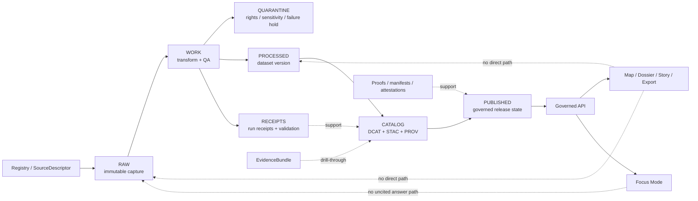

<!-- [KFM_META_BLOCK_V2]
doc_id: kfm://doc/<NEEDS_VERIFICATION_UUID>
title: data/
type: standard
version: v1
status: draft
owners: NEEDS VERIFICATION
created: NEEDS_VERIFICATION_YYYY-MM-DD
updated: 2026-04-01
policy_label: NEEDS VERIFICATION
related: [../README.md, ./registry/README.md, ./catalog/README.md, ./catalog/stac/README.md, ./processed/README.md]
tags: [kfm, data, truth-path, catalog, provenance]
notes: [Grounded in attached March 2026 KFM master manuals plus current public main tree evidence for data/ and selected child README surfaces; no local mounted checkout was available in this session.]
[/KFM_META_BLOCK_V2] -->

# `data/`

Governed storage, lifecycle, and release-artifact surface for KFM evidence-bearing data.

> **Status:** experimental  
> **Doc state:** draft  
> **Owners:** NEEDS VERIFICATION  
> **Path target:** `data/README.md`  
> 
> 
> 
> 
> 
> 
>   
> **Quick jump:** [Scope](#scope) · [Repo fit](#repo-fit) · [Accepted inputs](#accepted-inputs) · [Exclusions](#exclusions) · [Directory tree](#directory-tree) · [Quickstart](#quickstart) · [Usage](#usage) · [Diagram](#diagram) · [Tables](#tables) · [Task list](#task-list) · [FAQ](#faq) · [Appendix](#appendix)

> [!IMPORTANT]
> This README keeps four evidence layers separate on purpose:
>
> - **CONFIRMED doctrine** for KFM lifecycle law, trust boundaries, artifact families, catalog closure, and promotion posture.
> - **CONFIRMED current public tree** for `data/` as a live repo-root surface on public `main`, including top-level lifecycle directories and selected child README surfaces.
> - **PROPOSED deeper shape** for exact pack layouts, emitted artifact filenames, proof-pack internals, and validator wiring not proven by tree inspection alone.
> - **UNKNOWN / NEEDS VERIFICATION** for branch-only paths, local-only contents, owners, CI enforcement, proof objects, and any path not shown in the current public tree.

> [!NOTE]
> This file uses **CATALOG** for the lifecycle state and **catalog triplet** for the linked `DCAT + STAC + PROV` closure that makes a version discoverable, traceable, and evidence-resolvable.

## Scope

In the current public branch, `data/` is a repo-root surface that includes lifecycle and release-adjacent directories such as `raw/`, `work/`, `quarantine/`, `processed/`, `catalog/`, `receipts/`, `published/`, `proofs/`, and `registry/`. In March 2026 doctrine, that practical repo role is widened into the explicit KFM truth-path model:

`Source edge -> RAW -> WORK / QUARANTINE -> PROCESSED -> CATALOG -> PUBLISHED`

That makes `data/` more than storage. In KFM, it is the governed surface where intake, transformation, validation, catalog closure, release evidence, and correction lineage remain inspectable enough to audit, review, replay, and repair.

### What this README is for

This file is meant to help maintainers do four things quickly:

1. understand what belongs in `data/`,
2. distinguish **CONFIRMED doctrine** from **CONFIRMED public-tree evidence** and **PROPOSED deeper shape**,
3. keep storage responsibilities separate from contracts, policy, and governed APIs,
4. extend the tree without quietly weakening KFM’s trust posture.

### Evidence posture for this README

| Layer | Status | How to read it |
|---|---|---|
| Truth path, trust membrane, authoritative-versus-derived split, catalog triplet, promotion/correction posture | **CONFIRMED** | Safe to treat as current project doctrine. |
| `data/` as a repo-root surface on the current public branch | **CONFIRMED** | Current public `main` shows the path directly. |
| `data/registry/README.md`, `data/catalog/README.md`, `data/catalog/stac/README.md`, and `data/processed/README.md` | **CONFIRMED** | Public branch confirms these documentation surfaces exist. |
| `data/raw/`, `data/work/`, `data/quarantine/`, `data/processed/`, `data/catalog/`, `data/receipts/`, `data/published/`, `data/proofs/`, and `data/registry/` | **CONFIRMED** | Public tree confirms the directories exist; deeper contents still need inspection. |
| Exact internal filenames, emitted proof packs, real receipts, release examples, and validator/test wiring inside those zones | **NEEDS VERIFICATION** | Tree presence is not the same as emitted artifact proof. |
| `data/specs/` or `data/specs/README.md` | **UNKNOWN** | Not visible in the current public `data/` tree; verify the target branch before adding links or claims. |

[Back to top](#data)

## Repo fit

`data/` sits at the seam where governed source intake becomes durable project state.

### Path and adjacent surfaces

| Relation | Surface | Posture | Why it matters |
|---|---|---|---|
| Upstream | [`../README.md`](../README.md) | **CONFIRMED path** | Expected repo-wide overview and navigation surface. |
| Upstream | [`../packages/`](../packages/) | **CONFIRMED path / INFERRED role** | Shared reusable law should stay in packages rather than leaking into ad hoc storage layouts. |
| Upstream | [`../contracts/`](../contracts/) | **CONFIRMED path / INFERRED role** | Shared schemas, profiles, and controlled vocabularies should remain explicit rather than hiding inside data zones. |
| Upstream | [`../schemas/`](../schemas/) | **CONFIRMED path / NEEDS VERIFICATION for any specific family used here** | Public root confirms the directory exists; use direct branch evidence before treating it as the canonical home of any particular schema family. |
| Upstream | [`../policy/`](../policy/) | **CONFIRMED path / INFERRED role** | Rights, sensitivity, deny-by-default rules, and review obligations belong in executable policy as well as prose. |
| Upstream | [`../docs/`](../docs/) | **CONFIRMED path / INFERRED role** | Architecture docs, ADRs, templates, and runbooks should track behavior-significant changes to the data surface. |
| Lateral | [`./registry/README.md`](./registry/README.md) | **CONFIRMED path** | Current public branch confirms this as the registration-facing documentation surface. |
| Lateral | [`./registry/schemas/`](./registry/schemas/) | **CONFIRMED path** | Registry-local schema material has a live subtree; exact contents still need inspection. |
| Lateral | [`./catalog/README.md`](./catalog/README.md) | **CONFIRMED path** | Current public branch confirms the catalog boundary README. |
| Lateral | [`./catalog/stac/README.md`](./catalog/stac/README.md) | **CONFIRMED path** | Current public branch confirms the STAC-facing README surface. |
| Lateral | [`./processed/README.md`](./processed/README.md) | **CONFIRMED path** | Current public branch confirms a processed-zone README surface. |
| Lateral | `data/specs/` | **UNKNOWN / not visible on current public main** | Do not add or link this as a current fact unless the target branch proves it. |
| Downstream | [`../apps/`](../apps/) | **CONFIRMED path / INFERRED role** | Public and role-limited surfaces should consume promoted scope through governed APIs, not direct storage reads. |
| Downstream | [`../tools/`](../tools/) | **CONFIRMED path / INFERRED role** | Validators, link checks, catalog QA, and evidence linting should prove the data surface rather than merely describe it. |
| Downstream | [`../tests/`](../tests/) | **CONFIRMED path / INFERRED role** | Schema, catalog, policy, freshness, correction, and replay tests should enforce this surface. |
| Downstream | [`../infra/`](../infra/) | **CONFIRMED path / INFERRED role** | Deployment, backup, restore, correction, and reconciliation logic must preserve the trust membrane. |

### Repo-fit summary

| Question | Answer |
|---|---|
| What is `data/` for? | Governed intake, lifecycle state, catalog closure, release evidence, and repo-facing data surfaces such as registry entries, catalog artifacts, and processed or publish-adjacent zones. |
| What is `data/` **not**? | Not the trust membrane, not the public API surface, and not a license to expose RAW, WORK, QUARANTINE, or unpublished candidates directly. |
| What stays adjacent instead of buried here? | Shared contracts, shared schema registries, executable policy, app routes, worker logic, and most implementation law. |

[Back to top](#data)

## Accepted inputs

The following belong in or immediately around `data/` when KFM doctrine is being honored:

| Accepted input | Why it belongs here | Typical stage |
|---|---|---|
| Source registration artifacts | Source onboarding is a contract, not just a fetch | Registry / admission |
| Immutable raw captures and acquisition manifests | RAW must preserve source-native bytes and intake memory | RAW |
| Reproducible transforms, redactions, and QA outputs | WORK exists to normalize and validate without pretending to publish | WORK |
| Rights-unclear, sensitive, or failed-validation material | QUARANTINE is the regular hold state for unresolved material | QUARANTINE |
| Canonical processed dataset versions | PROCESSED is where publishable authority becomes stable and inspectable | PROCESSED |
| Run receipts, validation reports, and audit-ready process memory | Replay, rollback, and correction fail without durable process evidence | WORK / receipts |
| `DCAT + STAC + PROV` closure artifacts | Catalog closure is part of release truth, not decorative metadata | CATALOG |
| Release manifests, proof packs, and integrity objects | Promotion is a governed transition and should leave receipts | Release boundary |
| Zone manifests, public-safe exemplars, and example datasets | Repo-grounded summaries describe these as part of the repo-facing role of `data/` | Reference / exemplar |

### Artifact families at a glance

| Artifact family | What it does | Stage seam |
|---|---|---|
| `SourceDescriptor` | Declares source identity, access mode, rights posture, cadence, and publication intent | Admission |
| `IngestReceipt` | Proves what was fetched, when, and with what integrity result | RAW |
| `ValidationReport` | Records structural, spatial, temporal, unit, and domain QC outcomes | WORK / QUARANTINE |
| `DatasetVersion` | Carries immutable processed authority with stable identity and time semantics | PROCESSED |
| `CatalogClosure` | Links outward catalog metadata and lineage for releasable scope | CATALOG |
| `DecisionEnvelope` / `ReviewRecord` | Carries policy and review-bearing admissibility outcomes | Review / release |
| `ReleaseManifest` / `ReleaseProofPack` | Assembles a publishable trust unit | Promotion / release |
| `EvidenceBundle` | Resolves visible claims or surface state to inspectable support | Runtime / trust surfaces |
| `CorrectionNotice` | Preserves visible lineage for rollback, supersession, withdrawal, or narrowed republication | Post-release governance |

### Dataset-version pack *(PROPOSED starter shape)*

| Part | Typical location | Why it exists |
|---|---|---|
| Manifest + checksums | `data/processed/<theme>/<dataset>/<version>/manifest.json`, `SHA256SUMS.txt` | Stable fingerprinting and replay |
| Version README | `data/processed/<theme>/<dataset>/<version>/README.md` | Human-readable method, CRS, units, caveats, license, and links |
| Receipt / validation pack | `data/receipts/` or version-adjacent audit surface | Run receipts, validation reports, policy decisions, and replay memory |
| STAC / DCAT / PROV | `data/catalog/stac/`, `data/catalog/dcat/`, `data/catalog/prov/` | Discoverability, lineage, and policy-facing metadata closure |
| Proof / attestation pack | `data/proofs/` or equivalent release bundle | Promotion evidence, integrity, and rollback traceability |

> [!TIP]
> `data/` may **consume** shared schemas from `../contracts/` or `../schemas/`, but that is different from treating `data/` as the canonical home for every shared schema, vocabulary, or standards profile.

[Back to top](#data)

## Exclusions

The following do **not** belong here as sovereign truth or as the normal public path:

| Exclusion | Put it under / behind | Why |
|---|---|---|
| Direct client reads from canonical stores or unpublished artifacts | Governed APIs and trust-visible app surfaces | Storage is not the trust membrane. |
| Secrets, credentials, tokens, or host-specific secret material | Runtime secret management / deployment layer | `data/` is evidence-bearing, not secret-bearing. |
| Shared schemas and standards profiles | `../contracts/` and/or `../schemas/` | Keeps machine-readable contract authority explicit and reviewable. |
| Policy bundles, reason registries, and deny-by-default logic | `../policy/` | Policy should remain executable, testable, and independently reviewable. |
| Unreviewed analyst scratch outputs presented as publishable truth | `work/` or quarantine | Exploration is valid; silent publication is not. |
| Derived layers treated as authority by convenience | Rebuildable downstream layers | Search, graph, tile, vector, scene, cache, and summary layers remain downstream of stronger truth. |
| Silent overwrite of raw capture, processed authority, or released state | Correction / rollback / supersession flow | KFM requires visible correction lineage. |

> [!WARNING]
> `data/` is a governed evidence surface. It is **not** the public edge, **not** the trust boundary, and **not** permission to expose RAW, WORK, QUARANTINE, or unpublished candidates directly.

[Back to top](#data)

## Directory tree

### Current public branch snapshot *(CONFIRMED path evidence)*

```text
data/
├── README.md
├── catalog/
│   ├── README.md
│   ├── dcat/
│   ├── prov/
│   └── stac/
│       └── README.md
├── processed/
│   └── README.md
├── proofs/
├── published/
├── quarantine/
├── raw/
├── receipts/
├── registry/
│   ├── README.md
│   └── schemas/
└── work/
```

### Doctrine-aligned deeper pack shape *(PROPOSED below the confirmed tree)*

```text
data/
├── raw/<source>/<run>/                    # immutable source-native capture
├── work/<lane>/<run>/                     # transforms, QA, redaction, and intermediate work
├── quarantine/<reason>/<subject>/         # unresolved rights / sensitivity / validation holds
├── processed/<theme>/<dataset>/<version>/ # canonical dataset versions
├── catalog/
│   ├── dcat/
│   ├── stac/
│   └── prov/
├── receipts/<lane>/<run>/                 # process-memory artifacts
├── published/<release>/                   # optional materialized release scope
└── proofs/<release>/                      # manifests, proof packs, attestations, correction trace
```

### Path posture

| Path claim | Status | Reading rule |
|---|---|---|
| `data/` exists as a repo-root path on current public `main` | **CONFIRMED** | Treat as current public tree fact. |
| `data/registry/README.md`, `data/catalog/README.md`, `data/catalog/stac/README.md`, and `data/processed/README.md` exist on current public `main` | **CONFIRMED** | Path-level documentation surfaces are public-tree facts. |
| `data/raw/`, `data/work/`, `data/quarantine/`, `data/receipts/`, `data/published/`, and `data/proofs/` exist as top-level directories on current public `main` | **CONFIRMED** | Tree presence is proven; deep contents are not. |
| `data/catalog/dcat/` and `data/catalog/prov/` exist as catalog subdirectories on current public `main` | **CONFIRMED** | Tree presence is proven; deeper README or file inventories were not reviewed here. |
| Exact artifact filenames, emitted release examples, proof packs, and validator wiring within these directories are already present | **NEEDS VERIFICATION** | Inspect branch contents before documenting emitted objects as fact. |
| `data/specs/` is a current path | **UNKNOWN** | Not visible in the current public `data/` tree; verify the target branch before adding links or schema-home claims. |

### What this README intentionally does *not* assert

- that every tree-confirmed directory already contains emitted production artifacts,
- that public `main` proves non-public branch contents or active CI enforcement,
- that real proof packs, runtime response envelopes, or resolver traces have already been surfaced in-repo,
- that `data/specs/` exists,
- that current public tree confirmation alone proves end-to-end operational maturity.

[Back to top](#data)

## Quickstart

Start by separating **tree confirmation** from **artifact confirmation**.

```bash
# Inspect the current local checkout of the data surface
find data -maxdepth 3 -print 2>/dev/null | sort

# Read confirmed README surfaces if present
for f in \
  data/README.md \
  data/registry/README.md \
  data/catalog/README.md \
  data/catalog/stac/README.md \
  data/processed/README.md
do
  test -f "$f" && { echo "===== $f"; sed -n '1,220p' "$f"; }
done

# Confirm top-level lifecycle and release-adjacent directories
for p in \
  data/raw \
  data/work \
  data/quarantine \
  data/processed \
  data/catalog \
  data/receipts \
  data/published \
  data/proofs \
  data/registry
do
  test -e "$p" && echo "FOUND $p" || echo "MISSING $p"
done

# Treat branch-only or historical paths as unverified until shown by the checkout
test -d data/specs && echo "FOUND data/specs" || echo "data/specs not present in current public main tree"
```

### Inspect deeper artifact evidence

```bash
# Look for manifest / receipt / proof / catalog-shaped files
find data -maxdepth 6 -type f \
  \( -iname '*manifest*' -o -iname '*receipt*' -o -iname '*proof*' -o -iname '*catalog*' -o -iname '*.json' -o -iname '*.jsonld' -o -iname '*.prov' -o -iname '*.yaml' -o -iname '*.yml' \) \
  2>/dev/null | sort | sed -n '1,240p'

# If a processed zone exists, inspect whether version-like packs are materialized
find data/processed -maxdepth 5 -print 2>/dev/null | sort | sed -n '1,240p'

# If receipts/proofs exist as directories, check whether they already contain emitted artifacts
find data/receipts data/proofs -maxdepth 5 -print 2>/dev/null | sort | sed -n '1,240p'
```

> [!TIP]
> Public-tree confirmation is helpful, but KFM doctrine still requires **artifact-level proof** before stronger claims like “release-ready,” “policy-enforced,” or “resolver-backed” become fair.

[Back to top](#data)

## Usage

### 1. Register before you fetch

In KFM, source intake is a contract, not a download. A source that cannot be named, replayed, rights-reviewed, and quality-checked is not ready for governed movement into `data/`.

### 2. Keep RAW immutable

`RAW` should preserve source-native bytes, request context, rights or terms snapshots, and checksums. Cleanup, normalization, OCR, reprojection, redaction, and summarization belong later.

### 3. Transform in `WORK`, hold ambiguity in `QUARANTINE`

`WORK` is where normalization, parsing, joins, QA, redaction, and repair happen. Rights ambiguity, failed validation, unresolved sensitivity, or low-confidence extraction belong in `QUARANTINE`, not in `PROCESSED`.

### 4. Treat `PROCESSED` as governed authority candidates

`PROCESSED` is where stable dataset versions emerge. They should already point back to receipts, validation outputs, source context, and reproducible transform memory strongly enough to survive audit and replay.

### 5. Keep receipts and reports queryable

Run receipts, validation reports, and audit references are part of KFM’s operational memory. Whether they live under `data/receipts/` or an equivalent audited surface, they should remain easy to resolve during replay, correction, and release review.

### 6. Close the catalog triplet before promotion

A version is not outward-ready until `DCAT + STAC + PROV` can cross-link identifiers, assets, lineage, and evidence references without guesswork.

### 7. Publish by governed transition

`PUBLISHED` is first a release state, not merely a directory name. A repo may materialize supporting release artifacts under `data/published/`, but promotion still binds dataset version, catalog closure, policy state, review state, and proof objects into one inspectable decision.

### 8. Keep proofs attached to the exact release they justify

Checksums, manifests, proof packs, attestations, and correction evidence should remain linked to the exact dataset version or release scope they support. Detached proof objects are much less useful during rollback, audit, or dispute.

### 9. Read current tree shape and operational maturity separately

The current public branch already materializes the top-level `data/` zones. That is useful. It is **not** the same thing as proving that each zone already contains complete receipts, manifests, closures, proof objects, and correction drills.

### Illustrative artifact chain

The exact live filenames are **NEEDS VERIFICATION**, but the intended sequence is stable:

```text
registry/      source descriptor / source admission context
raw/           ingest receipt + immutable capture
work/          validation report + transform evidence
quarantine/    rights / sensitivity / validation hold
processed/     dataset version + manifest + checksums
receipts/      run receipts / validation outputs / audit-ready process memory
catalog/       catalog closure (DCAT + STAC + PROV)
published/     optional materialized release scope
proofs/        release proof pack / attestation / correction trace
```

[Back to top](#data)

## Diagram


```mermaid
flowchart LR
    REG[Registry / SourceDescriptor] --> RAW[RAW<br/>immutable capture]
    RAW --> WORK[WORK<br/>transform + QA]
    WORK --> QUAR[QUARANTINE<br/>rights / sensitivity / failure hold]
    WORK --> PROC[PROCESSED<br/>dataset version]
    WORK --> REC[RECEIPTS<br/>run receipts + validation]
    PROC --> CAT[CATALOG<br/>DCAT + STAC + PROV]
    CAT --> PUB[PUBLISHED<br/>governed release state]

    PUB --> API[Governed API]
    API --> UI[Map / Dossier / Story / Export]
    API --> FOCUS[Focus Mode]

    REC -. support .-> CAT
    PROOF[Proofs / manifests / attestations] -. support .-> PUB
    EVD[EvidenceBundle] -. drill-through .-> CAT

    UI -. no direct path .-> RAW
    UI -. no direct path .-> PROC
    FOCUS -. no uncited answer path .-> RAW
```

[Back to top](#data)

## Tables

### Truth-path zone matrix

| Zone / state | Core question | What belongs here | Block if |
|---|---|---|---|
| `RAW` | What exactly arrived? | Source-native payloads, request details, checksums, rights snapshots, unmodified source bytes | Raw bytes are mutated in place or exposed directly |
| `WORK` | What deterministic transform is happening? | Repair, normalization, OCR, reprojection, QA, joins, redaction transforms | Transform logic is irreproducible or undocumented |
| `QUARANTINE` | What is unresolved or unsafe? | Rights ambiguity, sensitivity ambiguity, failed validation, low-confidence extraction | Ambiguous material is treated as “almost publishable” |
| `PROCESSED` | What is now canonical and publishable? | Immutable processed artifacts, dataset versions, final QA outputs, stable manifests | The artifact cannot support valid catalog closure |
| `CATALOG` | Can the release be discovered and explained? | Cross-linked `DCAT + STAC + PROV`, outward identifiers, evidence pointers | Triplet members are missing, broken, or unresolved |
| `PUBLISHED` | May this scope be exposed? | Governed release state through API and trust-visible surfaces | Publication is treated as a folder copy instead of a gated transition |

### Release-adjacent support surfaces

| Surface | Status | Role | Caution |
|---|---|---|---|
| `receipts/` | **CONFIRMED directory / NEEDS VERIFICATION emitted contents** | Run receipts, validation reports, and audit-ready process memory | Top-level presence is proven; actual emitted inventory still needs inspection. |
| `published/` | **CONFIRMED directory / CONFIRMED state concept** | Optional materialized release scope for governed outputs | Publication itself still must be treated as a transition, not a folder copy. |
| `proofs/` | **CONFIRMED directory / NEEDS VERIFICATION emitted contents** | Release manifests, proof packs, attestations, signatures, correction trace | Proof objects must stay linked to the release or dataset version they justify. |
| `processed/README.md` | **CONFIRMED README surface** | Path-level guidance for the processed zone | Documentation does not itself prove emitted dataset versions. |
| Dataset version README | **PROPOSED** | Human-readable summary of method, CRS, units, caveats, license, and links | Do not let README prose replace machine-checkable manifests or catalog closure. |

### Minimum gates before outward trust widens

| Gate family | What it proves | Fail-closed outcome |
|---|---|---|
| Source admission | A source has a descriptor, owner/steward context, rights posture, and quality intent | Reject, defer, or quarantine |
| Source replay | Intake memory is strong enough to re-fetch and verify | Hold or quarantine |
| Schema / structure | Required fields, enums, and structural rules are satisfied | Block merge or promotion |
| Geometry / CRS | Geometry is valid and spatial support is coherent | Hold in `WORK / QUARANTINE` |
| Time validity | Time fields are present and semantically meaningful | Hold or quarantine |
| Identifier stability | IDs, spec hashes, and lineage pointers are deterministic enough to audit | Block canonical write or release |
| Catalog closure | `STAC + DCAT + PROV` resolve coherently | Block release or promotion |
| Policy bundle | Rights, sensitivity, reason codes, and deny-by-default logic are sufficient | Deny or hold |
| Evidence resolution | Consequential visible claims resolve to inspectable support | Runtime must abstain, deny, or error |
| Correction drill | Supersession, withdrawal, rollback, and correction remain visible and auditable | Prevent silent overwrite |

### Path-certainty matrix

| Claim | Status | Safer wording |
|---|---|---|
| `data/` exists as a repo-root path | **CONFIRMED** | “current public `main` path” |
| `data/` is governed by the canonical truth path | **CONFIRMED** | “load-bearing KFM doctrine” |
| `data/registry/README.md` exists | **CONFIRMED** | “current public `main` documentation surface” |
| `data/catalog/README.md` exists | **CONFIRMED** | “current public `main` documentation surface” |
| `data/catalog/stac/README.md` exists | **CONFIRMED** | “current public `main` documentation surface” |
| `data/raw/`, `data/work/`, `data/quarantine/`, `data/processed/`, `data/catalog/`, `data/receipts/`, `data/published/`, and `data/proofs/` are already live directories | **CONFIRMED** | “top-level public-tree fact; inspect deeper contents before stronger claims” |
| Specific release manifests, proof packs, receipts, or resolver traces already exist under those zones | **NEEDS VERIFICATION** | “inspect branch contents before documenting emitted objects” |
| `data/specs/` is canonical | **UNKNOWN** | “not visible on current public `main`; verify target branch before teaching it” |

[Back to top](#data)

## Task list

### Definition of done for this README

- [ ] The file clearly separates **CONFIRMED doctrine** from **CONFIRMED public-tree evidence**, **PROPOSED deeper shape**, and **UNKNOWN / NEEDS VERIFICATION**.
- [ ] `data/` is described as a governed truth-path surface, not a generic storage bucket.
- [ ] Accepted inputs and exclusions are explicit.
- [ ] The tree distinguishes **current public branch facts** from **deeper target-state pack shapes**.
- [ ] The README makes clear that storage is not the trust membrane.
- [ ] At least one Mermaid diagram explains real KFM structure.
- [ ] Verification steps tell a maintainer how to confirm or downgrade artifact-level claims in a working checkout.

### Review checks before merge

- [ ] Replace placeholder `doc_id`, owners, created date, and policy label with repo-backed values.
- [ ] Keep **current public branch facts** and **target-branch facts** separate when editing this file.
- [ ] Verify whether `data/specs/` exists on the target branch before adding any direct link or schema-home claim.
- [ ] Inspect deeper contents of `raw/`, `work/`, `quarantine/`, `receipts/`, `published/`, and `proofs/` before documenting emitted artifacts.
- [ ] Add one real emitted artifact path once a live release lane is visible.
- [ ] Keep terminology aligned with KFM doctrine: truth path, trust membrane, authoritative vs derived, catalog closure, EvidenceBundle, promotion, correction.
- [ ] Do not let current public tree confirmation be misread as proof of full operational maturity.

[Back to top](#data)

## FAQ

### Is `published` a directory?

Yes on the current public branch. By doctrine, though, **published** is first a governed release state. `data/published/` can materialize release scope, but publication is still not reducible to “copy files somewhere.”

### Are `data/registry/README.md`, `data/catalog/README.md`, and `data/catalog/stac/README.md` already real?

Yes on the current public branch. That confirms the documentation surfaces exist. It does **not** by itself prove deep emitted artifacts, runtime resolvers, or merge gates behind them.

### Is `data/specs/` real?

Not in the current public `data/` tree reviewed for this pass. Treat it as **UNKNOWN** until the target branch or local checkout proves it.

### Does top-level tree confirmation mean the lane is operational?

No. It proves path existence, not emitted receipts, release manifests, correction drills, policy bundles, or runtime proof objects.

### Is `receipts` different from `proofs`?

Yes, conceptually. **Receipts** are process-memory artifacts such as ingest receipts, validation reports, and run records. **Proofs** are release-significant objects such as manifests, attestations, and correction trace. The exact emitted contents of either still need inspection.

### Are per-version dataset READMEs expected?

They are **PROPOSED**, but strongly aligned with the corpus. Dataset-gate design packs recommend a `README.md` beside promoted dataset artifacts describing source, method, CRS, units, caveats, license, and links to STAC/DCAT/PROV.

[Back to top](#data)

## Appendix

<details>
<summary>Glossary</summary>

| Term | Meaning in this README |
|---|---|
| Truth path | The governed movement from source edge through RAW, WORK / QUARANTINE, PROCESSED, CATALOG, and into PUBLISHED state. |
| Trust membrane | The rule that clients do not bypass governed APIs, policy mediation, and evidence resolution to reach storage directly. |
| Catalog triplet | The linked metadata boundary formed by `DCAT + STAC + PROV`. |
| SourceDescriptor | Intake contract describing access mode, cadence, rights posture, normalization plan, and publication intent. |
| IngestReceipt | Evidence-bearing record of what was fetched, when, and with what integrity result. |
| DatasetVersion | Immutable governed version of a processed subject set. |
| EvidenceBundle | Governed support object that resolves a visible claim or answer into inspectable evidence. |
| Derived layer | Search, graph, vector, tile, scene, summary, or export surface built downstream of stronger truth. |
| CorrectionNotice | Evidence-bearing supersession, withdrawal, rollback, or narrowed republication object. |

</details>

<details>
<summary>Verification backlog carried by this file</summary>

| Item | Why it matters |
|---|---|
| Actual target-branch `data/` tree snapshot | Prevents public-main facts from being misread as the full working branch shape |
| Owners / dates / policy label / doc UUID | Lets the meta block stop carrying placeholders |
| Deeper contents of `raw/`, `work/`, `quarantine/`, `receipts/`, `published/`, and `proofs/` | Converts tree presence into inspectable artifact fact |
| Whether `data/specs/` exists on the working branch | Prevents broken links and schema-surface drift |
| One emitted dataset pack with manifest + triplet + receipts/proof objects | Grounds examples in real artifacts rather than doctrine alone |
| One runtime resolver trace and one negative-path sample | Proves EvidenceBundle and RuntimeResponseEnvelope behavior rather than leaving them conceptual |

</details>

<details>
<summary>Related entrypoints</summary>

- [`../README.md`](../README.md)
- [`./registry/README.md`](./registry/README.md)
- [`./registry/schemas/`](./registry/schemas/)
- [`./catalog/README.md`](./catalog/README.md)
- [`./catalog/dcat/`](./catalog/dcat/)
- [`./catalog/prov/`](./catalog/prov/)
- [`./catalog/stac/README.md`](./catalog/stac/README.md)
- [`./processed/README.md`](./processed/README.md)
- [`../contracts/`](../contracts/)
- [`../schemas/`](../schemas/)
- [`../policy/`](../policy/)
- [`../docs/`](../docs/)
- [`../tools/`](../tools/)
- [`../tests/`](../tests/)
- [`../apps/`](../apps/)
- [`../infra/`](../infra/)

</details>

[Back to top](#data)
