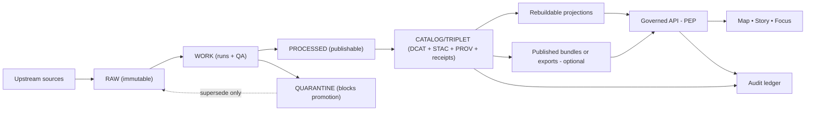

<!-- [KFM_META_BLOCK_V2]
doc_id: kfm://doc/f198c44a-6fb6-40e0-89e0-3f37f76e7742
title: data/ — Governed dataset artifacts + catalogs (Truth Path)
type: standard
version: v3
status: draft
owners: KFM Data Stewardship (resolve via CODEOWNERS)
created: 2026-02-22
updated: 2026-03-02
policy_label: public
related:
  - ../README.md
  - ../.github/README.md
  - ../configs/README.md
  - ../contracts/README.md
  - ../docs/governance/
  - ../policy/
tags:
  - kfm
  - data
  - governance
  - promotion-contract
  - catalogs
  - evidence
  - provenance
notes:
  - Canonical truth-path directory contract + Promotion Contract artifact map.
  - Aligned to vNext governance snapshots (2026-02-20) and delivery plan (2026-02-27); verify repo reality before enforcing paths.
  - This README is a target contract; adjust path names only with a governed migration plan (ADR + validator updates + rollout/rollback).
[/KFM_META_BLOCK_V2] -->

<a id="top"></a>

# `data/` — Governed dataset artifacts + catalogs
Canonical, audit-friendly truth-path artifacts for KFM: **specs → registries → zone artifacts → catalogs/receipts → promotion manifests → audit trail**.

**Truth path (canonical lifecycle):**  
**UPSTREAM → RAW → WORK/QUARANTINE → PROCESSED → CATALOG/TRIPLET (DCAT + STAC + PROV + run receipts) → PUBLISHED (governed runtime via PEP/API + UI)**  
Optional: **PUBLISHED bundles/exports** materialization (policy/rights filtered; cacheable), plus append-only **AUDIT** segments.

**Status:** draft • **Owners:** KFM Data Stewardship • **Last updated:** 2026-03-02


> [!IMPORTANT]
> **Canonical vs rebuildable:** `data/processed/` + `data/catalog/` (triplet + receipts + manifests) are canonical truth surfaces.  
> DB/search/graph/tiles are **rebuildable projections** and must be treated as disposable.

> [!IMPORTANT]
> **Terminology alignment (KFM):** **PUBLISHED** means the *policy-enforced runtime surfaces* (PEP/API + UI).  
> `data/published/` is an **optional** materialization area for *published bundles/exports* (tilesets, offline packages) that runtime may serve.

> [!IMPORTANT]
> **Trust membrane:** UI/clients MUST NOT read this directory (or backing object storage) directly.  
> All runtime access is through governed APIs (PEP) + evidence resolver + policy tests.

> [!NOTE]
> Normative keywords: **MUST / SHOULD / MAY** indicate enforcement strength (validators/gates).  
> Anything marked **UNKNOWN (repo)** is not verified on this branch; treat it as **fail-closed** until confirmed.

---

## Quick navigation

- [Truth status legend](#truth-status-legend)
- [Non-negotiable invariants](#non-negotiable-invariants)
- [Directory contract](#directory-contract)
- [If you are onboarding or updating a dataset](#if-you-are-onboarding-or-updating-a-dataset)
- [Repo reality check](#repo-reality-check)
- [Truth path diagram](#truth-path-diagram)
- [Directory layout](#directory-layout)
- [Promotion Contract artifact map](#promotion-contract-artifact-map)
- [Canonical path convention](#canonical-path-convention)
- [Identifiers and naming](#identifiers-and-naming)
- [Deterministic hashing guardrails](#deterministic-hashing-guardrails)
- [Controlled vocabularies](#controlled-vocabularies)
- [Zone contracts](#zone-contracts)
- [Catalog triplet](#catalog-triplet)
- [Cross-linking rules](#cross-linking-rules)
- [Evidence resolver touchpoints](#evidence-resolver-touchpoints)
- [Checksums and digests](#checksums-and-digests)
- [Policy labels and sensitive data](#policy-labels-and-sensitive-data)
- [Audit ledger](#audit-ledger)
- [Definition of Done](#definition-of-done)
- [Appendix templates](#appendix-templates)

---

## Truth status legend

- **CONFIRMED (posture):** KFM invariant / governance posture that should hold regardless of stack.
- **UNKNOWN (repo):** not verified on this branch; must fail-closed until confirmed.
- **PROPOSED:** recommended template/pattern; adopt only after steward review.

> [!NOTE]
> This README is a **semantic contract** for the truth path.  
> If this branch differs, update this README **and** validators together as a governed change.

<p align="right"><a href="#top">Back to top ↑</a></p>

---

## Non-negotiable invariants

These are KFM invariants that validators, CI, and runtime enforcement SHOULD make true:

1) **Truth path lifecycle zones** exist and promotions are gated (fail closed).  
2) **Trust membrane:** clients never access storage/DB directly; all access goes through governed APIs (PEP).  
3) **Catalog triplet** (DCAT + STAC + PROV) is the canonical evidence surface, cross-linked and validated.  
4) **Deterministic identity/hashing** (canonical JSON hashing posture) enables stable DatasetVersion IDs.  
5) **Cite-or-abstain:** user-visible narrative/Focus answers must cite resolvable EvidenceBundles or abstain.

> [!WARNING]
> Treat these as **tests**, not “documentation ideals.”

<p align="right"><a href="#top">Back to top ↑</a></p>

---

## Directory contract

### Purpose
`data/` holds the **governed artifacts** that make KFM reproducible and auditable:

- Dataset onboarding specs (inputs to deterministic identity)
- Source registry entries (rights + sensitivity + access posture)
- Immutable acquisitions (RAW) **or** metadata-only references (when mirroring is disallowed)
- Intermediate transforms and QA outputs (WORK)
- Failed/blocked artifacts with remediation (QUARANTINE)
- Publishable, immutable artifacts (PROCESSED)
- Canonical metadata + lineage (CATALOG/TRIPLET: DCAT + STAC + PROV + receipts + promotion manifest)
- Optional publishable bundles/exports (PUBLISHED bundles; policy/rights filtered; cacheable)
- Append-only audit ledger segments (AUDIT)

### Where this fits
`data/` sits on the **canonical side** of the trust membrane:

- Pipelines write here (or to equivalent object-store/registry prefixes).
- Governed APIs serve only **promoted** DatasetVersions that passed gates and have catalogs/receipts.
- UI/apps never read from here directly (no direct object-store/DB reads).

### Acceptable inputs
- Small, reviewable metadata (specs/registry/receipts/manifests/catalog JSON)
- Checksums and validation reports
- Approved artifacts *only when policy allows storing them in-repo* (often it will not)

### Exclusions
- **Secrets** (keys, tokens, credentials)
- **PII** unless explicitly restricted and governed (prefer external storage + pointers)
- **Exact coordinates for sensitive locations** in public-labeled areas
- Large binaries when the repo is not meant to store them (use object storage/OCI; keep digests + pointers here)

> [!WARNING]
> If it would be unsafe to paste into a public issue, it does not belong in `policy_label: public` paths.

<p align="right"><a href="#top">Back to top ↑</a></p>

---

## If you are onboarding or updating a dataset

Use this as the **fail-closed** “happy path”:

1) **Register the source**  
   - `data/registry/sources/<source_id>.v1.yml` with license/terms snapshot pointer and mirroring mode.

2) **Define the dataset spec**  
   - `data/specs/<dataset_slug>.v1.json` (canonicalizable; pinned schema/profile versions).

3) **Acquire RAW** (append-only)  
   - `data/raw/<dataset_slug>/<dataset_version_id>/acquisition_manifest.v1.json`  
   - `terms_snapshot/*` + `checksums.v1.json` (+ artifacts or pointers).

4) **Run WORK**  
   - `data/work/<dataset_slug>/<dataset_version_id>/runs/<run_id>/...`  
   - Emit QA artifacts + checksums + a run receipt.

5) **Quarantine if needed**  
   - `data/quarantine/<dataset_slug>/<dataset_version_id>/reason.v1.json` + bounded diagnostics.

6) **Produce PROCESSED** (immutable per DatasetVersion)  
   - `data/processed/<dataset_slug>/<dataset_version_id>/artifacts/*` + `checksums.v1.json` + `qa/validation_report.v1.json`.

7) **Generate CATALOG/TRIPLET**  
   - `data/catalog/<dataset_slug>/<dataset_version_id>/dcat.jsonld`  
   - `.../stac/...`  
   - `.../prov/bundle.jsonld`  
   - `.../run_receipts/<run_id>.json`

8) **Record promotion**  
   - `data/catalog/<dataset_slug>/<dataset_version_id>/promotion_manifest.v1.json`  
   - (Optional) steward approval record(s) and audit ledger append.

9) **Only then** may the dataset surface in **PUBLISHED runtime** (API/UI), and optionally as `data/published/...` bundles.

<p align="right"><a href="#top">Back to top ↑</a></p>

---

## Repo reality check

KFM can store the **full truth path** in object storage or a registry in production, while the git repo stores:
- specs + registries + catalogs + receipts + digests
- bounded fixtures for tests

Before enforcing gates, verify what your branch actually contains:

```bash
# Show top-level shape
find data -maxdepth 2 -type d -print

# Find dataset specs and source registry entries
ls -la data/specs 2>/dev/null || true
ls -la data/registry/sources 2>/dev/null || true

# Find catalogs and promotion manifests (if any exist)
find data/catalog -maxdepth 6 -name 'promotion_manifest*.json' -print 2>/dev/null

# Confirm quarantine exists (directory or state approach)
ls -la data/quarantine 2>/dev/null || true

# Spot-check PROV filename convention (bundle.jsonld vs prov.jsonld)
find data/catalog -maxdepth 8 -type f \( -name 'bundle.jsonld' -o -name 'prov.jsonld' \) -print 2>/dev/null
```

> [!IMPORTANT]
> If your repo uses a different prefix (e.g., `storage/`, `artifacts/`, an object-store bucket, or OCI registry),
> treat this README as the **semantic contract** and map paths accordingly—do not silently invent new meanings.

<p align="right"><a href="#top">Back to top ↑</a></p>

---

## Truth path diagram


```mermaid
flowchart LR
  U["Upstream sources"] --> R["RAW (immutable)"]
  R --> W["WORK (runs + QA)"]
  W --> P["PROCESSED (publishable)"]
  P --> C["CATALOG/TRIPLET (DCAT + STAC + PROV + receipts)"]

  W --> Q["QUARANTINE (blocks promotion)"]
  Q -.->|supersede only| R

  C --> IDX["Rebuildable projections"]
  C --> PB["Published bundles or exports - optional"]

  IDX --> API["Governed API - PEP"]
  PB --> API
  API --> UI["Map • Story • Focus"]

  C --> AUD["Audit ledger"]
  API --> AUD
```

> [!NOTE]
> In KFM terms, **PUBLISHED** is the governed runtime surface (**API/PEP + UI**).  
> `PB` is optional *materialization* of publishable bundles/exports that runtime may serve.

<p align="right"><a href="#top">Back to top ↑</a></p>

---

## Directory layout

This is the **recommended contract layout** for the truth path (paths are deterministic for validators).

```text
data/
├─ README.md
│
├─ specs/                                                # Dataset onboarding specs (inputs to spec_hash; deterministic)
│  ├─ README.md
│  ├─ <dataset_slug>.v1.json                             # Canonical dataset spec (versioned)
│  └─ _schemas/                                          # OPTIONAL: schemas for dataset specs (or reference contracts/)
│     └─ kfm.dataset_spec.v1.schema.json
│
├─ registry/                                             # Canonical registries (governed)
│  ├─ README.md
│  ├─ sources/
│  │  ├─ <source_id>.v1.yml                              # Source registry entry (human editable)
│  │  └─ <source_id>.v1.json                             # OPTIONAL: normalized export (generated)
│  └─ anchors/
│     ├─ anchors.v1.json                                 # Anchor register (Tier 0/1/2/R)
│     └─ _schemas/
│        └─ kfm.anchor_register.v1.schema.json
│
├─ fixtures/                                             # Small fixtures for tests/evals (bounded; synthetic preferred)
│  ├─ README.md
│  └─ golden/                                            # expected outputs for validators
│
├─ raw/                                                  # Immutable acquisitions (append-only; never served)
│  └─ <dataset_slug>/
│     └─ <dataset_version_id>/                           # Some deployments prefer <acquisition_id>; see Canonical path convention
│        ├─ acquisition_manifest.v1.json                 # Capture manifest (license/sensitivity required)
│        ├─ terms_snapshot/                              # Terms/license snapshot(s) captured at acquisition time
│        ├─ artifacts/                                   # Original payload (never modified; MAY be absent if metadata-only mode)
│        ├─ pointers/                                    # OPTIONAL: metadata-only references when mirroring is disallowed
│        │  └─ artifacts.ref.v1.json
│        ├─ checksums.v1.json                            # Digests for raw artifacts (or referenced artifacts, where possible)
│        └─ notes.md                                     # OPTIONAL: human notes (policy-safe)
│
├─ work/                                                 # Regeneratable intermediates (never served; run-scoped)
│  └─ <dataset_slug>/
│     └─ <dataset_version_id>/
│        └─ runs/
│           └─ <run_id>/
│              ├─ artifacts/
│              ├─ qa/
│              ├─ checksums.v1.json
│              └─ run_receipt.ref.json                   # POINTER or copy; canonical receipt stored under catalog/
│
├─ quarantine/                                           # Failed gates (never served; never promoted)
│  └─ <dataset_slug>/
│     └─ <dataset_version_id>/
│        ├─ reason.v1.json
│        ├─ diagnostics/
│        ├─ checksums.v1.json
│        └─ supersedes.json                              # OPTIONAL: points to replacement DatasetVersion(s)
│
├─ processed/                                            # Publishable artifacts — immutable per DatasetVersion
│  └─ <dataset_slug>/
│     └─ <dataset_version_id>/
│        ├─ artifacts/
│        ├─ checksums.v1.json
│        ├─ runtime_metadata.v1.json
│        └─ qa/
│           ├─ validation_report.v1.json
│           └─ profiles_used.v1.json                     # OPTIONAL
│
├─ catalog/                                              # Canonical metadata + lineage (validated + cross-linked)
│  └─ <dataset_slug>/
│     └─ <dataset_version_id>/
│        ├─ dcat.jsonld
│        ├─ stac/
│        │  ├─ collection.json
│        │  └─ items/
│        ├─ prov/
│        │  └─ bundle.jsonld
│        ├─ run_receipts/
│        │  └─ <run_id>.json
│        ├─ promotion_manifest.v1.json
│        ├─ linkcheck_report.v1.json                     # OPTIONAL (generated)
│        └─ checksums.v1.json                            # OPTIONAL (roll-up)
│
├─ published/                                            # OPTIONAL: publishable bundles/exports used by runtime (policy/rights filtered)
│  └─ <dataset_slug>/
│     └─ <dataset_version_id>/
│        ├─ exports/
│        ├─ attribution/
│        ├─ publish_run_receipt.json                     # OPTIONAL
│        └─ checksums.v1.json
│
└─ audit/                                                # Append-only audit records (often stored outside git in prod)
   ├─ README.md
   └─ ledger/
      └─ <year>/<month>/
         └─ append-only.log
```

> [!IMPORTANT]
> If artifacts live outside git (recommended for most real datasets), these paths map cleanly to:
> - object storage prefixes (s3://…/raw/, …/processed/, …/catalog/)
> - and/or registry digests (OCI artifacts)
> The repo still stores **specs + registries + manifests + catalogs + receipts + digests** to preserve auditability.

<p align="right"><a href="#top">Back to top ↑</a></p>

---

## Promotion Contract artifact map

Promotion is the act of moving from RAW/WORK into **PROCESSED + CATALOG/TRIPLET**, and therefore into runtime surfaces. **Promotion MUST be blocked unless required artifacts exist and validate**.

| Gate | Fail-closed rule (minimum) | Minimum file evidence (paths are canonical patterns) |
|---|---|---|
| **A — Identity & versioning** | Stable dataset slug; deterministic `spec_hash`; stable `dataset_version_id` | `specs/<dataset_slug>.v1.json` + CI “golden hash” fixture under `fixtures/` |
| **B — Licensing & rights** | Explicit license/rights + captured terms snapshot; mirroring mode compatible | `registry/sources/<source_id>.v1.yml`; `raw/.../terms_snapshot/*`; `raw/.../acquisition_manifest.v1.json` |
| **C — Sensitivity & redaction** | `policy_label` assigned; obligations recorded and applied where needed | `processed/.../runtime_metadata.v1.json`; `catalog/.../prov/bundle.jsonld`; policy decision id in receipt |
| **D — Catalog triplet validation** | DCAT/STAC/PROV validate and cross-link; EvidenceRefs resolve without guessing | `catalog/.../dcat.jsonld`; `catalog/.../stac/collection.json`; `catalog/.../prov/bundle.jsonld`; optional `linkcheck_report.v1.json` |
| **E — QA thresholds** | Validation report exists; spec-defined checks meet thresholds; else quarantine | `processed/.../qa/validation_report.v1.json`; `work/.../qa/*`; `quarantine/.../reason.v1.json` (if fail) |
| **F — Run receipt & audit** | Run receipts enumerate inputs/outputs with digests + environment; audit append exists | `catalog/.../run_receipts/<run_id>.json`; `audit/.../append-only.log` (or external ledger ref) |
| **G — Promotion manifest** | Promotion recorded as a digest-addressable release manifest tying artifacts + catalogs + checks | `catalog/.../promotion_manifest.v1.json` (+ optional signatures/attestations) |

> [!TIP]
> Keep this table in sync with validator schemas under `contracts/` and policy tests under `policy/`.

<p align="right"><a href="#top">Back to top ↑</a></p>

---

## Canonical path convention

KFM uses predictable paths so CI, policy, and evidence resolution are deterministic.

### Canonical path patterns (zones)
- `specs/<dataset_slug>.v1.json`
- `registry/sources/<source_id>.v1.yml`
- `registry/anchors/anchors.v1.json`

- `raw/<dataset_slug>/<dataset_version_id>/acquisition_manifest.v1.json`
- `raw/<dataset_slug>/<dataset_version_id>/terms_snapshot/*`
- `raw/<dataset_slug>/<dataset_version_id>/artifacts/*` (if mirroring allowed)
- `raw/<dataset_slug>/<dataset_version_id>/pointers/artifacts.ref.v1.json` (if metadata-only mode)
- `raw/<dataset_slug>/<dataset_version_id>/checksums.v1.json`

- `work/<dataset_slug>/<dataset_version_id>/runs/<run_id>/artifacts/*`
- `work/<dataset_slug>/<dataset_version_id>/runs/<run_id>/qa/*`
- `work/<dataset_slug>/<dataset_version_id>/runs/<run_id>/checksums.v1.json`

- `quarantine/<dataset_slug>/<dataset_version_id>/reason.v1.json`

- `processed/<dataset_slug>/<dataset_version_id>/artifacts/*`
- `processed/<dataset_slug>/<dataset_version_id>/checksums.v1.json`
- `processed/<dataset_slug>/<dataset_version_id>/qa/validation_report.v1.json`

- `catalog/<dataset_slug>/<dataset_version_id>/dcat.jsonld`
- `catalog/<dataset_slug>/<dataset_version_id>/stac/collection.json`
- `catalog/<dataset_slug>/<dataset_version_id>/prov/bundle.jsonld`
- `catalog/<dataset_slug>/<dataset_version_id>/run_receipts/<run_id>.json`
- `catalog/<dataset_slug>/<dataset_version_id>/promotion_manifest.v1.json`

- `published/<dataset_slug>/<dataset_version_id>/exports/*` (if used)
- `published/<dataset_slug>/<dataset_version_id>/publish_run_receipt.json` (if used)

### Canonical rules (enforced by validators / promotion gates)
- `raw/`, `work/`, `quarantine/`, `processed/`, `catalog/`, `published/`, `audit/` are reserved zone names.
- `dataset_slug` is stable and does **not** encode dates.
- `dataset_version_id` is derived deterministically from the dataset spec (`spec_hash` posture).
- Every artifact referenced by catalogs/receipts MUST have a digest (prefer `sha256`).
- Catalog triplet MUST cross-link and validate (+ receipts).
- Quarantined versions MUST NOT be promoted or served.

<p align="right"><a href="#top">Back to top ↑</a></p>

---

## Identifiers and naming

### Identifier families (recommended)
Use explicit URI-like identifiers with stable prefixes:
- `kfm://dataset/<dataset_slug>` (Dataset)
- `kfm://dataset/<dataset_slug>@<dataset_version_id>` (DatasetVersion)
- `kfm://artifact/sha256:<digest>` (Artifact)
- `kfm://run/<timestamp>.<dataset_slug>.<spec_hash_prefix>` (Run)
- `kfm://policy_decision/<id>` (Policy decision)
- `kfm://story/<uuid>@v3` (Story node)

Avoid embedding environment-specific hostnames in canonical IDs. Hostnames belong in distribution URLs.

### Deterministic versioning posture (spec_hash)
- `spec_hash` MUST be computed from a canonicalized spec representation (RFC 8785 posture recommended).
- `spec_hash` MUST be stable across platforms (enforce with a golden test).
- `dataset_version_id` MUST be derived from `spec_hash` inputs (same spec → same version ID).

### Dataset slug conventions
- lowercase
- words separated by underscore
- avoid embedding dates in `dataset_slug` (date belongs to version)

<p align="right"><a href="#top">Back to top ↑</a></p>

---

## Deterministic hashing guardrails

Deterministic identity is only useful if it is re-computable in CI and stable across platforms.

### Hash drift prevention checklist (MUST)
Do NOT compute `spec_hash` from values that depend on:
- system clocks (`retrieved_at`, “now()”)
- random seeds / generated UUIDs
- unstable serialization (unordered maps, locale-dependent float formatting)

Do:
- canonicalize JSON (RFC 8785 posture recommended)
- pin referenced schema/profile versions
- keep acquisition timestamps in **manifests and run receipts**, not in the hashed spec
- include at least one CI “golden spec_hash” fixture test

> [!NOTE]
> If you choose a human-friendly prefix (e.g., `2026-02.abcd1234`), ensure the prefix is itself an explicit spec input (not derived from wall-clock).

<p align="right"><a href="#top">Back to top ↑</a></p>

---

## Controlled vocabularies

Controlled vocabularies reduce mystery states in receipts, catalogs, and policy evaluation. They MUST be versioned and validated.

Recommended starter vocabularies:
- `policy_label`: `public | public_generalized | restricted | restricted_sensitive_location | internal | embargoed | quarantine`
- `artifact.zone` (for metadata/prov): `raw | work | processed | catalog | published`
- `citation.kind`: `dcat | stac | prov | doc | graph | url` (discouraged)

> [!PROPOSED]
> Represent quarantined artifacts as `artifact.zone=work` + a `kfm:quarantine=true` flag to keep the vocabulary small and consistent.

<p align="right"><a href="#top">Back to top ↑</a></p>

---

## Zone contracts

| Zone | Primary goal | Allowed contents | Not allowed | “Serve/publish eligible?” |
|---|---|---|---|---|
| RAW | Preserve upstream truth | as-received payload + manifest + terms snapshot + digests **or** metadata-only references | edits-in-place | ❌ |
| WORK | Normalize + validate + draft redactions | intermediate transforms + QA + candidates (run-scoped) | “manual fixes” without provenance | ❌ |
| QUARANTINE | Fail closed safely | reason + remediation + diagnostics (bounded) | promotion shortcuts | ❌ |
| PROCESSED | Publishable outputs | KFM-approved formats + digests + runtime metadata | missing digests/metadata | ✅ (only with catalogs + receipts + pass gates) |
| CATALOG/TRIPLET | Canonical evidence surface | DCAT + STAC + PROV + receipts + promotion manifest | unvalidated catalogs, broken links | ✅ |
| PUBLISHED (runtime) | Governed surfaces | policy-enforced API/UI outputs; may be backed by bundles | bypassing policy/PEP | ✅ (policy-limited) |
| PUBLISHED bundles (dir) | Optional publish artifacts | tilesets/offline packages/exports + attribution + receipts | leaking restricted details | ✅ (policy-limited) |
| AUDIT | Reviewability | append-only ledger segments | deletion/rewrites | N/A |

<p align="right"><a href="#top">Back to top ↑</a></p>

---

## Catalog triplet

The triplet is KFM’s interoperability + evidence surface:

- **DCAT**: dataset identity, publisher, license/rights, distributions
- **STAC**: assets, spatiotemporal extents, hrefs + checksums, policy-consistent geometry/bbox
- **PROV**: lineage (raw → work → processed), agents, activities, parameters, approvals
- **Run receipts**: per-run evidence used by CI and the evidence resolver

Minimum expectations:
- All components exist where applicable and validate under KFM profiles.
- All include: `kfm:dataset_id`, `kfm:dataset_version_id`, `kfm:policy_label`.
- All cross-links resolve deterministically (no guessing).
- EvidenceRefs used by Stories/Focus map into these objects.

<p align="right"><a href="#top">Back to top ↑</a></p>

---

## Cross-linking rules

Cross-links MUST be explicit:

- DCAT dataset → distributions → artifact digests
- DCAT dataset → `prov:wasGeneratedBy` → PROV bundle/activity
- STAC collection → link rel=`describedby` → DCAT dataset
- STAC item → link to PROV activity and/or run receipt
- EvidenceRef schemes resolve without guessing

CI SHOULD include a link-checker verifying cross-links for every promoted DatasetVersion.

<p align="right"><a href="#top">Back to top ↑</a></p>

---

## Evidence resolver touchpoints

Evidence resolution is central: an evidence resolver accepts an EvidenceRef, applies policy, and returns an EvidenceBundle (human card + machine metadata + digests + audit references).

Minimum expectations:
- Resolver applies policy and returns allow/deny plus obligations.
- Returned EvidenceBundle includes:
  - human view (renderable card)
  - machine metadata (JSON)
  - artifact links (only if policy allows)
  - digests + dataset_version_id
  - audit references

> [!IMPORTANT]
> Story publish and Focus Mode must verify citations resolve through the evidence resolver. If not, **abstain or reduce scope**.

<p align="right"><a href="#top">Back to top ↑</a></p>

---

## Checksums and digests

Rules:
- Every artifact MUST have a digest (prefer `sha256`).
- Digests MUST be recorded in:
  - zone-adjacent `checksums.v1.json`
  - run receipts (`catalog/.../run_receipts/<run_id>.json`)
  - promotion manifest roll-up (`promotion_manifest.v1.json`)
- Catalogs SHOULD surface digests in DCAT distributions and STAC assets.

Recommended `checksums.v1.json` structure:

```json
{
  "kfm_checksums_version": "v1",
  "algorithm": "sha256",
  "artifacts": [
    { "path": "artifacts/events.parquet", "digest": "sha256:..." },
    { "path": "qa/validation_report.v1.json", "digest": "sha256:..." }
  ]
}
```

<p align="right"><a href="#top">Back to top ↑</a></p>

---

## Policy labels and sensitive data

Starter labels:
- `public`
- `public_generalized`
- `restricted`
- `restricted_sensitive_location`
- `internal`
- `embargoed`
- `quarantine`

Default-safe rules:
- Default deny for sensitive-location and restricted data unless policy explicitly allows.
- If any public representation is allowed, publish a separate `public_generalized` derivative DatasetVersion.
- Never embed precise coordinates in Story Nodes or Focus outputs unless policy explicitly allows.
- Generalization/redaction is a first-class transform recorded in PROV.
- Policy decisions include decision ID + obligations + reason codes; record them in receipts/catalogs.

<p align="right"><a href="#top">Back to top ↑</a></p>

---

## Audit ledger

- Audit is append-only.
- Every promotion and every governed user-facing output should emit a run receipt and an audit reference.
- Audit content MUST be policy-safe (no leaking restricted identifiers into public logs).

<p align="right"><a href="#top">Back to top ↑</a></p>

---

## Definition of Done

A dataset integration (or new DatasetVersion) is DONE only when:

### Onboarding
- [ ] Source registry entry exists with terms snapshot pointer + mirroring mode + sensitivity intent.
- [ ] Dataset spec exists and `spec_hash` stability is tested.
- [ ] RAW acquisition includes manifest + terms snapshot + digests (or metadata-only references if mirroring disallowed).
- [ ] WORK run(s) emit QA artifacts + digests + receipt reference(s).
- [ ] Failures are quarantined with reason + remediation plan.

### Promotion eligibility (to PUBLISHED runtime)
- [ ] PROCESSED artifacts exist and are digest-addressed.
- [ ] CATALOG triplet validates and cross-links (DCAT/STAC/PROV) + receipts.
- [ ] Run receipts exist and enumerate input/output digests + environment capture.
- [ ] Promotion manifest exists and ties everything together.
- [ ] EvidenceRef resolution smoke test passes (policy + link resolution).
- [ ] Policy label reviewed where required (steward workflow).
- [ ] (If used) PUBLISHED bundles/exports exist and pass policy/rights filters.
- [ ] Changelog entry exists if this is a governed release/promotion.

<p align="right"><a href="#top">Back to top ↑</a></p>

---

## Appendix templates

<details>
<summary><strong>Template: Dataset spec (JSON)</strong></summary>

```json
{
  "kfm_spec_version": "v1",
  "dataset_slug": "example_dataset",
  "title": "Example Dataset",

  "upstream": {
    "source_id": "example_source",
    "authority": "Example Authority",
    "access_method": "bulk",
    "endpoints": [
      {
        "name": "example_zip",
        "url": "https://example.invalid/data.zip",
        "parameters": { "region": "KS", "as_of": "2026-02" }
      }
    ],
    "cadence": "monthly"
  },

  "sensitivity": {
    "policy_label_intent": "public",
    "pii_risk": "low",
    "sensitive_location_risk": "low",
    "obligations": []
  },

  "validation": {
    "schema_ref": "contracts/schemas/example.schema.json",
    "checks": [
      { "name": "geometry_valid", "threshold": 1.0 },
      { "name": "required_fields_present", "threshold": 0.99 }
    ]
  },

  "transforms": [
    {
      "name": "normalize",
      "container_image": "sha256:<pinned_image_digest>",
      "params": { "crs": "EPSG:4326", "schema_version": "v1" }
    }
  ],

  "outputs": [
    {
      "artifact_type": "geoparquet",
      "zone": "processed",
      "relative_path": "artifacts/data.geoparquet",
      "media_type": "application/x-parquet"
    }
  ]
}
```

</details>

<details>
<summary><strong>Template: Source registry entry (YAML)</strong></summary>

```yaml
source_id: usgs_waterdata_nwis
name: USGS WaterData (NWIS)
authority: USGS
domain: hydrology
access_method: api
cadence: daily
license_terms_snapshot:
  kind: public_domain
  captured_at: "2026-02-22"
  path_hint: "data/raw/usgs_waterdata_nwis/<dataset_version_id>/terms_snapshot/..."
sensitivity_intent: public
mirroring_mode: mirror_full # mirror_full | mirror_thumbnails | metadata_only_reference
connector_spec:
  type: http_api
  base_url: "https://example.invalid/"
credentials:
  strategy: secrets_manager
known_limitations:
  - missing_values_present
qa_checks:
  - validate_lat_lon_bounds
  - validate_time_series_gaps
```

</details>

<details>
<summary><strong>Template: Acquisition manifest (JSON)</strong></summary>

```json
{
  "kfm_acquisition_manifest_version": "v1",
  "dataset_slug": "example_dataset",
  "dataset_version_id": "2026-02.abcd1234",
  "source_id": "example_source",
  "fetched_at": "2026-02-28T12:00:00Z",
  "license_terms_snapshot": {
    "captured_at": "2026-02-28T12:00:00Z",
    "paths": ["terms_snapshot/2026-02-28T12-00Z.txt"]
  },
  "policy": { "policy_label_intent": "public" },
  "mirroring_mode": "mirror_full",
  "artifacts": [
    { "path": "artifacts/source.csv", "media_type": "text/csv" }
  ],
  "notes": "RAW is append-only; supersede with a new acquisition/DatasetVersion if needed."
}
```

</details>

<details>
<summary><strong>Template: Quarantine reason (JSON)</strong></summary>

```json
{
  "kfm_quarantine_reason_version": "v1",
  "dataset_slug": "example_dataset",
  "dataset_version_id": "2026-02.abcd1234",
  "reason_code": "RIGHTS_UNCLEAR|VALIDATION_FAIL|SENSITIVE_LOCATION|OTHER",
  "summary": "Policy-safe summary of why this version is blocked.",
  "remediation_plan": {
    "owner": "team-or-person",
    "next_steps": ["Capture license terms snapshot", "Add generalization transform", "Re-run validation"],
    "target_date": "2026-03-15"
  },
  "created_at": "2026-02-28T13:00:00Z"
}
```

</details>

<details>
<summary><strong>Template: Validation report (JSON)</strong></summary>

```json
{
  "kfm_validation_report_version": "v1",
  "dataset_slug": "example_dataset",
  "dataset_version_id": "2026-02.abcd1234",
  "status": "pass|degraded|fail",
  "checks": [
    { "name": "schema", "status": "pass", "details": {} },
    { "name": "spatial_bounds", "status": "pass", "details": {} },
    { "name": "rights", "status": "pass", "details": {} },
    { "name": "policy", "status": "pass", "details": { "policy_label": "public" } }
  ],
  "generated_at": "2026-02-28T14:00:00Z"
}
```

</details>

<details>
<summary><strong>Template: Run receipt (JSON)</strong></summary>

```json
{
  "kfm_run_receipt_version": "v1",
  "run_id": "kfm://run/2026-02-28T12:00:00Z.example_dataset.abcd",
  "actor": { "principal": "svc:pipeline", "role": "pipeline" },
  "operation": "ingest+publish",
  "dataset_slug": "example_dataset",
  "dataset_version_id": "2026-02.abcd1234",
  "spec_hash": "sha256:abcd1234...",
  "inputs": [
    {
      "artifact_id": "kfm://artifact/sha256:1111...",
      "zone": "raw",
      "uri": "s3://kfm-raw/example_dataset/2026-02/source.csv",
      "digest": "sha256:1111..."
    }
  ],
  "outputs": [
    {
      "artifact_id": "kfm://artifact/sha256:2222...",
      "zone": "processed",
      "path": "data/processed/example_dataset/2026-02.abcd1234/artifacts/data.geoparquet",
      "digest": "sha256:2222...",
      "media_type": "application/x-parquet"
    }
  ],
  "validation": {
    "status": "pass|degraded|fail",
    "report_digest": "sha256:<validation_report_digest>"
  },
  "policy": {
    "policy_label": "public",
    "decision_id": "kfm://policy_decision/xyz",
    "obligations": []
  },
  "environment": {
    "git_commit": "<commit>",
    "container_digest": "sha256:<image_digest>",
    "params_digest": "sha256:<params_digest>"
  },
  "timestamps": {
    "started_at": "2026-02-28T12:00:00Z",
    "ended_at": "2026-02-28T12:10:00Z"
  },
  "audit_ref": "kfm://audit/entry/123"
}
```

</details>

<details>
<summary><strong>Template: Promotion manifest (JSON)</strong></summary>

```json
{
  "kfm_promotion_manifest_version": "v1",
  "dataset_slug": "example_dataset",
  "dataset_version_id": "2026-02.abcd1234",
  "spec_hash": "sha256:abcd1234...",
  "released_at": "2026-02-28T13:00:00Z",
  "artifacts": [
    { "path": "artifacts/data.geoparquet", "digest": "sha256:...", "media_type": "application/x-parquet" }
  ],
  "catalogs": [
    { "path": "dcat.jsonld", "digest": "sha256:..." },
    { "path": "stac/collection.json", "digest": "sha256:..." },
    { "path": "prov/bundle.jsonld", "digest": "sha256:..." }
  ],
  "qa": { "status": "pass", "report_digest": "sha256:..." },
  "policy": { "policy_label": "public", "decision_id": "kfm://policy_decision/xyz" },
  "approvals": [
    { "role": "steward", "principal": "<id>", "approved_at": "2026-02-28T12:59:00Z" }
  ]
}
```

</details>

<p align="right"><a href="#top">Back to top ↑</a></p>
