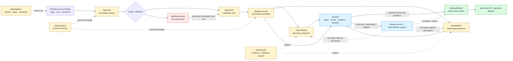

<!-- [KFM_META_BLOCK_V2]
doc_id: kfm://data/readme
title: data/ — Governed Lifecycle Data and Trust-Artifact Root
type: readme; root-readme; canonical-data-root; lifecycle-boundary; compatibility-drift-index; non-public-internal-root
version: v0.2.0
status: draft; repository-grounded; canonical-root-confirmed; mixed-lane-maturity; compatibility-debt-visible; payload-inventory-unverified; operational-enforcement-unverified; release-gated; non-authoritative
owners: OWNER_TBD — Data steward · Source steward · Pipeline steward · Domain stewards · Catalog/triplet steward · Evidence/proof steward · Receipt steward · Registry steward · Rights/sensitivity/policy reviewers · Release/correction/rollback steward · Security reviewer · Docs steward
created: 2026-06-29
updated: 2026-07-23
supersedes: v0.1.0 data root README at the same path
prepared_under_prompt: KFM Markdown Engineering, Modernization & GitHub Documentation Implementation Agent v5.0.0
policy_label: "restricted-review; data-root; lifecycle-governed; internal-by-default; no-direct-public-path; release-gated; source-role-aware; rights-aware; sensitivity-aware; evidence-aware; receipt-proof-catalog-release-separated; correction-aware; rollback-aware"
current_path: data/README.md
truth_posture: >
  CONFIRMED existing data root README and stable document identity; Directory Rules v1.4
  canonical data lifecycle root, phase map, release split, and mandatory root-README order;
  current RAW, WORK, QUARANTINE, PROCESSED, CATALOG, TRIPLET, receipts, proofs,
  PUBLISHED, registry, and rollback child READMEs; current compatibility READMEs for
  manifests, prov, singular triplet, literal triplet(s), and trade-routes; release root v2.0;
  current workflow inventory, Makefile boundaries, CODEOWNERS routing, generated-receipt
  lane and schema, and executable static connector/pipeline non-publisher test /
  PROPOSED minimum lifecycle artifact contract, transition evidence profile, compatibility
  retirement sequence, and unified data-root validation packet /
  CONFLICTED data/manifests versus release/manifests; data/prov versus data/catalog/prov;
  data/triplet and data/triplet(s) versus canonical data/triplets; topic-level data/trade-routes
  versus lifecycle-domain lanes; sources versus source_descriptors registry taxonomy; and
  data rollback support versus release rollback-decision families /
  UNKNOWN exhaustive recursive payload inventory, active source admissions, accepted
  cross-family lifecycle schemas, runtime writers, emitted receipt/proof completeness,
  catalog/triplet closure, release binding, public hosting, production behavior, and public effects /
  NEEDS VERIFICATION named accountable owners, independent review enforcement, branch
  protection, retention/deletion policy, sensitive-data access controls, validator orchestration,
  policy runtime, correction propagation, cache invalidation, and rollback drills
evidence_snapshot:
  repository: bartytime4life/Kansas-Frontier-Matrix
  repository_id: "1059091169"
  visibility: public
  base_ref: main
  base_commit: 79603b7981e52a4b1cdb5f1eb42a7f1dd34436d7
  prior_blob: 9ae3439441aa8239a9e57496d4d896e20a21e43e
  directory_rules_blob: 2affb080e6f0043867c64c7f06c1ca52030fbd55
  release_readme_blob: 0752610b1df6d11143158f6f162f65ecd650e6a6
  workflows_readme_blob: afb4f79ce2c5267cb1679f48186260e6edebf8b2
  codeowners_blob: dd2a84aa514d8ecd9208bc347f90f9a2ed37dd61
  makefile_blob: 51537af34ee065c2de571134688415042b83b22a
  validate_all_placeholder_blob: 5f01ac208c46f4ee98750af4fc1032604b670e9b
  non_publisher_test_blob: c6164787bc848eb2347c347af203d76afae37a2b
  adr_index_blob: cf08fae322ac53426f7394d97897fdb942253049
  raw_readme_blob: 771a4684341622aa684a3724f0c1a95b900f7335
  work_readme_blob: a9d2ef8636a4a9ab9b45097947792091ef4b9df1
  quarantine_readme_blob: 2f93c3dff8772edc27105a0fd8affd4b68cb7a60
  processed_readme_blob: 9cb4d4d35aa2878f02b4a6536ea5e674728c98e5
  catalog_readme_blob: 9cf67c4ce5308b9088466b023a244107e3863a48
  triplets_readme_blob: 222277e0ba00174ca88a3c1631a27f1ba7f86294
  receipts_readme_blob: 15f2608cfe3c692da2fdb8082b6f9d90f2a8bb9d
  proofs_readme_blob: 603dd71c5e0a4bd82e0228848514fd62d39b23c0
  published_readme_blob: 585abdf7953bc270a15bcf80b4dd8d6af93e70ac
  registry_readme_blob: ebadb413a5ba1151f94b8c33eb61fe51786da0f3
  rollback_readme_blob: e7e230b800f1ad92e798f5d5e4a33eed42841513
  manifests_compatibility_blob: c4cdbf0c0038f737447a7dc173f0fe49ef62490e
  prov_conflict_blob: 480ab7a559acb491d5984b2b33f0961578adc198
  triplet_compatibility_blob: 8ccabe28c3153ebf56d1828294e5810e420be446
  triplet_s_compatibility_blob: 13a114c1eb7559c09ec9b51a41285dbc1f61fbce
  trade_routes_compatibility_blob: 5f7f8ae32551c676089439a78360b2a58049250a
  generated_receipts_readme_blob: fe6bde02885c63b31897b5129019829d490bf777
  generated_receipt_schema_blob: fba21ed27ebccf1362fe397fe0c3ebd85e072685
  checked_absent_paths:
    - data/events/README.md
    - data/release/README.md
  inventory_method: exact GitHub file reads and bounded repository evidence at the pinned base; no clone, recursive payload inventory, runtime, deployment, or production store was inspected
related:
  - raw/README.md
  - work/README.md
  - quarantine/README.md
  - processed/README.md
  - catalog/README.md
  - triplets/README.md
  - receipts/README.md
  - proofs/README.md
  - published/README.md
  - registry/README.md
  - rollback/README.md
  - manifests/README.md
  - prov/README.md
  - triplet/README.md
  - triplet(s)/README.md
  - trade-routes/README.md
  - ../release/README.md
  - ../docs/doctrine/directory-rules.md
  - ../docs/doctrine/lifecycle-law.md
  - ../docs/doctrine/trust-membrane.md
  - ../docs/adr/INDEX.md
  - ../contracts/
  - ../schemas/
  - ../policy/
  - ../tools/validators/
  - ../tests/
  - ../fixtures/
  - ../pipelines/
  - ../pipeline_specs/
  - ../connectors/
  - ../apps/governed-api/
  - ../.github/workflows/README.md
  - ../.github/CODEOWNERS
  - ../Makefile
tags: [kfm, data, lifecycle, raw, work, quarantine, processed, catalog, triplets, receipts, proofs, published, registry, rollback, evidence, release, correction, compatibility, cite-or-abstain]
notes:
  - "This revision updates data/README.md in place and adds its required generated provenance receipt only."
  - "The first twelve H2 sections follow Directory Rules section 15 exactly."
  - "Canonical lifecycle lanes remain separate from compatibility and conflicted paths; no lane is moved, promoted, retired, or created by this documentation change."
  - "No payload, source activation, contract, schema, policy, fixture, test, validator, pipeline, workflow, release record, runtime, API, UI, deployment, or public artifact is created or modified."
  - "The v0.1 content and legacy fragment identities remain recoverable through the prior blob and the v0.1-to-v0.2 no-loss ledger."
[/KFM_META_BLOCK_V2] -->

<a id="top"></a>

# `data/` — Governed Lifecycle Data and Trust-Artifact Root

> **One-line purpose.** Own KFM lifecycle material and its data-plane trust adjuncts—from immutable source capture through governed public-safe artifacts—without turning directory placement, a generated derivative, or a release-adjacent record into truth or publication authority.

<p>
  <a href="#status"></a>
  <a href="#authority-level"></a>
  <a href="#operating-model-and-lifecycle-invariant"></a>
  <a href="#compatibility-and-placement-conflicts"></a>
  <a href="#public-client-and-sensitive-data-boundary"></a>
  <a href="#outputs"></a>
  <a href="#validation"></a>
</p>

> [!IMPORTANT]
> **`data/` is a lifecycle authority boundary, not a truth shortcut.** A file, hash, registry entry, receipt, proof, catalog record, triplet, published artifact, generated summary, workflow result, pull request, or merge does not become factual truth, policy permission, release approval, or KFM publication merely because it exists under this root.

> [!CAUTION]
> **Normal public clients must not read internal lifecycle stores directly.** RAW, WORK, QUARANTINE, PROCESSED, registry, receipt, proof, catalog, triplet, and rollback support remain behind governed interfaces. Only release-approved public-safe artifacts may flow from `data/published/` through approved delivery paths.

> [!WARNING]
> **Secrets and restricted material do not belong in this public repository.** Credentials, private endpoints, source-system secrets, living-person private data, DNA/genomic material, precise rare-species or archaeology locations, sensitive infrastructure detail, private-land joins, protected cultural knowledge, and unreviewed source payloads require approved storage and access controls outside ordinary repository paths.

**Quick navigation**

| Root contract | Trust and operation | Maintenance |
|---|---|---|
| [Purpose](#purpose) · [Authority](#authority-level) · [Status](#status) · [Belongs](#what-belongs-here) · [Exclusions](#what-does-not-belong-here) | [Inputs](#inputs) · [Outputs](#outputs) · [Validation](#validation) · [Lifecycle](#operating-model-and-lifecycle-invariant) · [Lane map](#canonical-lane-map) | [Review](#review-burden) · [Related](#related-folders) · [ADRs](#adrs) · [Last reviewed](#last-reviewed) · [Conflicts](#compatibility-and-placement-conflicts) · [Open verification](#open-verification-register) |

---

<a id="scope"></a>

## Purpose

`data/` is the canonical KFM responsibility root for lifecycle material and data-plane trust artifacts.

It answers five questions:

1. Which governed source capture, candidate, hold, processed product, catalog/triplet projection, receipt, proof, registry record, published carrier, or rollback-support artifact is this?
2. Which lifecycle phase and domain lane owns it?
3. Which source identity, role, rights, sensitivity, spatial scope, temporal scope, digest, code/spec identity, and validation lineage travel with it?
4. Which evidence, policy, review, release, correction, and rollback obligations remain open?
5. Which governed interface may expose it, to which audience and at which precision, after release gates close?

The durable public unit remains the **inspectable claim**. Data artifacts may support or carry that claim, but no path under `data/` can make the claim true, cited, rights-cleared, policy-admitted, reviewed, released, or public by implication.

This README changes no data state. It does not admit a source, run a pipeline, validate a payload, emit a receipt, close a proof, catalog a dataset, approve a release, switch an alias, invalidate a derivative, publish an artifact, or expose a route.

[Back to top](#top)

---

<a id="repo-fit"></a>

## Authority level

**Canonical data-lifecycle responsibility root; non-authoritative for object meaning, machine shape, policy, release decisions, public serving, and factual truth.**

| Concern | Owning authority | Role of `data/` |
|---|---|---|
| Lifecycle material | `data/` | Stores governed artifacts in the correct phase or trust-support lane. |
| Object meaning | [`contracts/`](../contracts/) | Data instances conform to accepted semantics; this README does not redefine them. |
| Machine shape | [`schemas/`](../schemas/) | Data instances reference accepted schemas; schemas do not live beside payloads as parallel authority. |
| Admissibility, rights, sensitivity, access | [`policy/`](../policy/) plus governed decisions | Data carries references and obligations; path placement does not grant permission. |
| Executable intake and transforms | [`connectors/`](../connectors/), [`pipelines/`](../pipelines/), admitted packages and tools | Produce candidates and receipts; do not create truth or publication by writing a path. |
| Enforceability | [`tests/`](../tests/), [`fixtures/`](../fixtures/), validators under [`tools/`](../tools/) | Prove bounded behavior; test success is not release approval. |
| Evidence and proof meaning | contracts/schemas/policy plus [`proofs/`](proofs/README.md) | Stores proof-support instances; neither README nor folder is proof by itself. |
| Process memory | [`receipts/`](receipts/README.md) | Stores receipts; receipts are not proof, catalog closure, release, or publication. |
| Catalog and graph projections | [`catalog/`](catalog/README.md), [`triplets/`](triplets/README.md) | Stores derived discovery/relationship projections; they remain downstream of governed records. |
| Release decisions | [`release/`](../release/README.md) | Separate root owns candidates, reviews, manifests, decisions, corrections, withdrawals, signatures, and rollback records. |
| Released public-safe artifacts | [`published/`](published/README.md) | Stores approved delivery carriers after release governance closes. |
| Public delivery | governed API, approved static delivery, release-resolved services | Consumes released artifacts; internal lifecycle stores are not normal public backends. |

### Authority invariants

- `data/published/` owns released **artifact bytes and public-safe sidecars**; `release/` owns the **decision and review record** that authorizes a release.
- `data/receipts/` records process memory; `data/proofs/` supports evidence/proof closure; `data/catalog/` and `data/triplets/` provide projections. These families must not collapse.
- Registry records identify and route sources, datasets, layers, rights, sensitivity, domains, and crosswalks. They do not replace domain evidence or lifecycle state.
- A domain name is a segment under a lifecycle or trust-support lane, not a root-level topic bucket.
- Compatibility paths remain non-canonical until an accepted ADR and migration record say otherwise.

[Back to top](#top)

---

<a id="status-notes"></a>

## Status

### Evidence snapshot

| Field | Current bounded result |
|---|---|
| Repository base | `main@79603b7981e52a4b1cdb5f1eb42a7f1dd34436d7` |
| Prior target blob | `9ae3439441aa8239a9e57496d4d896e20a21e43e` |
| Directory Rules | v1.4, blob `2affb080e6f0043867c64c7f06c1ca52030fbd55` |
| Canonical root posture | **CONFIRMED:** Directory Rules §9.1 assigns `data/` the lifecycle invariant. |
| Required README order | **CONFIRMED:** Directory Rules §15 requires the first twelve H2 sections used here. |
| Canonical child README roots | **CONFIRMED:** eleven exact child READMEs listed in [Canonical lane map](#canonical-lane-map). |
| Compatibility/conflicted README paths | **CONFIRMED:** `manifests/`, `prov/`, `triplet/`, `triplet(s)/`, and `trade-routes/` exist with non-canonical or conflicted posture. |
| Separate release root | **CONFIRMED:** [`release/README.md`](../release/README.md) v2.0 owns release governance and keeps explicit readiness holds visible. |
| Direct `data/events/README.md` | **NOT FOUND at the checked path.** This README does not create a new pre-RAW sibling. |
| Direct `data/release/README.md` | **NOT FOUND at the checked path.** Release decisions remain under `release/`. |

### Capability and enforcement posture

| Surface | Truth status | Current bounded finding |
|---|---:|---|
| Root and child documentation | `CONFIRMED / MIXED` | The canonical and compatibility lane READMEs exist, but versions, section systems, ownership placeholders, and maturity labels vary. |
| Exhaustive payload inventory | `UNKNOWN` | Exact file reads establish README/path evidence, not a recursive inventory of payloads, manifests, databases, generated files, ignored files, external stores, or runtime objects. |
| Accepted cross-family lifecycle contract | `NEEDS VERIFICATION` | No accepted root-wide object contract was established for every lifecycle and trust-support artifact family. |
| Unified validator orchestration | `NOT ESTABLISHED` | `tools/validate_all.py` exists but is a comment-only placeholder; it is not an aggregate data validator. |
| Repository baseline validation | `CONFIRMED BOUNDED` | `make validate` runs configured schema validators plus schema/contract tests; it does not validate all data payloads, lifecycle transitions, policy, proof closure, release state, or public hosting. |
| Connector/pipeline non-publisher guard | `CONFIRMED EXECUTABLE / BOUNDED` | A static test scans connector and pipeline source for write contexts near `data/catalog`, `data/published`, or `release/`; it is not a runtime sandbox or complete writer inventory. |
| Catalog, release-dry-run, publish-check Make targets | `WORKFLOW_HOLD / TODO` | They print explicit TODO readiness markers and do not build catalogs, assemble releases, or evaluate publication readiness. |
| Workflow inventory | `CONFIRMED / MIXED` | Workflow definitions include schema, contract, source, policy-boundary, promotion, release-dry-run, rollback, and domain readiness checks; definitions and green checks do not establish production readiness. |
| ADR authority | `PROPOSED` | The ADR index reports every numbered ADR as effectively proposed; this README accepts none. |
| CODEOWNERS routing | `CONFIRMED / LIMITED` | Default and selected trust-bearing data subroots route to `@bartytime4life`; routing is not stewardship assignment, independent review, approval, or proof that review occurred. |
| Public release readiness | `DENY BY DEFAULT` | No artifact becomes public from path placement, README text, a receipt, a workflow result, or a merge alone. |
| Production stores and public effects | `UNKNOWN` | No deployment, runtime, database, object store, tile host, cache, public route, dashboard, or production release was inspected. |

### Truth labels used here

| Label | Meaning |
|---|---|
| `CONFIRMED` | Verified from current repository bytes, tracked metadata, executable source, or pinned documentation evidence. |
| `PROPOSED` | A future contract, migration, check, or operating model not accepted or implemented at root scope. |
| `CONFLICTED` | Current paths or documents expose competing placement or authority claims. |
| `UNKNOWN` | Not established by the inspected repository, runtime, release, or production evidence. |
| `NEEDS VERIFICATION` | Checkable, but unresolved strongly enough to block reliance. |
| `DENY` | Fail-closed posture for unsafe exposure, unauthorized transition, or unsupported publication. |

[Back to top](#top)

---

<a id="accepted-material"></a>

## What belongs here

Only governed lifecycle material and data-plane trust/support instances belong under this root:

- **RAW:** immutable source captures or immutable references, retrieval metadata, checksums, and source-admission sidecars;
- **WORK:** normalized intermediates, candidate assertions, deterministic transform outputs, QA material, redaction/generalization trials, and run-local manifests;
- **QUARANTINE:** held material and review sidecars for unresolved identity, source role, rights, sensitivity, schema, geometry, time, evidence, policy, review, or receipt requirements;
- **PROCESSED:** normalized, versioned, validation-supported domain artifacts that are not thereby public;
- **CATALOG:** STAC, DCAT, PROV, domain catalog, and index projections tied to governed records;
- **TRIPLETS:** graph-compatible relationship projections, graph deltas, and exports that retain evidence/source-role references;
- **RECEIPTS:** ingest, transform, validation, pipeline, AI, redaction, aggregation, catalog, release-support, correction, rollback, and generated-work process memory;
- **PROOFS:** EvidenceBundle, ProofPack, validation, citation, review, integrity, agreement, and release-support instances under their accepted profiles;
- **PUBLISHED:** release-approved, public-safe artifact bytes and sidecars such as API payload snapshots, layers, PMTiles, GeoParquet, reports, stories, and approved indexes;
- **REGISTRY:** source, source-descriptor, dataset, layer, domain, rights, sensitivity, crosswalk, and other accepted registry records;
- **ROLLBACK SUPPORT:** data-plane rollback and alias-revert support, dependency/invalidation records, and rollback-local receipts that remain separate from release decisions;
- **LOCAL DOCUMENTATION:** README, index, manifest, digest, inventory, and migration sidecars that explain the local boundary without creating another authority home.

### Admission questions for every new artifact

| Question | Required posture |
|---|---|
| What responsibility and lifecycle phase owns it? | Exact root and lane identified before write. |
| What stable identity and digest bind it? | Deterministic where practical; no secret or sensitive value encoded in IDs. |
| Which source and source role support it? | Resolvable references; source role not inferred from filename or path. |
| Which spatial and temporal scopes apply? | Explicit where material; observed/source/retrieval/valid/release/correction times kept distinct as required. |
| Which rights, sensitivity, sovereignty, consent, or access obligations apply? | Resolved or fail closed into quarantine/restricted handling. |
| Which contract and schema apply? | Accepted references; no parallel local schema authority. |
| Which code/spec/run identity produced it? | Reproducible reference and receipt where applicable. |
| Which evidence, policy, review, release, correction, and rollback references remain open? | Visible; missing required closure blocks downstream transition. |

[Back to top](#top)

---

<a id="exclusions"></a>

## What does NOT belong here

| Do not place here | Correct responsibility home or action |
|---|---|
| ReleaseManifest, PromotionDecision, review approval, RollbackCard, CorrectionNotice, WithdrawalNotice, release signature, or release changelog | [`release/`](../release/README.md) |
| Semantic contract definitions | [`contracts/`](../contracts/) |
| JSON Schema, schema registry, or machine-shape authority | [`schemas/`](../schemas/) |
| Policy rules, policy bundles, or policy-engine code | [`policy/`](../policy/) |
| Connector, pipeline, validator, generator, package, application, API, UI, workflow, migration, or infrastructure code | Owning implementation root: `connectors/`, `pipelines/`, `tools/`, `packages/`, `apps/`, `.github/`, `migrations/`, or `infra/` |
| Reusable test fixtures or executable tests | [`fixtures/`](../fixtures/) and [`tests/`](../tests/) |
| Credentials, tokens, private keys, connection strings, secret-bearing config, or private endpoint details | Approved secret-management system; rotate and investigate if committed |
| Public client backing directly from RAW, WORK, QUARANTINE, PROCESSED, registry, receipt, proof, rollback, or unreleased catalog/triplet material | Governed API or approved released artifact path after policy/release checks |
| Generated language, embeddings, vector indexes, graph projections, maps, tiles, scenes, screenshots, reports, dashboards, or AI answers presented as sovereign truth | Downstream carriers only; resolve evidence and release state or abstain |
| Material with unresolved rights, precise sensitive locations, living-person private data, DNA/genomic context, cultural/archaeological restrictions, rare-species detail, critical infrastructure exposure, or private-land/title joins outside a governed hold/restricted path | Quarantine, approved restricted storage, redaction/generalization, staged access, delay, `ABSTAIN`, or `DENY` |
| New top-level topic lanes or alternate homes for manifests, provenance, triplets, sources, registries, proofs, receipts, release, contracts, schemas, or policy | Use canonical lane; otherwise require ADR, migration plan, compatibility record, and rollback |
| Silent deletion or overwrite used as correction/rollback | Preserve prior meaning, issue correction/withdrawal records, invalidate derivatives, and use governed rollback |

Compatibility READMEs may remain at existing paths during review or migration, but they must not receive new trust-bearing payloads or evolve independently.

[Back to top](#top)

---

## Inputs

Inputs arrive from governed producers; a file copy or external upload is not sufficient admission.

| Producer or source | Candidate input | Required boundary before acceptance |
|---|---|---|
| Source registry and admission process | SourceDescriptor, source role, rights, sensitivity, cadence, activation/review references | Identity and use posture resolved; otherwise quarantine or deny. |
| Connectors and source-edge tools | Immutable capture/reference, retrieval metadata, checksums, ingest receipt candidate | Output limited to RAW or QUARANTINE; no direct processed/catalog/published write. |
| Pipelines and admitted packages | WORK/PROCESSED candidates, transform reports, run receipts, validation references | Accepted spec/code identity, deterministic behavior where practical, bounded side effects, no direct publication. |
| Validators and tests | ValidationReport, citation report, integrity report, policy input, negative-case outcome | Tool/version/inputs recorded; a pass proves only the declared check. |
| Evidence/proof builders | EvidenceBundle, ProofPack, agreement/integrity support | Inputs resolve; claim scope and limitations preserved; proof is not release approval. |
| Catalog/triplet builders | STAC/DCAT/PROV records, catalog indexes, graph deltas/exports | Identifiers and evidence/source lineage close; projections remain derived. |
| Review, policy, and release processes | Decision references, obligations, release IDs, correction/rollback dependencies | Records remain in owning roots; `data/` stores referenced artifacts only where appropriate. |
| Authorized manual stewardship | Curated records, corrections, crosswalks, redaction/generalization outcomes | Actor, evidence, rationale, review, and receipt requirements met; no undocumented direct edit. |
| Recompile/correction processes | Superseding artifacts, invalidation sets, alias-revert support | Prior meaning retained; affected derivatives and public surfaces enumerated. |

### Minimum input metadata

A non-trivial artifact should carry or resolve, as applicable:

```text
stable_id + content_digest
source_id + source_role + source_version
spatial_scope + temporal_scope
rights_posture + sensitivity_posture + access_class
contract_ref + schema_ref
code_ref + spec_hash + run_id
validation_refs + receipt_refs
evidence_refs + proof_refs
policy_refs + review_refs
release_ref + correction_ref + rollback_ref
```

This is a **PROPOSED cross-family minimum profile**, not an accepted universal schema. Individual contracts control exact fields and finite outcomes.

[Back to top](#top)

---

## Outputs

`data/` emits or supports governed artifacts and references for downstream validation, catalog/triplet projection, release review, public delivery, correction, and rollback. It does not emit release approval by itself.

| Lane | Output role | Downstream consumer | Boundary |
|---|---|---|---|
| `raw/` | Immutable source capture/reference | WORK, QUARANTINE, source review | Internal; no public path. |
| `work/` | Candidate normalization and analysis | Validation, review, PROCESSED or QUARANTINE | Candidate, not truth or release. |
| `quarantine/` | Held material plus blocker context | Remediation, review, governed exit | Fail closed; no silent promotion. |
| `processed/` | Normalized validation-supported artifact | Catalog/triplet/proof/release-candidate builders | Not automatically public. |
| `catalog/` | Discovery/interchange projection | Governed catalog APIs, release/public indexes where approved | Catalog does not replace evidence or release. |
| `triplets/` | Relationship/graph projection | Graph/index consumers, analysis, released graph artifacts | Derived; not canonical replacement semantics. |
| `receipts/` | Process memory | Audit, replay, review, correction, rollback | Receipt is not proof or approval. |
| `proofs/` | Evidence/proof support | Policy/review/release and inspectable-claim surfaces | Proof support is not release authority. |
| `registry/` | Stable routing and governance metadata | Connectors, pipelines, validators, APIs, release review | Registry is not domain truth. |
| `rollback/` | Data-plane restoration and invalidation support | Release/correction/rollback processes | Release decision remains under `release/`. |
| `published/` | Released public-safe carrier | Governed APIs, approved static delivery, maps, exports, Evidence Drawer, bounded AI | Downstream carrier; release and evidence remain inspectable. |

### Release split

```text
release/         = review, decision, manifest, correction, withdrawal, signature, rollback authority

data/published/  = release-approved public-safe artifact bytes and delivery sidecars
```

A release record may point to a published artifact. The published artifact must not contain or impersonate the release decision that authorized it.

[Back to top](#top)

---

<a id="required-checks-before-use"></a>

## Validation

Validation is layered. No single current command was established as a complete data-root gate.

### Current repository-grounded controls

| Control | Current bounded behavior | Limit |
|---|---|---|
| [`make validate`](../Makefile) | Runs `tools/validators/_common/run_all.py` and schema/contract tests. | Does not recursively validate all lifecycle payloads, transitions, policy, proofs, releases, or hosting. |
| [`make boundary-guards`](../Makefile) | Runs selected policy/API boundary tests, including the connector/pipeline static non-publisher guard. | Bounded static/source tests; not a runtime filesystem or network sandbox. |
| [`tests/policy/test_pipeline_connector_non_publisher.py`](../tests/policy/test_pipeline_connector_non_publisher.py) | Rejects detected connector/pipeline write contexts near `data/catalog`, `data/published`, or `release/`. | Scans selected extensions and lexical windows; not exhaustive behavior proof. |
| [`tools/validate_all.py`](../tools/validate_all.py) | Repository path exists. | Comment-only placeholder; **do not cite as an implemented orchestrator**. |
| `make catalog`, `make release-dry-run`, `make publish-check` | Emit explicit TODO readiness markers. | Do not build a catalog, assemble a release, evaluate promotion, or authorize publication. |
| [Workflow inventory](../.github/workflows/README.md) | Records schema, contract, source, policy-boundary, promotion, release-dry-run, rollback, docs, and domain checks with explicit permissions. | Workflow definitions and green conclusions prove only their executed scope; several are holds or partial gates. |

### Required artifact checks

Before a non-trivial artifact advances, validate the applicable closure:

1. **Placement:** correct lifecycle phase, domain segment, compatibility class, and authority root.
2. **Identity and integrity:** stable ID, canonical digest, version, immutable input references, and collision/duplicate checks.
3. **Source:** admitted source reference, source role, authority class, source version/head, and retrieval lineage.
4. **Rights and sensitivity:** terms, attribution, access class, sovereignty/cultural authority, living-person/consent constraints, harmful precision, and redaction/generalization obligations.
5. **Contract and schema:** resolvable accepted versions, valid shape, semantic invariants, and closed additional fields where the schema requires them.
6. **Spatial and temporal support:** CRS/geometry/topology, scale/precision, valid/source/observation/retrieval/release/correction times, stale-state behavior, and uncertainty.
7. **Execution:** code/spec/run identity, deterministic/no-network posture where practical, side effects, retries, cancellation, replay, idempotency, and partial-state cleanup.
8. **Receipts and provenance:** input/output hashes, transform lineage, validation references, safe logs, and process receipt closure.
9. **Evidence and proof:** EvidenceRef resolution, EvidenceBundle/ProofPack limitations, citation closure, review support, and anti-collapse checks.
10. **Catalog/triplet:** identifier agreement, source/evidence lineage, projection parity, derivative status, and invalidation dependencies.
11. **Policy and review:** finite decision, reasons/obligations, accountable review, separation of duties where required, and no self-approval.
12. **Release, correction, rollback:** release reference, prior state, correction/withdrawal path, affected derivative/public-surface inventory, cache invalidation, and tested rollback target.

### Documentation checks for this root

- parse KFM metadata and preserve the stable `doc_id`;
- keep exactly one H1 and the Directory Rules §15 H2 order;
- resolve all internal fragments and repository-relative links;
- preserve legacy anchors documented in the no-loss ledger;
- keep fenced blocks, Mermaid, tables, HTML, alerts, and badge destinations valid;
- scan for credentials, secret patterns, private endpoints, and sensitive payload content;
- distinguish current repository evidence from proposed contracts and unknown runtime state;
- read back remote bytes and verify the final Git blob after mutation.

A validation pass is not factual proof, policy permission, human approval, release authorization, publication, or production parity.

[Back to top](#top)

---

## Review burden

### Current routing

[`.github/CODEOWNERS`](../.github/CODEOWNERS) routes the repository by default to `@bartytime4life` and repeats that route for `data/registry/`, `data/receipts/`, `data/proofs/`, and `data/published/`. This is **GitHub routing only**. It does not prove named data stewards, independent reviewers, required code-owner review, branch protection, separation of duties, or completed review.

### Review matrix

| Change class | Minimum review burden |
|---|---|
| README clarification or dead-link repair | Data/docs maintainer; verify no authority or lifecycle meaning changed. |
| New artifact or domain lane | Data steward, producer owner, domain steward, schema/contract reviewer, and source/rights/sensitivity reviewers as applicable. |
| RAW/source admission | Source steward, connector owner, rights/sensitivity reviewer, and data steward; no live activation by documentation alone. |
| Processed/catalog/triplet output | Pipeline/data owner, domain steward, validation reviewer, evidence/catalog/graph reviewer, and policy reviewer where consequences are material. |
| Receipt or proof profile | Receipt/proof steward, contract/schema/validation reviewer, evidence reviewer, and release reviewer if consumed by release gates. |
| Published artifact or public-serving change | Evidence, policy, sensitivity/rights, security, public-interface, release, correction, and rollback reviewers; independent approval where governance requires it. |
| Compatibility-path use, migration, move, rename, or retirement | Directory Rules/architecture reviewer, affected consumers, data steward, migration owner, and rollback reviewer; ADR when authority or lifecycle structure changes. |
| Sensitive-domain or exact-location material | Relevant domain and sovereignty/cultural/privacy/safety reviewers; fail closed until approved handling is established. |
| Correction, withdrawal, supersession, or rollback | Data, evidence, release, public-interface, cache/index, and affected-domain reviewers; preserve prior meaning and dependency lineage. |

Generated receipts and pull requests are review inputs, not human approval. AI-authored work must not approve its own artifacts or change review state.

[Back to top](#top)

---

## Related folders

| Path | Relationship |
|---|---|
| [`raw/`](raw/README.md) | Immutable source capture; no public path. |
| [`work/`](work/README.md) | Candidate/intermediate processing. |
| [`quarantine/`](quarantine/README.md) | Fail-closed hold and governed exit boundary. |
| [`processed/`](processed/README.md) | Normalized, validation-supported artifacts before projection/release. |
| [`catalog/`](catalog/README.md) | STAC/DCAT/PROV/domain discovery projections. |
| [`triplets/`](triplets/README.md) | Canonical plural relationship-projection lane. |
| [`receipts/`](receipts/README.md) | Process-memory root, including generated-work provenance. |
| [`proofs/`](proofs/README.md) | Evidence/proof-support root. |
| [`published/`](published/README.md) | Release-approved public-safe delivery artifacts. |
| [`registry/`](registry/README.md) | Source/dataset/layer/domain/rights/sensitivity/crosswalk routing records. |
| [`rollback/`](rollback/README.md) | Data-plane rollback and alias-revert support. |
| [`../release/`](../release/README.md) | Separate release-governance authority. |
| [`../contracts/`](../contracts/) · [`../schemas/`](../schemas/) · [`../policy/`](../policy/) | Meaning, machine shape, and admissibility. |
| [`../connectors/`](../connectors/) · [`../pipelines/`](../pipelines/) · [`../pipeline_specs/`](../pipeline_specs/) | Source access, executable transforms, and declarative intent. |
| [`../tests/`](../tests/) · [`../fixtures/`](../fixtures/) · [`../tools/`](../tools/) | Enforceability, deterministic cases, validators, generators, and operators. |
| [`../apps/governed-api/`](../apps/governed-api/) | Intended trust-membrane application; direct internal-store access remains denied. |
| [`../docs/doctrine/directory-rules.md`](../docs/doctrine/directory-rules.md) | Placement and lifecycle authority. |
| [`../docs/doctrine/lifecycle-law.md`](../docs/doctrine/lifecycle-law.md) | Lifecycle semantics and transition discipline. |
| [`../docs/doctrine/trust-membrane.md`](../docs/doctrine/trust-membrane.md) | Public/internal boundary. |
| [`../.github/workflows/README.md`](../.github/workflows/README.md) | Current workflow inventory and maturity disclosure. |

### Compatibility and conflicted children

| Path | Current posture | Canonical relationship |
|---|---|---|
| [`manifests/`](manifests/README.md) | Non-canonical compatibility/retirement | Release-level manifests belong under `release/manifests/`; released artifact sidecars may live with approved published artifacts. |
| [`prov/`](prov/README.md) | Placement conflicted | PROV catalog projections are also documented under `data/catalog/prov/`; migration/ADR required before authority claims. |
| [`triplet/`](triplet/README.md) | Transitional compatibility | Canonical lane is `data/triplets/`. |
| [`triplet(s)/`](triplet%28s%29/README.md) | Transitional literal-path compatibility | Canonical lane is `data/triplets/`. |
| [`trade-routes/`](trade-routes/README.md) | Transitional topic-path compatibility | Domain data belongs under lifecycle lanes using the `roads-rail-trade` domain segment. |

[Back to top](#top)

---

## ADRs

[`docs/adr/INDEX.md`](../docs/adr/INDEX.md) reports all numbered ADRs as effectively **proposed** at its evidence snapshot. This README records their relevance but accepts none and does not use a proposed ADR to authorize a move, release, or status transition.

| ADR | Relevance to `data/` | Effective status |
|---|---|---:|
| [`ADR-0001`](../docs/adr/ADR-0001-schema-home--schemas-contracts-v1-is-canonical.md) | Keeps machine schemas under `schemas/contracts/v1/`, not beside data payloads. | `proposed` |
| [`ADR-0011`](../docs/adr/ADR-0011-receipts-vs-proofs-vs-manifests-vs-catalog-separation.md) | Separates receipts, proofs, manifests, catalogs, and publication. | `proposed` |
| [`ADR-0012`](../docs/adr/ADR-0012-connector-outputs-to-data-raw-or-data-quarantine-only.md) | Restricts connector output to RAW or QUARANTINE. | `proposed` |
| [`ADR-0013`](../docs/adr/ADR-0013-spec_hash-and-run_id-identity-grammar.md) | Proposes shared run/spec identity grammar. | `proposed` |
| [`ADR-0014`](../docs/adr/ADR-0014-temporal-vocabulary--six-time-kinds-tracked.md) | Proposes shared temporal vocabulary. | `proposed` |
| [`ADR-0015`](../docs/adr/ADR-0015-data-published-_domain_-current-alias-is-governed-by-rollback_card.md) | Proposes governed `current` aliases and RollbackCard binding. | `proposed` |
| [`ADR-0017`](../docs/adr/ADR-0017-source-descriptor-admission-process.md) | Proposes source descriptor admission and activation records. | `proposed` |
| [`ADR-0018`](../docs/adr/ADR-0018-promotion-gate-sequence.md) | Proposes promotion gate sequence and records. | `proposed` |
| [`ADR-0021`](../docs/adr/ADR-0021-quarantine-has-structured-exit-paths.md) | Proposes named governed quarantine exits. | `proposed` |
| [`ADR-0022`](../docs/adr/ADR-0022-catalog-matrix--stac-+-dcat-+-prov-must-agree.md) | Proposes STAC/DCAT/PROV catalog closure. | `proposed` |
| [`ADR-0023`](../docs/adr/ADR-0023-geo-manifest-signs-every-pmtiles-cog-release.md) | Proposes signed geospatial artifact manifests. | `proposed` |
| [`ADR-0024`](../docs/adr/ADR-0024-steward-separation-of-duties-for-release.md) | Proposes release separation of duties. | `proposed` |
| [`ADR-0025`](../docs/adr/ADR-0025-public-client-never-reads-canonical-internal-stores.md) | Proposes the public-client trust-membrane rule as a numbered decision. | `proposed` |

### ADR and migration triggers

An accepted ADR and migration/rollback plan are required before:

- adding, removing, renaming, merging, or splitting a canonical data lifecycle phase;
- promoting `data/manifests/`, `data/prov/`, `data/triplet/`, `data/triplet(s)/`, or `data/trade-routes/` into authority;
- changing the `data/published/` versus `release/` split;
- creating a parallel receipt, proof, registry, catalog, release, schema, contract, source, or policy home;
- changing artifact identity semantics in a way that affects released or referenced records.

[Back to top](#top)

---

## Last reviewed

- **Date:** 2026-07-23
- **Evidence snapshot:** `main@79603b7981e52a4b1cdb5f1eb42a7f1dd34436d7`
- **Prior target blob:** `9ae3439441aa8239a9e57496d4d896e20a21e43e`
- **Review type:** exact repository file reads plus bounded workflow, Makefile, test, CODEOWNERS, release-root, generated-receipt, and ADR-index inspection
- **Payload/runtime inspection:** not performed
- **Named accountable owners:** needs verification
- **Independent review and branch protection:** needs verification
- **Public release readiness:** denied by default

Re-review this root when Directory Rules, lifecycle phases, the release split, child-lane authority, registry taxonomy, receipt/proof profiles, source admission, validator orchestration, public-serving architecture, correction behavior, or rollback mechanics change. Re-review immediately if a new direct child appears or a compatibility lane receives non-documentation payloads.

[Back to top](#top)

---

<a id="lifecycle-invariant"></a>

## Operating model and lifecycle invariant

Directory Rules defines the governing sequence:

```text
RAW -> WORK / QUARANTINE -> PROCESSED -> CATALOG / TRIPLET -> PUBLISHED
```

Promotion is a governed state transition, not a copy, move, rename, alias switch, tile build, catalog entry, graph projection, receipt, proof, workflow result, pull request, merge, or generated narrative.


```mermaid
flowchart LR
    SRC["Admitted source identity<br/>rights · role · sensitivity"] --> RAW["data/raw/<br/>immutable capture"]
    RAW --> TRIAGE{"Triage / validation"}
    TRIAGE --> WORK["data/work/<br/>candidate work"]
    TRIAGE --> QUAR["data/quarantine/<br/>fail-closed hold"]
    QUAR -->|governed remediation and exit| WORK
    WORK --> PROC["data/processed/<br/>normalized candidate"]
    PROC --> CAT["data/catalog/<br/>discovery projection"]
    PROC --> TRIP["data/triplets/<br/>relationship projection"]

    REG["data/registry/<br/>identity · rights · sensitivity"] -. references .-> SRC
    REC["data/receipts/<br/>process memory"] -. execution lineage .-> RAW
    REC -. execution lineage .-> PROC
    PROOF["data/proofs/<br/>evidence / validation support"] -. support .-> CAT
    PROOF -. support .-> TRIP

    CAT --> REVIEW["release/<br/>policy · review · manifest · decision"]
    TRIP --> REVIEW
    PROC --> REVIEW
    REVIEW -->|approved governed transition| PUB["data/published/<br/>public-safe carriers"]
    PUB --> API["governed API / approved delivery"]

    REVIEW -->|correction / withdrawal / rollback| ROLL["release records + data/rollback support"]
    ROLL -. invalidate / restore .-> PUB
    ROLL -. recompile affected derivatives .-> CAT
    ROLL -. recompile affected derivatives .-> TRIP

    classDef internal fill:#fff4ce,stroke:#8a6d3b,color:#24292f;
    classDef hold fill:#ffebe9,stroke:#cf222e,color:#24292f;
    classDef release fill:#ddf4ff,stroke:#0969da,color:#24292f;
    classDef public fill:#dafbe1,stroke:#1a7f37,color:#24292f;
    class RAW,WORK,PROC,CAT,TRIP,REG,REC,PROOF internal;
    class QUAR hold;
    class REVIEW,ROLL release;
    class PUB,API public;
```

> [!NOTE]
> The diagram states the responsibility contract. It does not prove that every source admission, lifecycle writer, registry resolver, validator, receipt emitter, proof builder, policy evaluator, catalog/triplet builder, release reviewer, alias switch, correction handler, rollback engine, cache invalidator, or public route is implemented.

### Transition matrix

| Transition | Minimum evidence before transition | Fail-safe outcome |
|---|---|---|
| Source edge → RAW | source identity/role, use posture, capture integrity, retrieval context, admission decision where required | QUARANTINE or DENY |
| RAW → WORK | immutable input reference, transform identity, bounded scope, run/receipt context | QUARANTINE or ERROR |
| RAW/WORK → QUARANTINE | explicit blocker, reason, affected scope, safe retention/access posture | HOLD / DENY according to applicable contract |
| QUARANTINE → WORK/PROCESSED | named exit, remediation evidence, revalidation, policy/review closure, receipt | Remain QUARANTINED |
| WORK → PROCESSED | contract/schema, source role, spatial/temporal, quality, provenance, policy checks appropriate to the artifact | QUARANTINE, ABSTAIN, DENY, or ERROR according to applicable contract |
| PROCESSED → CATALOG/TRIPLET | stable IDs, evidence/source lineage, projection parity, derivative label, catalog/graph validation | HOLD or ERROR |
| CATALOG/TRIPLET/PROCESSED → PUBLISHED | evidence/proof, rights/sensitivity, validation, policy, accountable review, release decision, correction and rollback closure | DENY / HOLD |
| PUBLISHED → corrected/superseded/withdrawn/rolled back | affected-artifact inventory, prior state, public notices where required, dependency/cache invalidation, rollback/recompile receipt | HOLD; never silent overwrite/delete |

The exact finite outcomes and record fields come from the applicable contracts. This README does not normalize conflicting vocabularies by prose.

[Back to top](#top)

---

<a id="confirmed-child-roots"></a>
<a id="directory-map"></a>

## Canonical lane map

### Canonical responsibility map

```text
data/
├── README.md
├── raw/
│   └── <domain>/<source_id>/<run_id>/
├── work/
│   └── <domain>/<run_id>/
├── quarantine/
│   └── <domain>/<reason>/<run_id>/
├── processed/
│   └── <domain>/<dataset_id>/<version>/
├── catalog/
│   ├── stac/
│   ├── dcat/
│   ├── prov/
│   └── domain/
├── triplets/
│   ├── graph_deltas/
│   └── exports/
├── receipts/
│   ├── ingest/
│   ├── validation/
│   ├── pipeline/
│   ├── ai/
│   └── generated/
├── proofs/
│   ├── evidence_bundle/
│   ├── proof_pack/
│   ├── validation_report/
│   └── citation_validation/
├── published/
│   ├── api_payloads/
│   ├── layers/
│   ├── pmtiles/
│   ├── geoparquet/
│   ├── reports/
│   └── stories/
├── rollback/
│   └── <domain>/<release_id>/
└── registry/
    ├── sources/
    ├── source_descriptors/
    ├── layers/
    ├── datasets/
    ├── domains/
    ├── rights/
    ├── sensitivity/
    └── crosswalks/
```

This is a responsibility map, not a recursive manifest and not permission to pre-create empty directories. Add a child only when a real governed artifact, source, run, dataset, registry record, receipt, proof, release dependency, migration, or steward decision requires it.

### Current canonical child-root evidence

| Root | Lifecycle/trust role | README evidence | Current limitation |
|---|---|---:|---|
| [`raw/`](raw/README.md) | Immutable source capture | `CONFIRMED` | Payloads, source admissions, and connector activation unverified. |
| [`work/`](work/README.md) | Candidate/intermediate work | `CONFIRMED` | Run inventory, receipts, validators, and side-effect controls unverified. |
| [`quarantine/`](quarantine/README.md) | Fail-closed hold | `CONFIRMED` | Held payloads, exit automation, and policy enforcement unverified. |
| [`processed/`](processed/README.md) | Normalized candidate products | `CONFIRMED` | Inventory and downstream closure unverified. |
| [`catalog/`](catalog/README.md) | Discovery/interchange projections | `CONFIRMED` | Catalog inventory, agreement checks, and release binding unverified. |
| [`triplets/`](triplets/README.md) | Relationship/graph projections | `CONFIRMED` | Graph payloads, validators, consumers, and parity unverified. |
| [`receipts/`](receipts/README.md) | Process memory | `CONFIRMED` | Exact layout, instance validity, signing, and complete emission unverified. |
| [`proofs/`](proofs/README.md) | Evidence/proof support | `CONFIRMED` | Emitted proof closure, profiles, and release enforcement unverified. |
| [`published/`](published/README.md) | Released public-safe carriers | `CONFIRMED` | Release approval, hosted payloads, routes, and current alias behavior unverified. |
| [`registry/`](registry/README.md) | Source/dataset/layer/domain/rights/sensitivity/crosswalk routing | `CONFIRMED` | Taxonomy, completeness, activation, and machine consumers unverified. |
| [`rollback/`](rollback/README.md) | Data-plane restoration/invalidation support | `CONFIRMED` | Rollback instances, execution, public invalidation, and drills unverified. |

[Back to top](#top)

---

## Compatibility and placement conflicts

Current repository paths expose real compatibility debt. This README preserves it as a review surface rather than silently calling it canonical or deleting it in a documentation PR.

| Conflict | Current safe posture | Resolution burden |
|---|---|---|
| `data/manifests/` versus `release/manifests/` | Treat `data/manifests/` as non-canonical compatibility/retirement only; no release records there. | Inventory consumers and payloads; accepted ADR/migration; mirror window if needed; rollback. |
| `data/prov/` versus `data/catalog/prov/` | Treat as placement conflicted; do not create competing PROV authority. | Classify support records versus catalog projections; decide through ADR/migration; update consumers and references. |
| `data/triplets/` versus `data/triplet/` and `data/triplet(s)/` | Canonical lane is plural `data/triplets/`; singular/literal paths deny new payloads. | Reference inventory, migration map, deprecation/retirement decision, compatibility tests, rollback. |
| `data/trade-routes/` versus lifecycle-domain lanes | Treat topic path as transitional compatibility; canonical domain segment is `roads-rail-trade` under each phase. | Inventory payloads/consumers; resolve any `transport` naming split; migrate by lifecycle phase. |
| `data/registry/sources/` versus `data/registry/source_descriptors/` | Keep both visible; do not assume identical semantics or duplicate active IDs. | Define family ownership, IDs, activation records, consumers, migration, and drift checks. |
| `data/rollback/` versus release rollback families | Use `data/rollback/` for data-plane support; use `release/` for decisions, cards, notices, and governance. | Accept exact record split, references, execution order, public invalidation, and drills. |
| Catalog/triplet discoverability versus publication | A projection may exist internally; public exposure still requires release binding and policy-safe delivery. | Define accepted catalog visibility states and route behavior. |
| Child README maturity vocabulary | Preserve source labels; do not treat `draft`, `PROPOSED`, `active`, lifecycle stage, and runtime outcome as one status system. | Adopt shared documentation/contract vocabularies through reviewed changes. |

### Safe migration sequence

1. Freeze new payloads in the compatibility/conflicted path.
2. Produce a pinned recursive inventory of files, IDs, consumers, workflows, registries, public references, and releases.
3. Classify every object by responsibility, lifecycle phase, authority, rights, sensitivity, and release state.
4. Open the required ADR and drift/migration records; do not let the migration draft authorize itself.
5. Move with history preservation, stable identity or explicit identity migration, compatibility pointers where justified, and updated references.
6. Run positive/negative validation, consumer parity checks, public-path checks, correction/invalidation tests, and a rollback drill.
7. Retire the compatibility path only after the verified window closes; preserve lineage and correction records.

No compatibility path is moved, renamed, or retired by this README update.

[Back to top](#top)

---

## Minimum lifecycle artifact contract

The following is a **PROPOSED root-level review profile**. It helps reviewers locate missing support; it does not replace object-family contracts or schemas.

| Area | Minimum reviewable support |
|---|---|
| Identity | Stable artifact ID, family, version, lifecycle phase, domain lane, content digest, prior/superseding IDs. |
| Source | SourceDescriptor/source ID, source role, authority class, source version/head, retrieval reference. |
| Scope | Spatial support, CRS/precision/scale, temporal support and time roles, uncertainty/limitations. |
| Rights and sensitivity | Rights/terms/attribution, access class, sovereignty/cultural authority, consent/privacy, sensitive geometry, obligations. |
| Meaning and shape | Accepted contract and schema refs; validator/profile refs; no parallel local authority. |
| Execution | Code ref, spec/profile hash, run ID, tool/runtime versions, inputs/outputs, deterministic/replay posture, side effects. |
| Validation | Schema/semantic/spatial/temporal/source-role/policy/citation/integrity results and finite reason codes. |
| Provenance and receipts | Process receipt refs, input/output digests, transform lineage, safe logs, timestamps, failure/partial-state record. |
| Evidence and proof | EvidenceRef/EvidenceBundle/ProofPack or explicit non-claim role; support and limitations resolvable. |
| Projection | Catalog/triplet IDs, parity and derivation status, source/evidence lineage, dependent indexes/tiles/graphs. |
| Policy and review | PolicyDecision refs, obligations, accountable reviewer state, separation of author/approver where required. |
| Release and recovery | Candidate/release refs, manifest/decision, prior state, correction/withdrawal, affected derivatives, rollback and recompile targets. |

### Anti-collapse assertions

```text
path presence        != factual truth
processed artifact   != EvidenceBundle
receipt              != proof
proof                != release approval
catalog record        != publication
triplet / graph edge  != canonical replacement truth
published artifact    != release decision
release decision      != permanent correctness
map / report / AI     != sovereign truth
rollback              != deletion of history
```

[Back to top](#top)

---

<a id="root-guardrails"></a>

## Public-client and sensitive-data boundary

### Public-client law

Ordinary clients may consume:

- governed API envelopes;
- release-resolved artifact URLs;
- approved public-safe `data/published/` artifacts;
- released catalog records and tiles where policy allows;
- resolved EvidenceBundle/citation support at the permitted detail level;
- correction, stale, supersession, withdrawal, and release-state cues.

Ordinary clients must not consume:

- RAW, WORK, QUARANTINE, or unreleased PROCESSED payloads;
- internal registry, receipt, proof, rollback, or review stores;
- unreleased catalog/triplet projections;
- direct source credentials/endpoints or unrestricted source payloads;
- hidden model output or generated text without governed evidence/policy envelopes;
- exact sensitive geometry or reconstructive joins withheld by policy.

### Sensitive-data defaults

| Material or risk | Default posture |
|---|---|
| Unknown rights or redistribution terms | QUARANTINE / DENY public exposure |
| Living-person or private household data | Restricted; minimize, purpose-bind, review consent/legal basis, deny public detail by default |
| DNA/genomic or derived kinship information | Fail closed; no ordinary repository payload or public path |
| Archaeology, sacred/cultural knowledge, sovereignty-sensitive material | Steward/authority review; generalize, delay, stage, or deny |
| Rare species/plants or vulnerable habitat | Public-safe generalization and anti-reconstruction review |
| Critical infrastructure or vulnerability detail | Minimize and restrict; public-safe aggregation only when approved |
| Private land/title/owner joins | Separate evidence roles; deny owner-resolved public exposure without authority |
| Exact source endpoints, credentials, or operational internals | Keep out of committed data and logs; use approved secret/config systems |
| Uncertain spatial precision or temporal support | Mark limitations, narrow claim, abstain, or hold |

Redaction, aggregation, generalization, masking, delay, and withholding are transforms. They require reason, scope, input/output identity, policy/review references, and a receipt where material. A client-side style filter is not a sufficient secrecy control.

[Back to top](#top)

---

## Open verification register

| Item | Status | Verification needed before reliance |
|---|---:|---|
| Exhaustive recursive `data/` inventory | `NEEDS VERIFICATION` | Pinned tree, file families, payload types, sizes, generated/ignored/external stores, and owners. |
| Canonical versus compatibility-path disposition | `CONFLICTED` | Payload/consumer inventory, accepted ADRs, migration manifests, compatibility window, rollback. |
| Registry family taxonomy and active source records | `NEEDS VERIFICATION` | IDs, source/source-descriptor split, activation decisions, rights/sensitivity records, consumers. |
| Cross-family lifecycle contract and identity grammar | `PROPOSED` | Accepted contracts/schemas, canonicalization, digest algorithm, validators, fixtures, migrations. |
| Lifecycle writer inventory | `UNKNOWN` | Connector/pipeline/package/tool/runtime code paths, permissions, side effects, sandbox, deployment. |
| Unified validator and data-profile registry | `NOT ESTABLISHED` | Accepted orchestrator, registered validators, deterministic commands, exit codes, CI wiring. |
| Rights/sensitivity/policy runtime enforcement | `UNKNOWN` | Active policy bundles, evaluator, input bindings, decisions, negative fixtures, logs/receipts. |
| Receipt emission, validity, signing, and retention | `NEEDS VERIFICATION` | Instance inventory, schema validation, producer binding, signing/attestation, review, retention. |
| Evidence/proof closure and correction propagation | `UNKNOWN` | EvidenceRef resolution, ProofPack profiles, invalidation graph, released-claim dependencies. |
| Catalog/triplet closure and parity | `UNKNOWN` | STAC/DCAT/PROV agreement, graph parity, ID closure, validators, released/public visibility. |
| Release binding and `current` alias behavior | `UNKNOWN` | Candidate/manifest/decision/review chain, alias mechanism, RollbackCard, atomicity, receipts. |
| Public serving, hosting, caching, and invalidation | `UNKNOWN` | Governed routes, artifact hosts, access control, headers, caches, stale/correction/withdrawal behavior. |
| Retention, deletion, legal hold, and storage governance | `UNKNOWN` | Accepted policy, source obligations, deletion/retention schedules, backup/recovery, audit. |
| Named stewards and independent review enforcement | `NEEDS VERIFICATION` | Approved role assignments, GitHub teams, rulesets, required checks/reviews, separation of duties. |
| Production release, rollback, and disaster-recovery evidence | `UNKNOWN` | Observed releases, dashboards/logs, rollback drills, recovery objectives, post-rollback verification. |

Unknown or conflicted items narrow claims and block higher-risk transitions; they do not invite plausible defaults.

[Back to top](#top)

---

<a id="evidence-ledger"></a>

## Evidence ledger

| Evidence | Observation used | Limit |
|---|---|---|
| Prior [`data/README.md`](./README.md) blob `9ae3439…` | Stable document identity, lifecycle purpose, release split, child-root index, guardrails, map, checks, and evidence posture. | Prior section order did not meet Directory Rules §15 and its evidence snapshot was stale. |
| [Directory Rules](../docs/doctrine/directory-rules.md) blob `2affb08…` | Canonical data tree, lifecycle rules, release split, compatibility/ADR/migration discipline, README order. | Doctrine does not prove implementation or payloads. |
| Canonical child READMEs | Eleven exact lane boundaries and mixed maturity. | README presence does not prove payload completeness or enforcement. |
| Compatibility/conflicted READMEs | Existing non-canonical manifest, provenance, triplet, and topic paths. | Does not decide migration or prove payloads/consumers. |
| [Release root README](../release/README.md) blob `0752610…` | Separate release-governance root and explicit readiness holds. | Does not prove operational release machinery. |
| [Workflow inventory](../.github/workflows/README.md) blob `afb4f79…` | Forty-one tracked workflow definitions at its pinned snapshot, explicit permissions, mixed holds/partial gates. | Does not establish current run success, branch protection, or production readiness. |
| [Makefile](../Makefile) blob `51537af…` | Implemented schema/contract baseline and boundary tests; explicit catalog/release/publish TODO markers. | Not a complete data lifecycle gate. |
| [`tools/validate_all.py`](../tools/validate_all.py) blob `5f01ac2…` | Path exists as a placeholder. | No aggregate validation behavior. |
| [Static non-publisher test](../tests/policy/test_pipeline_connector_non_publisher.py) blob `c616478…` | Executable bounded guard against detected connector/pipeline write contexts to publish targets. | Lexical/static coverage only. |
| [ADR index](../docs/adr/INDEX.md) blob `cf08fae…` | Every numbered ADR is effectively proposed at its snapshot. | Index does not accept decisions or prove implementation. |
| [Generated-receipt lane](receipts/generated/README.md) and [schema](../schemas/contracts/v1/receipts/generated_receipt.schema.json) | Existing process-memory lane and machine shape for AI-authored artifact provenance. | Receipt is not proof, approval, release, or publication. |
| [CODEOWNERS](../.github/CODEOWNERS) blob `dd2a84a…` | Current review routing to the verified repository account. | Routing is not stewardship, independent approval, or enforcement. |

### Evidence limits

No recursive clone, database, object store, bucket, registry service, source endpoint, secret store, policy runtime, catalog/triplet service, public API, tile host, cache, dashboard, deployment, production log, branch-protection setting, or released artifact was inspected. Current implementation and operational claims remain bounded accordingly.

[Back to top](#top)

---

## v0.1 to v0.2 no-loss ledger

| v0.1 element | v0.2 disposition |
|---|---|
| Stable path and `kfm://data/readme` identity | Preserved exactly. |
| Canonical lifecycle-root purpose | Preserved and made explicit under Purpose and Authority level. |
| Lifecycle invariant | Preserved verbatim and expanded with a corrected responsibility diagram and transition matrix. |
| Public-client trust membrane | Preserved and strengthened under Authority, Outputs, and Public-client boundary. |
| Release decision versus published artifact split | Preserved and reconciled with the current release-root v2.0 evidence. |
| Accepted material list | Preserved under What belongs here and expanded by explicit admission questions. |
| Exclusions | Preserved under What does NOT belong here with canonical routing. |
| Eleven confirmed child roots | Preserved in the canonical lane matrix with current blobs and bounded limitations. |
| Root guardrails | Preserved across Authority invariants, Validation, conflicts, anti-collapse assertions, and sensitive-data boundary. |
| Directory map | Preserved and aligned exactly to Directory Rules §9.1; compatibility paths are separated instead of appearing canonical. |
| Required checks | Preserved and expanded into repository-grounded current controls plus a twelve-part artifact review checklist. |
| Status notes and evidence ledger | Preserved, refreshed to current repository evidence, and separated from proposed future controls. |
| Legacy fragment IDs | Preserved: `scope`, `lifecycle-invariant`, `repo-fit`, `accepted-material`, `exclusions`, `confirmed-child-roots`, `root-guardrails`, `directory-map`, `required-checks-before-use`, `status-notes`, and `evidence-ledger`. |
| Correction and rollback posture | Preserved and strengthened with dependency/public-surface invalidation and migration discipline. |
| No-overclaim boundary | Preserved throughout; payload, runtime, release, and production maturity remain explicit UNKNOWN/NEEDS VERIFICATION. |

### Change history

#### v0.2.0 — 2026-07-23

- reorganized the first twelve H2 sections to the Directory Rules §15 contract;
- refreshed the evidence snapshot to current repository files;
- separated canonical lifecycle lanes from compatibility/conflicted paths;
- recorded the placeholder aggregate validator and bounded Make/workflow/test controls honestly;
- strengthened source, identity, time, rights, sensitivity, evidence, policy, release, public-client, correction, and rollback boundaries;
- added a transition matrix, compatibility migration sequence, minimum artifact profile, review matrix, verification register, and no-loss ledger;
- changed documentation and generated provenance only.

#### v0.1.0 — 2026-06-29

- replaced the short root stub with a lifecycle contract;
- documented child roots, accepted/excluded material, guardrails, directory map, checks, status notes, and evidence ledger.

[Back to top](#top)
