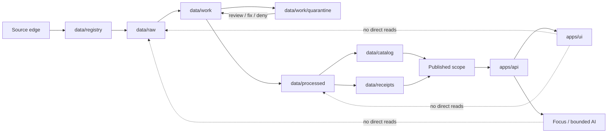

<!-- [KFM_META_BLOCK_V2]
doc_id: kfm://doc/TODO-uuid
title: Data Directory
type: standard
version: v1
status: draft
owners: TODO(team-or-names)
created: TODO(YYYY-MM-DD)
updated: TODO(YYYY-MM-DD)
policy_label: TODO(policy-label)
related: [TODO(../contracts/), TODO(../policy/), TODO(../docs/), TODO(../apps/api/), TODO(../tests/)]
tags: [kfm, data, truth-path, catalog, evidence, provenance]
notes: [Aligned to mounted KFM doctrine; live repo tree beyond data/README.md was not directly verified in the current session.]
[/KFM_META_BLOCK_V2] -->

# `data/`
Governed storage and artifact zone for KFM source onboarding, lifecycle transitions, catalog closure, and proof-bearing release artifacts.

> [!IMPORTANT]
> This README is aligned to the mounted KFM corpus, but the live repository tree was **not** directly verified in the current session. Paths below beyond `data/README.md` are the **expected KFM layout** and should be confirmed against the repo before merge.

| Status | Owners | Badges | Quick jump |
| --- | --- | --- | --- |
| Draft | TODO(team-or-names) |    | [Scope](#scope) · [Repo fit](#repo-fit) · [Inputs](#accepted-inputs) · [Directory tree](#directory-tree) · [Quickstart](#quickstart) · [Usage](#usage) · [Diagram](#diagram) · [Zone matrix](#zone-matrix) · [Task list](#task-list--definition-of-done) · [FAQ](#faq) |

---

## Scope

`data/` exists to hold KFM’s governed data-path materials, not just “files that happen to be data.”

In KFM terms, this directory is where source onboarding, immutable capture, transform staging, canonical publishable artifacts, catalog closure, and emitted receipts become inspectable and reviewable. It is part of the truth path and therefore part of the trust model.

This README treats `data/` as the home for:

- source registry entries and intake metadata
- immutable raw captures and their manifests
- work and quarantine artifacts used during governed transforms
- canonical processed artifacts ready for catalog closure
- catalog triplet outputs and related metadata products
- receipts, checksums, and related proof-bearing artifacts

> [!NOTE]
> `PUBLISHED` is a **governed release state**, not necessarily a sibling directory. This README therefore documents the storage and artifact zones under `data/`, while treating publication as an exposure state reached through governed APIs and policy gates.

[Back to top](#data)

## Repo fit

**Path:** `data/README.md`

`data/` sits between source onboarding and governed exposure. It should receive source-native captures and emit canonical artifacts, catalog surfaces, and release evidence. It should **not** become a direct public contract surface.

| Relationship | Expected repo neighbor | Why it matters here |
| --- | --- | --- |
| Upstream | [`../contracts/`](../contracts/) *(expected)* | Holds schemas, profiles, and machine-validated shapes that govern what may be stored or promoted under `data/`. |
| Upstream | [`../policy/`](../policy/) *(expected)* | Carries rights, sensitivity, and fail-closed rules that determine whether material stays in quarantine, promotes, or remains withheld. |
| Upstream | [`../docs/`](../docs/) *(expected)* | Provides architecture, runbooks, ADRs, and stewardship guidance that explain why `data/` is shaped the way it is. |
| Downstream | [`../apps/api/`](../apps/api/) *(expected)* | Governed read/exposure path for promoted outputs, evidence resolution, and policy-safe retrieval. |
| Downstream | [`../apps/ui/`](../apps/ui/) *(expected)* | Public and steward-facing surfaces should consume promoted scope only; they should never read `data/` directly. |
| Downstream | [`../tests/`](../tests/) *(expected)* | Validation, contract, policy, and reproducibility checks should treat `data/` artifacts as first-class test fixtures. |
| Downstream | [`../infra/`](../infra/) *(expected)* | Backup, retention, restore, and release discipline depend on knowing which `data/` materials are canonical versus rebuildable. |

> [!IMPORTANT]
> The repo-fit map above is **expected KFM structure**, not a claim that every neighbor path is mounted and verified in this session.

[Back to top](#data)

## Accepted inputs

The following belong here when they are under governed control and have clear lifecycle meaning:

- source registry entries and source-descriptor-adjacent metadata
- immutable raw payloads, request details, rights snapshots, and checksums
- work artifacts used for normalization, QA, geometry repair, redaction, or controlled joins
- quarantine materials whose rights, sensitivity, or validation status remain unresolved
- canonical processed artifacts such as GeoParquet, COG, PMTiles, and derivative tables
- DCAT / STAC / PROV outputs and related closure artifacts
- run receipts, validation reports, and release-adjacent evidence artifacts

## Exclusions

The following do **not** belong here, or do so only under an explicitly documented exception:

- direct client-facing app assets or UI bundles
- ad hoc notebook outputs treated as authoritative truth
- uncataloged “final” files
- direct public-access URLs that bypass policy or evidence resolution
- secrets, credentials, tokens, or local machine state
- undocumented caches, indexes, or one-off exports
- derived search, vector, tile, or graph material that is not clearly labeled as rebuildable and non-authoritative

> [!CAUTION]
> If a file cannot explain its source, lifecycle zone, rights posture, and promotion status, it does not belong in `data/`.

[Back to top](#data)

## Directory tree

The tree below reflects the **expected** KFM `data/` layout implied by the mounted manuals.

```text
data/
├── README.md
├── registry/
├── raw/
├── work/
│   └── quarantine/
├── processed/
├── catalog/
│   ├── dcat/
│   ├── stac/
│   └── prov/
└── receipts/
```

### Directory intent

| Path | Role | Keep here | Do not treat as |
| --- | --- | --- | --- |
| `data/registry/` | Source and dataset registration surface | registry entries, source descriptors, intake metadata | public runtime API output |
| `data/raw/` | Immutable acquisition zone | source-native captures, request details, rights snapshots, checksums | mutable working area |
| `data/work/` | Controlled transform and QA zone | normalization outputs, repair steps, intermediate reports | publishable truth |
| `data/work/quarantine/` | Held or blocked subzone | rights-unclear, sensitivity-unclear, failed-validation, review-blocked materials | warning-only pseudo-production |
| `data/processed/` | Canonical publishable artifact zone | immutable, content-addressable outputs ready for catalog closure | public release by folder copy |
| `data/catalog/` | Metadata and lineage boundary | DCAT / STAC / PROV materials and related closure outputs | a substitute for raw provenance |
| `data/receipts/` | Proof-bearing run artifacts | run receipts, digests, validation outputs, release-adjacent evidence | optional logging noise |

> [!TIP]
> If the live repo chooses a slightly different physical split—especially around `work/` and `quarantine/`—preserve the doctrine first: **mutable transform space must remain distinct from blocked-review space and from canonical processed outputs**.

[Back to top](#data)

## Quickstart

The fastest safe way to inspect whether `data/` matches KFM doctrine is to verify the zone boundaries before touching any files.

```bash
# Inspect the top-level layout
tree -L 2 data

# Review what is registered as onboarded or expected sources
find data/registry -maxdepth 2 -type f | sort

# Inspect one raw acquisition batch
find data/raw -maxdepth 4 -type f | sed -n '1,40p'

# Confirm catalog materials exist
find data/catalog -maxdepth 3 -type f | sort

# Review receipts or validation artifacts
find data/receipts -maxdepth 3 -type f | sort
```

### Minimal inspection checklist

1. Confirm a source or dataset is represented in `data/registry/`.
2. Confirm raw acquisition is immutable and accompanied by manifest/checksum material.
3. Confirm work artifacts are separated from canonical processed outputs.
4. Confirm no processed artifact is treated as done until catalog closure exists.
5. Confirm public/runtime paths consume promoted scope through governed services, not directly from `data/`.

[Back to top](#data)

## Usage

### 1. Register first, fetch second

Before a source enters `data/raw/`, it should have an identifiable home in `data/registry/`. Source intake is a contract, not a download.

### 2. Preserve raw exactly once

`data/raw/` is for source-native capture plus the metadata required to reconstruct acquisition. Overwrite-in-place breaks lineage and weakens auditability.

### 3. Transform in `work/`, not in `processed/`

Normalization, QA, geometry repair, redaction, OCR cleanup, temporary joins, and similar activities belong in `data/work/`. If rights or sensitivity remain unresolved, the material belongs in quarantine, not in processed output.

### 4. Promote only immutable, catalogable artifacts

`data/processed/` should contain canonical publishable artifacts that can regenerate a valid catalog triplet. If a processed artifact cannot support DCAT/STAC/PROV closure, it is not ready.

### 5. Treat publication as a gated state transition

Files under `data/` are not public merely because they exist. KFM publication happens only after identity, rights, sensitivity, catalog, receipt, policy, and operational checks close successfully.

### 6. Keep authoritative and derived layers distinct

If rebuildable projections such as tiles, search indexes, graph expansions, or vector stores are materialized from canonical artifacts, they must not silently become authoritative truth.

#### Illustrative raw-batch skeleton

```text
data/raw/<source_id>/<acquisition_date>/<batch_or_object>/
├── manifest.json
├── checksums.sha256
├── rights_snapshot/
└── payload/
```

#### Illustrative receipt-adjacent manifest

```json
{
  "source_id": "example_source",
  "acquired_at": "YYYY-MM-DDThh:mm:ssZ",
  "batch_id": "example-batch",
  "request": {
    "method": "GET",
    "params": {}
  },
  "rights_snapshot": "TODO",
  "artifacts": [
    {
      "path": "payload/example.ext",
      "sha256": "TODO"
    }
  ]
}
```

> [!NOTE]
> The JSON example above is illustrative only. Use the authoritative contract shape from the live repo once `../contracts/` is verified.

[Back to top](#data)

## Diagram


```mermaid
flowchart LR
    SE[Source edge] --> REG[data/registry]
    REG --> RAW[data/raw]
    RAW --> WORK[data/work]
    WORK --> QUAR[data/work/quarantine]
    WORK --> PROC[data/processed]
    QUAR -->|review / fix / deny| WORK
    PROC --> CAT[data/catalog]
    PROC --> REC[data/receipts]
    CAT --> PUB[Published scope]
    REC --> PUB
    PUB --> API[apps/api]
    API --> UI[apps/ui]
    API --> FOCUS[Focus / bounded AI]

    UI -. no direct reads .-> RAW
    UI -. no direct reads .-> PROC
    FOCUS -. no direct reads .-> RAW
```

### Read this diagram as policy, not just plumbing

- `data/` is part of the truth path.
- Catalog and receipts are not decorative metadata; they are what make promotion inspectable.
- Public/runtime surfaces consume **published scope**, not arbitrary filesystem state.
- No client, map surface, or Focus surface should read `data/` directly.

[Back to top](#data)

## Zone matrix

| Zone or state | Primary question it answers | Typical contents | Must never happen here |
| --- | --- | --- | --- |
| `raw/` | *What exactly did we receive?* | source-native payloads, request metadata, terms snapshots, checksums | in-place mutation or public exposure |
| `work/` | *What are we transforming, checking, or repairing?* | normalization outputs, QA reports, repair steps, temporary joins | pretending intermediate outputs are canonical |
| `work/quarantine/` | *What is blocked pending rights, sensitivity, or validation closure?* | failed validation, unresolved policy, withheld materials, review packets | warning-only pseudo-production |
| `processed/` | *What is canonical and publishable if catalog closure succeeds?* | immutable artifacts, canonical tables, publishable rasters or vectors | outputs with no reproducible lineage |
| `catalog/` | *Can a version be discovered, understood, and traced?* | DCAT, STAC, PROV, closure outputs | marking a version complete with broken or missing triplet members |
| `receipts/` | *Can we reconstruct what ran and what promoted?* | run receipts, checksums, validation outputs, release-adjacent evidence | treating proof as optional |
| `published` *(state)* | *May governed services expose this version?* | policy-safe exposure state | confusing a state transition with a folder copy |

[Back to top](#data)

## Task list / definition of done

A dataset path touching `data/` is not done because a transform finished. It is done when the governed release path closes.

- [ ] Source or dataset registry entry exists and validates.
- [ ] Raw acquisition is captured immutably with manifest, request details, rights snapshot, and checksums.
- [ ] Work outputs are reproducible from raw capture.
- [ ] Rights, sensitivity, and redaction/generalization obligations are explicit.
- [ ] Quarantine is used for ambiguity, not bypassed for convenience.
- [ ] Processed artifacts are immutable and content-addressable.
- [ ] Catalog closure exists and validates across DCAT / STAC / PROV.
- [ ] Representative evidence references resolve cleanly.
- [ ] Run receipts and validation artifacts exist.
- [ ] Public/runtime exposure is gated through governed services only.
- [ ] Owner, rollback note, and monitoring posture exist for any new release-significant surface.

### Review gates that should block promotion

- missing or unstable identity
- missing rights or unresolved redistribution posture
- unresolved sensitivity or absent redaction plan
- broken triplet validation
- missing receipt or checksum mismatch
- failing policy or contract tests
- no rollback path for a newly exposed release surface

[Back to top](#data)

## FAQ

### Why is `published` not shown as a directory?
Because KFM treats publication as a governed **state transition** reached through policy and evidence closure, not as a guarantee of a filesystem folder.

### Can the UI, notebooks, or ad hoc scripts read from `data/` directly?
Not as a public or governed behavior. KFM’s trust membrane requires external and UI access to cross governed APIs and policy boundaries.

### What should happen when rights or sensitivity are unclear?
Keep the material in quarantine, preserve the ambiguity explicitly, and route it through steward review. Do not “temporarily” publish and fix later.

### Are tiles, search indexes, vector stores, or graph expansions authoritative?
Not by default. They are derived and rebuildable unless explicitly promoted under the same governance discipline as canonical artifacts.

### Why keep receipts inside the `data/` story at all?
Because KFM treats evidence, promotion, and correction as operational facts. Receipts are part of the proof that a publishable object is reconstructible.

[Back to top](#data)

## Appendix

<details>
<summary><strong>Glossary and starter reference</strong></summary>

### Glossary

| Term | Meaning |
| --- | --- |
| **Truth path** | The governed movement from source acquisition through lifecycle zones into public-safe exposure. |
| **Trust membrane** | The rule that public and UI access cross governed APIs and policy checks instead of reading stores directly. |
| **Catalog triplet** | The linked DCAT / STAC / PROV boundary required for discoverable, traceable publication. |
| **EvidenceRef / EvidenceBundle** | Stable evidence token and its governed, policy-safe resolved support package. |
| **Public-safe** | Release posture that has already passed rights, sensitivity, precision, and visibility checks for the intended surface. |
| **Authoritative** | Canonical truth-path artifact or record. |
| **Derived** | Rebuildable projection, cache, tile, summary, graph, search, or vector layer that must remain subordinate to canonical truth. |

### Starter conventions

- Keep raw immutable.
- Keep quarantine explicit.
- Keep processed content-addressable.
- Keep catalog closure machine-validatable.
- Keep receipts attached to meaningful transitions.
- Keep public release downstream of governed APIs only.

### Anti-pattern summary

- Treating `work/` outputs as “close enough” publishables.
- Exposing raw files because they are easier to serve.
- Collapsing rights review into UI-side hide/show logic.
- Treating a tile, cache, or search result as sovereign truth.
- Using `data/` as a miscellaneous dump for one-off exports.

</details>

[Back to top](#data)