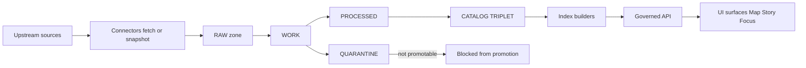

<!-- [KFM_META_BLOCK_V2]
doc_id: kfm://doc/6a5f5d11-7b62-4cb0-9a78-7e7c1d0a90c0
title: data/ — KFM truth-path artifacts and catalogs
type: standard
version: v1
status: draft
owners: KFM Data Stewardship (TBD)
created: 2026-03-03
updated: 2026-03-03
policy_label: public
related:
  - ../policy/
  - ../contracts/
  - ../packages/catalog/
  - ../packages/ingest/
tags: [kfm, data, governance, promotion-contract]
notes:
  - This README is a governed contract surface for what may live under data/.
  - All meaningful statements are tagged as [Confirmed], [Proposed], or [Unknown].
[/KFM_META_BLOCK_V2] -->

# `data/` — KFM truth-path artifacts & catalogs
One-line purpose: **Store the governed data artifacts that power KFM’s auditable truth path (RAW → WORK → PROCESSED → CATALOG/TRIPLET → PUBLISHED).** [Confirmed]


> NOTE: Badge targets are placeholders. Wire to real workflows once available. [Proposed]

## Quick navigation
- [Claim tags](#claim-tags)
- [Purpose and scope](#purpose-and-scope)
- [How `data/` fits the architecture](#how-data-fits-the-architecture)
- [Truth path diagram](#truth-path-diagram)
- [Directory layout](#directory-layout)
- [Lifecycle zones](#lifecycle-zones)
- [Promotion Contract summary](#promotion-contract-summary)
- [Adding or updating a dataset](#adding-or-updating-a-dataset)
- [What must not go here](#what-must-not-go-here)
- [Verification steps](#verification-steps)
- [Version history](#version-history)

---

## Claim tags
- **[Confirmed]** = explicitly supported by current KFM design/governance documents.
- **[Proposed]** = recommended convention/contract for this repo; adopt via PR.
- **[Unknown]** = not yet verified in the repo; see [Verification steps](#verification-steps).

[(Back to top)](#data--kfm-truth-path-artifacts--catalogs)

---

## Purpose and scope
- `data/` is the repo surface for **registry entries + catalogs + lifecycle-zone artifacts** needed for reproducible, governed publishing. [Confirmed]
- The goal is to make **re-indexing and rebuilding derived stores safe** without losing “source truth.” [Confirmed]
- Promotion is **blocked unless required artifacts exist and validate** (Promotion Contract). [Confirmed]

**Acceptable inputs (what belongs here)** [Confirmed/Proposed]
- Dataset/source registry entries (YAML) and their schemas. [Confirmed]
- RAW acquisitions + acquisition manifests + checksums. [Confirmed]
- WORK artifacts (normalized outputs, QA reports, candidate redactions). [Confirmed]
- QUARANTINE artifacts for failures/unclear license/sensitivity (not promotable). [Confirmed]
- PROCESSED publishable artifacts (standard formats + checksums + derived metadata). [Confirmed]
- Catalog “triplet”: DCAT + STAC + PROV + run receipts (file-based metadata). [Confirmed]
- Small, reviewable examples/fixtures only (if needed for tests/docs). [Proposed]

[(Back to top)](#data--kfm-truth-path-artifacts--catalogs)

---

## How `data/` fits the architecture
- KFM’s “truth path” flows from upstream sources through lifecycle zones into governed runtime surfaces. [Confirmed]
- **Clients/UI must not read databases or object storage directly**; all access must cross the governed API (policy enforcement point). [Confirmed]
- The catalog triplet **must cross-link identifiers** so EvidenceRefs resolve deterministically. [Confirmed]

[(Back to top)](#data--kfm-truth-path-artifacts--catalogs)

---

## Truth path diagram

```mermaid
flowchart LR
  Upstream[Upstream sources] --> Connectors[Connectors fetch or snapshot]
  Connectors --> RAW[RAW zone]
  RAW --> WORK[WORK]
  WORK --> PROCESSED[PROCESSED]
  WORK --> QUAR[QUARANTINE]
  PROCESSED --> CATALOG[CATALOG TRIPLET]
  CATALOG --> Indexers[Index builders]
  Indexers --> API[Governed API]
  API --> UI[UI surfaces Map Story Focus]

  QUAR -->|not promotable| STOP[Blocked from promotion]
```
- RAW is immutable (append-only); WORK may be rewritten; QUARANTINE is blocked from promotion. [Confirmed]
- PUBLISHED surfaces only serve promoted versions that have processed artifacts, validated catalogs, receipts, and policy labels. [Confirmed]

[(Back to top)](#data--kfm-truth-path-artifacts--catalogs)

---

## Directory layout
> WARNING: The layout below is the **intended contract** for `data/`. If the current repo differs, do **not** “paper over” differences—either (a) migrate in small PRs, or (b) update this README to match reality. [Proposed]

```text
data/
  README.md                      # This file [Proposed]
  registry/                      # Dataset + source registry entries and schemas [Confirmed]
    README.md                    # Registry rules and examples [Unknown]
    schemas/                     # JSON Schemas for registry entries [Confirmed]
    sources/                     # Connector definitions (endpoints, paging, auth) [Confirmed/Unknown]
  raw/                           # Immutable acquisitions + checksums + license snapshots [Proposed]
  work/                          # Normalization outputs + QA + redaction candidates [Proposed]
  quarantine/                    # Failed/unsafe/unclear items; never promoted [Proposed]
  processed/                     # Publishable artifacts + checksums + per-dataset README [Proposed]
    <theme>/<dataset>/<version>/ # Canonical per-version folder [Proposed]
  catalog/                       # Catalog “triplet” outputs [Proposed]
    stac/                        # File-based STAC catalog (collections/items) [Confirmed]
    dcat/                        # DCAT dataset records (JSON-LD) [Proposed]
    prov/                        # PROV bundles (lineage) [Proposed]
```

**Minimum contract for subdirectories** (what each must include) [Confirmed/Proposed]
- `registry/`: must be schema-validated and code-reviewed; treated as a contract surface. [Confirmed]
- `raw/`: must include acquisition manifest + checksums + minimal license/terms snapshot. [Confirmed]
- `work/`: must capture QA outputs and candidate redactions/generalizations. [Confirmed]
- `quarantine/`: must record why it is blocked (validation, licensing, sensitivity, instability). [Confirmed]
- `processed/`: must be in KFM-approved formats, checksummed, and ready for publishing if policy allows. [Confirmed]
- `catalog/`: must include cross-linked DCAT + STAC + PROV (and receipts) for every promoted dataset version. [Confirmed]

[(Back to top)](#data--kfm-truth-path-artifacts--catalogs)

---

## Lifecycle zones
| Zone | Rule of thumb | Typical contents | Mutability | Promotion status |
|---|---|---|---|---|
| RAW | “What we got from upstream” [Confirmed] | Acquisition manifest, raw artifacts, checksums, terms snapshot [Confirmed] | Append-only (supersede via new acquisition) [Confirmed] | Eligible only after gates [Confirmed] |
| WORK | “Make it usable + inspectable” [Confirmed] | Normalized outputs, QA reports, candidate redactions [Confirmed] | Rewrite OK [Confirmed] | Eligible only after gates [Confirmed] |
| QUARANTINE | “Stop unsafe/unclear items” [Confirmed] | Failed validation, unclear license, sensitivity issues [Confirmed] | Rewrite OK [Confirmed] | **Not promotable** [Confirmed] |
| PROCESSED | “Publishable artifacts” [Confirmed] | Standard formats + checksums + derived metadata [Confirmed] | Immutable-by-version [Proposed] | Eligible after cataloging [Confirmed] |
| CATALOG/TRIPLET | “Discovery + lineage” [Confirmed] | DCAT + STAC + PROV + run receipts [Confirmed] | Immutable-by-version [Proposed] | Required for publication [Confirmed] |
| PUBLISHED | “What runtime serves” [Confirmed] | Governed API/UI surfaces serve only promoted versions [Confirmed] | Governed [Confirmed] | Must pass all gates [Confirmed] |

[(Back to top)](#data--kfm-truth-path-artifacts--catalogs)

---

## Promotion Contract summary
Promotion is the act of moving a dataset version from **RAW/WORK → PROCESSED + CATALOG** and thereby making it eligible for **PUBLISHED** runtime surfaces. [Confirmed]

**Minimum gates (fail-closed)** [Confirmed]
- Identity + versioning are present and stable. [Confirmed]
- License/terms are recorded and acceptable; unclear licensing routes to QUARANTINE. [Confirmed]
- Sensitivity classification is assigned; unsafe exposure is blocked by policy. [Confirmed]
- Processed artifacts exist and have checksums. [Confirmed]
- DCAT + STAC + PROV validate and cross-link correctly. [Confirmed]
- Run receipts exist (audit trail of who/what/when/why, plus policy decisions). [Confirmed]

[(Back to top)](#data--kfm-truth-path-artifacts--catalogs)

---

## Adding or updating a dataset
> TIP: Keep PRs small and additive: add new versions rather than rewriting history. [Proposed]

### 1) Register the dataset/source
- Add or update a registry entry under `data/registry/` (YAML). [Confirmed]
- Ensure it passes schema validation in CI. [Confirmed]

### 2) Acquire into RAW (append-only)
- Store upstream payloads under `data/raw/...` with checksums and an acquisition manifest. [Confirmed/Proposed]
- Do not edit RAW; create a new acquisition snapshot instead. [Confirmed]

### 3) Normalize & QA in WORK (or QUARANTINE)
- Write normalized intermediates, QA reports, and any candidate redactions. [Confirmed]
- If validation fails, licensing is unclear, or sensitivity concerns exist, move to QUARANTINE. [Confirmed]

### 4) Emit PROCESSED artifacts
- Produce KFM-approved publishable formats (e.g., GeoParquet, PMTiles, COG, etc.). [Confirmed]
- Include checksums for every processed artifact. [Confirmed]

### 5) Emit the catalog triplet (DCAT + STAC + PROV)
- STAC: assets-level metadata for spatial/temporal artifacts. [Confirmed]
- DCAT: dataset-level metadata (license, publisher, distributions). [Confirmed]
- PROV: lineage (entities, activities, agents). [Confirmed]
- Cross-link identifiers across the triplet so evidence resolution is deterministic. [Confirmed]

### 6) Pass gates and promote
- CI must fail-closed if any gate is missing. [Confirmed]
- Only promoted versions may appear in PUBLISHED runtime surfaces. [Confirmed]

[(Back to top)](#data--kfm-truth-path-artifacts--catalogs)

---

## What must not go here
- Secrets, private keys, or credentials. [Proposed]
- Anything that would bypass the trust membrane (e.g., hardcoding direct DB/object-store reads in UI examples). [Confirmed]
- Quarantined content promoted “by exception” without documented governance decision. [Confirmed]
- “Floating” edits to RAW that destroy auditability (rewrite history). [Confirmed]
- High-risk sensitive location data without redaction/generalization and policy review. [Proposed]

[(Back to top)](#data--kfm-truth-path-artifacts--catalogs)

---

## Verification steps
Items tagged **[Unknown]** become **[Confirmed]** by the smallest checks below. [Proposed]

1) **Confirm current directory tree**  
   - Run: `ls -la data/` and `find data -maxdepth 3 -type d` [Proposed]

2) **Confirm registry schemas + validators exist**  
   - Look for: `data/registry/schemas/` and referenced schema files. [Proposed]

3) **Confirm catalog folder naming**  
   - Verify whether the repo uses `data/catalog/...` vs `data/stac/`/`data/prov/` splits; update this README accordingly. [Proposed]

4) **Confirm promotion gates are implemented in CI**  
   - Identify workflows that run schema validation + policy checks + crosslink checks. [Proposed]

[(Back to top)](#data--kfm-truth-path-artifacts--catalogs)

---

## Version history
| Version | Date (America/Chicago) | Notes |
|---|---:|---|
| v1 | 2026-03-03 | Initial governed scaffold for `data/README.md`. [Proposed] |
