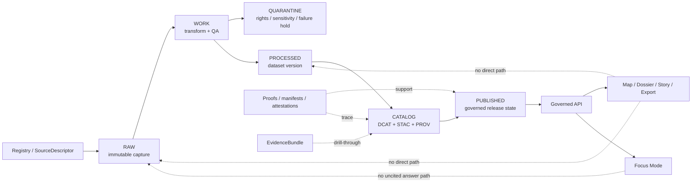

<!-- [KFM_META_BLOCK_V2]
doc_id: kfm://doc/<NEEDS_VERIFICATION_UUID>
title: data/
type: standard
version: v1
status: draft
owners: NEEDS VERIFICATION
created: NEEDS_VERIFICATION_YYYY-MM-DD
updated: 2026-03-21
policy_label: NEEDS VERIFICATION
related: [../README.md, ./registry/README.md, ./specs/README.md, ./catalog/README.md, ./catalog/stac/README.md]
tags: [kfm, data, truth-path, catalog, provenance]
notes: [Baseline doctrine grounded mainly in March 2026 KFM master manuals; continuity artifacts document repo-root data/ plus data/registry/README.md and data/catalog/stac/README.md at an earlier commit, but the mounted live checkout was not available in this session.]
[/KFM_META_BLOCK_V2] -->

# `data/`

Governed storage, lifecycle, and release-artifact surface for KFM evidence-bearing data.

> **Status:** experimental  
> **Doc state:** draft  
> **Owners:** NEEDS VERIFICATION  
> **Path target:** `data/README.md`  
> 
> 
> 
> 
> 
> 
>   
> **Quick jump:** [Scope](#scope) · [Repo fit](#repo-fit) · [Accepted inputs](#accepted-inputs) · [Exclusions](#exclusions) · [Directory tree](#directory-tree) · [Quickstart](#quickstart) · [Usage](#usage) · [Diagram](#diagram) · [Tables](#tables) · [Task list](#task-list) · [FAQ](#faq) · [Appendix](#appendix)

> [!IMPORTANT]
> This README intentionally keeps two evidence layers separate:
>
> - **CONFIRMED doctrine** for KFM lifecycle law, trust boundaries, artifact families, and promotion posture.
> - **INFERRED / PROPOSED path shape** for concrete `data/` directories, because the current session exposed the KFM PDF corpus and continuity artifacts, but **not** a mounted live repository checkout.

> [!NOTE]
> This file uses **CATALOG** for the lifecycle state and **catalog triplet** for the linked `DCAT + STAC + PROV` closure that makes a version discoverable, traceable, and evidence-resolvable.

## Scope

In continuity artifacts, `data/` is described at repo root as the surface for **registry entries, example datasets, catalog artifacts, and zone manifests**. In March 2026 doctrine, that practical surface is widened into the explicit KFM truth-path model:

`Source edge -> RAW -> WORK / QUARANTINE -> PROCESSED -> CATALOG -> PUBLISHED`

That makes `data/` more than storage. In KFM, it is the governed place where intake, transformation, validation, catalog closure, release evidence, and correction lineage remain inspectable enough to audit, review, and repair.

### What this README is for

This file is meant to help maintainers do four things quickly:

1. understand what belongs in `data/`,
2. distinguish **CONFIRMED doctrine** from **INFERRED / PROPOSED repo shape**,
3. keep storage responsibilities separate from contracts, policy, and governed APIs,
4. extend the live tree without quietly weakening KFM’s trust posture.

### Evidence posture for this README

| Layer | Status | How to read it |
|---|---|---|
| Truth path, trust membrane, authoritative-versus-derived split, promotion/correction posture | **CONFIRMED** | Safe to treat as project doctrine. |
| `data/` as a documented repo-root surface | **INFERRED** | Supported by continuity artifacts, but not reverified from a mounted checkout in this run. |
| `data/registry/README.md` and `data/catalog/stac/README.md` | **INFERRED** | Documented at an earlier repo commit in continuity artifacts; current checkout still needs direct verification. |
| `data/raw/`, `data/work/`, `data/quarantine/`, `data/processed/`, `data/catalog/`, `data/published/`, `data/proofs/` | **PROPOSED** | Strong doctrine-aligned starter skeleton from March 2026 manuals; not live-tree fact here. |
| `data/specs/README.md` and `data/catalog/README.md` | **NEEDS VERIFICATION** | Retained because task metadata expects them, but not directly established in current-session repo evidence. |

[Back to top](#data)

## Repo fit

`data/` sits at the seam where governed source intake becomes durable project state.

### Path and adjacent surfaces

| Relation | Surface | Posture | Why it matters |
|---|---|---|---|
| Upstream | [`../README.md`](../README.md) | **NEEDS VERIFICATION** | Expected repo-wide overview and navigation surface. |
| Upstream | [`../packages/`](../packages/) | **INFERRED** | Shared reusable law should stay in packages rather than leaking into ad hoc storage layouts. |
| Upstream | [`../contracts/`](../contracts/) | **INFERRED** | Shared schemas, profiles, and controlled vocabularies should remain explicit rather than hiding inside data zones. |
| Upstream | [`../policy/`](../policy/) | **INFERRED** | Rights, sensitivity, deny-by-default rules, and review obligations belong in executable policy as well as prose. |
| Upstream | [`../docs/`](../docs/) | **INFERRED** | Architecture docs, ADRs, runbooks, and stewardship procedures should explain behavior-significant changes to the data surface. |
| Lateral | [`./registry/README.md`](./registry/README.md) | **INFERRED** | Documented in continuity artifacts; likely source and dataset registration surface, but current checkout still needs verification. |
| Lateral | [`./catalog/stac/README.md`](./catalog/stac/README.md) | **INFERRED** | Documented in continuity artifacts; likely STAC-facing catalog surface, but current checkout still needs verification. |
| Lateral | [`./catalog/README.md`](./catalog/README.md) | **NEEDS VERIFICATION** | Doctrine-aligned target adjacency, but live evidence in this session did not prove the file. |
| Lateral | [`./specs/README.md`](./specs/README.md) | **NEEDS VERIFICATION** | Retained because task metadata expects it, but shared schema authority appears stronger under `../contracts/` unless a live checkout proves otherwise. |
| Downstream | [`../apps/`](../apps/) | **INFERRED** | Public and role-limited surfaces should consume promoted scope through governed APIs, not direct storage reads. |
| Downstream | [`../tools/`](../tools/) | **INFERRED** | Validators, link checks, catalog QA, and evidence linting should prove the data surface rather than merely describe it. |
| Downstream | [`../tests/`](../tests/) | **INFERRED** | Schema, catalog, policy, freshness, correction, and replay tests should enforce this surface. |
| Downstream | [`../infra/`](../infra/) | **INFERRED** | Deployment, backup, restore, correction, and reconciliation logic must preserve the trust membrane. |

### Repo-fit summary

| Question | Answer |
|---|---|
| What is `data/` for? | Governed intake, lifecycle state, catalog closure, release evidence, and data-facing repo surfaces such as registry entries and catalog artifacts. |
| What is `data/` **not**? | Not the trust membrane, not the public API surface, and not a license to expose RAW, WORK, QUARANTINE, or unpublished candidates directly. |
| What stays adjacent instead of buried here? | Shared contracts, executable policy, app routes, worker logic, and most implementation law. |

[Back to top](#data)

## Accepted inputs

The following belong in or immediately around `data/` when KFM doctrine is being honored:

| Accepted input | Why it belongs here | Typical stage |
|---|---|---|
| Source registration artifacts | Source onboarding is a contract, not just a fetch | Registry / admission |
| Immutable raw captures and acquisition manifests | RAW must preserve source-native bytes and intake memory | RAW |
| Reproducible transforms, redactions, and QA outputs | WORK exists to normalize and validate without pretending to publish | WORK |
| Rights-unclear, sensitive, or failed-validation material | QUARANTINE is the regular hold state for unresolved material | QUARANTINE |
| Canonical processed dataset versions | PROCESSED is where publishable authority becomes stable and inspectable | PROCESSED |
| `DCAT + STAC + PROV` closure artifacts | Catalog closure is part of release truth, not decorative metadata | CATALOG |
| Release manifests, proof packs, and integrity objects | Promotion is a governed transition and should leave receipts | Release boundary |
| Zone manifests, public-safe exemplars, and example datasets | Continuity artifacts describe these as part of the repo-facing role of `data/` | Reference / exemplar |

### Artifact families at a glance

| Artifact family | What it does | Stage seam |
|---|---|---|
| `SourceDescriptor` | Declares source identity, access mode, rights posture, support, cadence, and publication intent | Admission |
| `IngestReceipt` | Proves what was fetched, when, and with what integrity result | RAW |
| `ValidationReport` | Records structural, spatial, temporal, unit, and domain QC outcomes | WORK / QUARANTINE |
| `DatasetVersion` | Carries immutable processed authority with stable identity and time semantics | PROCESSED |
| `CatalogClosure` | Links outward catalog metadata and lineage for releasable scope | CATALOG |
| `DecisionEnvelope` / `ReviewRecord` | Carries policy and review-bearing admissibility outcomes | Review / release |
| `ReleaseManifest` / `ReleaseProofPack` | Assembles a publishable trust unit | Promotion / release |
| `EvidenceBundle` | Resolves visible claims or surface state to inspectable support | Runtime / trust surfaces |
| `CorrectionNotice` | Preserves visible lineage for rollback, supersession, withdrawal, or narrowed republication | Post-release governance |

### Dataset-version pack *(PROPOSED starter shape)*

| Part | Typical location | Why it exists |
|---|---|---|
| Manifest + checksums | `data/processed/<theme>/<dataset>/<version>/manifest.json`, `SHA256SUMS.txt` | Stable fingerprinting and replay |
| Version README | `data/processed/<theme>/<dataset>/<version>/README.md` | Human-readable method, CRS, units, caveats, license, and links |
| STAC / DCAT / PROV | `data/catalog/stac/`, `data/catalog/dcat/`, `data/catalog/prov/` | Discoverability, lineage, and policy-facing metadata closure |
| Proof / attestation pack | `data/proofs/` or equivalent release bundle | Promotion evidence, integrity, and rollback traceability |

> [!TIP]
> `data/` may **consume** shared schemas from `../contracts/`, but that is different from treating `data/` as the canonical home for every shared schema, vocabulary, or standards profile.

[Back to top](#data)

## Exclusions

The following do **not** belong here as sovereign truth or as the normal public path:

| Exclusion | Put it under / behind | Why |
|---|---|---|
| Direct client reads from canonical stores or unpublished artifacts | Governed APIs and trust-visible app surfaces | Storage is not the trust membrane. |
| Secrets, credentials, tokens, or host-specific secret material | Runtime secret management / deployment layer | `data/` is evidence-bearing, not secret-bearing. |
| Shared schemas and standards profiles | `../contracts/` | Keeps machine-readable contract authority explicit and reviewable. |
| Policy bundles, reason registries, and deny-by-default logic | `../policy/` | Policy should remain executable, testable, and independently reviewable. |
| Unreviewed analyst scratch outputs presented as publishable truth | `work/` or quarantine | Exploration is valid; silent publication is not. |
| Derived layers treated as authority by convenience | Rebuildable downstream layers | Search, graph, tile, vector, scene, cache, and summary layers remain downstream of stronger truth. |
| Silent overwrite of raw capture, processed authority, or released state | Correction / rollback / supersession flow | KFM requires visible correction lineage. |

> [!WARNING]
> `data/` is a governed evidence surface. It is **not** the public edge, **not** the trust boundary, and **not** permission to expose RAW, WORK, QUARANTINE, or unpublished candidates directly.

[Back to top](#data)

## Directory tree

### Continuity-artifact paths *(INFERRED; mounted checkout still needs verification)*

```text
data/
├── registry/
│   └── schemas/
└── catalog/
    └── stac/
```

### Doctrine-aligned starter skeleton *(PROPOSED)*

```text
data/
├── README.md
├── registry/                # source and dataset registration surfaces
├── raw/                     # immutable source-native capture
├── work/                    # transforms, QA, and reproducible intermediate work
├── quarantine/              # unresolved rights / sensitivity / validation hold
├── processed/               # canonical publishable derivatives and dataset versions
├── catalog/                 # catalog closure boundary
│   ├── dcat/
│   ├── stac/
│   └── prov/
├── published/               # optional materialized release scope; publication remains a state first
└── proofs/                  # release manifests, proof packs, attestations, and correction trace
```

### Path posture

| Path claim | Status | Reading rule |
|---|---|---|
| `data/` is a documented repo-root area | **INFERRED** | Supported by continuity artifacts; verify live presence in checkout. |
| `data/registry/` exists as a repo surface | **INFERRED** | Continuity artifacts point to `data/registry/README.md`; current checkout still needs verification. |
| `data/catalog/stac/` exists as a repo surface | **INFERRED** | Continuity artifacts point to `data/catalog/stac/README.md`; current checkout still needs verification. |
| `data/registry/schemas/` carries registry schema material | **INFERRED** | A continuity artifact points to `data/registry/schemas/dataset_entry.schema.json`; verify live tree before wiring automation. |
| `data/raw/`, `data/work/`, `data/quarantine/`, `data/processed/`, `data/catalog/`, `data/published/`, `data/proofs/` exist today | **PROPOSED** | Strong March 2026 starter skeleton; not live-tree fact in this session. |
| `data/specs/` is canonical | **UNKNOWN** | Keep only as a task-level adjacency until the mounted repo proves it. |

### What this README intentionally does *not* assert

- any specific worker, package, or service already wired to every zone,
- any exact filename convention below the zone level,
- any guarantee that `published/` or `proofs/` are already materialized directories in the live checkout,
- any claim that `data/catalog/README.md` or `data/specs/README.md` currently exist.

[Back to top](#data)

## Quickstart

Before trusting any path-level claim in this README, inspect the live checkout.

```bash
# Confirm the target surface exists
pwd
find data -maxdepth 3 -print 2>/dev/null | sort

# Read local README files if present
test -f data/README.md && sed -n '1,240p' data/README.md
test -f data/registry/README.md && sed -n '1,220p' data/registry/README.md
test -f data/catalog/README.md && sed -n '1,220p' data/catalog/README.md
test -f data/catalog/stac/README.md && sed -n '1,220p' data/catalog/stac/README.md
test -f data/specs/README.md && sed -n '1,220p' data/specs/README.md

# Inspect artifact-shaped files if present
find data -maxdepth 5 -type f \
  \( -iname '*manifest*' -o -iname '*receipt*' -o -iname '*proof*' -o -iname '*catalog*' -o -iname '*.json' -o -iname '*.yaml' -o -iname '*.yml' \) \
  2>/dev/null | sort | sed -n '1,200p'
```

### Minimal verification pass

```bash
# Confirm or downgrade the continuity and starter-shape claims
for p in \
  data \
  data/registry \
  data/registry/schemas \
  data/catalog \
  data/catalog/stac \
  data/raw \
  data/work \
  data/quarantine \
  data/processed \
  data/published \
  data/proofs \
  data/specs
do
  test -e "$p" && echo "FOUND $p" || echo "MISSING $p"
done

# Check whether catalog-triplet artifacts exist
find data -type f 2>/dev/null | grep -Ei '/(stac|dcat|prov)/|catalog' || true

# Check whether proof-bearing artifacts are already emitted somewhere under data/
find data -type f 2>/dev/null | grep -Ei 'receipt|manifest|proof|attest|bundle|correction|checksum' || true

# If data/specs is absent, compare with contracts/
test -d data/specs && echo "FOUND data/specs" || echo "VERIFY ../contracts before creating data/specs"
```

> [!TIP]
> If the checkout shows `../contracts/` as the canonical home for shared schemas and vocabularies, keep `./specs/README.md` as a documentation adjacency only, not as a prompt to create drift.

[Back to top](#data)

## Usage

### 1. Register before you fetch

In KFM, source intake is a contract, not a download. A source that cannot be named, replayed, rights-reviewed, and quality-checked is not ready for governed movement into `data/`.

### 2. Keep RAW immutable

`RAW` should preserve source-native bytes, request context, rights or terms snapshots, and checksums. Cleanup, normalization, OCR, reprojection, redaction, and summarization belong later.

### 3. Transform in `WORK`, hold ambiguity in `QUARANTINE`

`WORK` is where normalization, parsing, joins, QA, redaction, and repair happen. Rights ambiguity, failed validation, unresolved sensitivity, or low-confidence extraction belong in `QUARANTINE`, not in `PROCESSED`.

### 4. Treat `PROCESSED` as governed authority candidates

`PROCESSED` is where stable dataset versions emerge. They should already point back to receipts, validation outputs, source context, and reproducible transform memory strongly enough to survive audit and replay.

### 5. Close the catalog triplet before promotion

A version is not outward-ready until `DCAT + STAC + PROV` can cross-link identifiers, assets, lineage, and evidence references without guesswork.

### 6. Publish by governed transition

`PUBLISHED` is first a release state, not merely a directory name. A repo may materialize supporting release artifacts under `data/published/`, but promotion still binds dataset version, catalog closure, policy state, review state, and proof objects into one inspectable decision.

### 7. Keep proofs attached to the exact release they justify

Checksums, manifests, proof packs, attestations, and correction evidence should remain linked to the exact dataset version or release scope they support. Detached proof objects are much less useful during rollback, audit, or dispute.

### Illustrative artifact chain

The exact live filenames are **NEEDS VERIFICATION**, but the intended sequence is stable:

```text
registry/      source descriptor / source admission context
raw/           ingest receipt + immutable capture
work/          validation report + transform evidence
quarantine/    rights / sensitivity / validation hold
processed/     dataset version + manifest + checksums
catalog/       catalog closure (DCAT + STAC + PROV)
published/     optional materialized release scope
proofs/        release proof pack / attestation / correction trace
```

[Back to top](#data)

## Diagram


```mermaid
flowchart LR
    REG[Registry / SourceDescriptor] --> RAW[RAW<br/>immutable capture]
    RAW --> WORK[WORK<br/>transform + QA]
    WORK --> QUAR[QUARANTINE<br/>rights / sensitivity / failure hold]
    WORK --> PROC[PROCESSED<br/>dataset version]
    PROC --> CAT[CATALOG<br/>DCAT + STAC + PROV]
    CAT --> PUB[PUBLISHED<br/>governed release state]

    PUB --> API[Governed API]
    API --> UI[Map / Dossier / Story / Export]
    API --> FOCUS[Focus Mode]

    PROOF[Proofs / manifests / attestations] -. support .-> PUB
    PROOF -. trace .-> CAT
    EVD[EvidenceBundle] -. drill-through .-> CAT

    UI -. no direct path .-> RAW
    UI -. no direct path .-> PROC
    FOCUS -. no uncited answer path .-> RAW
```

[Back to top](#data)

## Tables

### Truth-path zone matrix

| Zone / state | Core question | What belongs here | Block if |
|---|---|---|---|
| `RAW` | What exactly arrived? | Source-native payloads, request details, checksums, rights snapshots, unmodified source bytes | Raw bytes are mutated in place or exposed directly |
| `WORK` | What deterministic transform is happening? | Repair, normalization, OCR, reprojection, QA, joins, redaction transforms | Transform logic is irreproducible or undocumented |
| `QUARANTINE` | What is unresolved or unsafe? | Rights ambiguity, sensitivity ambiguity, failed validation, low-confidence extraction | Ambiguous material is treated as “almost publishable” |
| `PROCESSED` | What is now canonical and publishable? | Immutable processed artifacts, dataset versions, final QA outputs, stable manifests | The artifact cannot support valid catalog closure |
| `CATALOG` | Can the release be discovered and explained? | Cross-linked `DCAT + STAC + PROV`, outward identifiers, evidence pointers | Triplet members are missing, broken, or unresolved |
| `PUBLISHED` | May this scope be exposed? | Governed release state through API and trust-visible surfaces | Publication is treated as a folder copy instead of a gated transition |

### Release-adjacent support surfaces

| Surface | Status | Role | Caution |
|---|---|---|---|
| `published/` | **PROPOSED directory / CONFIRMED state concept** | Optional materialized release scope for governed outputs | Publication itself still must be treated as a transition, not a folder copy |
| `proofs/` | **PROPOSED** | Release manifests, proof packs, attestations, signatures, correction trace | Proof objects must stay linked to the release or dataset version they justify |
| Dataset version README | **PROPOSED** | Human-readable summary of method, CRS, units, caveats, license, and links | Do not let README prose replace machine-checkable manifests or catalog closure |

### Minimum gates before outward trust widens

| Gate family | What it proves | Fail-closed outcome |
|---|---|---|
| Source admission | A source has a descriptor, owner/steward context, rights posture, and quality intent | Reject, defer, or quarantine |
| Source replay | Intake memory is strong enough to re-fetch and verify | Hold or quarantine |
| Schema / structure | Required fields, enums, and structural rules are satisfied | Block merge or promotion |
| Geometry / CRS | Geometry is valid and spatial support is coherent | Hold in `WORK / QUARANTINE` |
| Time validity | Time fields are present and semantically meaningful | Hold or quarantine |
| Identifier stability | IDs, spec hashes, and lineage pointers are deterministic enough to audit | Block canonical write or release |
| Catalog closure | `STAC + DCAT + PROV` resolve coherently | Block release or promotion |
| Policy bundle | Rights, sensitivity, reason codes, and deny-by-default logic are sufficient | Deny or hold |
| Evidence resolution | Consequential visible claims resolve to inspectable support | Runtime must abstain, deny, or error |
| Correction drill | Supersession, withdrawal, rollback, and correction remain visible and auditable | Prevent silent overwrite |

### Path-certainty matrix

| Claim | Status | Safer wording |
|---|---|---|
| `data/` exists as a repo-root path | **INFERRED** | “documented repo-root surface; verify in mounted checkout” |
| `data/` is governed by the canonical truth path | **CONFIRMED** | “load-bearing KFM doctrine” |
| `data/registry/README.md` exists | **INFERRED** | “documented in continuity artifact; current checkout still needs verification” |
| `data/catalog/stac/README.md` exists | **INFERRED** | “documented in continuity artifact; current checkout still needs verification” |
| `data/raw/`, `data/work/`, `data/quarantine/`, `data/processed/`, `data/catalog/`, `data/published/`, `data/proofs/` exist today | **PROPOSED** | “starter skeleton from March 2026 manuals; verify actual subpaths” |
| `data/specs/` is canonical | **UNKNOWN** | “requested adjacency; verify against `../contracts/` and the live tree” |

[Back to top](#data)

## Task list

### Definition of done for this README

- [ ] The file clearly separates **CONFIRMED doctrine** from **INFERRED / PROPOSED repo shape**.
- [ ] `data/` is described as a governed truth-path surface, not a generic storage bucket.
- [ ] Accepted inputs and exclusions are explicit.
- [ ] The tree distinguishes continuity-artifact paths from the March 2026 starter skeleton.
- [ ] The README makes clear that storage is not the trust membrane.
- [ ] At least one Mermaid diagram explains real KFM structure.
- [ ] Verification steps tell a maintainer how to confirm or downgrade path claims in a live checkout.

### Review checks before merge

- [ ] Replace placeholder `doc_id`, owners, created date, and policy label with repo-backed values.
- [ ] Verify all relative links against the actual checkout.
- [ ] Confirm whether shared schemas belong under `data/specs/` or `../contracts/`.
- [ ] Confirm whether `data/quarantine/` is a sibling directory or nested under `data/work/` in the live tree.
- [ ] Confirm whether `data/published/` and `data/proofs/` are real directories or only conceptual release-support surfaces.
- [ ] Add one real emitted artifact path once a live release lane is visible.
- [ ] Keep terminology aligned with KFM doctrine: truth path, trust membrane, authoritative vs derived, catalog closure, EvidenceBundle, promotion, correction.

[Back to top](#data)

## FAQ

### Is `published` a directory?

By doctrine, **published** is first a governed release state. In the March 20 starter skeleton, `data/published/` is a plausible support directory for materialized release scope, but publication is still not reducible to “copy files somewhere.”

### Are `data/registry/README.md` and `data/catalog/stac/README.md` already real?

They are **INFERRED**, not currently mounted facts. Continuity artifacts point to both paths at an earlier repo commit, but this session did not expose a live checkout to verify them directly.

### Where should schemas live: `data/specs/` or `../contracts/`?

The strongest current-session evidence still favors `../contracts/` for shared schema authority. A narrow registry-local schema surface under `data/registry/schemas/` may exist for dataset-entry validation, but that does not automatically make `data/specs/` canonical.

### Are per-version dataset READMEs expected?

They are **PROPOSED**, but strongly aligned with the corpus. Dataset-gate design packs recommend a `README.md` beside promoted dataset artifacts describing source, method, CRS, units, caveats, license, and links to STAC/DCAT/PROV.

### Do graph, search, vector, tile, or scene layers belong under `data/`?

They may exist as downstream artifacts or build products, but they must remain explicitly downstream of approved release scope and must not become sovereign truth by convenience.

[Back to top](#data)

## Appendix

<details>
<summary>Glossary</summary>

| Term | Meaning in this README |
|---|---|
| Truth path | The governed movement from source edge through RAW, WORK / QUARANTINE, PROCESSED, CATALOG, and into PUBLISHED state. |
| Trust membrane | The rule that clients do not bypass governed APIs, policy mediation, and evidence resolution to reach storage directly. |
| Catalog triplet | The linked metadata boundary formed by `DCAT + STAC + PROV`. |
| SourceDescriptor | Intake contract describing access mode, cadence, rights posture, normalization plan, and publication intent. |
| DatasetVersion | Immutable governed version of a processed subject set. |
| EvidenceBundle | Governed support object that resolves a visible claim or answer into inspectable evidence. |
| Derived layer | Search, graph, vector, tile, scene, summary, or export surface built downstream of stronger truth. |
| CorrectionNotice | Evidence-bearing supersession, withdrawal, rollback, or narrowed republication object. |

</details>

<details>
<summary>Verification backlog carried by this file</summary>

| Item | Why it matters |
|---|---|
| Actual `data/` tree snapshot | Converts documented target shape into inspectable repo fact |
| Owners / dates / policy label / doc UUID | Lets the meta block stop carrying placeholders |
| Real placement of `data/catalog/README.md` and `data/specs/README.md` | Prevents relative-link drift and schema-surface confusion |
| Whether `quarantine/` is nested or sibling | Avoids teaching the wrong tree shape |
| Whether `published/` and `proofs/` are materialized | Clarifies state-versus-directory behavior for release support |
| One emitted dataset pack with manifest + triplet + proof objects | Grounds examples in real artifacts rather than doctrine alone |

</details>

<details>
<summary>Related entrypoints</summary>

- [`../README.md`](../README.md)
- [`./registry/README.md`](./registry/README.md)
- [`./specs/README.md`](./specs/README.md)
- [`./catalog/README.md`](./catalog/README.md)
- [`./catalog/stac/README.md`](./catalog/stac/README.md)
- [`../packages/`](../packages/)
- [`../contracts/`](../contracts/)
- [`../policy/`](../policy/)
- [`../docs/`](../docs/)
- [`../tools/`](../tools/)
- [`../tests/`](../tests/)

</details>

[Back to top](#data)
