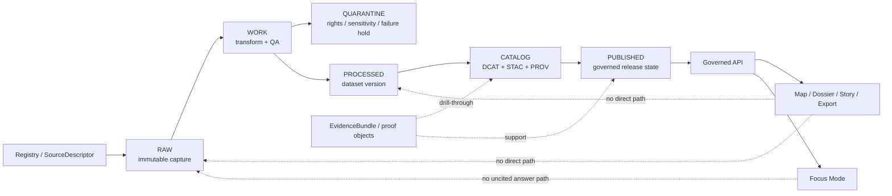

<!-- [KFM_META_BLOCK_V2]
doc_id: kfm://doc/<NEEDS_VERIFICATION_UUID>
title: data/
type: standard
version: v1
status: draft
owners: NEEDS VERIFICATION
created: NEEDS_VERIFICATION_YYYY-MM-DD
updated: 2026-03-19
policy_label: NEEDS VERIFICATION
related: [../README.md, ./registry/README.md, ./specs/README.md, ./catalog/README.md, ./catalog/stac/README.md]
tags: [kfm, data, truth-path, catalog, provenance]
notes: [Current-session evidence exposed a PDF corpus only; exact repo paths, owners, created date, policy label, and live subdirectory presence remain NEEDS VERIFICATION. Relative links below are preserved as target-adjacent repo intent, not reverified live-tree fact.]
[/KFM_META_BLOCK_V2] -->

# `data/`

Governed storage, lifecycle, and release-artifact surface for KFM evidence-bearing data.

> **Status:** experimental  
> **Doc state:** draft  
> **Owners:** NEEDS VERIFICATION  
> **Path target:** `data/README.md`  
> 
> 
> 
> 
> 
>   
> **Quick jump:** [Scope](#scope) · [Repo fit](#repo-fit) · [Accepted inputs](#accepted-inputs) · [Exclusions](#exclusions) · [Directory tree](#directory-tree) · [Quickstart](#quickstart) · [Usage](#usage) · [Diagram](#diagram) · [Tables](#tables) · [Task list](#task-list) · [FAQ](#faq) · [Appendix](#appendix)

> [!IMPORTANT]
> This README is intentionally split into two evidence layers:
>
> - **CONFIRMED doctrine** for KFM lifecycle law, trust boundaries, artifact families, and promotion posture.
> - **PROPOSED / NEEDS VERIFICATION repo shape** for concrete `data/` subpaths, because the current session directly exposed a PDF corpus only and did **not** expose a live repository tree.

> [!NOTE]
> This file uses **CATALOG** for the lifecycle state and **catalog triplet** for the linked `DCAT + STAC + PROV` closure that makes a version discoverable, traceable, and evidence-resolvable.

## Scope

`data/` is the governed artifact surface for moving material through the KFM truth path:

`Source edge -> RAW -> WORK / QUARANTINE -> PROCESSED -> CATALOG -> PUBLISHED`

That makes `data/` more than a storage bucket. In KFM doctrine, it is the place where intake, transformation, validation, catalog closure, and release-bearing artifacts stay legible enough to audit, review, and correct.

### What this README is for

This file is meant to help maintainers do four things quickly:

1. understand what belongs in `data/`,
2. distinguish **CONFIRMED doctrine** from **NEEDS VERIFICATION path shape**,
3. keep storage responsibilities separate from contracts, policy, and governed APIs,
4. review or grow the live tree without quietly weakening KFM’s trust posture.

### Evidence posture for this README

| Layer | Status | How to read it |
|---|---|---|
| Lifecycle law, truth path, trust membrane, release discipline | **CONFIRMED** | Safe to treat as project doctrine. |
| `data/` as a documented top-level module | **INFERRED** | Strongly supported by the corpus, but not reverified from a live checkout in this run. |
| Specific live subdirectories and adjacent README files | **NEEDS VERIFICATION** | Use the verification commands below before treating them as repo fact. |

[Back to top](#data)

## Repo fit

`data/` sits at the seam where governed source intake becomes durable project state.

### Path and adjacent surfaces

| Relation | Surface | Posture | Why it matters |
|---|---|---|---|
| Upstream | [`../README.md`](../README.md) | NEEDS VERIFICATION | Expected repo-wide overview and navigation surface. |
| Upstream | [`../contracts/`](../contracts/) | Documented target module | Shared schemas, profiles, and controlled vocabularies should stay explicit rather than hiding inside storage zones. |
| Upstream | [`../policy/`](../policy/) | Documented target module | Rights, sensitivity, deny-by-default rules, and review obligations belong in executable policy as well as prose. |
| Upstream | [`../docs/`](../docs/) | Documented target module | Architecture docs, ADRs, runbooks, and stewardship procedures should explain behavior-significant changes to the data surface. |
| Lateral | [`./registry/README.md`](./registry/README.md) | Requested / doctrine-aligned / path NEEDS VERIFICATION | Source and dataset registration surfaces anchor admissibility, ownership, cadence, and publication intent. |
| Lateral | [`./catalog/README.md`](./catalog/README.md) | Requested / doctrine-aligned / path NEEDS VERIFICATION | Catalog closure is part of release readiness, not decorative metadata. |
| Lateral | [`./catalog/stac/README.md`](./catalog/stac/README.md) | Requested / doctrine-aligned / path NEEDS VERIFICATION | STAC is one leg of the catalog triplet and should remain coupled to release-bearing scope. |
| Lateral | [`./specs/README.md`](./specs/README.md) | Requested adjacency / path NEEDS VERIFICATION | Retained because task metadata expects it, but shared schema authority appears stronger under `../contracts/` until a live checkout proves otherwise. |
| Downstream | [`../apps/`](../apps/) | Documented target module | Public and role-limited surfaces should consume promoted scope through governed APIs, not direct storage reads. |
| Downstream | [`../tests/`](../tests/) | Documented target module | Schema, catalog, policy, freshness, correction, and replay tests should prove this surface rather than merely describe it. |
| Downstream | [`../infra/`](../infra/) | Documented target module | Deployment, backup, restore, correction, and reconciliation logic must preserve the trust membrane. |

### Repo-fit summary

| Question | Answer |
|---|---|
| What is `data/` for? | Governed intake, lifecycle state, catalog closure, and release-adjacent artifact visibility. |
| What is `data/` **not**? | Not the trust membrane, not the public API surface, and not a license to expose storage directly. |
| What stays adjacent instead of buried here? | Shared contracts, policy bundles, runbooks, app routes, and most implementation logic. |

[Back to top](#data)

## Accepted inputs

The following belong in or immediately around `data/` when KFM doctrine is being honored:

| Accepted input | Why it belongs here | Typical stage |
|---|---|---|
| Source registration artifacts | Source onboarding is a contract, not just a fetch | Registry / admission |
| Immutable raw captures and acquisition manifests | RAW must preserve source-native bytes and intake memory | RAW |
| Reproducible transforms, redactions, and QA outputs | WORK exists to normalize and validate without pretending to publish | WORK / QUARANTINE |
| Canonical processed dataset versions | PROCESSED is where publishable authority becomes stable and inspectable | PROCESSED |
| `DCAT + STAC + PROV` closure artifacts | Catalog closure is part of release truth | CATALOG |
| Release manifests, proof objects, and correction-linked evidence | Publication is a governed state change, not a blind copy | Release boundary |
| Public-safe examples, exemplars, or zone manifests | Useful when they clarify lifecycle or publication shape without masquerading as canonical coverage | NEEDS VERIFICATION live placement |

### Artifact families at a glance

| Artifact family | What it does | Stage seam |
|---|---|---|
| `SourceDescriptor` | Declares source identity, access mode, rights posture, support, cadence, and publication intent | Admission |
| `IngestReceipt` | Proves what was fetched, when, and with what integrity result | RAW |
| `ValidationReport` | Records structural, spatial, temporal, unit, and domain QC outcomes | WORK / QUARANTINE |
| `DatasetVersion` | Carries immutable processed authority with stable identity and time semantics | PROCESSED |
| `CatalogClosure` | Links outward catalog metadata and lineage for releasable scope | CATALOG |
| `DecisionEnvelope` / `ReviewRecord` | Carries policy and review-bearing admissibility outcomes | Review / release |
| `ReleaseManifest` / `ReleaseProofPack` | Assembles a publishable trust unit | Promotion / release |
| `EvidenceBundle` | Resolves visible claims or surface state to inspectable support | Runtime / trust surfaces |
| `CorrectionNotice` | Preserves visible lineage for rollback, supersession, withdrawal, or narrowed republication | Post-release governance |

> [!TIP]
> `data/` may **consume** shared schemas from `../contracts/`, but that is different from treating `data/` as the canonical home for every shared schema, vocabulary, or standards profile.

[Back to top](#data)

## Exclusions

The following do **not** belong here as sovereign truth or as the normal public path:

| Exclusion | Put it under / behind | Why |
|---|---|---|
| Direct client reads from canonical stores or unpublished artifacts | Governed APIs and trust-visible app surfaces | Storage is not the trust membrane. |
| Secrets, credentials, tokens, or host-specific secret material | Runtime secret management / deployment layer | `data/` is evidence-bearing, not secret-bearing. |
| Shared schemas and standards profiles | `../contracts/` | Keeps machine-readable contract authority explicit and reviewable. |
| Policy bundles, reason registries, and deny-by-default logic | `../policy/` | Policy should remain executable, testable, and independently reviewable. |
| Unreviewed analyst scratch outputs presented as publishable truth | `work/` or quarantine | Exploration is valid, silent publication is not. |
| Derived layers treated as authority by convenience | Rebuildable downstream layers | Search, graph, tile, vector, scene, cache, and summary layers remain downstream of stronger truth. |
| Silent overwrite of raw capture, processed authority, or released state | Correction / rollback / supersession flow | KFM requires visible correction lineage. |

> [!WARNING]
> `data/` is a governed evidence surface. It is **not** the public edge, **not** the trust boundary, and **not** a permission slip for direct access to RAW, WORK, QUARANTINE, or unpublished candidates.

[Back to top](#data)

## Directory tree

### Doctrine-aligned target shape

The tree below is a **documentation-first target shape**, not a claim that every path already exists in the live checkout.

```text
data/
├── README.md
├── registry/                # source and dataset registration surfaces
├── raw/                     # immutable source-native capture
├── work/                    # transforms, QA, and reproducible intermediate work
│   └── quarantine/          # unresolved rights / sensitivity / validation hold
├── processed/               # canonical publishable derivatives and dataset versions
├── catalog/                 # catalog closure boundary
│   ├── dcat/
│   ├── stac/
│   └── prov/
└── [additional live subpaths require direct verification]
```

### Path posture

| Path claim | Status | Reading rule |
|---|---|---|
| `data/` is a documented repo area | **INFERRED** | Safe to describe as a project module, but verify live presence in checkout. |
| `raw/`, `work/`, `processed/`, `catalog/`, `registry/` fit KFM doctrine | **CONFIRMED doctrine / NEEDS VERIFICATION live tree** | Safe as target shape; not safe as live-path fact without checkout proof. |
| `catalog/dcat/`, `catalog/stac/`, `catalog/prov/` are the preferred catalog triplet split | **PROPOSED** | Strong doctrinal fit; verify actual file layout before writing path-specific automation. |
| `specs/` belongs under `data/` | **NEEDS VERIFICATION** | Keep as requested adjacency only until the live repo proves it. |

### What is intentionally *not* asserted here

- a real `data/receipts/` subdirectory,
- a real `data/examples/` subdirectory,
- any live package or worker consuming those paths,
- any exact file naming convention below the zone level.

Those shapes may exist, but this README does not promote them from doctrine to repo fact without direct tree evidence.

[Back to top](#data)

## Quickstart

Before trusting any path-level claim in this README, inspect the live checkout.

```bash
# Confirm the target surface exists
pwd
find data -maxdepth 3 -print 2>/dev/null | sort

# Read local README files if present
test -f data/README.md && sed -n '1,220p' data/README.md
test -f data/registry/README.md && sed -n '1,200p' data/registry/README.md
test -f data/catalog/README.md && sed -n '1,200p' data/catalog/README.md
test -f data/catalog/stac/README.md && sed -n '1,200p' data/catalog/stac/README.md
test -f data/specs/README.md && sed -n '1,200p' data/specs/README.md

# Inspect artifact-shaped files if present
find data -maxdepth 4 -type f \
  \( -iname '*manifest*' -o -iname '*receipt*' -o -iname '*catalog*' -o -iname '*.json' -o -iname '*.yaml' -o -iname '*.yml' \) \
  2>/dev/null | sort | sed -n '1,160p'
```

### Minimal verification pass

```bash
# Confirm or downgrade the doctrine-aligned target shape
for d in registry raw work processed catalog; do
  test -d "data/$d" && echo "FOUND data/$d" || echo "MISSING data/$d"
done

# Check whether catalog-triplet artifacts exist
find data -type f 2>/dev/null | grep -Ei '/(stac|dcat|prov)/|catalog' || true

# Check whether proof-bearing artifacts are already emitted somewhere under data/
find data -type f 2>/dev/null | grep -Ei 'receipt|manifest|proof|attest|bundle|correction' || true

# If data/specs is absent, compare with contracts/
test -d data/specs && echo "FOUND data/specs" || echo "VERIFY ../contracts before creating data/specs"
```

> [!TIP]
> If the checkout shows `../contracts/` as the canonical home for schemas and vocabularies, keep this README’s `./specs/README.md` link as a task-level adjacency note, not as an instruction to create drift.

[Back to top](#data)

## Usage

### 1. Register before you fetch

In KFM, source intake is a contract, not a download. A source that cannot be named, replayed, rights-reviewed, and quality-checked is not ready for governed movement into `data/`.

### 2. Keep RAW immutable

`RAW` should preserve source-native bytes, request context, and checksums. Cleanup, normalization, OCR, reprojection, and redaction belong later.

### 3. Transform in `WORK`, quarantine when needed

`WORK` is where normalization, parsing, joins, QA, redaction, and repair happen. Rights ambiguity, failed validation, unresolved sensitivity, or low-confidence extraction belong in `QUARANTINE`, not in `PROCESSED`.

### 4. Treat `PROCESSED` artifacts as governed authority candidates

`PROCESSED` is where stable dataset versions emerge. They should already point back to receipts, validation outputs, and source context strongly enough to survive audit and replay.

### 5. Close the catalog triplet before promotion

A version is not outward-ready until `DCAT + STAC + PROV` can cross-link identifiers, assets, lineage, and evidence references without guesswork.

### 6. Publish by governed transition

`PUBLISHED` is first a release state, not necessarily a sibling folder. Promotion binds dataset version, catalog closure, policy state, review state, and proof objects into one inspectable decision.

### 7. Keep derived layers downstream

Graph, search, vector, tile, scene, summary, and export layers may accelerate use, but they remain downstream of approved release scope and freshness. They do not become truth simply because they are fast or attractive.

### Illustrative artifact chain

The exact live filenames are **NEEDS VERIFICATION**, but the intended sequence is stable:

```text
registry/      source descriptor / source admission context
raw/           ingest receipt + immutable capture
work/          validation report + transform evidence
processed/     dataset version
catalog/       catalog closure (DCAT + STAC + PROV)
published/     governed release state (not necessarily a folder)
```

[Back to top](#data)

## Diagram


```mermaid
flowchart LR
    REG[Registry / SourceDescriptor] --> RAW[RAW<br/>immutable capture]
    RAW --> WORK[WORK<br/>transform + QA]
    WORK --> QUAR[QUARANTINE<br/>rights / sensitivity / failure hold]
    WORK --> PROC[PROCESSED<br/>dataset version]
    PROC --> CAT[CATALOG<br/>DCAT + STAC + PROV]
    CAT --> PUB[PUBLISHED<br/>governed release state]

    PUB --> API[Governed API]
    API --> UI[Map / Dossier / Story / Export]
    API --> FOCUS[Focus Mode]

    EVD[EvidenceBundle / proof objects] -. drill-through .-> CAT
    EVD -. support .-> PUB

    UI -. no direct path .-> RAW
    UI -. no direct path .-> PROC
    FOCUS -. no uncited answer path .-> RAW
```

[Back to top](#data)

## Tables

### Truth-path zone matrix

| Zone / state | Core question | What belongs here | Block if |
|---|---|---|---|
| `RAW` | What exactly arrived? | Source-native payloads, request details, checksums, terms snapshots, intake evidence | Raw bytes are mutated in place or exposed directly |
| `WORK` | What deterministic transform is happening? | Repair, normalization, OCR, reprojection, QA, joins, redaction transforms | Transform logic is irreproducible or undocumented |
| `QUARANTINE` | What is unresolved or unsafe? | Rights ambiguity, sensitivity ambiguity, failed validation, low-confidence extraction | Ambiguous material is treated as “almost publishable” |
| `PROCESSED` | What is now canonical and publishable? | Immutable processed artifacts, dataset versions, final QA outputs | The artifact cannot support valid catalog closure |
| `CATALOG` | Can the release be discovered and explained? | Cross-linked `DCAT + STAC + PROV`, outward identifiers, evidence pointers | Triplet members are missing, broken, or unresolved |
| `PUBLISHED` | May this scope be exposed? | Governed release state through API and trust-visible surfaces | Publication is treated as a folder copy instead of a gated transition |

### Minimum gates before outward trust widens

| Gate family | What it proves | Fail-closed outcome |
|---|---|---|
| Source admission | A source has a descriptor, owner/steward context, rights posture, and quality intent | Reject, defer, or quarantine |
| Source replay | Intake memory is strong enough to re-fetch and verify | Hold or quarantine |
| Schema / structure | Required fields, enums, and structural rules are satisfied | Block merge or promotion |
| Geometry / CRS | Geometry is valid and spatial support is coherent | Hold in `WORK / QUARANTINE` |
| Time validity | Time fields are present and semantically meaningful | Hold or quarantine |
| Identifier stability | IDs, spec hashes, and lineage pointers are deterministic enough to audit | Block canonical write or release |
| Catalog closure | `STAC + DCAT + PROV` resolve coherently | Block release or promotion |
| Policy bundle | Rights, sensitivity, reason codes, and deny-by-default logic are sufficient | Deny or hold |
| Evidence resolution | Consequential visible claims resolve to inspectable support | Runtime must abstain, deny, or error |
| Correction drill | Supersession, withdrawal, rollback, and correction remain visible and auditable | Prevent silent overwrite |

### Path-certainty matrix

| Claim | Status | Safer wording |
|---|---|---|
| `data/` exists as a live top-level path | NEEDS VERIFICATION | “documented target module; verify in checkout” |
| `data/` is governed by the canonical truth path | CONFIRMED | “load-bearing KFM doctrine” |
| `data/registry/`, `data/raw/`, `data/work/`, `data/processed/`, `data/catalog/` exist today | NEEDS VERIFICATION | “doctrine-aligned target roles; verify actual subpaths” |
| `data/specs/` is canonical | NOT ESTABLISHED | “requested adjacent path; verify against `../contracts/`” |
| `published` is just another directory | NOT SUPPORTED | “published is a governed release state first” |

[Back to top](#data)

## Task list

### Definition of done for this README

- [ ] The file clearly separates **CONFIRMED doctrine** from **PROPOSED / NEEDS VERIFICATION repo shape**.
- [ ] `data/` is described as a governed truth-path surface, not a generic storage bucket.
- [ ] Accepted inputs and exclusions are explicit.
- [ ] The tree is labeled as a doctrine-aligned target shape rather than silent repo fact.
- [ ] The README makes clear that storage is not the trust membrane.
- [ ] At least one Mermaid diagram explains real KFM structure.
- [ ] Verification steps tell a maintainer how to confirm or downgrade path claims in a live checkout.

### Review checks before merge

- [ ] Replace placeholder `doc_id`, owners, created date, and policy label with repo-backed values.
- [ ] Verify all relative links against the actual checkout.
- [ ] Confirm whether shared schemas belong under `data/specs/` or `../contracts/`.
- [ ] Confirm the real live placement of example datasets, proof objects, and zone manifests.
- [ ] Add one real emitted artifact path once a live release lane is visible.
- [ ] Keep terminology aligned with KFM doctrine: truth path, trust membrane, authoritative vs derived, catalog closure, EvidenceBundle, promotion, correction.

[Back to top](#data)

## FAQ

### Is `published` a directory?

Not by doctrine. In KFM, **published** is first a governed release state. A repo may materialize supporting artifacts for that state, but publication is not reducible to “copy files somewhere.”

### Why is `data/` not the public API surface?

Because storage is not the trust membrane. Public and role-limited surfaces are supposed to cross governed APIs, policy checks, release-state checks, and evidence resolution before trust is granted.

### Do graph, search, vector, tile, or scene layers belong under `data/`?

They may exist as downstream artifacts or build products, but they must remain explicitly downstream of approved release scope and must not become sovereign truth by convenience.

### Where should schemas live: `data/specs/` or `../contracts/`?

The current corpus strongly supports shared, machine-readable schemas and registries, but this session did not reverify the live tree. Until checkout proof says otherwise, `../contracts/` is the stronger default home for shared schema authority.

### Are example datasets allowed here?

Yes, when they are public-safe, explicitly marked as examples, and used to clarify lifecycle, catalog, or UI behavior. Their exact live placement is still **NEEDS VERIFICATION** in this run.

[Back to top](#data)

## Appendix

<details>
<summary>Glossary</summary>

| Term | Meaning in this README |
|---|---|
| Truth path | The governed movement from source edge through RAW, WORK / QUARANTINE, PROCESSED, CATALOG, and into PUBLISHED state. |
| Trust membrane | The rule that clients do not bypass governed APIs, policy mediation, and evidence resolution to reach storage directly. |
| Catalog triplet | The linked metadata boundary formed by `DCAT + STAC + PROV`. |
| SourceDescriptor | Intake contract describing access mode, cadence, rights posture, normalization plan, and publication intent. |
| DatasetVersion | Immutable governed version of a processed subject set. |
| EvidenceBundle | Governed support object that resolves a visible claim or answer into inspectable evidence. |
| Derived layer | Search, graph, vector, tile, scene, summary, or export surface built downstream of stronger truth. |
| CorrectionNotice | Evidence-bearing supersession, withdrawal, rollback, or narrowed republication object. |

</details>

<details>
<summary>Verification backlog carried by this file</summary>

| Item | Why it matters |
|---|---|
| Actual `data/` tree snapshot | Converts documented target shape into inspectable repo fact |
| Owners / dates / policy label / doc UUID | Lets the meta block stop carrying placeholders |
| Real schema and registry placement | Resolves `data/specs/` versus `../contracts/` ambiguity |
| Sample catalog and release artifacts | Grounds examples in emitted project artifacts rather than doctrine alone |
| Adjacent README presence and names | Prevents relative-link drift |
| One hydrology-first artifact chain | Gives the data surface one public-safe proof lane end to end |

</details>

<details>
<summary>Related entrypoints</summary>

- [`../README.md`](../README.md)
- [`./registry/README.md`](./registry/README.md)
- [`./specs/README.md`](./specs/README.md)
- [`./catalog/README.md`](./catalog/README.md)
- [`./catalog/stac/README.md`](./catalog/stac/README.md)
- [`../contracts/`](../contracts/)
- [`../policy/`](../policy/)
- [`../docs/`](../docs/)
- [`../tests/`](../tests/)

</details>

[Back to top](#data)
