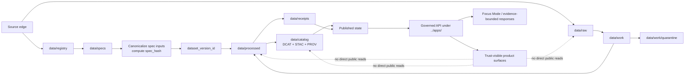

<!-- [KFM_META_BLOCK_V2]
doc_id: kfm://doc/<NEEDS_VERIFICATION_UUID>
title: data/
type: standard
version: v1
status: draft
owners: NEEDS VERIFICATION
created: YYYY-MM-DD
updated: YYYY-MM-DD
policy_label: NEEDS VERIFICATION
related: [../README.md, ./registry/README.md, ./specs/README.md, ./catalog/README.md, ./catalog/stac/README.md]
tags: [kfm, data, truth-path, catalog, provenance]
notes: [Owners, dates, policy label, and doc_id were not directly verified from mounted repo metadata in the current session.]
[/KFM_META_BLOCK_V2] -->

# `data/`

Governed storage and artifact zone for KFM source onboarding, lifecycle transitions, catalog closure, and proof-bearing release artifacts.

> **Status:** draft  
> **Owners:** NEEDS VERIFICATION  
> **Path:** `data/README.md`  
> 
> 
> 
> 
>   
> **Quick jump:** [Scope](#scope) · [Repo fit](#repo-fit) · [Inputs](#accepted-inputs) · [Directory tree](#directory-tree) · [Quickstart](#quickstart) · [Usage](#usage) · [Diagram](#diagram) · [Tables](#tables) · [Task list](#task-list) · [FAQ](#faq) · [Appendix](#appendix)

> [!IMPORTANT]
> Treat `data/` as part of the KFM truth path, not as a general-purpose dump. This README distinguishes between **CONFIRMED** repo-visible surfaces and **PROPOSED / NEEDS VERIFICATION** contract surfaces so branch-local expectations do not get silently promoted into repo fact.

## Scope

`data/` is the governed artifact space where KFM turns source intake into releaseable truth-path artifacts.

It is the directory family that anchors:

- source registration and onboarding intent
- deterministic raw capture
- transform and quarantine handling
- canonical processed outputs
- catalog closure across **DCAT + STAC + PROV**
- receipts, manifests, and proof-bearing release evidence

In KFM terms, this directory lives inside the canonical flow:

`Source edge -> RAW -> WORK / QUARANTINE -> PROCESSED -> CATALOG / TRIPLET -> PUBLISHED`

`PUBLISHED` is a **governed release state**, not necessarily a sibling folder in `data/`.

[Back to top](#data)

## Repo fit

`data/` sits between repo-level doctrine and governed runtime exposure.

| Direction | Surface | Why it matters |
|---|---|---|
| Upstream | [`../README.md`](../README.md) | Repo-wide invariants, trust posture, and cross-directory fit. |
| Upstream | [`../contracts/`](../contracts/) | Schemas, envelopes, vocabularies, and machine-checkable contract surfaces. |
| Upstream | [`../policy/`](../policy/) | Rights, sensitivity, redaction, and fail-closed policy logic. |
| Upstream | [`../docs/`](../docs/) | Runbooks, ADRs, architecture notes, and steward-facing guidance. |
| Lateral | [`./registry/README.md`](./registry/README.md) | Registry-first intake contract for datasets and governed entries. |
| Lateral | [`./specs/README.md`](./specs/README.md) | Canonical onboarding specs and `spec_hash` inputs. |
| Lateral | [`./catalog/README.md`](./catalog/README.md) | Catalog triplet boundary for governed metadata closure. |
| Lateral | [`./catalog/stac/README.md`](./catalog/stac/README.md) | STAC-specific asset packaging and delivery-facing geospatial metadata. |
| Downstream | [`../apps/`](../apps/) | Governed runtime surfaces consume promoted scope only. |
| Downstream | [`../tests/`](../tests/) | Fixtures, validators, and gate checks should prove lifecycle behavior. |
| Downstream | [`../infra/`](../infra/) | Retention, restore, promotion, reconciliation, and release operations. |

### Path posture

| Path class | Status here | Reading rule |
|---|---|---|
| `data/`, `data/registry/`, `data/specs/`, `data/catalog/` | **CONFIRMED** repo-visible documentation surfaces | Safe to reference directly. |
| `data/raw/`, `data/work/`, `data/processed/`, `data/receipts/` | **PROPOSED / NEEDS VERIFICATION** as branch-local directory reality | Treat as contract surfaces unless directly confirmed on the target branch. |
| `../apps/api/`, `../apps/ui/` | **PROPOSED / NEEDS VERIFICATION** as concrete subpaths | Use `../apps/` as the safe confirmed repo fit unless subpaths are verified. |

[Back to top](#data)

## Accepted inputs

The following belong in or immediately around `data/`:

- source registry entries and onboarding metadata
- dataset specs that stabilize `spec_hash` and version intent
- immutable raw captures plus integrity evidence
- transform-stage artifacts and validation outputs
- quarantine materials for unresolved rights, sensitivity, or schema issues
- canonical processed artifacts such as GeoParquet, COG, PMTiles, normalized tables, and governed JSON
- catalog triplet artifacts: **DCAT**, **STAC**, **PROV**
- receipts, manifests, validation reports, and correction-supporting evidence objects

## Exclusions

The following do **not** belong here as sovereign truth surfaces:

- direct UI or public-client reads from `data/`
  - use governed runtime surfaces under `../apps/` instead
- policy logic or reason-code registries
  - keep those under [`../policy/`](../policy/)
- canonical API envelopes and shared machine contracts
  - keep those under [`../contracts/`](../contracts/)
- ad hoc notebooks or analyst-only transient exports presented as publishable truth
  - route them through the governed lifecycle instead
- search, vector, graph, tile, cache, or scene layers treated as authoritative
  - those are downstream derived delivery surfaces
- secrets, credentials, or runtime-only operational state
  - keep those out of repo-tracked data surfaces

> [!NOTE]
> `data/` may hold artifacts that later drive public behavior, but public behavior still crosses the governed API and policy boundary. Storage is not the trust membrane.

[Back to top](#data)

## Directory tree

The tree below is a **repo-fit + contract** view. It intentionally separates what is repo-visible now from what remains branch-sensitive.

```text
data/
├── README.md
├── registry/                  # CONFIRMED repo-visible contract surface
│   └── README.md
├── specs/                     # CONFIRMED repo-visible spec surface
│   └── README.md
├── raw/                       # PROPOSED / NEEDS VERIFICATION as current branch path
├── work/                      # PROPOSED / NEEDS VERIFICATION
│   └── quarantine/            # PROPOSED / NEEDS VERIFICATION
├── processed/                 # PROPOSED / NEEDS VERIFICATION
├── catalog/                   # CONFIRMED repo-visible metadata boundary
│   ├── README.md
│   ├── dcat/                  # PROPOSED / NEEDS VERIFICATION as current branch path
│   ├── stac/                  # CONFIRMED repo-visible README surface
│   │   └── README.md
│   └── prov/                  # PROPOSED / NEEDS VERIFICATION as current branch path
└── receipts/                  # PROPOSED / NEEDS VERIFICATION proof surface
```

### Directory intent at a glance

| Surface | Role | Must be true before it matters |
|---|---|---|
| `registry/` | Declares what sources and datasets KFM intends to govern | Stable IDs, ownership/stewardship, policy label, and pipeline intent are explicit. |
| `specs/` | Freezes dataset onboarding semantics into reviewable spec inputs | Canonical fields, defaults, fixtures, and `spec_hash` inputs are machine-checkable. |
| `raw/` | Immutable acquisition capture | Original bytes, request context, rights snapshot, and checksums survive untouched. |
| `work/` | Deterministic transform and QA lane | Transforms are reproducible and still blockable. |
| `work/quarantine/` | Governance hold lane | Ambiguous rights, sensitivity, schema drift, or failed validation stop promotion here. |
| `processed/` | Canonical publishable derivatives | Stable artifact IDs, explicit time/CRS semantics, and quality checks exist. |
| `catalog/` | Discoverability + lineage closure | DCAT, STAC, and PROV resolve together without guessing. |
| `receipts/` | Proof-bearing run and release evidence | Inputs, outputs, policy results, and integrity cues can be reconstructed later. |

[Back to top](#data)

## Quickstart

Use these commands to inspect the data surface without assuming every contract path already exists on the current branch.

```bash
# 1) Confirm the top-level data surface
tree -L 2 data

# 2) Read the currently repo-visible contract docs
test -f data/README.md && sed -n '1,160p' data/README.md
test -f data/registry/README.md && sed -n '1,160p' data/registry/README.md
test -f data/specs/README.md && sed -n '1,160p' data/specs/README.md
test -f data/catalog/README.md && sed -n '1,200p' data/catalog/README.md
test -f data/catalog/stac/README.md && sed -n '1,160p' data/catalog/stac/README.md

# 3) Check which lifecycle paths actually exist on the current branch
find data -maxdepth 2 -type d | sort

# 4) Inspect catalog-facing files if present
find data/catalog -maxdepth 3 -type f 2>/dev/null | sort | sed -n '1,80p'

# 5) Inspect receipts or manifests if present
find data -maxdepth 3 \( -iname '*receipt*' -o -iname '*manifest*' \) 2>/dev/null | sort
```

### Minimal review sequence

```bash
# Inspect current contract surfaces
tree -L 2 data/registry data/specs data/catalog 2>/dev/null

# Verify that raw/work/processed paths are not being treated as public delivery surfaces
find data -maxdepth 2 -type d | grep -E '/(raw|work|processed|receipts)$' || true
```

[Back to top](#data)

## Usage

### 1. Register first

A source or dataset should be registered before it is fetched, transformed, or exposed. If KFM cannot say what a source is, why it is admissible, what cadence it carries, and what rights or sensitivity posture applies, intake is not ready.

### 2. Spec before version

A dataset spec stabilizes intent. A dataset version records what actually happened. Keep those distinct so `spec_hash`, validation, and release evidence stay meaningful.

### 3. Preserve raw exactly once

`raw/` is for immutable capture, not convenient cleanup. Do not overwrite upstream payloads in place. Keep request context, rights snapshots, and checksums with the acquisition record.

### 4. Transform only in `work/`

Normalization, OCR, geometry repair, crosswalks, redaction transforms, and quality checks belong in `work/`. If risk is unresolved, move to `quarantine/`, not to `processed/`.

### 5. Promote only immutable processed artifacts

`processed/` should hold canonical, publishable derivatives with stable IDs, explicit time/spatial semantics, and deterministic linkage back to intake and transform evidence.

### 6. Close the catalog triplet before exposure

No dataset version is complete until the corresponding catalog boundary is valid and cross-linked. In KFM, that means the **DCAT + STAC + PROV** relationship is working, not implied.

### 7. Treat publication as a state transition

`published` is not “copy files somewhere and hope.” Promotion binds identity, rights, sensitivity, catalog validity, receipts, policy checks, and operational readiness into one governed release decision.

### 8. Keep derived layers derived

Search, vector, graph, tile, cache, and scene layers may accelerate delivery, but they do not become sovereign truth. They remain downstream of approved release scope.

> [!WARNING]
> No public or analyst-facing governed behavior should bypass release scope, policy, or evidence resolution by reading raw, processed, or catalog storage directly.

[Back to top](#data)

## Diagram


```mermaid
flowchart LR
    SRC[Source edge] --> REG[data/registry]
    REG --> SPEC[data/specs]
    SPEC --> HASH[Canonicalize spec inputs<br/>compute spec_hash]
    SRC --> RAW[data/raw]
    RAW --> WORK[data/work]
    WORK --> QUAR[data/work/quarantine]
    WORK --> PROC[data/processed]
    HASH --> DV[dataset_version_id]
    DV --> PROC
    PROC --> CAT[data/catalog<br/>DCAT + STAC + PROV]
    PROC --> REC[data/receipts]
    CAT --> PUB[Published state]
    REC --> PUB
    PUB --> API[Governed API under ../apps/]
    API --> UI[Trust-visible product surfaces]
    API --> FOCUS[Focus Mode / evidence-bounded responses]

    UI -. no direct public reads .-> RAW
    UI -. no direct public reads .-> PROC
    UI -. no direct public reads .-> CAT
```

[Back to top](#data)

## Tables

### Zone contract matrix

| Zone / state | Core question | What belongs here | What must never happen here |
|---|---|---|---|
| `registry/` | *What do we intend to govern?* | Dataset and source registration contracts | Ad hoc intake with no declared identity or steward |
| `specs/` | *What is the machine-reviewable intended shape?* | Dataset specs, fixtures, spec inputs, canonical defaults | Hidden spec drift living only in notebooks or verbal convention |
| `raw/` | *What exactly arrived?* | Original payloads, request metadata, checksums, rights snapshots | In-place mutation or public exposure |
| `work/` | *What deterministic repair or enrichment is occurring?* | OCR, normalization, geometry repair, crosswalks, QA outputs | Quiet promotion of unresolved artifacts |
| `quarantine/` | *What remains unsafe or unresolved?* | Rights ambiguity, schema drift, failed validation, sensitive-location holds | Warning-only pseudo-production |
| `processed/` | *What is now publishable in canonical form?* | GeoParquet, COG, PMTiles, normalized tables, governed JSON | Artifacts that cannot regenerate valid catalog closure |
| `catalog/` | *Can discoverability, lineage, and evidence resolution work?* | DCAT, STAC, PROV and their cross-links | Marking a version complete when triplet closure is broken |
| `receipts/` | *Can the run or release be reconstructed later?* | Receipts, manifests, validation reports, release evidence | Shipping a consequential release with no proof-bearing audit object |
| `published` | *May this scope be exposed through governed runtime?* | Approved runtime-visible release scope | Treating publication as a folder copy instead of a gated transition |

### Promotion gates

| Gate | What must be true | Typical evidence surface |
|---|---|---|
| A — Identity & versioning | Stable `dataset_id`, `dataset_version_id`, deterministic `spec_hash`, artifact digests, non-ambiguous lineage | spec, manifest, digest set |
| B — Licensing & rights | Rights posture and source terms are captured and reviewable | rights snapshot, source terms artifact |
| C — Sensitivity & redaction | Restricted fields, locations, or generalized views are explicitly handled | policy label, obligations, redaction outputs |
| D — Catalog triplet validation | DCAT, STAC, and PROV are valid and cross-linked | catalog validators, link-check reports |
| E — QA & thresholds | Dataset-specific quality rules are explicit and passed | validation report, threshold output |
| F — Run receipt & audit record | Inputs, tool versions, outputs, checksums, and policy decisions are reconstructable | run receipt, audit object |
| G — Release readiness | Ownership, rollback/correction path, and operational posture exist | release manifest, owner/steward evidence |

[Back to top](#data)

## Task list

### Definition of done for a governed dataset lane

- [ ] Source or dataset registry entry exists and is reviewable.
- [ ] Dataset spec exists where the lane requires spec-driven identity or `spec_hash`.
- [ ] Raw acquisition preserves payload, request context, rights snapshot, and checksums.
- [ ] Transform logic is reproducible and isolated from release state.
- [ ] Quarantine path exists for unresolved rights, sensitivity, schema, or quality risk.
- [ ] Processed artifacts are immutable, named deterministically, and link back to source/run evidence.
- [ ] Catalog closure is valid across **DCAT + STAC + PROV**.
- [ ] Receipts or manifests can explain what happened without tribal memory.
- [ ] Governed API surfaces can expose promoted scope without direct storage access.
- [ ] Derived delivery layers, if any, prove release linkage and stay rebuildable.
- [ ] Correction or supersession can be represented without erasing prior evidence.

### Review checks before merge

- [ ] No README prose quietly upgrades a target-state path into confirmed repo fact.
- [ ] Public-safe vs restricted handling is visible where domain data needs it.
- [ ] Example commands do not assume paths that the branch may not contain.
- [ ] Relative links resolve or are clearly marked as contract/expected.
- [ ] Terminology matches KFM doctrine: truth path, trust membrane, catalog triplet, evidence, promotion, correction.

[Back to top](#data)

## FAQ

### Is `published/` a directory?

No. In KFM, **published** is first a governed release state. A branch may choose to materialize supporting artifacts for that state, but the concept itself is a transition with gates, not just a folder.

### Why not read `data/` directly from the UI?

Because storage is not the trust membrane. Public and role-limited behavior is supposed to cross release scope, policy, and evidence resolution through governed runtime surfaces.

### Why separate `registry/` and `specs/`?

Because source or dataset intent is not the same thing as a frozen machine-reviewable onboarding contract. Keeping them separate helps preserve clear identity, versioning, and review boundaries.

### Are search, graph, vector, and tiles part of `data/` truth?

Not as sovereign truth. They may depend on `data/` artifacts and be built from approved release scope, but they remain derived delivery surfaces.

### When should something enter `quarantine/`?

At minimum when rights are ambiguous, sensitivity is unresolved, validation fails, schema drift is unsafe, or public-safe scope cannot yet be justified.

[Back to top](#data)

## Appendix

<details>
<summary>Glossary</summary>

| Term | Meaning in this README |
|---|---|
| Truth path | The governed movement from source edge through RAW, WORK / QUARANTINE, PROCESSED, CATALOG / TRIPLET, and into PUBLISHED state. |
| Trust membrane | The rule that clients do not bypass governed API, policy, and evidence resolution to reach storage directly. |
| Catalog triplet | The linked metadata boundary formed by **DCAT + STAC + PROV**. |
| `spec_hash` | Deterministic identity input derived from canonicalized spec content where spec-driven versioning applies. |
| Dataset version | A controlled processed subject set at explicit grain, time basis, and evidence state. |
| EvidenceRef / EvidenceBundle | The route from a claim-bearing surface into inspectable policy-safe support. |
| Authoritative | Truth-path artifacts or state KFM treats as system-of-record at their declared grain. |
| Derived | Rebuildable layers such as search, vector, graph, tiles, summaries, and scenes. |
</details>

<details>
<summary>Starter conventions</summary>

A practical starter rule set for `data/`:

1. Name source and dataset identifiers deterministically.
2. Keep raw acquisition append-only.
3. Canonicalize spec inputs before computing `spec_hash`.
4. Emit receipts whenever a lane crosses a promotion boundary.
5. Keep catalog validation machine-checkable.
6. Prefer explicit policy labels over implied handling.
7. Record correction and supersession as evidence-bearing transitions, not silent overwrites.
</details>

<details>
<summary>Anti-patterns</summary>

Avoid these patterns in or around `data/`:

- treating `data/` as a catch-all scratchpad
- publishing from analyst notebooks or transient transforms
- inferring rights posture from convenience or silence
- hiding catalog incompleteness behind UI polish
- letting derived layers write back as authority
- storing only polished outputs and discarding raw capture context
- assuming that a missing evidence route can be patched later in the UI
</details>

<details>
<summary>Related entrypoints</summary>

- [`../README.md`](../README.md)
- [`./registry/README.md`](./registry/README.md)
- [`./specs/README.md`](./specs/README.md)
- [`./catalog/README.md`](./catalog/README.md)
- [`./catalog/stac/README.md`](./catalog/stac/README.md)
- [`../contracts/`](../contracts/)
- [`../policy/`](../policy/)
- [`../docs/`](../docs/)
</details>

[Back to top](#data)