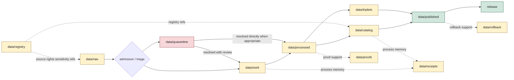

<!-- [KFM_META_BLOCK_V2]
doc_id: kfm://data/readme
title: Data Root README
type: data-root-readme
version: v0.1.0
status: draft
owners:
  - <data-steward>
  - <source-steward>
  - <pipeline-steward>
  - <domain-stewards>
  - <catalog-steward>
  - <graph-steward>
  - <proof-steward>
  - <receipt-steward>
  - <registry-steward>
  - <policy-steward>
  - <release-steward>
  - <docs-steward>
created: 2026-06-29
updated: 2026-06-29
policy_label: restricted-review
truth_posture: cite-or-abstain
responsibility_root: data/
authority_level: canonical-data-lifecycle-root
artifact_family: lifecycle-data-root-index
path_posture: existing-short-readme-replaced; directory-rules-confirm-data-lifecycle-tree; child-root-readmes-confirmed-for-raw-work-quarantine-processed-catalog-triplets-receipts-proofs-published-registry-rollback; release-root-confirmed-separate; payload-inventory-and-runtime-enforcement-need-verification
sensitivity_posture: governed-internal-by-default; public-only-through-release-and-published-artifact-paths; no-direct-public-access-to-raw-work-quarantine-or-internal-stores; source-role-preserving; rights-aware; sensitivity-aware; evidence-aware; receipt-aware; policy-aware; release-aware; correction-and-rollback-aware
related:
  - raw/README.md
  - work/README.md
  - quarantine/README.md
  - processed/README.md
  - catalog/README.md
  - triplets/README.md
  - receipts/README.md
  - proofs/README.md
  - published/README.md
  - registry/README.md
  - rollback/README.md
  - ../release/README.md
  - ../docs/doctrine/directory-rules.md
  - ../docs/doctrine/lifecycle-law.md
  - ../docs/doctrine/trust-membrane.md
  - ../contracts/
  - ../schemas/
  - ../policy/
  - ../tools/validators/
tags:
  - kfm
  - data
  - lifecycle
  - raw
  - work
  - quarantine
  - processed
  - catalog
  - triplets
  - receipts
  - proofs
  - published
  - registry
  - rollback
  - release-gated
  - evidence-first
  - cite-or-abstain
  - no-direct-public-path
notes:
  - "This README replaces the short `data/README.md` root stub."
  - "Directory Rules define `data/` as the lifecycle data tree and state the invariant `RAW -> WORK / QUARANTINE -> PROCESSED -> CATALOG / TRIPLET -> PUBLISHED`."
  - "Promotion is a governed state transition, not a file move. Directory placement alone never proves release, publication, policy admission, evidence support, or factual truth."
  - "Release decisions belong under `release/`, not `data/`; `data/published/` holds released public-safe artifacts, not release authority."
  - "README/path evidence does not prove payloads, schemas, validators, receipts, policy automation, CI checks, review completion, hosting, or release readiness."
[/KFM_META_BLOCK_V2] -->

<a id="top"></a>

# Data Root

Canonical lifecycle data root for KFM source captures, working candidates, holds, processed outputs, catalog/triplet projections, proof support, process receipts, registries, rollback support, and released public-safe delivery artifacts.

<p>
  
  
  
  
  
  
</p>

**Status:** active lifecycle root / draft governance contract  
**Owners:** `<data-steward>`, `<pipeline-steward>`, `<domain-stewards>`, `<policy-steward>`, `<release-steward>`  
**Path:** `data/`  
**Quick links:** [Scope](#scope) · [Lifecycle invariant](#lifecycle-invariant) · [Repo fit](#repo-fit) · [Accepted material](#accepted-material) · [Exclusions](#exclusions) · [Confirmed child roots](#confirmed-child-roots) · [Root guardrails](#root-guardrails) · [Directory map](#directory-map) · [Required checks](#required-checks-before-use) · [Status notes](#status-notes) · [Evidence ledger](#evidence-ledger)

> [!IMPORTANT]
> `data/` is a canonical lifecycle root, not a shortcut to truth or publication. Public clients and normal UI surfaces must use governed interfaces, release-resolved artifacts, EvidenceBundle/proof support, policy decisions, review state, and release state. Direct reads from RAW, WORK, QUARANTINE, PROCESSED, registry, proof, receipt, catalog, triplet, or rollback internals are not the normal public path.

---

## Scope

`data/` owns KFM lifecycle data families. It is where source captures, working candidates, holds, processed artifacts, catalog records, graph-compatible relationship projections, receipts, proofs, published delivery artifacts, registries, and rollback support are placed by responsibility and lifecycle phase.

The public unit of value remains the inspectable claim: a statement whose evidence, source role, spatial and temporal scope, policy posture, review state, release state, and correction lineage can be inspected. Files under `data/` may support that claim, but directory placement alone never makes a claim true, public, cited, rights-cleared, policy-admitted, reviewed, released, or safe to answer.

---

## Lifecycle invariant

```text
RAW -> WORK / QUARANTINE -> PROCESSED -> CATALOG / TRIPLET -> PUBLISHED
```

Directory Rules state that this invariant is governance, not just storage organization. Promotion is a governed state transition. A copy, move, export, generated summary, graph projection, tile build, report render, or API payload does not satisfy promotion unless validation, provenance, rights, sensitivity, receipts, proof support, catalog/triplet closure, release decision, correction path, and rollback target are appropriate to the claim and exposure.


```mermaid
flowchart LR
    RAW[data/raw] --> TRIAGE{admission / triage}
    TRIAGE --> WORK[data/work]
    TRIAGE --> QUAR[data/quarantine]
    QUAR -->|resolved with review| WORK
    WORK --> PROC[data/processed]
    QUAR -->|resolved directly when appropriate| PROC
    PROC --> CAT[data/catalog]
    PROC --> TRIP[data/triplets]
    CAT --> PUB[data/published]
    TRIP --> PUB
    PUB --> REL[release]
    PROC -. proof support .-> PROOF[data/proofs]
    WORK -. process memory .-> REC[data/receipts]
    CAT -. process memory .-> REC
    PUB -. rollback support .-> ROLL[data/rollback]
    REG[data/registry] -. source rights sensitivity refs .-> RAW
    REG -. registry refs .-> CAT

    classDef internal fill:#fff3cd,stroke:#8a6d3b,color:#202124;
    classDef hold fill:#f8d7da,stroke:#842029,color:#202124;
    classDef governed fill:#d1e7dd,stroke:#0f5132,color:#202124;
    class RAW,WORK,PROC,CAT,TRIP,PROOF,REC,REG,ROLL internal;
    class QUAR hold;
    class PUB,REL governed;
```

> [!NOTE]
> This diagram is a responsibility map, not proof that every pipeline, validator, receipt emitter, proof builder, policy engine, release manifest, public route, or CI gate is currently wired.

---

## Repo fit

| Responsibility | Correct home | Boundary |
|---|---|---|
| Lifecycle data | `data/` | This root. Data artifacts only. |
| Release decisions | [`../release/`](../release/README.md) | ReleaseManifest, PromotionDecision, rollback cards, corrections, withdrawals, signatures, changelog. |
| Contracts | `../contracts/` | Interface and contract authority, not data payload storage. |
| Schemas | `../schemas/` | Schema authority, not data payload storage. |
| Policy | `../policy/` | Policy rule authority, not data payload storage. |
| Validators and tools | `../tools/validators/`, `../tools/` | Execution and validation logic, not canonical data. |
| Tests and fixtures | `../tests/` | Verification assets, not lifecycle data unless explicitly mirrored as test fixtures. |
| Apps, APIs, UI, clients | `../apps/`, `../packages/`, implementation roots | Public surfaces must consume governed APIs or released artifacts, not internal data roots. |
| Documentation | `../docs/` | Doctrine, architecture, runbooks, ADRs, standards. |

---

## Accepted material

Accepted content is limited to data-lifecycle artifacts and local README/index sidecars:

- immutable source captures and RAW-local source-admission sidecars;
- normalized intermediates, candidate assertions, QA outputs, redaction/generalization trials, and work-local run material;
- quarantine holds and hold-review sidecars for unresolved rights, sensitivity, source-role, schema, validation, geometry, temporal, or policy issues;
- processed normalized outputs after appropriate validation and review;
- catalog records, catalog indexes, and graph-compatible triplet projections;
- EvidenceBundle, ProofPack, validation, citation, review, integrity, and proof-support artifacts;
- process receipts for ingest, validation, pipeline, AI, redaction, aggregation, catalog, release-support, correction, and rollback activity;
- source, dataset, layer, domain, rights, sensitivity, and crosswalk registry records;
- rollback support artifacts and alias-revert receipts that remain separate from release decision authority;
- released public-safe delivery artifacts under `data/published/` after release gates close;
- README, manifest, index, digest, and reference sidecars that document the local data boundary without creating parallel authority.

---

## Exclusions

| Do not place here | Correct home |
|---|---|
| ReleaseManifest, PromotionDecision, RollbackCard, CorrectionNotice, WithdrawalNotice, release signatures, or release changelog | `release/` |
| Contract definitions or interface authority | `contracts/` |
| JSON Schema, schema registry, or schema authority | `schemas/` |
| Policy rules or policy engine logic | `policy/` |
| Validators, scripts, pipeline code, app code, API code, UI code, package code, or build workflows | `tools/`, `pipelines/`, `apps/`, `packages/`, `.github/`, or implementation roots |
| Public client source material, normal UI route payloads, or direct public API backing stores | Governed APIs and released `data/published/` artifacts only after release gates. |
| Generated language, summaries, embeddings, vector indexes, tiles, scenes, dashboards, screenshots, or reports as sovereign truth | Downstream surfaces only; claims must resolve to evidence, policy, review, and release state or abstain. |
| Material with unresolved rights, sensitive locations, living-person data, DNA/genomic context, cultural/archaeological sensitivity, rare species locations, critical infrastructure detail, private land/title joins, or security-relevant exposure outside a governed hold or restricted lane | `data/quarantine/`, restricted governed lanes, redaction/generalization paths, or `DENY`/`ABSTAIN` posture. |
| Parallel schema, contract, policy, proof, registry, release, or source-authority homes created for convenience | Use canonical roots or create an ADR/migration note before adding authority. |

---

## Confirmed child roots

The roots below were confirmed by GitHub fetches during this documentation pass. This table confirms README/path evidence only; it does **not** prove payload inventory, schemas, validators, emitted receipts, proof closure, policy automation, CI enforcement, review completion, hosting, public route behavior, or release readiness.

| Root | Lifecycle role | Boundary summary |
|---|---|---|
| [`raw/`](raw/README.md) | `RAW` | Immutable source captures and source-admission sidecars; no public path. |
| [`work/`](work/README.md) | `WORK` | Normalized intermediates and candidate assertions; no public API/UI or release aliases. |
| [`quarantine/`](quarantine/README.md) | `QUARANTINE` | Held material for failed validation, unresolved rights/sensitivity, schema drift, over-precise geometry, or review gaps. |
| [`processed/`](processed/README.md) | `PROCESSED` | Validated normalized outputs; not automatically public or released. |
| [`catalog/`](catalog/README.md) | `CATALOG` | STAC/DCAT/PROV/domain catalog projections; discovery is not release authority. |
| [`triplets/`](triplets/README.md) | `TRIPLET` | Graph-compatible relationship projections; not canonical replacement truth. |
| [`receipts/`](receipts/README.md) | Process memory | Run, validation, ingest, AI, catalog, release-support, correction, and rollback process memory; not proof by itself. |
| [`proofs/`](proofs/README.md) | Proof support | EvidenceBundle, ProofPack, validation, citation, review, and integrity-adjacent proof support; not release authority. |
| [`published/`](published/README.md) | `PUBLISHED` | Released public-safe delivery artifacts and sidecars; downstream carrier only. |
| [`registry/`](registry/README.md) | Registry | Source, dataset, layer, domain, rights, sensitivity, and crosswalk registry records; not canonical domain truth. |
| [`rollback/`](rollback/README.md) | Rollback support | Data-plane rollback and alias-revert support; release decisions remain in `release/`. |

Legacy or compatibility mentions of `prov`, `manifests`, or `reports` should be routed through confirmed responsibility roots unless an ADR says otherwise: `data/catalog/prov/`, `release/` for release manifests, and `data/published/reports/` for released report artifacts.

---

## Root guardrails

| Risk | Guardrail |
|---|---|
| Directory placement becomes truth | Treat path placement as governance context, not factual proof. Claims still need evidence, source role, policy, review, release state, and correction lineage. |
| Public path bypass | Public clients and normal UI surfaces must use governed interfaces or release-resolved artifacts, not internal lifecycle stores. |
| Release authority drift | Release decisions live in `release/`; `data/published/` holds released artifacts, not the decision itself. |
| WORK or PROCESSED becomes public | WORK is candidate/intermediate; PROCESSED is normalized output. Neither is public by placement. |
| Catalog or triplet projection becomes sovereign truth | Catalog and triplets are downstream projections; they must not replace source, processed records, EvidenceBundles, policy, or release decisions. |
| Receipt/proof collapse | Receipts record process memory. Proofs support evidence closure. Neither silently substitutes for the other or for release. |
| Registry becomes domain truth | Registries describe sources, datasets, layers, domains, rights, sensitivity, and crosswalks. Domain truth still depends on lifecycle, evidence, policy, and review. |
| Sensitive detail leaks through joins | Living-person, DNA/genomic, cultural, archaeological, ecological, infrastructure, land/title, private parcel, rare species, and exact sensitive-location joins fail closed. |
| Generated output outruns evidence | Generated text, summaries, embeddings, maps, tiles, scenes, dashboards, reports, and graph/vector indexes are downstream interpretive surfaces. They cite or abstain. |
| Correction and rollback become silent edits | Corrections, withdrawals, supersessions, and rollbacks require auditable records and derivative invalidation where material. |

---

## Directory map

Directory Rules define the intended shape as:

```text
data/
├── README.md
├── raw/
│   └── <domain>/<source_id>/<run_id>/
├── work/
│   └── <domain>/<run_id>/
├── quarantine/
│   └── <domain>/<reason>/<run_id>/
├── processed/
│   └── <domain>/<dataset_id>/<version>/
├── catalog/
│   ├── stac/
│   ├── dcat/
│   ├── prov/
│   └── domain/
├── triplets/
│   ├── graph_deltas/
│   └── exports/
├── receipts/
│   ├── ingest/
│   ├── validation/
│   ├── pipeline/
│   ├── ai/
│   └── release/
├── proofs/
│   ├── evidence_bundle/
│   ├── proof_pack/
│   ├── validation_report/
│   └── citation_validation/
├── published/
│   ├── api_payloads/
│   ├── layers/
│   ├── pmtiles/
│   ├── geoparquet/
│   ├── reports/
│   └── stories/
├── rollback/
│   └── <domain>/<release_id>/
└── registry/
    ├── sources/
    ├── source_descriptors/
    ├── layers/
    ├── datasets/
    ├── domains/
    ├── rights/
    ├── sensitivity/
    └── crosswalks/
```

Do not pre-create empty child directories unless a real source, run, dataset, proof, receipt, registry record, release, migration, inventory, or steward decision requires them.

---

## Required checks before use

- [ ] Confirm the target lifecycle root before adding or moving any data artifact.
- [ ] Confirm source role, source authority, rights, sensitivity, temporal role, spatial scope, and review state travel with the artifact.
- [ ] Confirm RAW material is immutable and not exposed directly.
- [ ] Confirm WORK material stays candidate/intermediate and cannot act as a public API/UI, release alias, or generated-answer source.
- [ ] Confirm QUARANTINE material cannot promote without remediation, review, receipt, and policy closure.
- [ ] Confirm PROCESSED material has validation and provenance support before downstream projection.
- [ ] Confirm CATALOG/TRIPLET records do not replace EvidenceBundle support, processed records, or release decisions.
- [ ] Confirm receipts and proofs stay separate object families.
- [ ] Confirm public or semi-public artifacts are under `data/published/` only after release governance closes.
- [ ] Confirm release decisions are recorded under `release/`, not `data/`.
- [ ] Confirm correction, withdrawal, supersession, stale-state invalidation, and rollback targets exist where material.
- [ ] Confirm no public client, normal UI, map layer, story, report, graph/vector index, Focus Mode answer, or AI answer bypasses governed interfaces and release state.

---

## Status notes

| Item | Status | Notes |
|---|---:|---|
| Target path presence | CONFIRMED | `data/README.md` existed as a short root README before this update. |
| Data root authority | CONFIRMED doctrine | Directory Rules define `data/` as the lifecycle invariant root. |
| Lifecycle invariant | CONFIRMED doctrine | `RAW -> WORK / QUARANTINE -> PROCESSED -> CATALOG / TRIPLET -> PUBLISHED`. |
| Release decision split | CONFIRMED README / doctrine | `release/README.md` and Directory Rules place release decisions outside `data/`. |
| Child lifecycle roots | CONFIRMED README/PATH | The roots listed in [Confirmed child roots](#confirmed-child-roots) were fetched during this pass. |
| Legacy `prov`, `manifests`, `reports` mention | CLARIFIED | Routed to confirmed responsibility roots: catalog PROV, release manifests, and published reports. |
| Payload inventory | UNKNOWN | This README does not prove payload bytes exist under any child root. |
| Schemas, validators, receipts, proofs, CI, policy enforcement, public routes, hosting, release linkage | NEEDS VERIFICATION | No runtime enforcement was proven by this edit. |
| Public release readiness | DENY by default | Data-root placement alone cannot publish or expose claims. |

---

## Evidence ledger

| Source | Status | Supports | Limits |
|---|---|---|---|
| Previous target file | CONFIRMED | `data/README.md` existed and identified `data/` as lifecycle data. | It was too short to define governance boundaries. |
| [`../docs/doctrine/directory-rules.md`](../docs/doctrine/directory-rules.md) | CONFIRMED doctrine | `data/` lifecycle tree, invariant, phase rules, and release split. | Does not prove runtime enforcement or payload inventory. |
| [`raw/README.md`](raw/README.md) | CONFIRMED README | RAW root boundary, source-capture posture, no public path. | Does not prove raw payload inventory or connector activation. |
| [`work/README.md`](work/README.md) | CONFIRMED README | WORK root boundary, normalized intermediates, candidate assertions, no public path. | Does not prove work-run payloads, schemas, validators, or receipts. |
| [`quarantine/README.md`](quarantine/README.md) | CONFIRMED README | Quarantine hold posture and governed exit expectations. | Does not prove held payloads or policy automation. |
| [`processed/README.md`](processed/README.md) | CONFIRMED README | Processed root boundary and downstream catalog/triplet/publication relationship. | Does not prove processed inventory or validators. |
| [`catalog/README.md`](catalog/README.md) | CONFIRMED README | Catalog projection boundary and release-gated exposure posture. | Does not prove catalog payloads or release linkage. |
| [`triplets/README.md`](triplets/README.md) | CONFIRMED README | Triplets as graph-compatible relationship projections, not canonical replacement truth. | Does not prove graph payloads or validators. |
| [`receipts/README.md`](receipts/README.md) | CONFIRMED README | Receipts as process memory, not proof/catalog/release. | Does not prove emitted receipt inventory or signing. |
| [`proofs/README.md`](proofs/README.md) | CONFIRMED README | Proof support root and EvidenceBundle/ProofPack posture. | Does not prove proof closure or release enforcement. |
| [`published/README.md`](published/README.md) | CONFIRMED README | Published data as released public-safe downstream carriers. | Does not prove hosted artifacts or release approval. |
| [`registry/README.md`](registry/README.md) | CONFIRMED README | Registry root for source/dataset/layer/domain/rights/sensitivity/crosswalk records. | Does not prove registry payload completeness or public route behavior. |
| [`rollback/README.md`](rollback/README.md) | CONFIRMED README | Rollback support root and decision/data-plane split. | Does not prove rollback instances or release artifacts. |
| [`../release/README.md`](../release/README.md) | CONFIRMED README | Release decisions, manifests, promotion records, rollback cards, withdrawals, corrections, signatures, and changelog live outside `data/`. | Release root README is short and status `PROPOSED`. |

[Back to top](#top)
