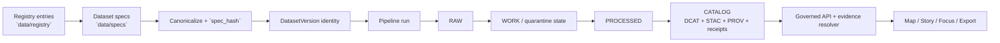

<!-- [KFM_META_BLOCK_V2]
doc_id: kfm://doc/3d639a5f-40da-41d4-b6e1-f91c79d4622a
title: data/ README
type: standard
version: v1
status: draft
owners: KFM Data Stewardship; KFM Engineering
created: 2026-03-07
updated: 2026-03-07
policy_label: public
related: [../README.md, ../contracts/, ../policy/, ./registry/, ./specs/, ./catalog/]
tags: [kfm, data, governance, catalogs, provenance]
notes: [Directory contract for the governed KFM data surface.]
[/KFM_META_BLOCK_V2] -->

# `data/`
Governed dataset artifacts, contracts, and catalogs for the KFM truth path.

**Status:** draft  
**Owners:** KFM Data Stewardship; KFM Engineering  
   

**Quick jump:** [Scope](#scope) · [Repo fit](#repo-fit) · [Accepted inputs](#accepted-inputs) · [Exclusions](#exclusions) · [Directory tree](#directory-tree) · [Quickstart](#quickstart) · [Truth path](#truth-path) · [Zone contracts](#zone-contracts) · [Promotion gates](#promotion-gates) · [Definition of Done](#definition-of-done) · [FAQ](#faq) · [Appendix](#appendix)

## Scope
This directory is the **canonical governed data surface** for KFM. It holds the artifacts and contracts that let a dataset move from onboarding intent to publishable evidence.

It is not just a storage bucket. It is the place where KFM keeps:
- reviewable dataset onboarding contracts
- immutable or versioned lifecycle artifacts
- validated discovery and provenance metadata
- receipts and manifests that make publication reproducible

> [!IMPORTANT]
> If a dataset cannot be reviewed, validated, policy-labeled, and cited from this surface, it is not ready to appear in KFM runtime experiences.

## Repo fit
**Path:** `data/`

**Upstream dependencies:**
- [`../README.md`](../README.md) for operating posture and invariants
- [`../contracts/`](../contracts/) for schemas, profiles, and controlled vocabularies
- [`../policy/`](../policy/) for default-deny policy and test fixtures
- `../tools/` for validators, hash tooling, and link checks

**Downstream consumers:**
- `data/catalog/` feeds governed discovery and evidence resolution
- governed API surfaces (for example `../apps/api/`, where present) consume promoted artifacts and catalogs
- map, story, export, and Focus Mode surfaces consume only policy-approved, citable outputs

## Accepted inputs
The following belong here:
- **Registry entries** that define what KFM knows how to onboard
- **Dataset specs** that are canonical inputs to deterministic versioning and `spec_hash`
- **RAW acquisitions** with manifests, original payloads, and checksums
- **WORK outputs** such as normalization results, QA reports, and redaction candidates
- **PROCESSED artifacts** in approved publishable formats
- **CATALOG artifacts** including DCAT, STAC, PROV, run receipts, and promotion manifests

## Exclusions
The following do **not** belong here:
- secrets, credentials, signed URLs, or embedded tokens
- direct runtime databases, search indexes, graph projections, or tile caches
- ad hoc scratch exports, notebooks, and one-off analysis dumps
- manual fixes to RAW data in place
- user-visible artifacts that are not cataloged, policy-labeled, and tied to evidence

> [!WARNING]
> `data/` is not a general-purpose file dump. If an artifact is rebuildable, temporary, or uncitable, put it somewhere else or keep it out of the repo entirely.

## Directory tree
This is the recommended high-level contract for `data/`. Submodules may refine their own internal structure in their local `README.md` files.

```text
data/
├─ README.md                 # This file: purpose, invariants, and workflow
├─ registry/                 # Reviewable source/dataset registry entries
├─ specs/                    # Canonical dataset onboarding specs (input to spec_hash)
├─ raw/                      # Immutable upstream acquisitions (append-only)
├─ work/                     # Intermediate transforms, QA, redaction candidates
├─ processed/                # Publishable, versioned artifacts
└─ catalog/                  # DCAT + STAC + PROV + receipts + promotion manifests
```

### Submodule entrypoints
- [`./registry/README.md`](./registry/README.md)
- [`./specs/README.md`](./specs/README.md)
- [`./catalog/stac/README.md`](./catalog/stac/README.md)

If a branch introduces a different structure, update this README and the submodule README in the **same PR**.

[Back to top](#data)

## Quickstart
Use these steps when onboarding or changing a dataset.

### 1) Inspect the governed data surface
```bash
find data -maxdepth 2 -type d | sort
sed -n '1,120p' data/registry/README.md
sed -n '1,120p' data/specs/README.md
```

### 2) Add or update the reviewable contracts first
```bash
# add or update registry/spec artifacts before touching lifecycle zones
$EDITOR data/registry/...
$EDITOR data/specs/...
```

### 3) Run repo-native validation entrypoints
```bash
# prefer the project’s real entrypoints on your branch
make help

# common alternates, depending on branch tooling
pytest
npm test
```

### 4) Verify the change is still citeable and fail-closed
```bash
# examples only — replace with repo-native validators once wired
python -m json.tool data/catalog/.../dcat.jsonld >/dev/null
python -m json.tool data/catalog/.../prov/prov.jsonld >/dev/null
```

> [!NOTE]
> The safest operating order is: **registry/specs first, artifacts second, catalogs/receipts last, runtime only after promotion gates pass**.

## Truth path
Registry and specs define intent and governance. Pipeline runs produce artifacts. Catalogs and receipts turn those artifacts into something that KFM can safely expose.


```mermaid
flowchart LR
    R[Registry entries\n`data/registry`] --> S[Dataset specs\n`data/specs`]
    S --> H[Canonicalize + `spec_hash`]
    H --> V[DatasetVersion identity]
    V --> P[Pipeline run]
    P --> RAW[RAW]
    RAW --> WORK[WORK / quarantine state]
    WORK --> PROC[PROCESSED]
    PROC --> CAT[CATALOG\nDCAT + STAC + PROV + receipts]
    CAT --> API[Governed API + evidence resolver]
    API --> UI[Map / Story / Focus / Export]
```

## Zone contracts
| Area | Primary purpose | Mutability | Required contents | Directly served? |
|---|---|---|---|---|
| `data/registry/` | Reviewable dataset/source registry | editable in PRs | identity, rights, cadence, stewardship, policy intent | No |
| `data/specs/` | Canonical onboarding spec input to `spec_hash` | editable in PRs | normalized contract fields, validation expectations, outputs | No |
| `data/raw/` | Preserve upstream truth | append-only | acquisition manifest, original payload, checksums | No |
| `data/work/` | Normalize, validate, and prepare | regeneratable / run-scoped | intermediate artifacts, QA, quarantine status where needed | No |
| `data/processed/` | Store publishable outputs | immutable per version | approved artifacts, checksums, validation report | Not directly |
| `data/catalog/` | Expose discovery + provenance + receipts | immutable per version | DCAT, STAC, PROV, run receipts, promotion manifest | Indirectly, through governed APIs |

### Canonical vs rebuildable
The following are **canonical** and belong under `data/`:
- processed artifacts
- validated catalogs
- run receipts and promotion manifests
- digests/checksums that support reproducibility

The following are **rebuildable projections** and should not be treated as source of truth here:
- PostGIS tables
- search indexes
- graph projections
- tile caches and other runtime accelerators

## Promotion gates
A dataset version must not be promoted unless all required gates pass.

- [ ] **Identity and versioning** — stable dataset identity and deterministic `spec_hash`
- [ ] **Licensing and rights** — explicit license/rights and attribution; unclear means fail closed
- [ ] **Sensitivity and obligations** — `policy_label` assigned and any generalization/redaction plan documented
- [ ] **Processed integrity** — publishable artifacts exist in approved formats and all digests are present
- [ ] **Catalog validation** — DCAT, STAC, and PROV validate and cross-link cleanly
- [ ] **Receipts and auditability** — run receipts and promotion manifest exist and enumerate inputs/outputs
- [ ] **Evidence resolution** — at least one representative `EvidenceRef` resolves successfully in CI

> [!WARNING]
> There is no “temporary promotion.” If a rights question, sensitivity issue, or catalog failure is unresolved, the dataset stays out of runtime.

## Definition of Done
### DoD for a dataset change PR
- [ ] Registry entry and spec are updated together when governance intent changes
- [ ] RAW acquisition is reproducible and documented
- [ ] WORK transforms are deterministic and reviewable
- [ ] PROCESSED artifacts are versioned, digest-addressed, and in approved formats
- [ ] Catalog triplet is validated and cross-linked
- [ ] Receipts and promotion manifest are present
- [ ] `policy_label` is assigned and any obligations are recorded
- [ ] Change notes explain what changed and why

### DoD for runtime eligibility
- [ ] A governed API can reach the dataset through catalogs and receipts
- [ ] Evidence resolution works without guessing
- [ ] No direct-storage shortcut is required for map, story, export, or Focus Mode use

[Back to top](#data)

## FAQ
### Why are both `registry/` and `specs/` needed?
`registry/` captures **what** the dataset is and under what governance it may be used. `specs/` captures the canonical onboarding contract that drives deterministic versioning and pipeline behavior.

### Can RAW data be corrected in place?
No. RAW is append-only. If an acquisition is wrong, supersede it with a new acquisition and preserve the old one for auditability.

### Can runtime services read `processed/` directly?
Not as a trust shortcut. Runtime experiences should consume promoted artifacts through governed APIs, catalogs, and evidence resolution.

### Where do redaction or generalization steps belong?
In WORK and PROV. Treat redaction/generalization as first-class transforms, not as invisible cleanup.

## Appendix
<details>
<summary>Canonical path patterns and starter conventions</summary>

### Recommended path patterns
```text
data/raw/<dataset_slug>/<acquisition_id>/...
data/work/<dataset_slug>/<run_id>/...
data/processed/<dataset_slug>/<dataset_version_id>/...
data/catalog/<dataset_slug>/<dataset_version_id>/...
```

### Starter conventions
- `dataset_slug`: stable, lowercase, underscore-separated, no dates
- `dataset_version_id`: immutable and derived from deterministic spec hashing
- `checksums.json`: present adjacent to artifacts
- `promotion_manifest.json`: the release rollup for catalogs, receipts, and policy decision context

### Related contracts
- `contracts/` — schemas, profiles, and controlled vocabularies
- `policy/` — policy-as-code and fixtures
- `data/registry/` — onboarding registry contract
- `data/specs/` — canonical spec contract
- `data/catalog/stac/` — STAC discovery contract

</details>

[Back to top](#data)
