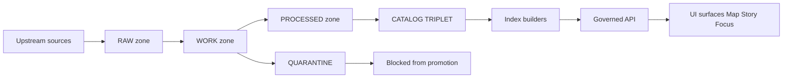

<!-- [KFM_META_BLOCK_V2]
doc_id: kfm://doc/6a5f5d11-7b62-4cb0-9a78-7e7c1d0a90c0
title: data/ — KFM truth-path artifacts and catalogs
type: standard
version: v2
status: draft
owners: KFM Data Stewardship (TBD via CODEOWNERS)
created: 2026-03-03
updated: 2026-03-03
policy_label: public
related:
  - ../policy/
  - ../contracts/
  - ../tools/
  - ../docs/
tags: [kfm, data, governance, promotion-contract, truth-path, trust-membrane]
notes:
  - This README is a governed contract surface for what may live under data/.
  - Every meaningful statement is tagged as [CONFIRMED], [PROPOSED], or [UNKNOWN].
  - last_verified: UNVERIFIED (run the checks in "Repo alignment checks").
[/KFM_META_BLOCK_V2] -->

<a id="top"></a>

# `data/` — KFM truth-path artifacts, catalogs, and promotion contract surface

One-line purpose: **Define and store the governed artifacts that implement KFM’s auditable truth path (Upstream → RAW → WORK/QUARANTINE → PROCESSED → CATALOG/TRIPLET → PUBLISHED).** [CONFIRMED]


> **IMPACT (must-read)** [PROPOSED]  
> - **This directory is a contract surface.** Changes here can affect promotion, publishing eligibility, and evidence resolution. [CONFIRMED]  
> - **Fail-closed posture:** if required artifacts/cross-links are missing, promotion must be blocked. [CONFIRMED]  
> - **Trust membrane reminder:** clients/UI must never read storage directly; only governed APIs may serve promoted versions. [CONFIRMED]

---

## Quick nav
- [Claim tags](#claim-tags)
- [Scope](#scope)
- [Where this fits](#where-this-fits)
- [Truth path diagram](#truth-path-diagram)
- [Directory contract](#directory-contract)
- [Lifecycle zones](#lifecycle-zones)
- [Promotion Contract v1](#promotion-contract-v1)
- [Quickstart](#quickstart)
- [Add or update a dataset](#add-or-update-a-dataset)
- [Exclusions](#exclusions)
- [Task list](#task-list)
- [Repo alignment checks](#repo-alignment-checks)
- [Version history](#version-history)

---

## Claim tags
- **[CONFIRMED]** = required invariant / contract described in current KFM design & governance docs.
- **[PROPOSED]** = recommended repo convention; adopt via PR once verified and enforced in CI.
- **[UNKNOWN]** = repo state not yet verified; see [Repo alignment checks](#repo-alignment-checks).

[(Back to top)](#top)

---

## Scope
- `data/` contains **registry entries, example datasets/fixtures, catalog artifacts, and truth-path zone manifests** used to make governance enforceable. [CONFIRMED]
- `data/` is **not** where UI/clients read from at runtime; published data is served via governed APIs after policy checks. [CONFIRMED]

**Acceptable inputs (what belongs here)** [CONFIRMED/PROPOSED]
- Dataset/source registry entries (YAML/JSON) + schemas + controlled vocab references. [CONFIRMED]
- Zone manifests, checksums, license/terms snapshots, QA reports, and run receipts for dataset versions. [CONFIRMED]
- Catalog triplet outputs (DCAT + STAC + PROV) with deterministic cross-links. [CONFIRMED]
- Small, reviewable fixtures for tests/docs (not production-scale payloads). [PROPOSED]

**Path contract vs physical storage** [PROPOSED]
- Prefer **content-addressed external storage** (object store / OCI artifacts) for large binaries; keep **manifests + digests + catalogs + receipts** in-repo for reviewability. [PROPOSED]
- Any artifact referenced by the catalog triplet must be **digest-verifiable** (sha256) regardless of where bytes live. [CONFIRMED]

[(Back to top)](#top)

---

## Where this fits
KFM is governed by two non-negotiable invariants: **truth path** and **trust membrane**. [CONFIRMED]

- **Truth path lifecycle:** Upstream → RAW → WORK/QUARANTINE → PROCESSED → CATALOG (DCAT+STAC+PROV + run receipts) → projections → governed API → UI. [CONFIRMED]
- **Trust membrane:** clients never access storage/DB directly; backend uses repository interfaces; all access is policy-evaluated at the policy enforcement point (PEP). [CONFIRMED]
- **Canonical vs rebuildable stores:** catalogs + provenance (and canonical artifacts) are the source of truth; indexes/DB/search/tiles are rebuildable projections. [CONFIRMED]

[(Back to top)](#top)

---

## Truth path diagram

```mermaid
flowchart LR
  Upstream[Upstream sources] --> RAW[RAW zone]
  RAW --> WORK[WORK zone]
  WORK --> QUAR[QUARANTINE]
  WORK --> PROCESSED[PROCESSED zone]
  PROCESSED --> CATALOG[CATALOG TRIPLET]
  CATALOG --> INDEXES[Index builders]
  INDEXES --> API[Governed API]
  API --> UI[UI surfaces Map Story Focus]

  QUAR --> STOP[Blocked from promotion]
```

- RAW is append-only; supersede via new acquisition (do not rewrite). [CONFIRMED]
- QUARANTINE is not promotable. [CONFIRMED]
- CATALOG/TRIPLET must cross-link identifiers so EvidenceRefs resolve deterministically. [CONFIRMED]
- PUBLISHED/runtime surfaces must serve only **promoted** versions with validated artifacts + catalogs + receipts + policy labels. [CONFIRMED]

[(Back to top)](#top)

---

## Directory contract
> **WARNING:** This is the **intended contract** for `data/`. If repo reality differs, do not “paper over” it. Migrate in small PRs or update this README to match reality. [PROPOSED]

```text
data/
  README.md                      # This file [PROPOSED]

  registry/                      # Dataset + source registry entries and schemas [CONFIRMED]
    schemas/                     # JSON Schema (or equivalent) for registry entries [CONFIRMED]
    sources/                     # Declarative source/connector definitions (if present) [UNKNOWN]
    datasets/                    # Dataset specs (if separated from sources) [UNKNOWN]

  raw/                           # Immutable acquisition manifests + checksums + terms snapshots [PROPOSED]
  work/                          # Normalization outputs + QA + redaction candidates [PROPOSED]
  quarantine/                    # Failed/unsafe/unclear items; never promoted [PROPOSED]
  processed/                     # Publishable artifacts + checksums (immutable by version) [PROPOSED]

  catalog/                       # Catalog “triplet” outputs [PROPOSED]
    stac/                        # STAC catalogs/collections/items [CONFIRMED]
    dcat/                        # DCAT dataset records (JSON-LD) [PROPOSED]
    prov/                        # PROV bundles (JSON-LD or equivalent) [PROPOSED]

  receipts/                      # Run receipts / audit records (append-only) [PROPOSED]
```

**Minimum contract per subdirectory** [CONFIRMED/PROPOSED]
- `registry/`: schema-validated; code-reviewed; treated as a contract surface. [CONFIRMED]
- `raw/`: acquisition manifest + checksums + upstream license/terms snapshot. [CONFIRMED]
- `work/`: QA outputs + candidate redactions/generalizations + intermediate transforms. [CONFIRMED]
- `quarantine/`: reason for block is recorded (license/sensitivity/validation/instability). [CONFIRMED]
- `processed/`: approved publishable formats + checksums + derived metadata. [CONFIRMED]
- `catalog/`: DCAT + STAC + PROV validate and cross-link; EvidenceRefs resolve without guessing. [CONFIRMED]
- `receipts/`: run receipts capture inputs, tooling versions, hashes, and policy decisions. [CONFIRMED]

[(Back to top)](#top)

---

## Lifecycle zones

| Zone | Rule of thumb | Typical contents | Mutability | Promotion status |
|---|---|---|---|---|
| RAW | “What we got from upstream” [CONFIRMED] | acquisition manifest, raw artifacts/pointers, checksums, terms snapshot [CONFIRMED] | Append-only; supersede via new acquisition [CONFIRMED] | Eligible only after gates [CONFIRMED] |
| WORK | “Make it usable + inspectable” [CONFIRMED] | normalized outputs, QA reports, redaction candidates [CONFIRMED] | Rewrite OK [CONFIRMED] | Eligible only after gates [CONFIRMED] |
| QUARANTINE | “Stop unsafe/unclear items” [CONFIRMED] | failed validation, unclear license, sensitivity issues, upstream instability [CONFIRMED] | Rewrite OK [CONFIRMED] | **Not promotable** [CONFIRMED] |
| PROCESSED | “Publishable artifacts” [CONFIRMED] | approved formats + checksums + derived runtime metadata [CONFIRMED] | Immutable-by-version [PROPOSED] | Eligible after cataloging [CONFIRMED] |
| CATALOG/TRIPLET | “Discovery + lineage” [CONFIRMED] | DCAT + STAC + PROV + run receipts (cross-linked) [CONFIRMED] | Immutable-by-version [PROPOSED] | Required for publication [CONFIRMED] |
| PUBLISHED | “What runtime serves” [CONFIRMED] | governed API/UI surfaces; policy enforced [CONFIRMED] | Governed [CONFIRMED] | Must pass all gates [CONFIRMED] |

[(Back to top)](#top)

---

## Promotion Contract v1
Promotion is the act of moving a dataset version from **RAW/WORK → PROCESSED + CATALOG**, making it eligible for **PUBLISHED** runtime surfaces. [CONFIRMED]

### Minimum gates (fail-closed)
These gates are intentionally framed so they can be automated in CI and reviewed by stewards. [CONFIRMED]

| Gate | Name | Minimum required artifacts/conditions |
|---:|---|---|
| A | Identity & versioning | `dataset_id`, `dataset_version_id`, deterministic `spec_hash`, content digests for artifacts [CONFIRMED] |
| B | Licensing & rights | license/rights metadata + snapshot of upstream terms [CONFIRMED] |
| C | Sensitivity & redaction plan | `policy_label` + obligations (generalize geometry/remove fields/etc.) when needed [CONFIRMED] |
| D | Catalog triplet validation | DCAT/STAC/PROV validate and cross-link; EvidenceRefs resolve without guessing [CONFIRMED] |
| E | QA & thresholds | dataset-specific checks + thresholds documented; failures route to QUARANTINE [CONFIRMED] |
| F | Run receipt & audit record | run receipt captures inputs/tools/hashes/policy decisions; append-only audit record [CONFIRMED] |
| G | Release manifest | promotion recorded in a release manifest referencing artifacts + digests [CONFIRMED] |

> **Deterministic identity note:** stable dataset/version IDs should be compatible with canonical JSON hashing (e.g., RFC 8785 JCS) to make caching/signing/version clarity reliable. [CONFIRMED]

[(Back to top)](#top)

---

## Quickstart
> These commands are safe, repo-agnostic sanity checks. Replace `TODO:` commands once repo wiring is verified. [PROPOSED]

### 1) Inspect the contract surface
```bash
ls -la data/
find data -maxdepth 3 -type d
```

### 2) Spot-check checksums (example)
```bash
# Example: verify a sha256sum file (if present)
# (Adjust path and format to repo reality.)
sha256sum -c data/**/checksums.sha256 2>/dev/null || true
```

### 3) Catalog + registry validation hooks
```bash
# TODO (UNKNOWN): replace with actual repo validators once confirmed.
# Examples of what we expect to exist somewhere in tools/ or CI:
# - registry schema validation
# - STAC validation
# - DCAT validation
# - PROV validation / link checks
echo "TODO: wire catalog + registry validators into a single 'data gate' command"
```

[(Back to top)](#top)

---

## Add or update a dataset
> Prefer small, additive PRs: add new versions rather than rewriting history. [PROPOSED]

1) **Register** [CONFIRMED]  
   - Add/update registry entry under `data/registry/`.  
   - Ensure schema validation passes.

2) **Acquire into RAW (append-only)** [CONFIRMED]  
   - Write acquisition manifest + checksums + terms snapshot.  
   - Do not edit RAW; supersede with a new acquisition.

3) **Transform + QA in WORK (or QUARANTINE)** [CONFIRMED]  
   - Normalize, validate, generate QA reports.  
   - If validation fails, license unclear, or sensitivity concerns exist → QUARANTINE.

4) **Emit PROCESSED artifacts** [CONFIRMED]  
   - Produce approved publishable formats + checksums.

5) **Emit catalog triplet (DCAT + STAC + PROV) + receipts** [CONFIRMED]  
   - Cross-link IDs across all three catalogs and run receipts.

6) **Promote only if gates pass** [CONFIRMED]  
   - CI must fail-closed if any gate is missing.  
   - Only promoted versions may appear in runtime surfaces.

[(Back to top)](#top)

---

## Exclusions
What must not live in `data/`:

- Secrets, private keys, access tokens, credentials. [PROPOSED]
- Anything that bypasses the trust membrane (direct DB/object-store reads from UI examples). [CONFIRMED]
- Quarantined content promoted “by exception” without recorded governance decision. [CONFIRMED]
- Rewrite-in-place “fixes” to RAW that break auditability (rewrite history). [CONFIRMED]
- High-risk sensitive location data without redaction/generalization and governance review. [PROPOSED]

[(Back to top)](#top)

---

## Task list
> **Definition of Done — dataset version is promotion-ready** [CONFIRMED/PROPOSED]

- [ ] Gate A: Identity/versioning present (ids, spec_hash, digests). [CONFIRMED]
- [ ] Gate B: License/rights + upstream terms snapshot recorded. [CONFIRMED]
- [ ] Gate C: Sensitivity classification assigned; redaction obligations defined (if needed). [CONFIRMED]
- [ ] Gate E: QA report exists; thresholds met (else quarantine). [CONFIRMED]
- [ ] PROCESSED artifacts exist; checksums verify. [CONFIRMED]
- [ ] Gate D: DCAT/STAC/PROV validate; cross-links resolve; EvidenceRefs resolve deterministically. [CONFIRMED]
- [ ] Gate F: Run receipt exists; includes tool versions + hashes + policy decisions. [CONFIRMED]
- [ ] Gate G: Release manifest references digests (location TBD). [CONFIRMED/UNKNOWN]
- [ ] CI is green and fail-closed gates are enforced. [PROPOSED]

[(Back to top)](#top)

---

## Repo alignment checks
<details>
<summary><strong>Turn UNKNOWN → CONFIRMED (smallest verification steps)</strong></summary>

1) **Confirm current directory tree** [PROPOSED]  
   - `ls -la data/`  
   - `find data -maxdepth 3 -type d`

2) **Confirm registry schemas + validators exist** [PROPOSED]  
   - Look for `data/registry/schemas/` and CI jobs that validate registry entries.

3) **Confirm catalog folder naming** [PROPOSED]  
   - Verify whether the repo uses `data/catalog/{stac,dcat,prov}` or another split; update this README to match.

4) **Confirm Promotion Contract gates are enforced in CI** [PROPOSED]  
   - Identify workflows/jobs that check: license fields, policy labels, checksums, cross-link integrity, receipts, and (if enabled) attestations.

5) **Confirm release manifest location** [PROPOSED]  
   - Determine where Gate G “release manifest” lives (`releases/` vs `data/` vs `artifacts/`) and document it.

</details>

[(Back to top)](#top)

---

## Version history
| Version | Date (America/Chicago) | Notes |
|---|---:|---|
| v1 | 2026-03-03 | Initial governed scaffold for `data/README.md`. [PROPOSED] |
| v2 | 2026-03-03 | Aligned language to truth path + trust membrane invariants and Promotion Contract v1 gates; added DoD checklist + clarified canonical vs rebuildable posture. [PROPOSED] |
