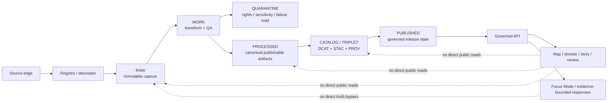

<!-- [KFM_META_BLOCK_V2]
doc_id: kfm://doc/<NEEDS_VERIFICATION_UUID>
title: data/
type: standard
version: v1
status: draft
owners: NEEDS VERIFICATION
created: YYYY-MM-DD
updated: YYYY-MM-DD
policy_label: NEEDS VERIFICATION
related: [../README.md, ./registry/README.md, ./specs/README.md, ./catalog/README.md, ./catalog/stac/README.md]
tags: [kfm, data, truth-path, catalog, provenance]
notes: [Current-session repo metadata was not mounted; owners, dates, policy label, doc_id, and related-path resolution remain NEEDS VERIFICATION. Relative links below are preserved as target-adjacent repo intent, not verified tree facts.]
[/KFM_META_BLOCK_V2] -->

# `data/`

Governed storage and artifact doctrine for KFM source intake, lifecycle transitions, catalog closure, and proof-bearing release artifacts.

> **Status:** experimental  
> **Doc state:** draft  
> **Owners:** NEEDS VERIFICATION  
> **Target path:** `data/README.md` *(requested target path; current-session repo tree not directly verified)*  
> 
> 
> 
> 
> 
>   
> **Quick jump:** [Scope](#scope) · [Repo fit](#repo-fit) · [Accepted inputs](#accepted-inputs) · [Exclusions](#exclusions) · [Directory tree](#directory-tree) · [Quickstart](#quickstart) · [Usage](#usage) · [Diagram](#diagram) · [Tables](#tables) · [Task list](#task-list) · [FAQ](#faq) · [Appendix](#appendix)

> [!IMPORTANT]
> This README is intentionally split between **CONFIRMED doctrine** and **NEEDS VERIFICATION repo shape**. In the current session, the visible workspace evidence was the mounted PDF corpus; a live repository tree, schema inventory, workflow directory, or runtime manifests were **not** directly available here. Treat concrete paths below as either **documented target modules** or **request-derived placeholders** unless you verify them in the actual checkout.

## Scope

`data/` is the KFM storage-and-artifact surface for moving evidence-bearing material through the governed truth path:

`Source edge -> RAW -> WORK / QUARANTINE -> PROCESSED -> CATALOG / TRIPLET -> PUBLISHED`

This directory should therefore be read as a **governed artifact zone**, not a generic dump, scratchpad, or public contract surface.

### What this README is trying to do

It clarifies three things at once:

1. what `data/` is for in KFM doctrine
2. which adjacent surfaces usually belong with it
3. which path claims still need repo verification before they can be treated as live tree fact

### Current evidence posture

| Aspect | Posture | Reading rule |
|---|---|---|
| Truth path, trust membrane, catalog triplet, fail-closed publication | **CONFIRMED** | Safe to state as project doctrine. |
| `data/` as a documented repo surface | **INFERRED from project docs** | Supported by repo-inventory and data-lifecycle docs, but not rechecked from a mounted tree in this session. |
| `data/registry/`, `data/raw/`, `data/work/`, `data/processed/`, `data/catalog/`, `data/receipts/` | **Documented target modules / NEEDS VERIFICATION** | Present in project documentation as intended repo areas or lifecycle zones; current tree presence still needs checkout verification. |
| `data/specs/` | **Request-derived / NEEDS VERIFICATION** | Conceptually supported by source-descriptor and schema-record doctrine, but exact path placement was not directly confirmed in the mounted workspace. |

[Back to top](#data)

## Repo fit

### Path and adjacent surfaces

**Target path:** `data/README.md`

The links below are preserved because they fit the requested doc topology and the project’s documented module logic, but they should still be verified in the live checkout.

| Relationship | Surface | Posture | Why it matters |
|---|---|---|---|
| Upstream | [`../README.md`](../README.md) | NEEDS VERIFICATION | Expected repo-wide doctrine and directory map. |
| Upstream | [`../contracts/`](../contracts/) | Documented target module | Machine-readable contracts, schemas, and controlled vocabularies should stay explicit rather than hiding inside storage zones. |
| Upstream | [`../policy/`](../policy/) | Documented target module | Rights, sensitivity, obligations, and fail-closed rules belong in executable policy, not ad hoc storage conventions. |
| Upstream | [`../docs/`](../docs/) | Documented target module | Runbooks, ADRs, and architecture docs should explain behavior-significant changes to the data surface. |
| Lateral | [`./registry/README.md`](./registry/README.md) | Documented target module / NEEDS VERIFICATION | Dataset and source registration surfaces anchor intake intent and stewardship. |
| Lateral | [`./specs/README.md`](./specs/README.md) | Request-derived / NEEDS VERIFICATION | Spec-driven onboarding is doctrinally supported; exact placement under `data/specs/` is not confirmed here. |
| Lateral | [`./catalog/README.md`](./catalog/README.md) | Documented target module / NEEDS VERIFICATION | Catalog closure is part of release readiness, not a decorative afterthought. |
| Lateral | [`./catalog/stac/README.md`](./catalog/stac/README.md) | Request-derived / NEEDS VERIFICATION | STAC is confirmed as part of the metadata spine; this exact nested README path remains unverified. |
| Downstream | [`../apps/`](../apps/) | Documented target module | Public and role-limited surfaces should consume promoted scope through governed APIs, not through direct storage reads. |
| Downstream | [`../tests/`](../tests/) | Documented target module | Invalid fixtures, catalog validation, policy tests, stale-projection tests, and correction drills should prove the data surface. |
| Downstream | [`../infra/`](../infra/) | Documented target module | Promotion, reconciliation, backup, restore, and runtime rollout logic should preserve the trust membrane. |

### Placement note: `specs/` versus `contracts/`

The March 2026 corpus strongly confirms **source descriptors**, **schema records**, and **contract-family schemas**. It does **not** settle one exact repo rule for whether every spec-like artifact lives under `data/specs/`, `contracts/`, or both.

That means this README keeps `data/specs/` because the requested target file expects it, but treats the exact placement as **NEEDS VERIFICATION** until the live repo tree is inspected.

[Back to top](#data)

## Accepted inputs

The following belong in or immediately around `data/` when the KFM truth path is being honored:

- source descriptors and source-registration intent
- immutable raw captures and acquisition manifests
- ingest receipts and validation reports
- intermediate work products and quarantine artifacts
- canonical processed artifacts with stable IDs and checksums
- catalog closure artifacts across **DCAT + STAC + PROV**
- release-facing manifests, proof packs, and correction-linked evidence
- zone manifests, dataset examples, and other storage-facing artifacts that explain how a governed release came to exist

### Typical artifact families

| Artifact family | Typical role | Best-fit stage |
|---|---|---|
| `source_descriptor` | Intake contract for a source or source family | Registry / intake |
| `ingest_receipt` | What was fetched, when, from where, with which checksums | RAW / intake |
| `validation_report` | Structural, semantic, policy, and QA outcome | Intake / WORK / PROCESSED |
| `dataset_version` | Immutable processed subject set | PROCESSED |
| `catalog_closure` | Linked release-ready metadata boundary | CATALOG |
| `release_manifest` / proof pack | Governed release evidence | Pre-publication / PUBLISHED boundary |
| `correction_notice` | Supersession, withdrawal, or narrowed release scope | Post-publication governance |

> [!NOTE]
> Exact on-disk placement of every artifact family is not fully verified in the current session. What **is** confirmed is the contract logic: KFM expects descriptors, receipts, validation outputs, dataset versions, catalog closure, release evidence, and correction artifacts to remain explicit and inspectable.

[Back to top](#data)

## Exclusions

The following do **not** belong here as sovereign truth or default public access paths:

- direct client, UI, or notebook reads from raw, processed, or canonical storage
- secrets, credentials, tokens, or environment-specific secret material
- policy bundles and obligation registries that should live under `../policy/`
- API contracts and shared schemas that should live under `../contracts/`
- polished summaries, graphs, tiles, vector indexes, caches, or scene layers treated as primary truth
- unreviewed analyst scratch outputs presented as publishable evidence
- rights-unclear or sensitivity-unclear materials promoted without quarantine, redaction, generalization, or steward review

> [!WARNING]
> `data/` is part of the governed evidence path. It is **not** the trust membrane. Storage alone never authorizes exposure.

[Back to top](#data)

## Directory tree

### Doctrine-aligned contract view

The tree below is a **documentation-first target shape**, not a claim that every path already exists in the mounted repo.

```text
data/
├── README.md                        # this document (requested target)
├── registry/                        # documented target module; repo presence needs verification
│   └── README.md
├── specs/                           # request-derived adjacency; path placement needs verification
│   └── README.md
├── raw/                             # documented lifecycle zone; repo presence needs verification
├── work/                            # documented lifecycle zone; repo presence needs verification
│   └── quarantine/
├── processed/                       # documented lifecycle zone; repo presence needs verification
├── catalog/                         # documented target module; repo presence needs verification
│   ├── README.md
│   ├── dcat/                        # conceptual closure surface; exact path unverified
│   ├── stac/                        # conceptual closure surface; exact path unverified
│   │   └── README.md
│   └── prov/                        # conceptual closure surface; exact path unverified
└── receipts/                        # documented target module; repo presence needs verification
```

### Directory intent at a glance

| Surface | Role | What must never happen |
|---|---|---|
| `registry/` | Names sources and datasets before intake becomes operational | Ad hoc onboarding with no declared identity, cadence, or steward |
| `specs/` | Freezes spec-driven behavior when the repo chooses to separate spec surfaces from generic contracts | Hidden spec drift living only in notebooks or prose |
| `raw/` | Immutable upstream capture plus acquisition evidence | In-place mutation or public exposure |
| `work/` | Reproducible transforms, QA, repair, and enrichment | Quiet use as pseudo-production |
| `work/quarantine/` | Governance hold for ambiguity, failure, or sensitivity | “Publish with warning” as the normal path |
| `processed/` | Canonical publishable derivatives and immutable dataset versions | Artifacts that cannot regenerate valid catalog closure |
| `catalog/` | Release-facing metadata closure and discoverability spine | Marking a version complete with broken or partial triplet linkage |
| `receipts/` | Run and release evidence | Consequential publication with no reconstructible trail |

[Back to top](#data)

## Quickstart

Assuming a real checkout is available locally, start by verifying the actual tree before trusting any adjacent path in this README.

```bash
# Verify that the target surface exists
pwd
find data -maxdepth 3 -print 2>/dev/null | sort

# Inspect any storage-facing README files that are actually present
test -f data/README.md && sed -n '1,220p' data/README.md
test -f data/registry/README.md && sed -n '1,200p' data/registry/README.md
test -f data/catalog/README.md && sed -n '1,200p' data/catalog/README.md
test -f data/catalog/stac/README.md && sed -n '1,200p' data/catalog/stac/README.md
test -f data/specs/README.md && sed -n '1,200p' data/specs/README.md

# Audit whether doctrine-shaped lifecycle zones exist in the checkout
find data -maxdepth 2 -type d | sort

# Inspect storage-facing artifacts if present
find data -maxdepth 3 -type f \
  \( -iname '*manifest*' -o -iname '*receipt*' -o -iname '*.json' -o -iname '*.yaml' -o -iname '*.yml' \) \
  2>/dev/null | sort | sed -n '1,120p'
```

### Minimal review pass

```bash
# Check whether raw/work/processed/catalog/receipts are represented at all
for d in raw work processed catalog receipts registry specs; do
  test -d "data/$d" && echo "FOUND data/$d" || echo "MISSING data/$d"
done

# Check whether catalog closure artifacts exist anywhere under data/
find data -type f 2>/dev/null | grep -Ei '/(stac|dcat|prov)/|catalog' || true
```

> [!TIP]
> If the checkout does **not** match the documented target shape, keep the doctrine and downgrade the path claim. Do not quietly reverse the truth standard.

[Back to top](#data)

## Usage

### 1. Register before you fetch

In KFM, source intake is a contract, not a download. If the source cannot be described with enough clarity to be replayed and governed, it is not ready for the truth path.

### 2. Capture raw immutably

`RAW` is where source-native bytes, request context, and rights snapshots remain durable. Convenience cleanup belongs later, not at acquisition time.

### 3. Transform in `WORK`, quarantine when necessary

Normalization, OCR, geometry repair, enrichment, joins, and redaction transforms belong in `WORK`. Unclear rights, unresolved sensitivity, or broken validation push material into `QUARANTINE`, not into `PROCESSED`.

### 4. Treat processed outputs as release candidates, not just files

`PROCESSED` is where immutable, canonical, publishable derivatives should emerge with stable identifiers, validation evidence, and clear lineage back to their run receipts.

### 5. Close the catalog triplet before promotion

A dataset version is not release-ready until **DCAT + STAC + PROV** can cross-link and resolve without guesswork.

### 6. Publish by governed transition

`PUBLISHED` is first a release state, not merely a sibling folder. Promotion binds dataset version, catalog closure, review state, policy posture, and rollback readiness into one inspectable decision.

### 7. Keep derived layers derived

Tiles, search, graph, vector, caches, and summaries may accelerate delivery, but they remain rebuildable projections downstream of release scope.

[Back to top](#data)

## Diagram


```mermaid
flowchart LR
    SRC[Source edge] --> REG[Registry / descriptor]
    REG --> RAW[RAW<br/>immutable capture]
    RAW --> WORK[WORK<br/>transform + QA]
    WORK --> QUAR[QUARANTINE<br/>rights / sensitivity / failure hold]
    WORK --> PROC[PROCESSED<br/>canonical publishable artifacts]
    PROC --> CAT[CATALOG / TRIPLET<br/>DCAT + STAC + PROV]
    CAT --> REL[PUBLISHED<br/>governed release state]
    REL --> API[Governed API]
    API --> UI[Map / dossier / story / review]
    API --> FOCUS[Focus Mode / evidence-bounded responses]

    UI -. no direct public reads .-> RAW
    UI -. no direct public reads .-> PROC
    UI -. no direct public reads .-> CAT
    FOCUS -. no direct truth bypass .-> RAW
```

[Back to top](#data)

## Tables

### Truth-path zone matrix

| Zone / state | Core question | What belongs here | Block if |
|---|---|---|---|
| `RAW` | What exactly arrived? | Source-native payloads, request details, checksums, terms snapshots | Raw bytes are mutated in place or exposed publicly |
| `WORK` | What deterministic transformation is happening? | Repair, normalization, OCR, QA, joins, redaction transforms | Transform logic is irreproducible or undocumented |
| `QUARANTINE` | What is unresolved or unsafe? | Rights ambiguity, sensitivity ambiguity, failed validation, steward review | Ambiguous artifacts are treated as “almost public” |
| `PROCESSED` | What is now canonical and publishable? | Immutable processed artifacts, dataset versions, validation outputs | The artifact cannot support catalog closure |
| `CATALOG / TRIPLET` | Can the release be discovered and explained? | Linked DCAT, STAC, PROV and release-facing metadata | Triplet members are missing, broken, or unresolved |
| `PUBLISHED` | May this scope be exposed? | Governed release scope through API and trust-visible surfaces | Publication is treated as a folder copy instead of a gated transition |

### Promotion-minded checklist

| Gate family | What should be explicit before outward trust widens |
|---|---|
| Identity & versioning | Stable dataset identity, dataset version identity, digests, deterministic naming |
| Rights & license | Source terms, reuse posture, rights class, redistribution constraints |
| Sensitivity & disclosure | Policy label, location-exposure rule, redaction or generalization behavior |
| Catalog closure | Valid DCAT, STAC, and PROV with working cross-links |
| Run / release evidence | Receipts, manifests, validation results, rollback pointer, correction path |
| Runtime trust | Evidence resolution, citation behavior, visible surface state, audit linkage |

### Path-certainty matrix

| Path claim | Status | Safer wording |
|---|---|---|
| `data/` exists as a repo area | INFERRED from project docs | “documented target module; verify in checkout” |
| `data/registry/` exists | INFERRED from project docs | “documented target module; verify in checkout” |
| `data/raw/`, `data/work/`, `data/processed/`, `data/catalog/`, `data/receipts/` all exist | NEEDS VERIFICATION | “documented lifecycle-aligned target shape” |
| `data/specs/` exists | NEEDS VERIFICATION | “request-derived adjacent path; spec placement unverified” |
| `published/` is a sibling folder | NOT SUPPORTED | “published is a governed state first” |

[Back to top](#data)

## Task list

### Definition of done for this README

- [ ] The file distinguishes **CONFIRMED doctrine** from **NEEDS VERIFICATION repo shape**.
- [ ] `data/` is described as a governed truth-path surface, not as a generic bucket.
- [ ] Accepted inputs and exclusions are explicit.
- [ ] The directory tree is labeled as doctrine-aligned target shape rather than silent repo fact.
- [ ] The README warns that storage is not the trust membrane.
- [ ] At least one Mermaid diagram explains real KFM structure.
- [ ] Verification steps tell a maintainer how to confirm or downgrade path claims in a live checkout.

### Review checks before merge

- [ ] Owners, dates, policy label, and `doc_id` are updated from actual repo metadata.
- [ ] Relative links resolve in the real tree or are adjusted.
- [ ] Any mention of `data/specs/` is either verified or re-homed to the actual spec/contract path.
- [ ] Storage paths do not imply direct client or public access.
- [ ] README language does not silently promote target-state structure into current-state fact.
- [ ] The doc stays aligned with KFM terminology: truth path, trust membrane, catalog triplet, evidence, promotion, correction.

[Back to top](#data)

## FAQ

### Is `published` a directory?

Not by doctrine. In KFM, **published** is first a governed release state. A repo may materialize supporting artifacts for that state, but publication is not reducible to “copy files somewhere.”

### Are all directories in the tree above confirmed in the current repo?

No. The tree is a doctrine-aligned contract view. Current-session repo verification was not available here, so path existence still needs local checkout confirmation.

### Why not let the UI read from `data/` directly?

Because storage is not the trust membrane. KFM’s public and role-limited surfaces are supposed to cross governed APIs, policy checks, and evidence resolution before trust is granted.

### Where should schemas live: `data/specs/` or `contracts/`?

The corpus confirms the need for schema records and machine-readable contracts, but not one final path rule for this exact repo in the current session. Use the live tree as the tiebreaker and keep the truth standard explicit.

### Do graph, vector, tile, or cache layers belong under `data/`?

They may exist as derived artifacts or build inputs, but they must remain explicitly downstream of approved release scope and must not become sovereign truth.

[Back to top](#data)

## Appendix

<details>
<summary>Glossary</summary>

| Term | Meaning in this README |
|---|---|
| Truth path | The governed movement from source edge through RAW, WORK / QUARANTINE, PROCESSED, CATALOG / TRIPLET, and into PUBLISHED state. |
| Trust membrane | The rule that clients do not bypass governed API, policy, and evidence resolution to reach storage directly. |
| Catalog triplet | The linked metadata boundary formed by **DCAT + STAC + PROV**. |
| Source descriptor | Intake contract describing access mode, cadence, rights posture, normalization plan, and quality checks. |
| Dataset version | Immutable governed version of a processed subject set. |
| EvidenceRef / EvidenceBundle | Citation primitive and governed resolved evidence payload used to support outward claims. |
| Derived layer | Search, vector, graph, tile, summary, or scene surface built downstream of stronger truth. |
| Correction notice | Evidence-bearing supersession, withdrawal, or narrowing artifact tied to a prior release. |

</details>

<details>
<summary>Starter conventions</summary>

1. Keep raw acquisition append-only.
2. Preserve request parameters, checksums, and rights snapshots with acquisition records.
3. Treat redaction and generalization as governed transforms, not UI tricks.
4. Require catalog closure before outward trust widens.
5. Keep release and correction artifacts as first-class evidence objects.
6. Verify path claims from the live checkout before promoting this README to `published` repo doctrine.

</details>

<details>
<summary>Verification backlog carried by this file</summary>

| Item | Why it matters |
|---|---|
| Actual `data/` tree snapshot | Converts documented target shape into inspectable repo fact |
| Owners / dates / policy label / doc UUID | Lets the metadata block stop carrying placeholders |
| Actual placement of spec-driven artifacts | Resolves `data/specs/` versus `contracts/` ambiguity |
| Any current receipts / manifests / catalog outputs | Grounds examples in live project artifacts instead of doctrine alone |
| Adjacent README presence and names | Prevents broken relative links from drifting into the default docs path |

</details>

<details>
<summary>Related entrypoints</summary>

- [`../README.md`](../README.md)
- [`./registry/README.md`](./registry/README.md)
- [`./specs/README.md`](./specs/README.md)
- [`./catalog/README.md`](./catalog/README.md)
- [`./catalog/stac/README.md`](./catalog/stac/README.md)
- [`../contracts/`](../contracts/)
- [`../policy/`](../policy/)
- [`../docs/`](../docs/)

</details>

[Back to top](#data)
