<div align="center">

# 🗃️ Kansas Frontier Matrix — **Data Architecture & Governance Overview**  
`data/README.md`

**Purpose:** Defines the structure, interoperability, and ethical governance of the Kansas Frontier Matrix data ecosystem.  
Implements a modular, FAIR+CARE-certified, and MCP-DL v6.4.3-compliant framework for spatiotemporal, historical, and environmental datasets.

[](../.github/workflows/stac-validate.yml)
[](../.github/workflows/dcat-export.yml)
[](../LICENSE)
[](../docs/standards/faircare-validation.md)
[](../docs/architecture/repo-focus.md)

</div>

---

## 📚 Overview

The `data/` directory forms the **core of KFM’s reproducible data infrastructure**, providing the foundation for historical, environmental, and AI-driven geospatial analysis.  
It unifies **raw**, **processed**, **catalogued**, and **archived** data under strict governance policies, ensuring that every artifact is verifiable, ethical, and interoperable.

**Objectives:**
- Standardize all datasets using STAC 1.0 and DCAT 3.0 metadata.  
- Enforce FAIR+CARE principles for data ethics and reuse.  
- Maintain provenance through cryptographic verification and immutable audit chains.  
- Enable semantic querying and AI explainability via CIDOC CRM + OWL-Time ontology links.

---

## 🗂️ Directory Layout

```plaintext
data/
├── README.md                        # This file — data architecture overview
│
├── sources/                         # JSON manifests of external datasets and APIs
│   ├── noaa_weather_datasets.json
│   ├── usgs_historic_topo.json
│   └── kansas_archival_maps.json
│
├── raw/                             # Immutable raw data (referenced via DVC or LFS)
│   ├── usgs/
│   ├── fema/
│   ├── noaa/
│   └── kgs/
│
├── work/                            # ETL workspace for processed and temporary outputs
│   ├── tmp/
│   │   ├── climate/
│   │   ├── hazards/
│   │   ├── hydrology/
│   │   └── staging/
│   └── processed/
│       ├── climate/
│       ├── hazards/
│       ├── hydrology/
│       └── treaties/
│
├── stac/                            # SpatioTemporal Asset Catalog (STAC 1.0)
│   ├── catalog.json
│   ├── items/
│   │   ├── climate_2025.json
│   │   ├── hazards_v9.5.0.json
│   │   └── hydrology_2024.json
│   └── collections/
│       ├── hazards_collection.json
│       └── climate_collection.json
│
├── meta/                            # DCAT 3.0 dataset exports for data portals
│   ├── hazards_dcat.jsonld
│   └── climate_dcat.jsonld
│
├── archive/                         # Archived and immutable historical data versions
│   ├── hazards/
│   ├── climate/
│   └── treaties/
│
└── reports/                         # Validation, FAIR+CARE, and provenance audit logs
    ├── audit/
    │   └── data_provenance_ledger.json
    ├── fair/
    │   ├── data_fair_summary.json
    │   └── data_care_assessment.json
    ├── validation/
    │   ├── stac_validation_report.json
    │   └── schema_validation_summary.json
    └── lineage/
        └── data_lineage_tree.json
```

---

## 🧩 Data Lifecycle

```mermaid
flowchart TD
    A["Raw Data Sources"] --> B["ETL Pipeline · Extract, Transform, Load"]
    B --> C["Validation · FAIR+CARE & Schema Compliance"]
    C --> D["Processed Workspace · data/work/processed/"]
    D --> E["STAC & DCAT Registration"]
    E --> F["AI & Focus Mode Integration"]
    F --> G["Governance Ledger & Archival Storage"]
```



Every dataset is tracked from ingestion to governance review, with FAIR+CARE validation and signed checksum lineage maintained via `reports/audit/data_provenance_ledger.json`.

---

## ⚙️ Data Standards & Interoperability

| Standard | Purpose | Implementation |
|-----------|----------|----------------|
| **STAC 1.0** | Geospatial asset catalog | `data/stac/` |
| **DCAT 3.0** | Dataset interoperability for portals | `data/meta/` |
| **GeoJSON / GeoTIFF / NetCDF** | Standard data formats | `data/work/processed/` |
| **ISO 19115 / ISO 19139** | Metadata for geospatial datasets | Embedded in STAC items |
| **CIDOC CRM + OWL-Time** | Semantic ontology for events & time | Graph integration (Neo4j) |
| **FAIR+CARE Framework** | Ethical & reproducible data governance | `docs/standards/faircare-validation.md` |

---

## 🧠 FAIR+CARE Implementation

| Principle | Implementation |
|------------|----------------|
| **Findable** | Indexed in STAC/DCAT and accessible through the Focus Mode AI catalog. |
| **Accessible** | Published under CC-BY or Public Domain; accessible via open APIs. |
| **Interoperable** | Uses GeoJSON, DCAT 3.0, and STAC 1.0 metadata schemas with consistent CRS (EPSG:4326). |
| **Reusable** | Each dataset includes provenance, version, license, and checksum data. |
| **Collective Benefit** | Enables climate, hydrology, and heritage research. |
| **Authority to Control** | Honors community stewardship and indigenous data sovereignty. |
| **Responsibility** | AI governance and CARE audit pipelines ensure ethical use. |
| **Ethics** | Datasets reviewed by the FAIR+CARE Council prior to release. |

---

## 🔍 Provenance & Governance Chain

All datasets in `data/` undergo **cryptographic lineage tracking** and audit verification:

| Artifact | Purpose |
|-----------|----------|
| `reports/audit/data_provenance_ledger.json` | Ledger of dataset origins, transformations, and validations |
| `reports/validation/stac_validation_report.json` | Results of STAC schema validation |
| `reports/fair/data_fair_summary.json` | FAIR+CARE audit summary and compliance score |
| `releases/v9.5.0/manifest.zip` | Comprehensive manifest of checksums and signatures |
| `releases/v9.5.0/sbom.spdx.json` | Software Bill of Materials for dataset generation tools |

Each ledger entry contains:
- Source identifier, license, and ingestion timestamp  
- FAIR+CARE compliance score  
- Validator and maintainer digital signatures  
- SHA-256 hash verification for reproducibility  

---

## 🧾 Data Access & Integration

KFM datasets can be accessed or queried via:

- **REST / GraphQL APIs** (`/api/stac/`, `/api/focus/`, `/api/events/`)  
- **Neo4j Knowledge Graph** — enables semantic search via CIDOC CRM entities  
- **STAC/DCAT Catalog Viewer** in the web frontend (`web/src/layers/`)  
- **AI/ML Pipelines** for hazard prediction and Focus Mode reasoning  

Primary AI data layers:  
`data/work/tmp/hazards/`, `data/work/tmp/climate/`, `data/work/tmp/hydrology/`

---

## 🧱 Validation & Automation Workflows

| Workflow | Description | Output |
|-----------|--------------|--------|
| `stac-validate.yml` | Validates STAC Items/Collections for schema conformance | `reports/validation/stac_validation_report.json` |
| `dcat-export.yml` | Exports DCAT 3.0 JSON-LD feeds from STAC | `data/meta/*.jsonld` |
| `faircare-validate.yml` | Runs FAIR+CARE and ethics audits | `reports/fair/data_fair_summary.json` |
| `governance-ledger.yml` | Appends provenance records to ledger | `reports/audit/data_provenance_ledger.json` |

Each workflow runs automatically upon dataset submission (`data_submission.yml`) or update.

---

## 🧩 Ethical Data Review Process

All data submissions must pass the **FAIR+CARE Council Review**, following this sequence:

1. FAIR+CARE compliance test (workflow validation).  
2. Governance board sign-off (`governance_review.yml` issue form).  
3. STAC/DCAT metadata linkage and validation.  
4. Provenance ledger entry and checksum confirmation.  
5. Telemetry update in `releases/v9.5.0/focus-telemetry.json`.

> Each approved dataset becomes part of the immutable governance chain and visible through Focus Mode dashboards.

---

## 🧾 Version History

| Version | Date | Author | Summary |
|----------|------|---------|----------|
| v9.5.0 | 2025-10-30 | @kfm-data-lab | Upgraded to MCP-DL v6.4.3; added DCAT 3.0 exports and expanded governance ledger automation. |
| v9.3.2 | 2025-10-28 | @kfm-data-lab | Comprehensive data architecture documentation with FAIR+CARE and STAC integration. |
| v9.3.1 | 2025-10-27 | @bartytime4life | Added provenance and audit documentation standards. |
| v9.3.0 | 2025-10-26 | @kfm-architecture | Established modular data directory and automated validation workflows. |

---

<div align="center">

**Kansas Frontier Matrix** · *FAIR+CARE Data Governance × Provenance Integrity × Open Science*  
[🔗 Repository](https://github.com/bartytime4life/Kansas-Frontier-Matrix) • [🧭 Docs Portal](../docs/) • [⚖️ Governance Ledger](../docs/standards/governance/)

</div>
