# 📦 `data/` — Kansas Frontier Matrix Data & Metadata Hub 🧭🗺️

<p align="left">
  
  
  
  
  
  
  
  
  
</p>

> **Last reviewed:** 2026-01-06  
> ✅ **Purpose:** `data/` is the canonical home for **raw inputs**, **intermediate work**, **processed outputs**, and the **metadata boundary artifacts** (STAC/DCAT/PROV) that make KFM traceable, governed, and shippable.  
> ⚠️ **Rule:** If it isn’t **cataloged + provenance‑linked**, it isn’t **published** in KFM.  
> 🧠 **Data Spaces mindset:** KFM treats metadata + identifiers + provenance as the *interface*; big binaries can live elsewhere as long as pointers are stable and auditable.  

**⬅️ Back to repo overview:** [`../README.md`](../README.md)  
**🤝 Collaboration & automation:** [`../.github/README.md`](../.github/README.md) *(if present)*  
**🧭 MCP governance layer:** [`../mcp/MCP-README.md`](../mcp/MCP-README.md) *(recommended)*  

---

## 🧭 Quick Nav
- [🏁 5‑minute publish checklist](#-5minute-publish-checklist)
- [🧠 KFM pipeline snapshot](#-kfm-pipeline-snapshot)
- [🚦 Non‑negotiables](#-nonnegotiables)
- [✅ What “published” means in KFM](#-what-published-means-in-kfm)
- [🗂️ Directory layout](#️-directory-layout)
- [🔁 Data lifecycle](#-data-lifecycle)
- [🏷️ Metadata boundary artifacts](#️-metadata-boundary-artifacts)
- [📐 Formats & performance rules](#-formats--performance-rules)
- [🧾 Evidence artifacts (AI + analysis outputs)](#-evidence-artifacts-ai--analysis-outputs)
- [🧷 Stable IDs + naming + hashing](#-stable-ids--naming--hashing)
- [🧪 Validation & CI gates](#-validation--ci-gates)
- [➕ Adding a new dataset / domain](#-adding-a-new-dataset--domain)
- [🛠️ Toolchain](#️-toolchain)
- [📚 Project file influence map](#-project-file-influence-map-uses-all-project-files)
- [🧷 Footnotes](#-footnotes)

---

## 🏁 5‑minute publish checklist

> [!IMPORTANT]
> **Publishing** = **processed output + boundary artifacts + validation**.  
> Raw files alone are *never* “published” in KFM.

### ✅ Minimum bar (per dataset)
- [ ] Place sources under `data/raw/<domain>/…` *(stay close to original; preserve reprocessing baseline)*
- [ ] Generate intermediates under `data/work/<domain>/…` *(temporary joins, clipped AOIs, staging rasters)*
- [ ] Produce publishable outputs under `data/processed/<domain>/…`
- [ ] Write boundary artifacts:
  - [ ] **STAC Collection** → `data/stac/collections/<collection-id>.json`
  - [ ] **STAC Item(s)** → `data/stac/items/<item-id>.json`
  - [ ] **DCAT Dataset (JSON‑LD)** → `data/catalog/dcat/<dataset-id>.jsonld`
  - [ ] **PROV bundle (JSON‑LD)** → `data/prov/<run-id>.jsonld`
- [ ] Record hashes (SHA256) for processed outputs *(and raw when feasible)*
- [ ] Add QA evidence to `data/qa/<domain>/…` *(bbox sanity, quicklook screenshot, validation report)*
- [ ] Run validators (local or CI) and confirm all links + schemas pass

### 🥇 Optional “quality tiers” (useful for expectations)
| Tier | What it means | Required |
|---|---|---|
| 🥉 Bronze | Raw + minimal metadata | Raw preserved + classification + source/terms |
| 🥈 Silver | Publishable output + STAC | Processed output + STAC + QA note |
| 🥇 Gold | Fully governed + discoverable | STAC + DCAT + PROV + strong QA + hashes |

---

## 🧠 KFM pipeline snapshot

KFM enforces strict ordering from **data → catalogs → graph → API → UI → narrative**, ensuring end‑to‑end traceability.

```mermaid
flowchart LR
  subgraph Data["📦 Data & Metadata"]
    A["Raw Sources"] --> B["ETL + Normalization"]
    B --> C["STAC Items + Collections"]
    C --> D["DCAT Dataset Views"]
    C --> E["PROV Lineage Bundles"]
  end

  C --> G["🕸️ Graph (references back to catalogs)"]
  G --> H["🛰️ API Layer (contracts + auth + redaction)"]
  H --> I["🗺️ Map UI — React · MapLibre · (optional) WebGL/3D"]
  I --> J["📚 Story Nodes (governed narratives)"]
  J --> K["🎯 Focus Mode (provenance-linked context bundle)"]
```



---

## 🚦 Non‑negotiables

- ⛓️ **Pipeline ordering is absolute:** `ETL → Catalogs (STAC/DCAT/PROV) → Graph → API → UI → Story → Focus`.  
- 🚪 **API boundary rule:** UI never queries internal stores/graph directly; all access goes through governed API endpoints.
- 🔁 **Deterministic + idempotent ETL:** config-driven, repeatable runs with stable IDs, run logs, and hashes.
- 🧾 **Evidence-first narrative:** Story/F​ocus must cite evidence; AI outputs must be labeled + provenance-linked.
- 🏷️ **Sovereignty & classification propagation:** outputs cannot become *less restricted* than any input without an approved redaction step.
- 🔒 **Treat inputs as hostile:** GeoJSON, CSV, PDFs, rasters, and “metadata from the internet” can be attack surfaces—validate and bound.

> [!TIP]
> **FAIR** makes data *findable/accessible/interoperable/reusable*.  
> **CARE** keeps it *ethical and accountable*.  
> **Sovereignty** ensures the right people control sensitive data.

---

## ✅ What “published” means in KFM

KFM uses explicit **stages** and **contracts** (so we don’t ship “mystery layers”).

### 🧊 Stages (data state)
- **Raw** (`data/raw/**`) → source snapshot; minimally transformed; reprocessing baseline.
- **Work** (`data/work/**`) → intermediate artifacts; not stable; may be deleted/regenerated.
- **Processed** (`data/processed/**`) → final outputs meant to be served/used downstream.
- **Published** ✅ → processed outputs that have:
  - STAC/DCAT/PROV boundary artifacts **and**
  - passing validations/CI gates **and**
  - classification/handling rules applied.

### 🧾 Boundary artifacts (metadata state)
- **STAC** = asset-level + spatial/temporal indexing
- **DCAT** = dataset/distribution discovery entry
- **PROV** = lineage graph: inputs → activities → outputs

> [!WARNING]
> If you ship a file without a STAC/DCAT/PROV trail, you ship an **orphan**. Orphans do not go to prod.

---

## 🗂️ Directory layout

> KFM’s **canonical layout** keeps both humans and automation sane.

```text
data/
  raw/                         # 1) Raw, minimally transformed inputs (per domain)
    <domain>/

  work/                        # 2) Intermediate artifacts produced during ETL (per domain)
    <domain>/

  processed/                   # 3) Final, publishable outputs (per domain)
    <domain>/

  stac/                        # ✅ Required: STAC catalog artifacts
    catalog.json               # ⭐ Recommended: root STAC catalog entrypoint
    collections/               # STAC Collections (dataset-level)
    items/                     # STAC Items (asset-level)

  catalog/
    dcat/                      # ✅ Required: DCAT JSON-LD dataset entries

  prov/                        # ✅ Required: PROV lineage bundles (inputs → activities → outputs)

  manifests/                   # ⭐ Recommended: dataset manifests, dictionaries, contracts
  qa/                          # ⭐ Recommended: validation reports + “looks-right” evidence

  graph/                       # ⭐ Optional: graph import/export artifacts (reference index only)
    csv/
    cypher/

  README.md                    # 📍 you are here
```

> [!NOTE]
> Some teams prefer `data/<domain>/{raw,work,processed}`. That’s fine—just keep the same intent and keep catalogs/prov discoverable.

---

## 🔁 Data lifecycle

KFM supports **batch** and **event-driven** pipelines (depending on source scale and cadence).

### 1) Ingestion 📥
- Batch pulls (scheduled) for known sources.
- Manual uploads (expert CSVs/surveys) into staging with controlled import.
- Preserve raw inputs as a reprocessing anchor.

### 2) Processing 🧰
Cleaning, joins, georeferencing, derived layers, modeling, simulation outputs.

- Prefer “compute close to data” when appropriate (e.g., PostGIS spatial SQL + indices).
- Use distributed patterns when spatiotemporal archives grow (chunking, partitions, caching).
- Keep transforms explicit and repeatable (scripts/configs captured by PROV).

### 3) Storage & indexing 🗄️
Processed outputs live in:
- Queryable stores (PostGIS tables + spatial indices)
- Web-friendly geospatial files (COG/GeoJSON/tiles) optimized for streaming
- Evidence artifacts for modeling/simulation (plots, summaries, uncertainty notes)

### 4) Publication / serving 🌐
- UI consumes **governed API outputs** (authZ + redaction + classification propagation).
- “New data available” signals can trigger graph refresh and UI indexing.

---

## 🏷️ Metadata boundary artifacts

> [!IMPORTANT]
> Boundary artifacts are the **interfaces** downstream layers consume.  
> Graph/API/UI/story must reference **catalog IDs**, not ad-hoc local paths.

### ✅ Required metadata outputs
- **STAC (Collections + Items)** for geospatial assets (vectors, rasters, tiles, and related artifacts).
- **DCAT dataset entry (JSON‑LD)** for discovery: title/description/license/keywords/distributions.
- **PROV lineage bundle** capturing inputs → activities → outputs with configs/params and run identifiers.

### 🔗 Cross-layer linkage expectations (do not break)
- STAC Items must link to stable assets (usually under `data/processed/**`).
- DCAT must link to distributions (STAC collection and/or direct downloads).
- PROV must link raw → work → processed and record run/config identifiers.
- Graph stores references to catalog IDs (avoid storing bulky payloads in the graph).

### 🔐 Classification propagation (always-on)
- Carry classification/handling labels through STAC, DCAT, and PROV.
- Outputs cannot be published at a lower restriction than any input without a documented redaction step.

> [!CAUTION]
> Public repo = public download. Treat “easy to copy” formats (GeoJSON/CSV) as disclosure boundaries.

---

## 📐 Formats & performance rules

KFM is map-first and time-aware. Formats must support streaming, indexing, and honest representation.

### 🗺️ Vector
| Use case | Recommended format | Why |
|---|---|---|
| Small inspectable overlays | GeoJSON | debuggable; works everywhere |
| Medium/large boundaries | TopoJSON | smaller wire size |
| Dense/large features | Vector tiles (PMTiles/MBTiles) | pan/zoom performance |
| Authority edits / storage | PostGIS | constraints + indices + query power |

**Vector must-haves ✅**
- stable feature IDs (`kfm_id` or equivalent)
- geometry validity checks + CRS explicit
- simplification/topology preserved for UI layers

### 🛰️ Raster
| Use case | Recommended format | Why |
|---|---|---|
| Web streaming | **COG** (Cloud Optimized GeoTIFF) | range requests; pyramids |
| Quicklook | PNG/JPEG (small) | QA + previews |
| Time-series stacks | chunked/partitioned storage | scalability + partial reads |

**Raster must-haves ✅**
- overviews/pyramids (when needed)
- nodata defined, units documented
- QA “looks-right” screenshot at known zoom + bbox

### 📦 Big data posture (keep git healthy)
- Git stores **metadata + small samples + QA**, not the entire state of the world.
- Heavy assets can live in object storage or release artifacts as long as:
  - STAC/DCAT pointers are stable,
  - hashes exist,
  - licensing allows distribution.

---

## 🧾 Evidence artifacts (AI + analysis outputs)

KFM treats **analysis outputs** (including AI-assisted artifacts and simulations) as first-class datasets:

✅ Requirements:
- Stored in `data/processed/<domain>/...` (or `data/processed/evidence/...` if cross-domain)
- Cataloged in STAC/DCAT and flagged as derived (`kfm:derived=true`)
- Traced in PROV with:
  - input dataset IDs,
  - model/version + parameters,
  - uncertainty/limits where applicable,
  - classification propagation rationale
- Served only via governed APIs (redaction + role checks)

> [!TIP]
> If AI participates: label **AI-assisted**, store prompt/config when allowed, and record model version + constraints in PROV.

---

## 🧷 Stable IDs + naming + hashing

Stable IDs make the system queryable, debuggable, and safe to automate.

### ✅ ID patterns (recommended)
- **Dataset/Collection ID:** `kfm.ks.<domain>.<dataset>`
- **Item ID:** `kfm.ks.<domain>.<dataset>.<yyyymmdd|yyyymm>.<variant>.v<major>`
- **Run ID:** `etl_<yyyymmdd>_<hhmmss>_<shortgitsha>` *(or similar)*

### 📛 File naming (processed outputs)
Use names that support routing and reproducibility:
- `<domain>__<dataset>__<yyyymmdd|yyyymm>__<epsg>__<resolution>__v<major.minor>.<ext>`
- Example: `agriculture__ndvi__20250301__epsg4326__30m__v1.0.tif`

### 🔒 Hashing rule
Record **SHA256** for:
- processed outputs (required)
- raw inputs (recommended when feasible)
- ETL configs / parameter snapshots (recommended)

Where to store hashes:
- STAC `assets` (via `file:checksum` or a KFM profile field)
- PROV `Entity` records
- `data/manifests/**` (audit-friendly index)

---

## 🧪 Validation & CI gates

KFM expects automated validation and governance checks to prevent regressions and sensitive leaks.

### ✅ Typical gates
- STAC/DCAT/PROV schema validation
- Link checks:
  - STAC assets exist
  - DCAT distributions resolve
  - PROV locations present and coherent
- Classification-consistency checks (no downgrades without redaction approval)
- Secret scanning + sensitive data scanning
- “Looks-right” QA checks for map layers (bbox, zoom, quicklook)

### 🧰 Starter local checks (example)
```bash
# 1) JSON sanity
find data/stac data/catalog/dcat data/prov -name "*.json*" -print0 | xargs -0 -n 1 jq empty

# 2) Broken links (STAC assets exist)
python tools/validate_stac_links.py data/stac/items

# 3) Provenance completeness (raw→work→processed)
python tools/validate_prov.py data/prov

# 4) Governance scan (example placeholder)
python tools/scan_sensitive.py data/processed
```

> ⭐ Keep CI fast: run heavy geospatial validations nightly when needed.

---

## ➕ Adding a new dataset / domain

Follow the domain expansion pattern and keep domains isolated.

### ✅ Checklist
- [ ] Create folders:
  - [ ] `data/raw/<new-domain>/`
  - [ ] `data/work/<new-domain>/`
  - [ ] `data/processed/<new-domain>/`
- [ ] Add ETL config (idempotent, logged, hashable)
- [ ] Produce boundary artifacts:
  - [ ] STAC Collection + Item(s)
  - [ ] DCAT JSON‑LD entry
  - [ ] PROV run bundle
- [ ] Validate schemas + links in CI
- [ ] (Optional) Sync references into graph (after catalogs exist)
- [ ] Expose via governed API (redaction/classification)
- [ ] Add a domain runbook under docs (recommended)

<details>
<summary><strong>🧱 Dataset skeleton (copy/paste)</strong></summary>

```text
data/raw/<domain>/<source>/
data/work/<domain>/<dataset>/
data/processed/<domain>/<dataset>/

data/stac/collections/kfm.ks.<domain>.<dataset>.json
data/stac/items/kfm.ks.<domain>.<dataset>.<yyyymmdd>.<variant>.v1.json

data/catalog/dcat/kfm.ks.<domain>.<dataset>.jsonld
data/prov/etl_<yyyymmdd>_<hhmmss>_<shortgitsha>.jsonld

data/qa/<domain>/<dataset>__<yyyymmdd>__qa.md
data/manifests/kfm.ks.<domain>.<dataset>.yml   # optional, recommended
```
</details>

---

## 🛠️ Toolchain

KFM’s data layer interoperates across geospatial + ML + simulation + web delivery:

- 🐍 **Python geospatial stack:** geopandas / rasterio / pyproj + PostGIS adapters
- 🐘 **PostgreSQL + PostGIS:** spatial SQL + indices for scalable queries
- 🧰 **GDAL/OGR CLI:** `gdalwarp`, `gdal_translate`, `ogr2ogr` (repeatable transforms)
- 🧩 **Orchestration:** scheduled runs + event-driven jobs (queues/workers)
- 🌐 **Serving:** governed API returns GeoJSON/tiles/evidence bundles to UI
- 🗺️ **Visualization constraints:** web mapping is performance-bound; optimize early

---

## 📚 Project file influence map (uses all project files)

> ✅ This README is informed by the full KFM reference pack.  
> The table below maps **every project file** to a concrete data-layer requirement or convention.

<details>
<summary><strong>📦 Expand: Influence map (all project files)</strong></summary>

| Project file | How it shapes `data/` (policy, formats, metadata, QA) |
|---|---|
| `Kansas Frontier Matrix (KFM) – Comprehensive Engineering Design.docx` | Defines the canonical pipeline order, “published means cataloged,” evidence bundles, and API boundary posture |
| `Latest Ideas.docx` | Drives pragmatic staging: prototype in `work/`, graduate into `processed/` with catalogs + QA when it becomes real |
| `Data Spaces.pdf` | Metadata-as-interface mindset: pointer-over-payload, stable IDs, and “trust signals” (provenance, checksums, distributions) |
| `Scalable Data Management for Future Hardware.pdf` | Informs big-data posture: partitioning, streaming-friendly formats, caching, and keeping git lean while preserving auditability |
| `PostgreSQL Notes for Professionals - PostgreSQLNotesForProfessionals.pdf` | Guides PostGIS usage for spatial indexing, schema discipline, and operational patterns (migrations/backups/roles) |
| `python-geospatial-analysis-cookbook.pdf` | Anchors CRS sanity, vector/raster IO discipline, and transform-at-boundaries conventions |
| `Cloud-Based Remote Sensing with Google Earth Engine-Fundamentals and Applications.pdf` | Shapes remote sensing pipelines: time-series outputs, export tracking, and derived raster governance (NDVI/composites) |
| `making-maps-a-visual-guide-to-map-design-for-gis.pdf` | Treats symbology/legends as truth claims; requires QA quicklooks and non-misleading map outputs |
| `Mobile Mapping_ Space, Cartography and the Digital - 9789048535217.pdf` | Adds mobile/offline considerations: tile bundles, reduced payloads, and location sensitivity awareness |
| `responsive-web-design-with-html5-and-css3.pdf` | Reinforces performance constraints that influence data packaging (tiles over blobs, previews, and payload budgets) |
| `webgl-programming-guide-interactive-3d-graphics-programming-with-webgl.pdf` | Motivates GPU-friendly formats/tiling and careful handling of large visual datasets; “graceful degradation” impacts what we store/ship |
| `compressed-image-file-formats-jpeg-png-gif-xbm-bmp.pdf` | Governs image/quicklook optimization and avoiding repo bloat for QA assets |
| `ethical-hacking-and-countermeasures-secure-network-infrastructures.pdf` | Threat-models the data pipeline: hostile inputs, safe ops, least privilege, and disclosure boundaries |
| `Gray Hat Python - Python Programming for Hackers and Reverse Engineers (2009).pdf` | Adds adversarial mindset: parsing risks, file validation, and “treat inputs as hostile” as a default |
| `concurrent-real-time-and-distributed-programming-in-java-threads-rtsj-and-rmi.pdf` | Informs event-driven + worker pipeline discipline: bounded work, timeouts, backpressure, and deterministic job outputs |
| `Introduction to Digital Humanism.pdf` | Defines human-centered governance: transparency, accountability, privacy, and resisting “automation theater” |
| `Principles of Biological Autonomy - book_9780262381833.pdf` | Systems thinking: feedback loops, closure, and keeping humans in control of what becomes “truth” |
| `On the path to AI Law’s prophecies and the conceptual foundations of the machine learning age.pdf` | Adds auditability expectations for AI-derived artifacts: labeling, provenance, and governance-friendly documentation |
| `Understanding Statistics & Experimental Design.pdf` | Requires experimental rigor and explicit assumptions for published analysis outputs; informs QA expectations |
| `graphical-data-analysis-with-r.pdf` | Promotes “look first” EDA and honest visual diagnostics; supports QA artifact expectations |
| `regression-analysis-with-python.pdf` | Drives regression artifact discipline: diagnostics, assumptions, and reproducible baselines as governed evidence |
| `Regression analysis using Python - slides-linear-regression.pdf` | Standardizes lightweight baseline workflows and minimal outputs for quick, reproducible checks |
| `think-bayes-bayesian-statistics-in-python.pdf` | Requires uncertainty-forward reporting and provenance of priors/posteriors for Bayesian evidence artifacts |
| `Scientific Modeling and Simulation_ A Comprehensive NASA-Grade Guide.pdf` | Simulation governance: V&V status, sensitivity analysis, and run manifests captured in PROV |
| `Generalized Topology Optimization for Structural Design.pdf` | Optimization outputs as data: objective/constraints, parameter sweeps, and artifact traceability |
| `Spectral Geometry of Graphs.pdf` | Graph analytics caution: interpretability and avoiding opaque metrics; reinforces “graph references catalogs” (don’t hide truth in graph math) |
| `Deep Learning for Coders with fastai and PyTorch - Deep.Learning.for.Coders.with.fastai.and.PyTorchpdf` | ML outputs as governed data: model cards, artifacts, reproducibility, and separating training evidence from serving |
| `A programming Books.pdf` | Broad toolchain literacy supporting data tooling choices and scripting discipline |
| `B-C programming Books.pdf` | Broad toolchain literacy (B–C) |
| `D-E programming Books.pdf` | Broad toolchain literacy (D–E) |
| `F-H programming Books.pdf` | Broad toolchain literacy (F–H) |
| `I-L programming Books.pdf` | Broad toolchain literacy (I–L) |
| `M-N programming Books.pdf` | Broad toolchain literacy (M–N) |
| `O-R programming Books.pdf` | Broad toolchain literacy (O–R) |
| `S-T programming Books.pdf` | Broad toolchain literacy (S–T) |
| `U-X programming Books.pdf` | Broad toolchain literacy (U–X) |

</details>

---

## 🧷 Footnotes

- This README’s “published means cataloged” and strict pipeline ordering are rooted in KFM’s system design and governance posture (see KFM engineering design + MCP docs).
- The “metadata boundary artifacts” standard aligns with the project’s STAC/DCAT/PROV-first discipline and the “data spaces” interoperability mindset.
- The security posture (treat inputs as hostile) is intentionally conservative because geospatial pipelines frequently process complex, parser-heavy formats.