# 📦 `data/` — Kansas Frontier Matrix Data & Metadata Hub 🧭🗺️


> **Last updated:** 2026-01-06  
> ✅ **Purpose:** `data/` is the canonical home for **raw inputs**, **intermediate work**, **published/processed outputs**, and the **metadata boundary artifacts** (STAC/DCAT/PROV) that make KFM traceable, governed, and shippable. [^staging]  
> ⚠️ **Rule:** If it isn’t **cataloged + provenance-linked**, it isn’t **published** in KFM. [^provenance-first]

**⬅️ Back to repo overview:** [`../README.md`](../README.md)  
**🤝 Collaboration & automation:** [`../.github/README.md`](../.github/README.md) *(if present)*  
**📘 Master pipeline guide:** `docs/MASTER_GUIDE_v13.md` *(recommended if present)*

---

## 🧭 Quick Nav
- [🏁 5‑minute publish checklist](#-5minute-publish-checklist)
- [🧠 KFM pipeline snapshot](#-kfm-pipeline-snapshot)
- [🚦 Non‑negotiables](#-nonnegotiables)
- [✅ What “published” means in KFM](#-what-published-means-in-kfm)
- [🗂️ Directory layout](#️-directory-layout)
- [🔁 Data lifecycle](#-data-lifecycle)
- [🏷️ Metadata boundary artifacts](#️-metadata-boundary-artifacts)
- [🧰 KFM profiles, schemas, and contracts](#-kfm-profiles-schemas-and-contracts)
- [🧩 Minimal artifact templates](#-minimal-artifact-templates)
- [🧾 Evidence artifacts (AI + analysis outputs)](#-evidence-artifacts-ai--analysis-outputs)
- [🧬 Versioning & releases](#-versioning--releases)
- [🧷 Stable IDs + hashing](#-stable-ids--hashing)
- [📐 Conventions](#-conventions)
- [🧪 Validation & CI gates](#-validation--ci-gates)
- [➕ Adding a new dataset / domain](#-adding-a-new-dataset--domain)
- [🛠️ Toolchain](#️-toolchain)
- [📚 Reference library](#-reference-library)
- [🧷 Footnotes](#-footnotes)

---

## 🏁 5‑minute publish checklist

> [!IMPORTANT]
> **Publishing** = **processed output + boundary artifacts + validation**.  
> Raw files alone are *never* “published” in KFM.

**Minimum bar (per dataset):**
- [ ] Place sources under `data/raw/<domain>/…` (keep as close to original as practical)
- [ ] Produce outputs under `data/processed/<domain>/…`
- [ ] Write boundary artifacts:
  - [ ] **STAC Collection** → `data/stac/collections/<collection-id>.json`
  - [ ] **STAC Item(s)** → `data/stac/items/<item-id>.json`
  - [ ] **DCAT Dataset (JSON‑LD)** → `data/catalog/dcat/<dataset-id>.jsonld`
  - [ ] **PROV bundle (JSON‑LD)** → `data/prov/<run-id>.jsonld`
- [ ] Add hashes (SHA256) for outputs (+ ideally for raw inputs)
- [ ] Add evidence/QA artifacts (screenshot / bbox / zoom / validation report) to `data/qa/…`
- [ ] Run CI validators locally (or via PR) and ensure everything passes

---

## 🧠 KFM pipeline snapshot
KFM enforces a strict ordering from **data → catalogs → graph → API → UI → narrative**, ensuring traceability end‑to‑end. [^pipeline-diagram]

```mermaid
flowchart LR
  subgraph Data
    A["Raw Sources"] --> B["ETL + Normalization"]
    B --> C["STAC Items + Collections"]
    C --> D["DCAT Dataset Views"]
    C --> E["PROV Lineage Bundles"]
  end

  C --> G["Graph (references back to catalogs)"]
  G --> H["API Layer (contracts + redaction)"]
  H --> I["Map UI — React · MapLibre · (optional) Cesium"]
  I --> J["Story Nodes (governed narratives)"]
  J --> K["Focus Mode (provenance-linked context bundle)"]
```



---

## 🚦 Non‑negotiables
These invariants keep the platform consistent and governed:

- **Pipeline ordering is absolute:** `ETL → Catalogs (STAC/DCAT/PROV) → Graph → API → UI → Story Nodes → Focus Mode`. [^pipeline-order]
- **API boundary rule:** UI never queries the graph directly; all access goes through the governed API layer (enforces access control + redaction). [^api-boundary]
- **Deterministic, idempotent ETL:** config-driven, repeatable runs with stable IDs/hashes and logging for reproducibility. [^deterministic-etl]
- **Evidence-first narrative:** Story Nodes / Focus Mode must cite evidence; AI outputs must be labeled and provenance-linked. [^evidence-first]
- **Sovereignty & classification propagation:** outputs cannot be **less restricted** than inputs without approved redaction/handling. [^sovereignty]

> [!TIP]
> **FAIR** makes data *findable/accessible/interoperable/reusable*.  
> **CARE** ensures *collective benefit, authority to control, responsibility, and ethics*.  
> **Sovereignty** ensures the right people control sensitive data.

---

## ✅ What “published” means in KFM
KFM uses **stages** and **contracts**. This avoids “mystery layers” and makes audits possible.

### 🧊 Stages (data state)
- **Raw** (`data/raw/**`) → source truth snapshot; minimally transformed; reprocessing baseline.
- **Work** (`data/work/**`) → intermediate artifacts (joins, temporary rasters, staging tables).
- **Processed** (`data/processed/**`) → final, publishable outputs (COGs, GeoJSON, tiles, reports).
- **Published** ✅ → processed outputs that have:
  - STAC/DCAT/PROV boundary artifacts **and**
  - passing validations/CI gates **and**
  - classification/handling rules applied.

### 🧾 Boundary artifacts (metadata state)
- **STAC** = asset-level + spatial/temporal indexing
- **DCAT** = dataset/distribution discovery entry
- **PROV** = lineage graph: inputs → activities → outputs

> [!WARNING]
> If you ship a file without a STAC/DCAT/PROV trail, you ship an **orphan**. Orphans don’t go to prod.

---

## 🗂️ Directory layout
KFM’s required staging and boundary artifacts (plus recommended helper dirs):

```text
data/
  raw/                         # 1) Raw, minimally transformed inputs (per domain)
    <domain>/
      ...

  work/                        # 2) Intermediate artifacts produced during ETL (per domain)
    <domain>/
      ...

  processed/                   # 3) Final, publishable outputs (per domain)
    <domain>/
      ...

  stac/                        # ✅ Required: STAC catalog artifacts
    catalog.json               # ⭐ Recommended: root STAC catalog entrypoint
    collections/               # STAC Collections (dataset-level)
    items/                     # STAC Items (asset-level)

  catalog/
    dcat/                      # ✅ Required: DCAT JSON-LD dataset entries

  prov/                        # ✅ Required: PROV lineage bundles (inputs → activities → outputs)

  manifests/                   # ⭐ Recommended: dataset manifests, schemas, dictionaries, QA contracts
  qa/                          # ⭐ Recommended: validation reports (schema checks, link checks, QA metrics)

  graph/                       # ⭐ Optional: graph import/export artifacts (CSV/Cypher), if needed
    csv/
    cypher/

  README.md                    # 📍 you are here
```

> [!NOTE]
> Some repos prefer a domain‑scoped layout (`data/<domain>/{raw,work,processed}`).
> If we ever migrate to that, this README becomes the compatibility map. [^staging]

---

## 🔁 Data lifecycle
KFM’s pipeline can be **batch** or **streaming** depending on the source. [^kfm-pipeline-overview]

### 1) Ingestion
- Scheduled batch ingest (cron/Airflow/GitHub Actions schedules). [^kfm-ingestion]
- Streaming ingest (MQTT/HTTP endpoints) with fast validation + timestamping. [^kfm-ingestion]
- Manual uploads (expert CSVs/surveys) into a staging area with controlled import. [^kfm-ingestion]
- **Raw-first principle:** preserve raw inputs to allow reprocessing. [^raw-first]

### 2) Processing
Cleaning, joining, deriving metrics, OCR, georeferencing, modeling, simulation.
- Prefer “compute close to data” when appropriate (e.g., PostGIS spatial SQL). [^postgis-processing]
- Support scale-out processing (Dask/Spark) for huge spatiotemporal archives. [^postgis-processing]
- CLI glue is allowed and often best (GDAL/OGR, raster2pgsql, etc.). [^postgis-processing]

### 3) Storage & indexing
Processed outputs live in:
- **Queryable stores** (PostGIS tables + spatial indices)
- **Geospatial files** (COG/GeoJSON/tiles) optimized for web streaming. [^storage]

### 4) Publication / serving
- UI requests go through the **API**, which enforces classification/redaction and returns governed outputs. [^serve-frontend]
- Event-driven workflows can publish “new data available” signals for downstream stages. [^event-driven]

---

## 🏷️ Metadata boundary artifacts

> [!IMPORTANT]
> Boundary artifacts are the “interfaces” that downstream stages consume.
> Graph/API/UI/story work must reference **catalog IDs**, not ad-hoc local paths. [^boundary-artifacts]

### ✅ Required metadata outputs
- **STAC (Collections + Items)** for geospatial assets (and consistent collection records even for some non-spatial datasets). [^stac-dcat-prov]
- **DCAT dataset entry (JSON‑LD)** for discovery: title/description/license/keywords/distributions. [^stac-dcat-prov]
- **PROV lineage bundle** capturing inputs → activities → outputs with configs/params and run identifiers. [^prov-end-to-end]

### 🔗 Cross-layer linkage expectations (don’t break these)
- STAC Items must link to stable assets (usually under `data/processed/**`). [^stac-links]
- DCAT should link to STAC and/or direct downloads. [^dcat-links]
- PROV must link raw → work → processed and record run/config identifiers. [^prov-end-to-end]
- Graph stores references to catalog IDs (not bulky data payloads). [^graph-references]

### 🔐 Classification propagation (always-on)
- Carry classification/handling labels through **STAC**, **DCAT**, and **PROV**.
- Outputs cannot be published at a *lower restriction* than any input unless a documented redaction step exists. [^sovereignty]

> [!CAUTION]
> Public repo = public downloads. Treat **GeoJSON** and other “easy-to-copy” formats as disclosure boundaries. [^geojson-privacy]

---

## 🧰 KFM profiles, schemas, and contracts

> [!TIP]
> If you need custom fields, extend **KFM profiles** (don’t invent one-off metadata keys).  
> Keep project-specific keys namespaced (e.g., `kfm:*`) and validate in CI.

**Recommended docs (repo‑local standards):**
- `docs/standards/KFM_STAC_PROFILE.md` 🗺️
- `docs/standards/KFM_DCAT_PROFILE.md` 🏷️
- `docs/standards/KFM_PROV_PROFILE.md` 🧬
- `docs/governance/SOVEREIGNTY.md` 🔐

**Recommended schema locations:**
- `schemas/stac/**`
- `schemas/dcat/**`
- `schemas/prov/**`

---

## 🧩 Minimal artifact templates
Use these as starter scaffolds. Keep them small, validate in CI, and extend via KFM profiles.

> [!NOTE]
> IDs below use a consistent, Kansas‑scoped naming pattern:
> - **Dataset/Collection ID:** `kfm.ks.<domain>.<dataset>`  
> - **Item ID:** `kfm.ks.<domain>.<dataset>.<yyyymmdd>.<variant>.v<major>`  
> You can still use hyphens if your tooling prefers, but keep the pattern stable. [^stable-ids]

<details>
<summary><strong>🗺️ STAC Collection</strong> — <code>data/stac/collections/&lt;collection-id&gt;.json</code></summary>

```json
{
  "type": "Collection",
  "stac_version": "1.0.0",
  "id": "kfm.ks.agriculture.ndvi",
  "title": "KFM Kansas — Agriculture NDVI",
  "description": "NDVI composites derived from satellite imagery for Kansas agriculture monitoring.",
  "license": "proprietary",
  "extent": {
    "spatial": { "bbox": [[-102.05, 36.99, -94.59, 40.00]] },
    "temporal": { "interval": [["2020-01-01T00:00:00Z", null]] }
  },
  "keywords": ["KFM", "Kansas", "agriculture", "NDVI"],
  "providers": [
    { "name": "Kansas Frontier Matrix", "roles": ["producer"] }
  ],
  "links": [
    { "rel": "root", "href": "../catalog.json", "type": "application/json" }
  ],
  "kfm:classification": "public",
  "kfm:quality_tier": "silver"
}
```
</details>

<details>
<summary><strong>🛰️ STAC Item</strong> — <code>data/stac/items/&lt;item-id&gt;.json</code></summary>

```json
{
  "type": "Feature",
  "stac_version": "1.0.0",
  "id": "kfm.ks.agriculture.ndvi.20250301.composite.v1",
  "collection": "kfm.ks.agriculture.ndvi",
  "geometry": null,
  "bbox": null,
  "properties": {
    "datetime": "2025-03-01T00:00:00Z",
    "proj:epsg": 4326
  },
  "assets": {
    "cog": {
      "href": "../../processed/agriculture/agriculture__ndvi__20250301__epsg4326__30m__v1.0.tif",
      "type": "image/tiff; application=geotiff; profile=cloud-optimized",
      "roles": ["data"],
      "file:checksum": "sha256:<sha256>"
    },
    "qa": {
      "href": "../../qa/agriculture/agriculture__ndvi__20250301__qa.md",
      "type": "text/markdown",
      "roles": ["metadata"]
    }
  },
  "links": [
    { "rel": "collection", "href": "../collections/kfm.ks.agriculture.ndvi.json", "type": "application/json" }
  ],
  "kfm:classification": "public",
  "kfm:derived": true
}
```
</details>

<details>
<summary><strong>🏷️ DCAT Dataset (JSON‑LD)</strong> — <code>data/catalog/dcat/&lt;dataset-id&gt;.jsonld</code></summary>

```json
{
  "@context": {
    "dcat": "http://www.w3.org/ns/dcat#",
    "dct": "http://purl.org/dc/terms/",
    "foaf": "http://xmlns.com/foaf/0.1/"
  },
  "@type": "dcat:Dataset",
  "dct:identifier": "kfm.ks.agriculture.ndvi",
  "dct:title": "KFM Kansas — Agriculture NDVI",
  "dct:description": "NDVI composites derived for KFM agriculture monitoring.",
  "dct:license": "proprietary",
  "dcat:keyword": ["KFM", "Kansas", "NDVI", "agriculture"],
  "dcat:distribution": [
    {
      "@type": "dcat:Distribution",
      "dct:title": "STAC Collection",
      "dcat:accessURL": "data/stac/collections/kfm.ks.agriculture.ndvi.json"
    },
    {
      "@type": "dcat:Distribution",
      "dct:title": "COG (latest)",
      "dcat:accessURL": "data/processed/agriculture/agriculture__ndvi__latest__epsg4326__30m__v1.0.tif"
    }
  ],
  "kfm:classification": "public"
}
```
</details>

<details>
<summary><strong>🧬 PROV Bundle (JSON‑LD)</strong> — <code>data/prov/&lt;run-id&gt;.jsonld</code></summary>

```json
{
  "@context": {
    "prov": "http://www.w3.org/ns/prov#",
    "xsd": "http://www.w3.org/2001/XMLSchema#"
  },
  "@graph": [
    {
      "@id": "prov:activity/etl_20250301_010203_a1b2c3d",
      "@type": "prov:Activity",
      "prov:label": "NDVI ETL run",
      "prov:startedAtTime": { "@value": "2025-03-01T01:02:03Z", "@type": "xsd:dateTime" },
      "prov:endedAtTime": { "@value": "2025-03-01T01:15:00Z", "@type": "xsd:dateTime" },
      "prov:used": [{ "@id": "prov:entity/raw_landsat_scene_20250301" }],
      "prov:generated": [{ "@id": "prov:entity/processed_ndvi_20250301" }],
      "prov:wasAssociatedWith": [{ "@id": "prov:agent/kfm_pipeline" }]
    },
    {
      "@id": "prov:entity/raw_landsat_scene_20250301",
      "@type": "prov:Entity",
      "prov:label": "Raw Landsat input",
      "prov:location": "data/raw/agriculture/landsat/2025/03/01/...",
      "kfm:classification": "public"
    },
    {
      "@id": "prov:entity/processed_ndvi_20250301",
      "@type": "prov:Entity",
      "prov:label": "Processed NDVI COG",
      "prov:location": "data/processed/agriculture/agriculture__ndvi__20250301__epsg4326__30m__v1.0.tif",
      "kfm:hash_sha256": "<sha256>",
      "kfm:classification": "public"
    },
    {
      "@id": "prov:agent/kfm_pipeline",
      "@type": "prov:Agent",
      "prov:label": "KFM pipeline runner",
      "kfm:git_sha": "<shortsha>",
      "kfm:container_image": "<image-digest>"
    }
  ]
}
```
</details>

<details>
<summary><strong>📄 Optional: Dataset Manifest (KFM)</strong> — <code>data/manifests/&lt;dataset-id&gt;.yml</code></summary>

> ⭐ Recommended: treat this manifest as the *human-friendly anchor* that can generate STAC/DCAT/PROV.

```yaml
id: kfm.ks.agriculture.ndvi
title: "KFM Kansas — Agriculture NDVI"
domain: agriculture
classification: public
license: proprietary
keywords: ["KFM", "Kansas", "agriculture", "NDVI"]

sources:
  - label: "Landsat collection X"
    ref: "USGS:<id or url>"
    accessed: "2026-01-06"

coverage:
  bbox: [-102.05, 36.99, -94.59, 40.00]
  crs: "EPSG:4326"
  time_range: { start: "2020-01-01", end: null }

outputs:
  - path: "data/processed/agriculture/agriculture__ndvi__20250301__epsg4326__30m__v1.0.tif"
    sha256: "<sha256>"
    type: "cog"

artifacts:
  stac_collection: "data/stac/collections/kfm.ks.agriculture.ndvi.json"
  stac_items_glob: "data/stac/items/kfm.ks.agriculture.ndvi.*.json"
  dcat_dataset: "data/catalog/dcat/kfm.ks.agriculture.ndvi.jsonld"
  prov_runs_glob: "data/prov/etl_*.jsonld"

qa:
  - "data/qa/agriculture/agriculture__ndvi__20250301__qa.md"
```
</details>

---

## 🧾 Evidence artifacts (AI + analysis outputs)

KFM treats **analysis outputs** (including AI-generated artifacts and simulations) as first-class datasets that must be stored + cataloged + provenance-linked. [^evidence-artifacts]

Evidence artifacts must be:
- Stored in `data/processed/...` (domain or project subfolder). [^evidence-artifacts]
- Cataloged in STAC/DCAT and labeled as derived/AI-assisted as needed. [^evidence-artifacts]
- Traced in PROV with inputs, method/model, parameters, and confidence/uncertainty where applicable. [^evidence-artifacts]
- Exposed only via governed APIs (enforcing classification and redaction). [^evidence-artifacts]

> [!TIP]
> If AI participates: label the artifact **AI-assisted / AI-generated**, store prompt/config (as allowed), and record model/version + constraints in PROV.

---

## 🧬 Versioning & releases
KFM is versioned at both dataset and system levels. [^versioning]

- **Dataset versioning:** link revisions using DCAT + PROV (e.g., `prov:wasRevisionOf`). Prefer persistent identifiers (DOI/ARK) for externally published versions. [^versioning]
- **API versioning:** breaking changes require versioned endpoints or a documented deprecation strategy. [^versioning]
- **Release versioning:** repo releases follow semver; major bumps reflect structural changes (including metadata schema changes). [^versioning]

> [!NOTE]
> Consider a `releases/` or GitHub Releases strategy for distributing **large datasets**:
> ship **metadata + checksums** in git; ship heavy binaries via release assets or object storage.

---

## 🧷 Stable IDs + hashing
Stable IDs make the pipeline deterministic and linkable. [^stable-ids]

### ✅ Recommended ID rules
- **Dataset/Collection ID:** `kfm.ks.<domain>.<dataset>`
- **Item ID:** `kfm.ks.<domain>.<dataset>.<yyyymmdd or yyyymm>.<variant>.v<major>`
- **Run ID:** `etl_<yyyymmdd>_<hhmmss>_<shortgitsha>`

### 🔒 Hashing rules
Record **SHA256** for:
- raw inputs (when feasible)
- processed outputs
- configs (ETL config snapshot)

Store hashes in:
- STAC assets (via a profile field or extension)
- PROV entities
- `data/manifests/**` (audit-friendly index)

> 🧠 Determinism tip: if an output changes, it *must* be explainable via changed inputs, config, code revision, or environment.

---

## 📐 Conventions

### 🧾 File naming
Use names that support reproducibility and routing:
- `"<domain>__<dataset>__<yyyymmdd or yyyymm>__<crs>__<resolution>__v<major.minor>.<ext>"`
- Example: `agriculture__ndvi__20250301__epsg4326__30m__v1.0.tif`

### 🌍 CRS & units
- Store CRS explicitly in geospatial files and metadata.
- Document unit conversions in PROV/configs (especially for time-series and model features).

### 🗺️ Web-serving friendly assets
- Raster: prefer **COG**; precompute overviews where appropriate.
- Vector: simplify where needed; consider tiles for heavy layers.
- Never commit sensitive data in easy-to-exfiltrate formats without governance review. [^geojson-privacy]

### 🐘 Databases (when relevant)
PostGIS enables spatial storage + analysis close to data (buffers, within, distance, joins). [^postgis-intro]

---

## 🧪 Validation & CI gates
KFM expects automated validation and governance checks to prevent regressions and sensitive leaks. [^ci-gates]

### ✅ Typical gates
- Schema validation for STAC/DCAT/PROV outputs.
- Link checks (STAC assets exist, DCAT distributions resolve, PROV locations present).
- Classification-consistency checks (no “downgrades” without an approved redaction step). [^sovereignty]
- Secret scanning + sensitive data scanning.
- API contract tests (OpenAPI/GraphQL) if the dataset is served.

### 🧰 Practical “starter” checks (example)
```bash
# 1) JSON sanity
find data/stac data/catalog/dcat data/prov -name "*.json*" -print0 | xargs -0 -n 1 jq empty

# 2) Broken links (STAC assets exist)
python tools/validate_stac_links.py data/stac/items

# 3) Provenance completeness (raw→work→processed)
python tools/validate_prov.py data/prov

# 4) No accidental leaks (placeholder example)
python tools/scan_sensitive.py data/processed
```

> ⭐ Keep CI fast: treat heavy geospatial QA (huge rasters) as nightly unless critical.

---

## ➕ Adding a new dataset / domain
Follow the domain expansion pattern and keep domains isolated. [^domain-expansion]

### ✅ Checklist
- [ ] Create domain folders:
  - [ ] `data/raw/<new-domain>/`
  - [ ] `data/work/<new-domain>/`
  - [ ] `data/processed/<new-domain>/`  [^staging]
- [ ] Add/confirm ETL pipeline config (idempotent, logged, hashable). [^deterministic-etl]
- [ ] Produce boundary artifacts:
  - [ ] STAC Collection + Item(s) → `data/stac/...` [^stac-dcat-prov]
  - [ ] DCAT entry → `data/catalog/dcat/...` [^stac-dcat-prov]
  - [ ] PROV lineage → `data/prov/...` [^prov-end-to-end]
- [ ] Validate schemas + links in CI (no broken references). [^ci-gates]
- [ ] (If needed) Load references into graph **after** catalogs exist; don’t duplicate raw payloads in graph. [^graph-references]
- [ ] Expose via governed API (redaction/classification). [^api-boundary]
- [ ] Create/Update domain runbook: `docs/data/<new-domain>/README.md`. [^domain-expansion]

<details>
<summary><strong>🧱 Dataset skeleton (copy/paste)</strong></summary>

```text
data/raw/<domain>/<source>/
data/work/<domain>/<dataset>/
data/processed/<domain>/<dataset>/

data/stac/collections/kfm.ks.<domain>.<dataset>.json
data/stac/items/kfm.ks.<domain>.<dataset>.<yyyymmdd>.<variant>.v1.json

data/catalog/dcat/kfm.ks.<domain>.<dataset>.jsonld
data/prov/etl_<yyyymmdd>_<hhmmss>_<shortgitsha>.jsonld

data/qa/<domain>/<dataset>__<yyyymmdd>__qa.md
data/manifests/kfm.ks.<domain>.<dataset>.yml   # optional, recommended
```
</details>

---

## 🛠️ Toolchain
KFM’s data layer interoperates across geospatial + ML + simulation + web delivery:

- 🐍 **Python geospatial stack:** geopandas/rasterio/pyproj + PostGIS integrations
- 🐘 **PostgreSQL + PostGIS:** spatial SQL for analysis and query performance [^postgis-intro]
- 🧰 **GDAL/OGR CLI:** `gdalwarp`, `gdal_translate`, `ogr2ogr`, etc.
- 🧩 **Workflow orchestration:** cron/Airflow/GitHub Actions scheduling for batch + dependency graphs
- 🌐 **Serving layer:** governed API returns JSON/tiles/layers to the map UI [^serve-frontend]
- 🗺️ **Frontend visualization:** React + MapLibre, with optional Cesium for 3D views [^pipeline-diagram]

---

## 📚 Reference library
> 📌 Repo convention (recommended): store reference PDFs under `/docs/library/` (use **Git LFS** if needed).  
> Internal KFM specs should live under `/docs/specs/` and `/docs/standards/`.

For the full reading map, see the root README: [`../README.md`](../README.md) ✅

---

## 🧷 Footnotes
[^pipeline-diagram]: Diagram of the KFM pipeline including Map UI stack and Focus Mode linkage (KFM architecture spec).
[^staging]: Required staging + catalog output locations: `data/raw/<domain>` → `data/work/<domain>` → `data/processed/<domain>`, plus STAC/DCAT/PROV outputs in canonical folders.
[^pipeline-order]: “Pipeline ordering is absolute” invariant statement (KFM policy).
[^api-boundary]: API boundary rule (UI must not query the graph directly; governed API enforces controls/redaction).
[^provenance-first]: Provenance-first publishing requirement (STAC/DCAT + PROV before graph/UI/story usage).
[^deterministic-etl]: Deterministic, idempotent, config-driven ETL with fully logged runs + hashes/stable IDs.
[^evidence-first]: Evidence-first narrative rule + AI labeling and provenance/confidence requirements.
[^sovereignty]: Sovereignty/classification propagation (no derivative less restricted than inputs; UI safeguards).
[^boundary-artifacts]: Boundary artifacts required before publication (STAC/DCAT/PROV as interfaces to downstream stages).
[^evidence-artifacts]: Evidence artifact handling requirements (store, catalog, PROV trace, governed API exposure).
[^stac-dcat-prov]: STAC/DCAT/PROV alignment policy (required metadata records + profile validation).
[^stac-links]: STAC Items must point to stable data assets (often `data/processed/**`) and include attribution/license.
[^dcat-links]: DCAT entries should link to STAC/distributions for discovery and access.
[^prov-end-to-end]: PROV must link raw → work → processed and identify pipeline run/config identifiers.
[^graph-references]: Graph should reference catalog IDs rather than storing bulky payloads; graph models relationships.
[^versioning]: Dataset/API/release versioning expectations (incl. `prov:wasRevisionOf` and semantic versioning).
[^stable-ids]: Stable dataset/item/run ID rules + hash requirements to ensure determinism and linkability.
[^kfm-pipeline-overview]: KFM pipeline stages overview (Ingestion → Processing → Storage → Publication/Serving) and batch/streaming framing.
[^kfm-ingestion]: Ingestion modes: scheduled batch, streaming ingest, manual uploads.
[^raw-first]: “Store raw data reliably first” principle (keep raw as baseline for reprocessing).
[^event-driven]: Event-driven approach with queues/topics for async processing and resilience (e.g., new imagery triggers).
[^serve-frontend]: High-level flow: ingest → process → store/index → serve via API to frontend.
[^postgis-processing]: Processing options including PostGIS queries, distributed processing, shell tooling, and orchestration.
[^storage]: Storage outcomes include relational tables with indices and geospatial stores; tile pyramids are used for efficient raster serving.
[^postgis-intro]: PostGIS enables complex spatial analysis functions for vectors and rasters; used for answering spatial questions efficiently.
[^geojson-privacy]: Public GeoJSON in public repos is downloadable; treat as a disclosure boundary.
[^ci-gates]: CI validation expectations including schema validation, link checks, and security/governance scans (secrets, sensitive data, classification consistency).
[^domain-expansion]: Domain expansion pattern: raw/work/processed per domain, publish to catalogs, and maintain a domain README under `docs/data/<domain>/`.