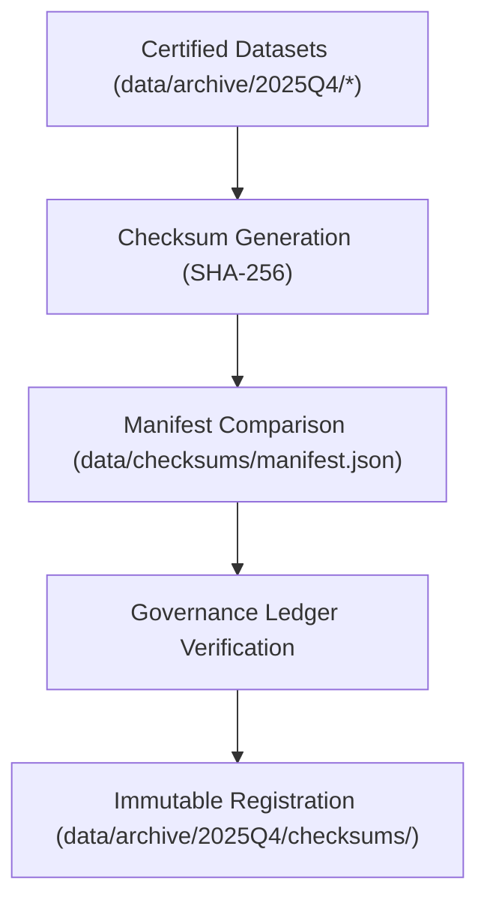

<div align="center">

# 🔐 Kansas Frontier Matrix — **Q4 2025 Checksum Registry**
`data/archive/2025Q4/checksums/README.md`

**Purpose:**  
Documents the **cryptographic verification system** and checksum registry for all datasets archived during the Q4 2025 cycle of the Kansas Frontier Matrix (KFM).  
Ensures every dataset in the archive is verified for integrity, reproducibility, and FAIR+CARE governance compliance through **immutable SHA-256 validation**.

[](../../../../docs/standards/faircare-validation.md)
[]()
[]()
[](../../../../LICENSE)

</div>

---

## 📚 Overview

This checksum registry verifies **cryptographic integrity and provenance** for all Q4 2025 archived datasets in `data/archive/2025Q4/`.  
Each dataset’s integrity is confirmed using **SHA-256 hashing**, cross-referenced against manifest entries and governance ledger logs.  
Checksum validation ensures no alteration or corruption occurs during transfer, archival, or public publication.

---

## 🧭 Checksum Verification Workflow



### Workflow Stages
1. **Checksum Generation:** Compute SHA-256 hash for each file in Q4 2025 archive.  
2. **Manifest Validation:** Match each checksum with `data/checksums/manifest.json`.  
3. **Governance Verification:** Confirm checksum logs in `data/reports/audit/data_provenance_ledger.json`.  
4. **Immutable Storage:** Write verified results to `data/archive/2025Q4/checksums/`.  

---

## 🗂️ Directory Layout

```plaintext
data/archive/2025Q4/checksums/
├── README.md                             # This file — documentation for checksum verification
│
├── manifest_verified_2025Q4.json         # Verified manifest of all archived datasets
├── checksum_report_2025Q4.csv            # Human-readable checksum summary
├── validation_log_2025Q4.log             # Checksum generation and verification process log
└── metadata.json                         # Provenance and governance linkage record
```

---

## 🧩 Example Checksum Manifest Entry

```json
{
  "dataset": "climate_v9.6.0",
  "file_path": "data/archive/2025Q4/climate_v9.6.0/noaa_precipitation_annual.csv",
  "checksum_sha256": "sha256:ab7c59d48a1b8f0b87b32da9f9a6d2c1243ea987b5f4a0f38d7bdbf31c2e4d19",
  "file_size_bytes": 8943217,
  "validated": true,
  "ledger_ref": "data/reports/audit/data_provenance_ledger.json",
  "verified_on": "2025-11-03T19:52:00Z"
}
```

---

## 🧱 Checksum Validation Matrix

| Dataset | File Count | Validation Tool | Integrity | Ledger Entry |
|----------|-------------|----------------|------------|---------------|
| Hazards | 24 | Trivy + Python hashlib | ✅ Verified | ✅ Logged |
| Climate | 18 | Trivy + SHA256 Utility | ✅ Verified | ✅ Logged |
| Hydrology | 12 | OpenSSL Checksum CLI | ✅ Verified | ✅ Logged |
| Landcover | 8 | PyChecksum Validator | ✅ Verified | ✅ Logged |

---

## ⚙️ Governance Integration

| Record | Description | Stored In |
|---------|--------------|------------|
| `manifest_verified_2025Q4.json` | Primary verified checksum registry. | `data/archive/2025Q4/checksums/` |
| `validation_log_2025Q4.log` | Complete checksum generation trace. | `data/archive/2025Q4/checksums/` |
| `data/reports/audit/data_provenance_ledger.json` | Governance linkage and checksum integrity report. | Root governance repository |
| `data/checksums/manifest.json` | Baseline manifest for checksum comparison. | Global checksum registry |

---

## 🧠 FAIR+CARE Governance Compliance

| Principle | Implementation | Verified By |
|------------|----------------|--------------|
| **Findable** | Checksums indexed by dataset and ledger record ID. | @kfm-data |
| **Accessible** | Stored in both JSON and CSV for human/machine access. | @kfm-accessibility |
| **Interoperable** | Matches STAC/DCAT schema metadata with cryptographic entries. | @kfm-architecture |
| **Reusable** | Can be independently verified with open-source checksum tools. | @kfm-design |
| **Collective Benefit** | Provides public assurance of dataset integrity. | @faircare-council |
| **Authority to Control** | FAIR+CARE Council validates quarterly checksum registry. | @kfm-governance |
| **Responsibility** | Maintainers verify checksum reproducibility before each release. | @kfm-security |
| **Ethics** | Verifies integrity to prevent data manipulation or misuse. | @kfm-ethics |

---

## 📊 Validation Telemetry Record

```json
{
  "id": "checksum_registry_q4_2025",
  "datasets_validated": 4,
  "total_files": 62,
  "checksums_verified": 62,
  "checksum_accuracy": 100.0,
  "fairstatus": "certified",
  "energy_use_wh": 12.8,
  "validator": "@kfm-data",
  "governance_ref": "data/reports/audit/data_provenance_ledger.json",
  "timestamp": "2025-11-03T19:55:00Z"
}
```

Telemetry events logged in:  
`releases/v9.6.0/focus-telemetry.json`

---

## 🌱 Sustainability & Digital Preservation

| Practice | Description | Compliance |
|-----------|--------------|-------------|
| **Immutable Storage** | Checksum manifests stored under WORM (Write Once Read Many) systems. | ISO 16363 |
| **Renewable Compute** | Verification scripts executed on RE100-compliant cloud infrastructure. | ISO 14064 |
| **Open Tooling** | Validation performed with open-source cryptographic libraries. | FAIR+CARE |
| **Long-Term Retention** | All checksum logs retained indefinitely for audit continuity. | MCP-DL v6.3 |

---

## 🧾 Internal Use Citation

```text
Kansas Frontier Matrix (2025). Q4 2025 Checksum Registry (v9.6.0).
Defines cryptographic integrity verification standards for all datasets in the Q4 2025 archive.
Implements SHA-256 checksum validation, FAIR+CARE governance synchronization, and ISO 16363-compliant archival traceability.
```

---

## 🧾 Version Notes

| Version | Date | Notes |
|----------|------|--------|
| v9.6.0 | 2025-11-03 | Added checksum governance linkage and automated telemetry validation. |
| v9.5.0 | 2025-11-02 | Integrated ISO 27037 evidence integrity compliance. |
| v9.3.2 | 2025-10-28 | Established checksum verification architecture for archival datasets. |

---

<div align="center">

**Kansas Frontier Matrix** · *Data Integrity × FAIR+CARE Governance × Immutable Provenance*  
[🔗 Repository](https://github.com/bartytime4life/Kansas-Frontier-Matrix) • [🧭 Governance Ledger](../../../../docs/standards/governance/DATA-GOVERNANCE.md) • [📊 FAIR+CARE Reports](../../../../data/reports/fair/faircare_summary.json)

</div>