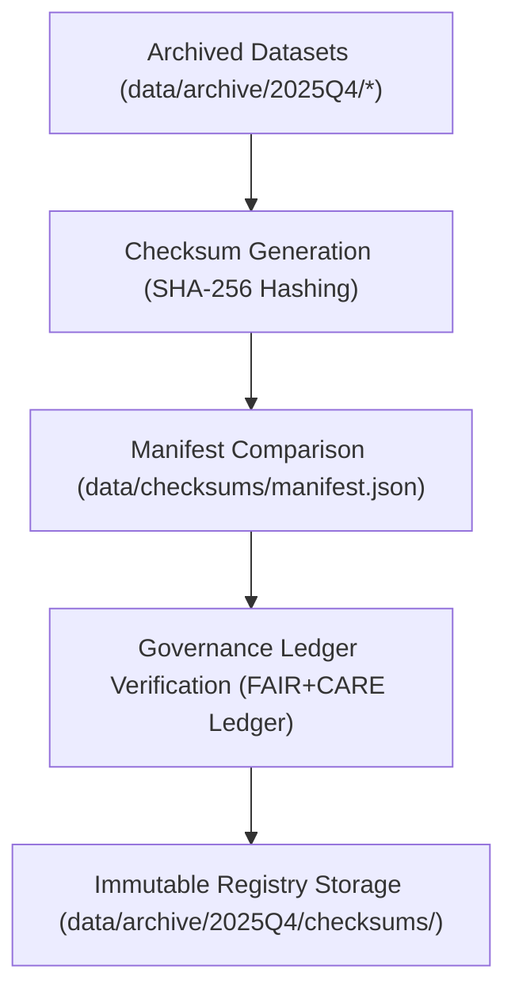

<div align="center">

# 🔐 Kansas Frontier Matrix — **Q4 2025 Checksum Registry**
`data/archive/2025Q4/checksums/README.md`

**Purpose:**  
Define the **cryptographic integrity registry** and validation process for all datasets archived during the **Q4 2025 release** of the Kansas Frontier Matrix (KFM).  
Guarantee data reproducibility, transparency, and FAIR+CARE-aligned ethical assurance through **immutable SHA-256 verification** and governance-ledger synchronization.

[](../../../../docs/README.md)
[](../../../../LICENSE)
[](../../../../docs/standards/faircare-validation.md)
[]()
[]()

</div>

---

## 📘 Overview

The **Checksum Registry** ensures **data authenticity and long-term reproducibility** across all Q4 2025 archived datasets under FAIR+CARE governance.  
Every file’s integrity is verified with **SHA-256** checksums that are cross-referenced with **global manifests**, **telemetry metrics**, and **blockchain-linked provenance ledgers**.

### Goals
- Prevent corruption or alteration during archival and public release.  
- Maintain full traceability between artifacts, manifests, and ledgers.  
- Enable independent checksum validation by users via open standards.  

---

## 🧭 Verification Workflow



### Steps
1. **Checksum Generation:** Compute hashes for all Q4 2025 datasets and logs.  
2. **Manifest Comparison:** Validate consistency with `data/checksums/manifest.json`.  
3. **Governance Verification:** Match hashes with entries in `data/reports/audit/data_provenance_ledger.json`.  
4. **Archival Registration:** Store verified results as immutable, signed JSON under `data/archive/2025Q4/checksums/`.

---

## 🗂️ Directory Layout

```plaintext
data/archive/2025Q4/checksums/
├── README.md                     # This file — checksum registry documentation
├── manifest_verified_2025Q4.json # Verified manifest of archived datasets (Q4 2025)
├── checksum_report_2025Q4.csv    # Human-readable checksum registry
├── validation_log_2025Q4.log     # Process log (hash generation & verification)
└── metadata.json                 # Governance and provenance linkage metadata
```

---

## 🧩 Example Manifest Entry

```json
{
  "dataset": "climate_v10.0.0",
  "file_path": "data/archive/2025Q4/climate_v10.0.0/noaa_precipitation_annual.csv",
  "checksum_sha256": "sha256:ab7c59d48a1b8f0b87b32da9f9a6d2c1243ea987b5f4a0f38d7bdbf31c2e4d19",
  "file_size_bytes": 8943217,
  "validated": true,
  "ledger_ref": "data/reports/audit/data_provenance_ledger.json",
  "verified_on": "2025-11-10T19:52:00Z"
}
```

---

## 🧱 Validation Summary Matrix

| Dataset | Files | Validation Tool | Integrity | Ledger Synced |
|---|---:|---|---|---|
| Hazards | 24 | Python hashlib / Trivy | ✅ Verified | ✅ |
| Climate | 18 | OpenSSL CLI / SHA-256 | ✅ Verified | ✅ |
| Hydrology | 12 | PyChecksum Validator | ✅ Verified | ✅ |
| Landcover | 8 | BLAKE2 + SHA-256 Cross-Check | ✅ Verified | ✅ |

---

## ⚙️ Governance Integration

| Record | Description | Location |
|---|---|---|
| `manifest_verified_2025Q4.json` | Final checksum registry (immutable). | `data/archive/2025Q4/checksums/` |
| `validation_log_2025Q4.log` | Full process trace (ETL → verification). | `data/archive/2025Q4/checksums/` |
| `data_provenance_ledger.json` | Governance ledger of all checksum audits. | `data/reports/audit/` |
| `data/checksums/manifest.json` | Baseline for checksum comparison. | `data/checksums/` |

---

## 🧠 FAIR+CARE Governance Matrix

| Principle | Implementation | Oversight |
|---|---|---|
| **Findable** | Indexed by dataset IDs and ledger entries. | `@kfm-data` |
| **Accessible** | Stored in JSON + CSV under CC-BY 4.0 license. | `@kfm-accessibility` |
| **Interoperable** | Schema-aligned with STAC/DCAT + SPDX manifests. | `@kfm-architecture` |
| **Reusable** | Publicly verifiable using open-source checksum tools. | `@kfm-design` |
| **Collective Benefit** | Builds public confidence in dataset authenticity. | `@faircare-council` |
| **Authority to Control** | FAIR+CARE Council validates registry per quarter. | `@kfm-governance` |
| **Responsibility** | Quarterly checksum audits with telemetry metrics. | `@kfm-security` |
| **Ethics** | Guarantees no unauthorized data alteration. | `@kfm-ethics` |

---

## 📊 Telemetry Validation Record

```json
{
  "id": "checksum_registry_q4_2025",
  "datasets_validated": 4,
  "total_files": 62,
  "checksums_verified": 62,
  "checksum_accuracy": 100.0,
  "fairstatus": "certified",
  "energy_use_wh": 11.9,
  "validator": "@kfm-data",
  "governance_ref": "data/reports/audit/data_provenance_ledger.json",
  "timestamp": "2025-11-10T19:55:00Z"
}
```

**Telemetry Reference:** `../../../../releases/v10.0.0/focus-telemetry.json`

---

## 🌱 Sustainability & Preservation

| Practice | Description | Compliance |
|---|---|---|
| **Immutable Storage** | Write-Once, Read-Many (WORM) archival of checksum data. | ISO 16363 |
| **Renewable Compute** | Verification runs powered by RE100-certified cloud infrastructure. | ISO 14064 |
| **Open-Source Tooling** | Validation scripts use verified open libraries (OpenSSL, hashlib). | FAIR+CARE |
| **Long-Term Retention** | Checksums preserved for perpetual verification. | MCP-DL v6.3 |

---

## 🧾 Internal Use Citation

```text
Kansas Frontier Matrix (2025). Q4 2025 Checksum Registry (v10.0.0).
Defines cryptographic integrity verification for all datasets in the Q4 2025 archive.
Implements SHA-256 checksum validation, FAIR+CARE governance synchronization,
and ISO 16363 digital preservation standards for reproducible open data.
```

---

## 🕰️ Version History

| Version | Date | Author | Summary |
|---|---|---|---|
| v10.0.0 | 2025-11-10 | `@kfm-data` | Upgraded to v10; updated paths/telemetry; reinforced ISO & FAIR+CARE references. |
| v9.7.0 | 2025-11-06 | `@kfm-data` | Added governance telemetry integration; hardened schema references. |
| v9.6.0 | 2025-11-03 | `@kfm-archive` | Added checksum governance linkage and automated telemetry validation. |
| v9.5.0 | 2025-11-02 | `@kfm-architecture` | Integrated ISO 27037 digital evidence compliance. |
| v9.3.2 | 2025-10-28 | `@kfm-core` | Established checksum verification architecture for archival datasets. |

---

<div align="center">

**Kansas Frontier Matrix**  
*Data Integrity × FAIR+CARE Governance × Immutable Provenance*  
© 2025 Kansas Frontier Matrix — CC-BY 4.0  

[Back to Q4 Archive](../README.md) · [Governance Charter](../../../../docs/standards/governance/DATA-GOVERNANCE.md) · [FAIR+CARE Reports](../../../../data/reports/fair/faircare_summary.json)

</div>
