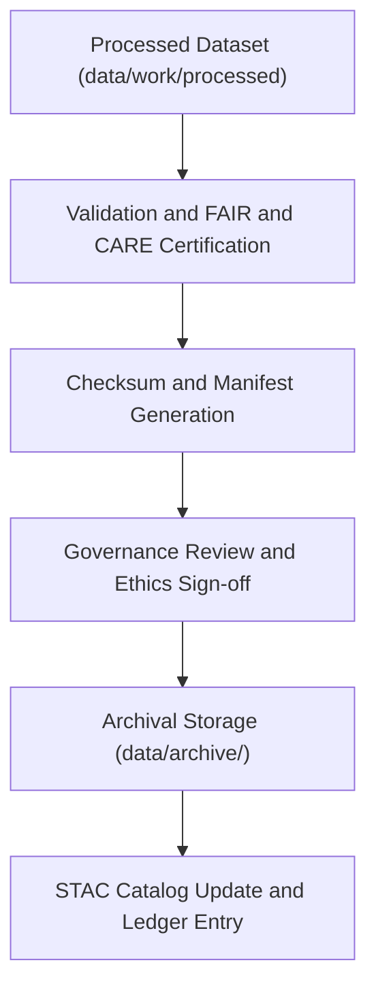

<div align="center">

# 🗄️ Kansas Frontier Matrix — **Data Archive**
`data/archive/README.md`

**Purpose:** Repository of versioned and immutable datasets that have completed FAIR+CARE validation and ETL transformation.  
Ensures long-term reproducibility, provenance tracking, and ethical preservation of historical, environmental, and hazard datasets.

[](../../.github/workflows/stac-validate.yml)
[](../../LICENSE)
[](../../docs/standards/faircare-validation.md)
[](../../docs/architecture/repo-focus.md)

</div>

---

## 📚 Overview

The `data/archive/` directory serves as the **long-term preservation layer** of the Kansas Frontier Matrix (KFM) data ecosystem.  
Archived datasets represent validated, published, and provenance-locked records of Kansas environmental, historical, and hazard data.  
These datasets are used for reproducible research, FAIR+CARE auditing, and legacy comparison in future releases.

Each archived dataset:
- Has completed the full ETL and validation workflow.  
- Is cryptographically verified via checksum and manifest linkage.  
- Includes FAIR+CARE metadata, provenance chains, and schema documentation.  
- Is immutable — no direct edits are allowed post-archival.  

---

## 🗂️ Directory Layout

```plaintext
data/archive/
├── README.md                           # This file — overview of data archival standards
│
├── hazards/                            # Hazard data (storms, floods, droughts, etc.)
│   ├── hazards_v9.2.0/
│   ├── hazards_v9.1.0/
│   └── hazards_legacy/
│
├── climate/                            # Climate data archives (temperature, drought indices)
│   ├── climate_v9.2.0/
│   ├── climate_v9.0.0/
│   └── climate_historical_1900s/
│
└── treaties/                           # Historical treaties and land cession data
    ├── treaties_v9.1.0/
    ├── treaties_v8.9.5/
    └── treaties_legacy/
```

> **Note:** Each versioned subdirectory includes its own `metadata.json`, `checksums.sha256`, and `provenance_record.json`.

---

## ⚙️ Archival Workflow



### Steps:
1. **Validation:** Dataset passes schema and FAIR+CARE checks.  
2. **Checksum Generation:** SHA-256 digest computed and logged.  
3. **Governance Approval:** FAIR+CARE Council verifies ethical and provenance compliance.  
4. **Archival Locking:** Dataset version frozen under `/archive/`.  
5. **Ledger Registration:** Metadata recorded in `reports/audit/data_provenance_ledger.json`.  

---

## 🧩 Metadata & Provenance

Each archived dataset includes:
| File | Description |
|------|--------------|
| `metadata.json` | Complete FAIR+CARE metadata (license, provenance, version, governance info). |
| `checksums.sha256` | Hash verification for all dataset files to ensure integrity. |
| `provenance_record.json` | Full lineage trace documenting data source, transformations, and validators. |
| `validation_report.json` | Summary of schema, STAC, and FAIR+CARE validation results. |
| `governance_approval.md` | FAIR+CARE council statement authorizing archive release. |

> All metadata and provenance records are cross-linked to the master governance ledger:  
> `reports/audit/data_provenance_ledger.json`

---

## 🧠 FAIR+CARE Compliance

| Principle | Implementation in Archive |
|------------|---------------------------|
| **Findable** | Indexed via STAC catalog and release manifest. |
| **Accessible** | Open data under CC-BY 4.0 with clear download paths. |
| **Interoperable** | Archived in open formats (GeoTIFF, GeoJSON, CSV, JSON-LD). |
| **Reusable** | Includes versioning, schema, and source citations. |
| **Collective Benefit** | Enables transparent long-term research for Kansas and global study. |
| **Authority to Control** | Governance board approval required for archival admission. |
| **Responsibility** | Audits ensure sensitive or restricted data are appropriately handled. |
| **Ethics** | Archival decisions recorded in ethical governance logs. |

---

## 🧾 Governance Integration

Archival governance workflows:
- `.github/workflows/governance-ledger.yml` — Updates and verifies archival ledger entries  
- `.github/workflows/faircare-validate.yml` — Confirms FAIR+CARE certification prior to freeze  
- `.github/workflows/stac-validate.yml` — Validates metadata references for all archived datasets  

All artifacts are traceable through:
- `releases/v9.3.2/manifest.zip`  
- `reports/audit/data_provenance_ledger.json`  
- `schemas/telemetry/work-data-governance-v14.json`

---

## 🧱 Usage & Citation

To cite archived data in publications:
```text
Kansas Frontier Matrix (2025). [Dataset Title]. Version v9.3.2. 
Available at: https://github.com/bartytime4life/Kansas-Frontier-Matrix/tree/main/data/archive/
License: CC-BY 4.0
```

Always reference both the dataset version and the FAIR+CARE metadata file in your citation.

---

## 🧾 Version History

| Version | Date       | Author             | Summary |
|----------|------------|--------------------|----------|
| v9.3.2   | 2025-10-28 | @kfm-data-lab      | Added archive structure and governance process documentation. |
| v9.3.1   | 2025-10-27 | @bartytime4life    | Linked archival workflow to governance and checksum verification. |
| v9.3.0   | 2025-10-26 | @kfm-architecture  | Established data archival directory and metadata schema. |

---

<div align="center">

**Kansas Frontier Matrix** · *Data Stewardship × Provenance × FAIR+CARE Archival Integrity*  
[🔗 Repository](https://github.com/bartytime4life/Kansas-Frontier-Matrix) • [🧭 Docs Portal](../../docs/) • [⚖️ Governance Ledger](../../docs/standards/governance/)

</div>
