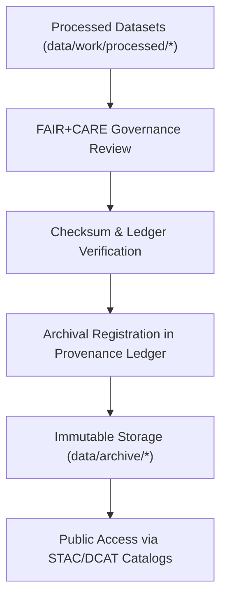

<div align="center">

# 🗃️ Kansas Frontier Matrix — **Data Archive & Provenance Registry**
`data/archive/README.md`

**Purpose:**  
Defines the **archival standards, data retention policies, and provenance registry protocols** governing long-term storage of FAIR+CARE-certified datasets within the Kansas Frontier Matrix (KFM).  
This archive ensures immutable, transparent, and ethical data preservation, enabling scientific reproducibility and historical continuity for future generations.

[](../../docs/standards/faircare-validation.md)
[]()
[]()
[](../../LICENSE)

</div>

---

## 📚 Overview

The **KFM Data Archive** functions as the **final, immutable layer** in the data lifecycle — preserving certified datasets, governance records, and checksum manifests under FAIR+CARE ethical governance.  
Every dataset archived here is permanently linked to its **provenance, schema, and audit history**, forming the backbone of the KFM’s reproducibility and transparency system.

The archive:
- Retains all datasets certified via FAIR+CARE validation workflows.  
- Stores cryptographic checksums and governance ledger references.  
- Maintains immutable provenance metadata under ISO 16363 standards.  
- Guarantees long-term access through open, standardized data formats.

---

## 🧭 Archive Framework



### Archival Steps
1. **Certification:** Dataset passes all FAIR+CARE and schema validations.  
2. **Verification:** SHA-256 checksums matched with `data/checksums/manifest.json`.  
3. **Governance:** Dataset audit results logged in provenance ledger.  
4. **Archival:** Immutable storage created under `data/archive/`.  
5. **Publication:** Entry indexed via STAC/DCAT for long-term discoverability.  

---

## 🗂️ Directory Layout

```plaintext
data/archive/
├── README.md                               # This file — documentation for data archive and provenance registry
│
├── 2025Q4/                                # Quarterly archive of certified data releases
│   ├── hazards_v9.6.0/                    # Hazard datasets (floods, tornadoes, droughts)
│   ├── climate_v9.6.0/                    # Climate and temperature index archives
│   ├── hydrology_v9.6.0/                  # Streamflow, aquifer, and water system data
│   ├── landcover_v9.6.0/                  # Landcover and vegetation datasets
│   ├── metadata/                          # FAIR+CARE and governance certification documents
│   └── checksums/                         # Verified SHA-256 manifest logs
│
└── index.json                             # Machine-readable registry of all archived datasets
```

---

## 🧱 Archive Data Model

| Field | Description | Example |
|--------|--------------|----------|
| `archive_id` | Unique archival dataset identifier. | `archive_hazards_v9.6.0_2025Q4` |
| `dataset_name` | Dataset title and domain. | `Hazards — Flood and Tornado Composite` |
| `records_total` | Number of records in dataset. | `18234` |
| `checksum_sha256` | Cryptographic hash for integrity verification. | `sha256:bd27a4f1d9e81b...` |
| `fairstatus` | FAIR+CARE certification state. | `certified` |
| `schema_version` | Data contract schema version. | `v3.0.1` |
| `archived_on` | UTC timestamp of archival. | `2025-11-03T19:40:00Z` |
| `governance_ref` | Provenance ledger record path. | `data/reports/audit/data_provenance_ledger.json` |

---

## 🧩 FAIR+CARE Archival Governance Matrix

| Principle | Implementation | Oversight |
|------------|----------------|------------|
| **Findable** | STAC and DCAT catalogs index all archived datasets. | @kfm-data |
| **Accessible** | All archives stored in open, public formats (CSV, GeoJSON, Parquet). | @kfm-accessibility |
| **Interoperable** | Linked via metadata schemas (FAIR, ISO 19115, DCAT 3.0). | @kfm-architecture |
| **Reusable** | Permanent provenance, schema, and FAIR+CARE metadata. | @kfm-design |
| **Collective Benefit** | Enables future research and transparency across generations. | @faircare-council |
| **Authority to Control** | Governance Council oversees archival lifecycle and retention. | @kfm-governance |
| **Responsibility** | Archive logs reviewed and checksum-verified quarterly. | @kfm-security |
| **Ethics** | Redaction and anonymization applied prior to publication. | @kfm-ethics |

All governance reports logged in:  
`data/reports/audit/data_provenance_ledger.json`

---

## 🧠 Provenance Integration & Checksum Verification

| Process | Output | File |
|----------|---------|------|
| **Checksum Verification** | Hash match validation results. | `data/archive/checksums/manifest.json` |
| **Governance Audit Log** | Ledger reference for dataset lineage. | `data/reports/audit/data_provenance_ledger.json` |
| **FAIR+CARE Certification Report** | Ethical validation outcome. | `data/reports/fair/faircare_summary.json` |
| **Archive Registry Entry** | Catalog of datasets stored under `data/archive/`. | `data/archive/index.json` |

---

## ⚙️ Example Archive Metadata Record

```json
{
  "id": "archive_climate_v9.6.0_2025Q4",
  "domain": "climate",
  "records_total": 125480,
  "checksum_verified": true,
  "fairstatus": "certified",
  "schema_version": "v3.0.1",
  "storage_format": ["CSV", "Parquet"],
  "archived_on": "2025-11-03T19:40:00Z",
  "ledger_hash": "sha256:91e8d4acaf6b20...",
  "governance_registered": true,
  "validator": "@kfm-archive",
  "energy_use_wh": 14.6
}
```

---

## 🌱 Sustainability & Preservation Standards

| Standard | Description | Compliance |
|-----------|--------------|-------------|
| **ISO 16363** | Trusted Digital Repository framework. | ✅ |
| **ISO 19115** | Metadata lineage and documentation standard. | ✅ |
| **ISO 14064** | Carbon footprint and energy accounting. | ✅ |
| **MCP-DL v6.3** | Documentation-first reproducibility protocol. | ✅ |
| **FAIR+CARE** | Ethics and accessibility framework. | ✅ |

All sustainability data reported in:  
`releases/v9.6.0/focus-telemetry.json`

---

## 🧩 Retention Policy

| Category | Retention | Policy |
|-----------|------------|--------|
| FAIR+CARE-Certified Datasets | Permanent | Immutable archival. |
| Validation Reports | Permanent | Retained for governance verification. |
| Checksum Manifests | Permanent | Cross-checked with all new releases. |
| Governance Records | Permanent | Ledger-stored for audit traceability. |
| Energy Telemetry | 5 years | Used for sustainability benchmarking. |

---

## 🧾 Internal Use Citation

```text
Kansas Frontier Matrix (2025). Data Archive & Provenance Registry (v9.6.0).
Defines the FAIR+CARE-certified archival framework ensuring ethical, transparent, and reproducible long-term dataset preservation.
Implements ISO 16363, STAC 1.0, and CARE governance principles for sustainable open data stewardship.
```

---

## 🧾 Version Notes

| Version | Date | Notes |
|----------|------|--------|
| v9.6.0 | 2025-11-03 | Added ISO 16363 compliance and FAIR+CARE archival validation workflow. |
| v9.5.0 | 2025-11-02 | Integrated checksum ledger sync and renewable infrastructure reporting. |
| v9.3.2 | 2025-10-28 | Established baseline data archival standards under MCP-DL v6.3. |

---

<div align="center">

**Kansas Frontier Matrix** · *Data Preservation × FAIR+CARE Governance × Provenance Continuity*  
[🔗 Repository](https://github.com/bartytime4life/Kansas-Frontier-Matrix) • [🧭 Governance Ledger](../../docs/standards/governance/DATA-GOVERNANCE.md) • [📊 FAIR+CARE Audit Summary](../../data/reports/fair/faircare_summary.json)

</div>