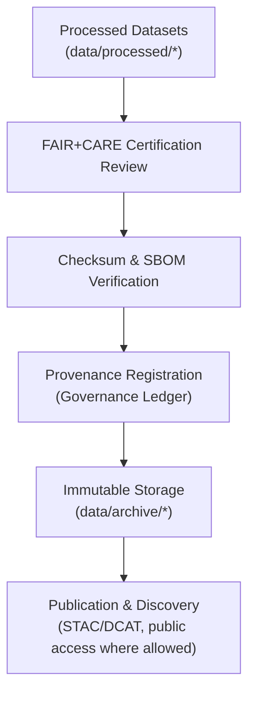

# 🗃️ **Kansas Frontier Matrix — Data Archive & Provenance Registry**  
`data/archive/README.md`

**Purpose**  
Define the **archival standards, retention policy, and provenance registry architecture** governing long-term storage of FAIR+CARE-certified datasets in the Kansas Frontier Matrix (KFM).  

The archive is the **final lifecycle layer**:
- Immutable storage of certified datasets  
- Append-only provenance and governance ledgers  
- Publicly verifiable checksums & metadata  
- Sustainable, ethical, and sovereign data preservation  

 ·
 ·
 ·
 ·

---

## 📘 1. Overview

The **KFM Data Archive** is a **trusted repository** aligned with:

- **ISO 16363** (Trusted Digital Repository)  
- **FAIR+CARE** ethics and governance  
- **STAC 1.x / DCAT 3.0** discoverability  
- **KFM-OP v11** ontology and provenance rules  

Each archived dataset:

- Has passed all validation gates (schema, FAIR+CARE, checksum)  
- Is linked to full provenance and telemetry metrics  
- Is preserved in open, durable formats suitable for long-term reuse  

The archive complements `data/raw/`, `data/work/`, and `data/processed/` by acting as the **immutable, referenceable end-state** of datasets.

---

## 🧭 2. Archive Framework

### 2.1 Archival Pipeline

1. **Certification**  
   - Dataset passes FAIR+CARE, schema, and quality validation.  
   - Contract compliance confirmed via `data_contract_ref`.  

2. **Verification**  
   - Checksum & SBOM consistency validated against `sbom_ref` and archive manifests.  

3. **Governance Registration**  
   - Records written to governance ledgers, e.g. `docs/reports/audit/data_provenance_ledger.json`.  
   - CARE and sovereignty decisions recorded for sensitive datasets.  

4. **Archival Writing**  
   - Immutable copies stored in `data/archive/` under time- and version-partitioned directories.  

5. **Publication / Discovery**  
   - `index.json` and STAC/DCAT catalogs updated when public release is allowed.  

---

## 🗂️ 3. Directory Layout (Emoji Style A)

~~~text
data/archive/
├── 📄 README.md                       # This file
│
├── 📂 2025Q4/                         # Example quarterly archive partition
│   ├── 🌩️ hazards_v11.0.0/           # Floods, tornadoes, droughts, hazard layers
│   ├── 🌦️ climate_v11.0.0/           # Climate indices and atmospheric archives
│   ├── 💧 hydrology_v11.0.0/          # Streamflow, aquifer, groundwater datasets
│   ├── 🌿 landcover_v11.0.0/          # Land cover & vegetation layers
│   ├── 🪶 cultural_v11.0.0/           # Cultural/heritage datasets (governance-restricted)
│   ├── 📑 metadata/                   # FAIR+CARE, governance & validation reports
│   └── 🔐 checksums/                  # Verified SHA-256 manifests for this partition
│
└── 🧾 index.json                      # Machine-readable catalog of all archived datasets
~~~

**Constraints**

- Archive partitions (e.g., `2025Q4/`) are **append-only** after finalization.  
- `metadata/` and `checksums/` contain frozen validation artifacts.  
- `index.json` is maintained by CI/CD and must remain schema-valid and logically append-only.

---

## ⚙️ 4. Archive Data Model

The archive registry uses a consistent record model in `index.json` and STAC/DCAT views.

### 4.1 Core Archive Record

| Field             | Description                                   | Example                                           |
|-------------------|-----------------------------------------------|---------------------------------------------------|
| `archive_id`      | Unique ID of archived dataset/bundle          | `archive_climate_v11.0.0_2025Q4`                  |
| `dataset_name`    | Human-readable title                          | `Climate — Temperature & Precipitation`          |
| `domain`          | Thematic domain                               | `climate`                                         |
| `records_total`   | Count of records/features/tiles               | `124891`                                          |
| `checksum_sha256` | SHA-256 digest of primary bundle              | `sha256:b98a6f7a3e7c41bff8...`                    |
| `fairstatus`      | FAIR+CARE certification status                | `certified`                                       |
| `schema_version`  | Data contract/schema version                  | `v3.0.1`                                          |
| `archived_on`     | UTC timestamp of archival                     | `2025-11-19T19:44:00Z`                            |
| `governance_ref`  | Governance ledger record                      | `docs/reports/audit/data_provenance_ledger.json` |
| `stac_ref`        | STAC Item/Collection reference                | `data/stac/items/climate_v11_2025Q4.json`        |
| `dcat_ref`        | DCAT dataset reference                        | `data/dcat/climate_v11_2025Q4.jsonld`            |
| `public_access`   | Accessibility policy                          | `open`, `restricted`, `internal`                  |

---

## 🧠 5. FAIR+CARE Archival Governance Matrix

| Principle              | Archive Implementation                                      | Oversight             |
|------------------------|------------------------------------------------------------|-----------------------|
| **Findable**           | STAC/DCAT metadata, `index.json`, persistent IDs          | @kfm-data             |
| **Accessible**         | Open formats & documented access policies                  | @kfm-accessibility    |
| **Interoperable**      | DCAT 3.0 & ISO 19115-1 metadata                            | @kfm-architecture     |
| **Reusable**           | Provenance, rights, FAIR+CARE metadata                     | @kfm-design           |
| **Collective Benefit** | Archives reflect community-aligned use & benefit           | @faircare-council     |
| **Authority to Control** | Sovereignty and consent-driven access control            | @kfm-governance       |
| **Responsibility**     | Regular integrity & ethics audits                          | @kfm-security         |
| **Ethics**             | Redaction, anonymization, masking where required           | @kfm-ethics           |

Governance reports are written into:

~~~text
docs/reports/audit/data_provenance_ledger.json
docs/reports/audit/governance-ledger.json
~~~

---

## 🔐 6. Provenance & Verification

Verifications combine:

- Checksum manifests in `data/archive/*/checksums/`  
- SBOM references (`sbom_ref`) and manifests (`manifest_ref`)  
- Governance ledgers under `docs/reports/audit/**`  

### 6.1 Process → Output Mapping

| Process                 | Output Type                          | Example Path                                           |
|-------------------------|---------------------------------------|--------------------------------------------------------|
| Checksum verification   | SHA-256 integrity manifest            | `data/archive/2025Q4/checksums/manifest.json`         |
| Governance audit        | Council review + ethics decision      | `docs/reports/audit/governance-ledger.json`           |
| FAIR+CARE certification | Certification summary                 | `docs/reports/fair/faircare_summary.json`             |
| Archive index update    | Registry entry for archived datasets  | `data/archive/index.json`                             |

---

## 📊 7. Example Archive Record (JSON)

~~~json
{
  "archive_id": "archive_hydrology_v11.0.0_2025Q4",
  "dataset_name": "Kansas Hydrology — Streamflow & Aquifer Levels",
  "domain": "hydrology",
  "records_total": 128476,
  "checksum_verified": true,
  "fairstatus": "certified",
  "schema_version": "v3.0.1",
  "storage_format": ["CSV", "Parquet", "GeoJSON"],
  "archived_on": "2025-11-19T19:44:00Z",
  "stac_ref": "data/stac/items/hydro_v11_2025Q4.json",
  "dcat_ref": "data/dcat/hydro_v11_2025Q4.jsonld",
  "governance_ref": "docs/reports/audit/data_provenance_ledger.json",
  "ledger_hash": "sha256:89f7e4acb93b20...",
  "governance_registered": true,
  "energy_use_wh": 14.2,
  "carbon_gco2e": 11.3,
  "validator": "@kfm-archive"
}
~~~

---

## 🌱 8. Sustainability & Preservation Standards

The archive adheres to:

- **ISO 16363** — trusted digital repository practices  
- **ISO 19115-1** — metadata lineage & documentation  
- **ISO 14064 / 50001** — carbon and energy management standards  
- **MCP-DL v6.3** — documentation-first reproducibility  
- **FAIR+CARE** — ethical & community-aligned stewardship  

Sustainability telemetry is aggregated into:

~~~text
../../releases/v11.2.2/focus-telemetry.json
docs/reports/telemetry/data-archive-*.json
~~~

Metrics tracked:

- Energy consumption for archival processes  
- Carbon estimates per archival batch  
- Long-term growth of archive volume  
- Ratio of open vs restricted archival content  

---

## 🧮 9. Retention & Access Policy

| Category                 | Retention | Access Policy             | Notes                                   |
|--------------------------|----------:|---------------------------|-----------------------------------------|
| FAIR+CARE datasets       | Permanent | Open or restricted        | Dataset-level governance applies        |
| Validation reports       | Permanent | Internal, governed access | Used for audits & recertification       |
| Checksum manifests       | Permanent | Public when possible      | Support community re-validation         |
| Governance records       | Permanent | Internal, council access  | Append-only, immutable ledgers          |
| Sustainability telemetry | ≥ 5 years | Internal, aggregated      | Used for sustainability trend analysis  |

In-place modification of archive contents is forbidden; corrections produce **new archive versions** with explicit lineage links.

---

## 🧬 10. Relationship to STAC / DCAT / Graph

Archived datasets:

- Are referenced via STAC & DCAT with archive IDs & versions  
- Are represented in the graph as:
  - `Dataset` (CIDOC E73 / dcat:Dataset)  
  - `Distribution` entries for archived bundles  
  - `prov:Entity` with `prov:wasDerivedFrom` and `prov:wasGeneratedBy` links  

The archive is the **authoritative timeline** for:

- “What data existed in which form at what time?”  
- Reproducible analyses and map states  
- Governance and compliance audits  

---

## 🔁 11. CI/CD Integration

Archive updates are orchestrated by:

- `data_pipeline.yml` — identifies datasets ready for archival  
- `sbom_verify.yml` — ensures SBOM + manifest alignment  
- `faircare_validate.yml` — confirms FAIR+CARE compliance  
- `telemetry_export.yml` — updates archive-related telemetry  

Any PR or release affecting `data/archive/` must:

- Pass all validations  
- Update `index.json`  
- Update governance & provenance ledgers  
- Produce updated telemetry artifacts  

---

## 🧭 12. Contributor Workflow

For maintainers:

1. Validate dataset in `data/processed/**`.  
2. Confirm governance & CARE decisions.  
3. Update STAC/DCAT metadata as needed.  
4. Run checksum & SBOM verification.  
5. Use archival tooling to write `data/archive/<partition>/<dataset_version>/`.  
6. Update `data/archive/index.json`.  
7. Confirm telemetry & ledger updates.  

Contributors:

- Work in `data/raw/`, `data/work/`, `data/processed/`.  
- Use governed data submission processes.  
- Do **not** write directly into `data/archive/`.  

---

## 🧾 13. Internal Citation

~~~text
Kansas Frontier Matrix (2025). Data Archive & Provenance Registry (v11.0.0).
A FAIR+CARE-compliant archival architecture for immutable, transparent, and sustainable
preservation of scientific, historical, and cultural datasets within the Kansas Frontier Matrix.
Aligns with ISO 16363, STAC 1.x, DCAT 3.0, and KFM-OP v11 governance rules.
~~~

---

## 🕰️ 14. Version History

| Version | Date       | Author         | Summary                                                                                                         |
|--------:|-----------:|---------------|-----------------------------------------------------------------------------------------------------------------|
| v11.2.2 | 2025-11-27 | `@kfm-archive` | Upgraded to KFM-MDP v11.2.2; applied emoji layout; aligned release refs; clarified sustainability & governance. |
| v11.0.0 | 2025-11-19 | `@kfm-archive` | Upgraded archive framework to v11; added sustainability telemetry, sovereignty hooks, and ontology mapping.    |
| v10.2.2 | 2025-11-12 | `@kfm-archive` | Streaming STAC sync, JSON-LD lineage, checksum manifest, and energy/CO₂ telemetry.                              |
| v10.0.0 | 2025-11-10 | `@kfm-archive` | v10 archive architecture with STAC/DCAT and retention/provenance guidance.                                      |
| v9.7.0  | 2025-11-06 | `@kfm-archive` | DCAT mapping, sustainability metrics, and directory conventions.                                                |

---

© 2025 Kansas Frontier Matrix — CC-BY 4.0  
[⬅️ Back](../README.md) · [🧱 Data System Architecture](../ARCHITECTURE.md) · [🛡️ Governance Charter](../../docs/standards/governance/ROOT-GOVERNANCE.md)

