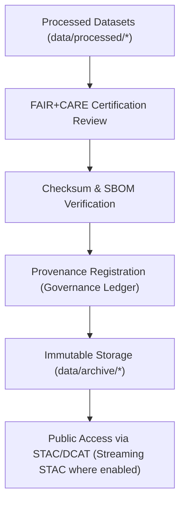

<div align="center">

# 🗃️ Kansas Frontier Matrix — **Data Archive & Provenance Registry**  
`data/archive/README.md`

**Purpose:**  
Define the **archival standards, retention policy, and provenance registry protocols** governing long-term storage of FAIR+CARE-certified datasets within the Kansas Frontier Matrix (KFM).  
Ensure immutable, transparent, and ethical data preservation — enabling reproducibility and intergenerational access to verified scientific and historical records.

[](../../docs/README.md)
[](../../LICENSE)
[](../../docs/standards/faircare.md)
[]()
[]()

</div>

---

## 📘 Overview

The **KFM Data Archive** is the final, immutable lifecycle layer — preserving **certified datasets, provenance ledgers, and checksum manifests** under FAIR+CARE governance.  
Every archived dataset is **cryptographically validated, ethically reviewed**, and **linked to its schema, telemetry, and audit history**.

### Key Objectives

- Permanently preserve FAIR+CARE-certified datasets and validation records.  
- Maintain immutable provenance ledgers for reproducibility.  
- Provide ISO 16363-trusted long-term storage using open, durable formats.  
- Support public verification through checksums, STAC/DCAT catalogs, and telemetry logs.

---

## 🧭 Archive Framework



### Archival Process

1. **Certification** — Dataset passes FAIR+CARE + schema validation gates.  
2. **Verification** — Cross-check with `data/checksums/manifest.json` and SPDX SBOM.  
3. **Governance** — Provenance registered in ledger (`data/reports/audit/data_provenance_ledger.json`).  
4. **Archival** — Immutable copy stored under `data/archive/`.  
5. **Publication** — Indexed in **STAC/DCAT** catalogs for discoverability.

---

## 🗂️ Directory Layout

```plaintext
data/archive/
├── README.md
│
├── 2025Q4/                          # Quarterly archive (example)
│   ├── hazards_v10.2.2/             # Hazard datasets (floods, tornadoes, droughts)
│   ├── climate_v10.2.2/             # Climate indices & atmospheric archives
│   ├── hydrology_v10.2.2/           # Streamflow, aquifer, and groundwater data
│   ├── landcover_v10.2.2/           # Landcover & vegetation datasets
│   ├── metadata/                    # FAIR+CARE & governance certification documents
│   └── checksums/                   # Verified SHA-256 manifests
│
└── index.json                       # Machine-readable catalog of all archived datasets
```

---

## ⚙️ Archive Data Model

| Field | Description | Example |
|---|---|---|
| `archive_id` | Unique ID of the archived dataset. | `archive_climate_v10.2.2_2025Q4` |
| `dataset_name` | Dataset title and domain. | `Climate — Temperature & Precipitation Composite` |
| `records_total` | Count of records. | `124891` |
| `checksum_sha256` | SHA-256 hash for verification. | `sha256:b98a6f7a3e7c41bff8...` |
| `fairstatus` | FAIR+CARE certification state. | `certified` |
| `schema_version` | Data contract schema version. | `v3.0.1` |
| `archived_on` | UTC timestamp of archival. | `2025-11-12T19:44:00Z` |
| `governance_ref` | Ledger record path. | `data/reports/audit/data_provenance_ledger.json` |

---

## 🧠 FAIR+CARE Archival Governance Matrix

| Principle | Implementation | Oversight |
|---|---|---|
| **Findable** | STAC & DCAT catalogs with UUID/DOI indexing. | `@kfm-data` |
| **Accessible** | Open archival formats (CSV, GeoJSON, Parquet, NetCDF). | `@kfm-accessibility` |
| **Interoperable** | Linked with ISO 19115 and DCAT 3.0 metadata. | `@kfm-architecture` |
| **Reusable** | Permanent provenance and FAIR+CARE metadata retention. | `@kfm-design` |
| **Collective Benefit** | Transparent preservation serving science & culture. | `@faircare-council` |
| **Authority to Control** | Governance Council certifies archive lifecycle. | `@kfm-governance` |
| **Responsibility** | Quarterly integrity and ethics reviews. | `@kfm-security` |
| **Ethics** | Redaction and anonymization prior to archiving. | `@kfm-ethics` |

**Governance reports:** `data/reports/audit/data_provenance_ledger.json`

---

## 🧩 Provenance Integration & Verification

| Process | Output | File |
|---|---|---|
| **Checksum Verification** | SHA-256 integrity validation | `data/archive/checksums/manifest.json` |
| **Governance Audit Log** | Council review and ethics approval | `data/reports/audit/data_provenance_ledger.json` |
| **FAIR+CARE Certification** | Compliance audit results | `data/reports/fair/faircare_summary.json` |
| **Archive Registry Entry** | Catalog entry of archived datasets | `data/archive/index.json` |

---

## 📊 Example Archive Metadata Record

```json
{
  "id": "archive_hydrology_v10.2.2_2025Q4",
  "domain": "hydrology",
  "records_total": 128476,
  "checksum_verified": true,
  "fairstatus": "certified",
  "schema_version": "v3.0.1",
  "storage_format": ["CSV", "Parquet"],
  "archived_on": "2025-11-12T19:44:00Z",
  "ledger_hash": "sha256:89f7e4acb93b20...",
  "governance_registered": true,
  "energy_use_wh": 14.2,
  "validator": "@kfm-archive"
}
```

---

## 🌱 Sustainability & Preservation Standards

| Standard | Description | Compliance |
|---|---|---|
| **ISO 16363** | Trusted Digital Repository accreditation | ✅ |
| **ISO 19115** | Metadata lineage and documentation | ✅ |
| **ISO 14064 / 50001** | Carbon and energy efficiency standards | ✅ |
| **MCP-DL v6.3** | Documentation-first lifecycle reproducibility | ✅ |
| **FAIR+CARE** | Ethical, open, and equitable stewardship | ✅ |

**Sustainability telemetry:** `../../releases/v10.2.0/focus-telemetry.json`

---

## 🧮 Retention Policy

| Category | Retention | Policy |
|---|---|---|
| FAIR+CARE Datasets | Permanent | Immutable archival with ledger reference |
| Validation Reports | Permanent | Used in reproducibility and ethics audits |
| Checksum Manifests | Permanent | Cross-verified each new release cycle |
| Governance Records | Permanent | Append-only ledger |
| Energy Telemetry | 5 years | Tracked for sustainability benchmarks |

---

## 🧾 Internal Use Citation

```text
Kansas Frontier Matrix (2025). Data Archive & Provenance Registry (v10.2.2).
FAIR+CARE-compliant archival architecture ensuring ethical, transparent, and reproducible data preservation.
Implements ISO 16363, STAC 1.0, DCAT 3.0, and CARE-aligned standards for sustainable open data governance.
```

---

## 🕰️ Version History

| Version | Date | Author | Summary |
|---|---|---|---|
| v10.2.2 | 2025-11-12 | `@kfm-archive` | Align to v10.2: streaming STAC sync, JSON-LD lineage, consolidated checksum manifest, and energy/CO₂ telemetry. |
| v10.0.0 | 2025-11-10 | `@kfm-archive` | STAC/DCAT refs and retention/provenance guidance aligned to v10; telemetry references updated. |
| v9.7.0 | 2025-11-06 | `@kfm-archive` | DCAT mapping, sustainability metrics, and directory conventions added. |
| v9.6.0 | 2025-11-03 | `@kfm-archive` | ISO 16363 compliance and FAIR+CARE archival validation introduced. |

---

<div align="center">

**Kansas Frontier Matrix**  
*Data Preservation × FAIR+CARE Governance × Provenance Continuity*  
© 2025 Kansas Frontier Matrix — CC-BY 4.0  

[Back to Data Index](../README.md) · [Governance Charter](../../docs/standards/governance/DATA-GOVERNANCE.md) · [FAIR+CARE Summary](../../data/reports/fair/faircare_summary.json)

</div>