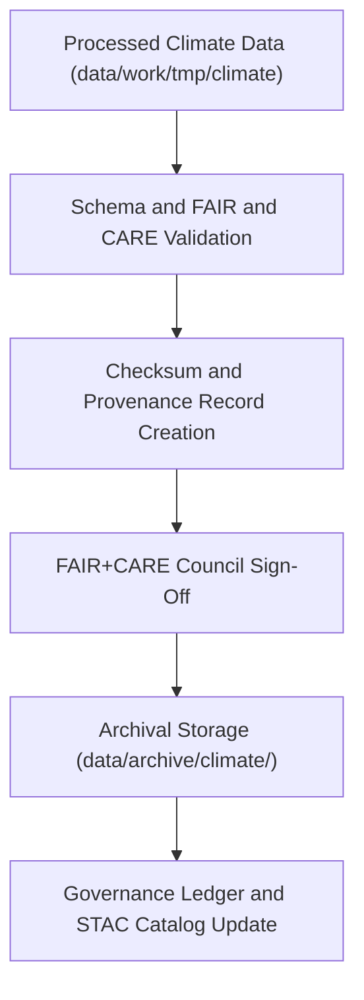

<div align="center">

# 🌦️ Kansas Frontier Matrix — **Climate Data Archive**
`data/archive/climate/README.md`

**Purpose:** Contains archived, validated, and FAIR+CARE-certified climate datasets for Kansas, covering temperature, precipitation, drought indices, and atmospheric anomalies.  
Each version is frozen, checksum-verified, and ethically governed for long-term reproducibility and scientific transparency.

[](../../../.github/workflows/stac-validate.yml)
[](../../../LICENSE)
[](../../../docs/standards/faircare-validation.md)
[](../../../docs/architecture/repo-focus.md)

</div>

---

## 📚 Overview

The `data/archive/climate/` directory holds all historical and current **Kansas climate data** produced or validated by the Kansas Frontier Matrix (KFM) project.  
Each dataset within this archive has undergone:
- **ETL transformation** from primary NOAA and NCEI datasets.  
- **Validation** against schema, STAC, and FAIR+CARE ethics standards.  
- **Checksum verification** and governance sign-off for archival preservation.

The archive supports climate trend analysis, Focus Mode AI predictions, and historical climate reconstruction aligned with FAIR+CARE ethics and open data reproducibility principles.

---

## 🗂️ Directory Layout

```plaintext
data/archive/climate/
├── README.md                          # This file — overview of archived climate data
│
├── climate_v9.3.2/                    # Latest validated dataset (2025 release)
│   ├── climate_summary_2025.geojson
│   ├── climate_anomalies_2025.geojson
│   ├── metadata.json
│   ├── provenance_record.json
│   ├── validation_report.json
│   ├── checksums.sha256
│   └── governance_approval.md
│
├── climate_v9.2.0/                    # Previous version (2024)
│   ├── climate_indices_2024.geojson
│   ├── metadata.json
│   ├── validation_report.json
│   └── checksums.sha256
│
└── climate_historical_1900s/          # Legacy datasets (1900–1999)
    ├── kansas_precip_1950.geojson
    ├── kansas_temp_1900_1999.geojson
    ├── metadata_legacy.md
    └── retro_audit_notes.json
```

---

## ⚙️ Archival Workflow



### Steps:
1. **ETL Processing:** Climate data extracted from NOAA/NCEI sources.  
2. **Validation:** Schema and metadata verification per STAC/DCAT standards.  
3. **Ethics Review:** FAIR+CARE Council conducts review for bias, accuracy, and ethical considerations.  
4. **Archival Freezing:** Dataset version locked under immutable storage.  
5. **Governance Logging:** Entry added to the audit ledger with checksum and metadata references.

---

## 🌍 Dataset Composition

| Dataset | Description | Source Agency | Coverage | Format |
|----------|--------------|----------------|-----------|---------|
| `climate_summary_2025.geojson` | Annual temperature, precipitation, and drought summary for Kansas. | NOAA NCEI | 2025 statewide | GeoJSON |
| `climate_anomalies_2025.geojson` | Monthly temperature and rainfall anomaly deviations from 1901–2000 average. | NOAA CPC | 1900–2025 | GeoJSON |
| `climate_indices_2024.geojson` | Palmer Drought Severity and Standardized Precipitation Index. | NOAA NIDIS | 2024 | GeoJSON |
| `kansas_temp_1900_1999.geojson` | Historical temperature dataset. | USHCN | 1900–1999 | GeoJSON |

---

## 🧩 Metadata Schema

Each dataset contains the following metadata fields (STAC 1.0 / DCAT 3.0 aligned):

| Field | Description | Example |
|--------|--------------|----------|
| `id` | Dataset identifier | `"climate_v9.3.2"` |
| `title` | Dataset title | `"Kansas Climate Summary Dataset"` |
| `description` | Summary of dataset purpose and scope | `"Temperature, precipitation, and drought data for Kansas"` |
| `version` | Dataset release version | `"v9.3.2"` |
| `license` | Usage license | `"CC-BY 4.0"` |
| `provider` | Source data agencies | `["NOAA", "NCEI", "NIDIS"]` |
| `extent` | Bounding box and temporal coverage | `[-102.05, 36.99, -94.61, 40.00], 1900–2025` |
| `checksum` | Hash verification signature | `"sha256:af77d9f2d..."` |

---

## 🧠 FAIR+CARE Compliance

| Principle | Implementation |
|------------|----------------|
| **Findable** | Indexed through STAC with metadata tags for searchability. |
| **Accessible** | Released under CC-BY 4.0; available through repository and Focus Mode API. |
| **Interoperable** | Uses open, machine-readable formats (GeoJSON, CSV). |
| **Reusable** | Fully documented provenance and transformation metadata. |
| **Collective Benefit** | Supports climate research and local policy development. |
| **Authority to Control** | Governance Council ensures attribution and licensing accuracy. |
| **Responsibility** | Verified data accuracy through multi-source comparison. |
| **Ethics** | Bias detection applied to anomaly layers; council approval logged. |

All FAIR+CARE certifications recorded in:  
`data/reports/fair/data_care_assessment.json`

---

## 🔍 Provenance Record (Excerpt)

```json
{
  "dataset_id": "climate_v9.3.2",
  "source_agencies": ["NOAA NCEI", "NOAA CPC", "Kansas Mesonet"],
  "etl_script": "src/pipelines/etl/climate/climate_pipeline.py",
  "validated_by": "@kfm-data-lab",
  "archived_on": "2025-10-28T14:35:00Z",
  "checksum": "b91e8a4b4e77aa3019fa6e8a2e0c74e15f6e82db12...",
  "linked_stac": "data/stac/items/climate_v9.3.2.json",
  "governance_status": "approved"
}
```

---

## ⚙️ Governance & Validation Linkages

Each archived version references:
- `data/reports/audit/data_provenance_ledger.json` — Full lineage and governance record.  
- `data/reports/fair/data_fair_summary.json` — FAIR evaluation results.  
- `data/reports/validation/stac_validation_report.json` — Schema validation logs.  
- `releases/v9.3.2/manifest.zip` — Dataset and checksum registry.  

---

## ⚖️ Ethical Stewardship

> All climate datasets undergo ethical review for:
> - Accuracy and completeness relative to public domain sources.  
> - Representation of climate events without political or cultural bias.  
> - Protection of potentially sensitive geographic data (e.g., private agricultural sites).  

Ethics reviews documented under `data/reports/fair/ethics_review_summary.md`.

---

## 🧾 Usage & Citation

**Access Path:**  
`data/archive/climate/climate_v9.3.2/`

**Citation Example:**
```text
Kansas Frontier Matrix (2025). Kansas Climate Archive Dataset (v9.3.2).
FAIR+CARE-certified integrated dataset derived from NOAA, NCEI, and Mesonet data.
Available at: https://github.com/bartytime4life/Kansas-Frontier-Matrix/tree/main/data/archive/climate
License: CC-BY 4.0
```

---

## 🧾 Version History

| Version | Date | Notes |
|----------|------|--------|
| v9.3.2 | 2025-10-28 | Added 2025 anomaly and summary datasets; expanded drought index layers. |
| v9.2.0 | 2024-08-01 | Introduced Palmer Drought Severity Index and climate index features. |
| v9.1.0 | 2023-10-15 | Initial FAIR+CARE-aligned archive release of climate data. |

---

<div align="center">

**Kansas Frontier Matrix** · *Climate Science × FAIR+CARE Governance × Open Data Integrity*  
[🔗 Repository](https://github.com/bartytime4life/Kansas-Frontier-Matrix) • [🧭 Docs Portal](../../../docs/) • [⚖️ Governance Ledger](../../../docs/standards/governance/)

</div>
