<div align="center">

# 📜 Kansas Frontier Matrix — **Historical Climate Archive (1900s)**
`data/archive/climate/climate_historical_1900s/README.md`

**Purpose:** Preserves early 20th-century Kansas climate datasets (1900–1999) derived from NOAA, NCEI, and USHCN records.  
Serves as a foundational, pre-FAIR+CARE resource for historical temperature, precipitation, and drought data across Kansas.

[](../../../../docs/standards/governance/DATA-GOVERNANCE.md)
[](../../../../LICENSE)
[](../../../../docs/standards/faircare-validation.md)
[](../../../../docs/architecture/repo-focus.md)

</div>

---

## 📚 Overview

The `climate_historical_1900s/` directory contains **legacy climate data** from the early Kansas weather observation records.  
These datasets were compiled prior to the implementation of MCP-DL documentation and FAIR+CARE compliance, but were retrospectively reviewed and annotated for preservation integrity.

**Key Characteristics:**
- Covers temperature and precipitation observations between **1900–1999**.  
- Compiled from NOAA, NCEI, and Kansas Mesonet archives.  
- Converted from shapefiles and CSVs into modern GeoJSON format.  
- Reviewed for ethical and metadata completeness in 2025.  

---

## 🗂️ Directory Layout

```plaintext
data/archive/climate/climate_historical_1900s/
├── README.md                             # This file — overview of historical archive
│
├── kansas_temp_1900_1999.geojson         # Statewide temperature records (monthly means)
├── kansas_precip_1950.geojson            # 1950 annual precipitation dataset
├── metadata_legacy.md                    # Retrospective metadata and source attribution
└── retro_audit_notes.json                # FAIR+CARE retrospective review findings (2025)
```

---

## ⚙️ Historical Context and Workflow

```mermaid
flowchart TD
    A["Original NOAA and USHCN Data (1900–1999)"] --> B["Manual Compilation and Georeferencing (2010–2018)"]
    B --> C["CSV to GeoJSON Conversion and CRS Alignment (2020)"]
    C --> D["Legacy Archive (data/archive/climate/climate_historical_1900s)"]
    D --> E["Retrospective FAIR and CARE Review (2025)"]
```



### Notes:
- Data originally digitized from paper logs and scanned maps between 2010–2015.  
- Georeferenced manually using early QGIS workflows.  
- Retrospectively validated for metadata completeness and spatial accuracy.  

---

## 🧩 Retrospective FAIR+CARE Audit Results (2025)

| Principle | Status | Notes |
|------------|---------|-------|
| **Findable** | ⚠️ Partial | Metadata added post-hoc; STAC links reconstructed manually. |
| **Accessible** | ✅ Open | Files released under CC-BY 4.0. |
| **Interoperable** | ⚠️ Partial | Some missing coordinate reference information added during review. |
| **Reusable** | ⚠️ Limited | Documentation reconstructed from historical sources. |
| **Collective Benefit** | ✅ Met | Serves public, academic, and environmental history uses. |
| **Authority to Control** | ✅ Met | Source agencies attributed (NOAA, NCEI, USHCN). |
| **Responsibility** | ⚠️ Partial | Ethics review added retrospectively; some uncertainty in legacy methods. |
| **Ethics** | ✅ Passed | No privacy or proprietary data included. |

Results documented in:  
`data/reports/fair/ethics_review_summary.md`

---

## 🧠 Legacy Metadata Overview

```json
{
  "id": "climate_historical_1900s",
  "title": "Kansas Historical Climate Archive (1900–1999)",
  "description": "Legacy Kansas climate datasets derived from NOAA and USHCN archives for the 20th century.",
  "license": "CC-BY 4.0",
  "providers": [
    {"name": "NOAA NCEI", "role": "data-source"},
    {"name": "USHCN", "role": "data-source"},
    {"name": "Kansas Mesonet", "role": "validator"}
  ],
  "spatial_extent": {"bbox": [-102.05, 36.99, -94.61, 40.00]},
  "temporal_extent": {"interval": ["1900-01-01T00:00:00Z", "1999-12-31T00:00:00Z"]}
}
```

---

## 🧾 Retrospective Governance Notes (from `retro_audit_notes.json`)

```json
{
  "review_year": 2025,
  "reviewer": "@kfm-data-lab",
  "notes": [
    "Legacy datasets lacked full FAIR schema; fields reconstructed.",
    "Checksum integrity verified via retro-generated SHA-256 hashes.",
    "No ethical conflicts found; approved for permanent retention.",
    "Converted from shapefile to GeoJSON with consistent EPSG:4326 CRS."
  ],
  "approved_by": "@bartytime4life",
  "approval_status": "retrospectively-approved"
}
```

---

## ⚙️ Governance & Provenance Integration

| Record Type | Reference |
|--------------|------------|
| **Audit Ledger** | `data/reports/audit/archive_integrity_log.json` |
| **Ethical Review Summary** | `data/reports/fair/ethics_review_summary.md` |
| **Retro Review Notes** | `data/archive/climate/climate_historical_1900s/retro_audit_notes.json` |
| **Checksum Manifest** | `releases/v8.9.0/manifest.zip` |

---

## ⚖️ Historical Importance

> These legacy datasets represent the earliest digitized collections of Kansas climate data.
> They have been preserved for:
> - Transparency and lineage continuity.  
> - Comparative analysis with modern climate datasets.  
> - Educational and archival value under FAIR+CARE stewardship.  
>
> Although pre-standardization, these files serve as a testament to the evolution of open data ethics in KFM’s research methodology.

---

## 🧾 Citation

```text
Kansas Frontier Matrix (Legacy Archive). Kansas Historical Climate Dataset (1900–1999).
Digitized NOAA and USHCN data, retrospectively reviewed for FAIR+CARE compliance (2025).
Available at: https://github.com/bartytime4life/Kansas-Frontier-Matrix/tree/main/data/archive/climate/climate_historical_1900s
License: CC-BY 4.0
```

---

## 🧾 Version Notes

| Year | Update | Description |
|------|---------|-------------|
| 2025 | FAIR+CARE Retrospective Audit | Added metadata and governance links; approved for permanent retention. |
| 2020 | GeoJSON Conversion | Migrated shapefiles and CSV data into open formats. |
| 2015 | Digitization | Original records scanned and digitized from NOAA and USHCN archives. |

---

<div align="center">

**Kansas Frontier Matrix** · *Historical Data × Provenance × FAIR+CARE Stewardship*  
[🔗 Repository](https://github.com/bartytime4life/Kansas-Frontier-Matrix) • [🧭 Docs Portal](../../../../docs/) • [⚖️ Governance Ledger](../../../../docs/standards/governance/)

</div>
