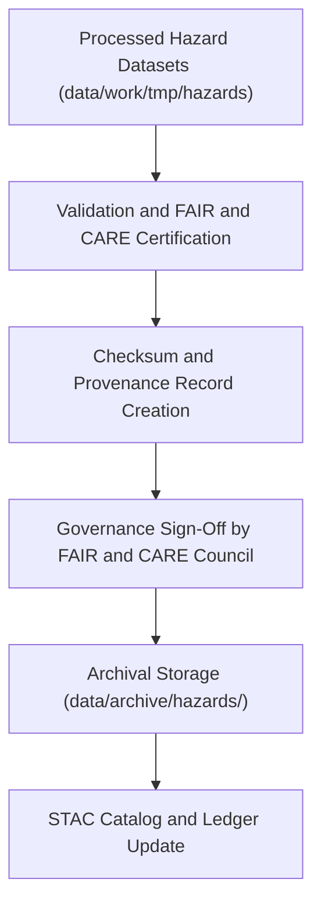

<div align="center">

# 🌪️ Kansas Frontier Matrix — **Hazards Data Archive**
`data/archive/hazards/README.md`

**Purpose:** Contains immutable, versioned archives of validated hazards datasets—floods, tornadoes, droughts, wildfires, and seismic data—preserved under FAIR+CARE governance.  
Ensures reproducibility, integrity, and ethical preservation of historical and environmental hazard data for Kansas.

[](../../../.github/workflows/stac-validate.yml)
[](../../../LICENSE)
[](../../../docs/standards/faircare-validation.md)
[](../../../docs/architecture/repo-focus.md)

</div>

---

## 📚 Overview

The `data/archive/hazards/` directory preserves finalized, validated hazard datasets and metadata under the **FAIR+CARE archival standard**.  
Each dataset within this archive:
- Has passed ETL, schema, and STAC validation.  
- Includes FAIR+CARE and ethics sign-offs.  
- Contains cryptographic checksums and provenance metadata.  
- Is versioned and frozen—ensuring reproducibility and integrity.  

This archive provides Kansas researchers, environmental agencies, and the public with transparent, traceable, and ethically governed hazard data across multiple time periods.

---

## 🗂️ Directory Layout

```plaintext
data/archive/hazards/
├── README.md                            # This file — hazards archive overview
│
├── hazards_v9.3.2/                      # Latest validated hazard dataset (2025)
│   ├── hazards_floods_2025.geojson
│   ├── hazards_tornado_tracks_2025.geojson
│   ├── hazards_drought_zones_2025.geojson
│   ├── metadata.json
│   ├── provenance_record.json
│   ├── checksums.sha256
│   └── validation_report.json
│
├── hazards_v9.2.0/                      # Previous dataset version
│   ├── hazards_combined_2024.geojson
│   ├── metadata.json
│   ├── provenance_record.json
│   └── checksums.sha256
│
└── hazards_legacy/                      # Legacy datasets predating FAIR+CARE alignment
    ├── hazards_2020.geojson
    ├── hazards_2018.geojson
    ├── hazards_archive_notes.md
    └── migration_manifest.json
```

---

## ⚙️ Archival Workflow



**Workflow Description:**
1. ETL and AI pipelines process hazard data from NOAA, FEMA, USGS, and KGS sources.  
2. Validation reports confirm schema, STAC, and FAIR+CARE compliance.  
3. Checksums and provenance files are generated for reproducibility.  
4. FAIR+CARE Council approves and freezes data under `data/archive/hazards/`.  
5. Archival metadata is indexed into the STAC catalog and governance ledger.

---

## 🧩 Metadata Schema

Each archived hazard dataset includes:
| File | Description |
|------|--------------|
| `metadata.json` | Contains dataset title, spatial extent, temporal coverage, and license. |
| `provenance_record.json` | Describes lineage, sources, transformations, and reviewers. |
| `validation_report.json` | Summarizes schema, FAIR, and CARE validation outcomes. |
| `checksums.sha256` | Hash signatures verifying file immutability. |
| `governance_approval.md` | FAIR+CARE Council’s validation statement (optional). |

All metadata conforms to **STAC 1.0**, **DCAT 3.0**, and **FAIR+CARE v9.3.2** schemas.

---

## 🧠 FAIR+CARE Integration

| Principle | Implementation in Archive |
|------------|---------------------------|
| **Findable** | Indexed via STAC and dataset manifest with unique identifiers. |
| **Accessible** | Open under CC-BY 4.0; downloadable from public catalog. |
| **Interoperable** | Standardized GeoJSON, CSV, and TIFF formats. |
| **Reusable** | Rich metadata and provenance allow dataset replication. |
| **Collective Benefit** | Enables disaster preparedness, historical research, and policy design. |
| **Authority to Control** | Governance council ensures ethical data use. |
| **Responsibility** | All data sources verified and attributed. |
| **Ethics** | Bias and sensitivity checks completed for all AI-involved analyses. |

---

## 🔍 Example — Provenance Record (Excerpt)

```json
{
  "dataset_id": "hazards_v9.3.2",
  "source_agencies": ["NOAA", "FEMA", "USGS", "KGS"],
  "compiled_by": "@kfm-etl-ops",
  "validated_by": "@kfm-data-lab",
  "archived_on": "2025-10-28T15:45:00Z",
  "checksum": "b4e98f2e99df345a99c8bdeb76a6ed72aabc1340...",
  "stac_link": "data/stac/items/hazards_v9.3.2.json",
  "governance_status": "approved",
  "fairstatus": {
    "fair_score": 99,
    "care_score": 100
  }
}
```

> 🧩 Each entry links to governance ledgers and validation logs in `data/reports/audit/`.

---

## ⚙️ Source Agencies and Coverage

| Agency | Dataset Type | Spatial Coverage | Temporal Range |
|--------|---------------|-----------------|----------------|
| **NOAA** | Storms, Tornadoes, and Hail Events | Kansas counties | 1950–2025 |
| **FEMA** | Disaster Declarations and Flood Zones | County and region | 1953–Present |
| **USGS** | Seismic, Landslide, and Soil Data | Statewide grid | 1900–Present |
| **KGS** | Geological and Hydrological Hazards | Statewide | 1880–Present |

All datasets are harmonized into consistent coordinate reference systems (EPSG:4326) and temporal spans.

---

## 🧾 Governance & Audit Linkages

All hazard archives connect to:
- `data/reports/audit/data_provenance_ledger.json` — Provenance and governance record.  
- `data/reports/fair/data_care_assessment.json` — Ethical compliance report.  
- `data/reports/validation/stac_validation_report.json` — Validation and schema results.  
- `releases/v9.3.2/manifest.zip` — Global manifest with checksums.  
- `.github/workflows/governance-ledger.yml` — Workflow maintaining governance consistency.  

---

## 🧱 Data Access & Citation

**Access Path:**  
Public access via KFM STAC catalog → `data/stac/items/hazards_v9.3.2.json`

**Citation Example:**
```text
Kansas Frontier Matrix (2025). Kansas Hazard Dataset (v9.3.2).
Integrated hazard archive compiled from NOAA, FEMA, USGS, and KGS data.
Available at: https://github.com/bartytime4life/Kansas-Frontier-Matrix/tree/main/data/archive/hazards
License: CC-BY 4.0
```

---

## 🧾 Version History

| Version | Date       | Author             | Summary |
|----------|------------|--------------------|----------|
| v9.3.2   | 2025-10-28 | @kfm-data-lab      | Added hazards archive schema, governance integration, and FAIR+CARE metadata. |
| v9.3.1   | 2025-10-27 | @bartytime4life    | Linked provenance and checksum validation to global ledger. |
| v9.3.0   | 2025-10-26 | @kfm-architecture  | Established hazards archival workflow documentation. |

---

<div align="center">

**Kansas Frontier Matrix** · *Hazard Intelligence × Provenance × FAIR+CARE Archival Integrity*  
[🔗 Repository](https://github.com/bartytime4life/Kansas-Frontier-Matrix) • [🧭 Docs Portal](../../../docs/) • [⚖️ Governance Ledger](../../../docs/standards/governance/)

</div>
