<div align="center">

# 🕰️ Kansas Frontier Matrix — **Hazards Legacy Archive**
`data/archive/hazards/hazards_legacy/README.md`

**Purpose:** Preserves early (pre-FAIR+CARE) Kansas hazard datasets maintained for reference, provenance continuity, and historical reproducibility.  
These files represent legacy geospatial integrations prior to the adoption of full MCP-DL v6.3 documentation and FAIR+CARE governance workflows.

[](../../../../docs/standards/governance/DATA-GOVERNANCE.md)
[](../../../../LICENSE)
[](../../../../docs/standards/faircare-validation.md)
[](../../../../docs/architecture/repo-focus.md)

</div>

---

## 📚 Overview

The `hazards_legacy/` directory stores historical hazard datasets from the **pre-FAIR+CARE governance era (2015–2023)**.  
These files capture early spatial integrations of flood, tornado, drought, and seismic data that served as foundational material for subsequent validated releases.

While not governed by the same MCP-DL documentation and validation standards as newer releases, all legacy datasets were retroactively reviewed for:
- Provenance continuity and checksum verification.  
- License and attribution consistency.  
- Spatial accuracy and coordinate system alignment.  
- Ethical compliance via retrospective FAIR+CARE audit (2025).  

---

## 🗂️ Directory Layout

```plaintext
data/archive/hazards/hazards_legacy/
├── README.md                            # This file — legacy hazard data overview
│
├── hazards_2020.geojson                 # Pre-standard integrated hazard dataset
├── hazards_2018.geojson                 # Early hazards compilation (NOAA, FEMA)
├── hazards_2016.geojson                 # Initial pilot dataset prototype
├── hazards_archive_notes.md             # Notes and audit results from FAIR+CARE retro-review
└── migration_manifest.json              # Mapping of legacy datasets to current equivalents
```

---

## ⚙️ Legacy Workflow (Historical Context)

```mermaid
flowchart TD
    A["Raw NOAA and FEMA Data (2015–2020)"] --> B["Manual GIS Integration (ArcMap / QGIS)"]
    B --> C["Preliminary Validation (Schema and Projection)"]
    C --> D["Legacy Archive (data/archive/hazards/hazards_legacy)"]
    D --> E["Retrospective FAIR and CARE Review (2025)"]
```



**Historical Notes:**
- Prior to 2023, hazard datasets were integrated manually using ArcMap and QGIS.  
- FAIR+CARE principles were later applied retroactively using the 2025 governance schema.  
- Coordinate systems and boundaries were normalized to **EPSG:4326** during review.  

---

## 🧩 Retrospective FAIR+CARE Audit (2025)

| Principle | Result | Notes |
|------------|--------|-------|
| **Findable** | ⚠️ Partial | Metadata incomplete; identifiers reconstructed from historical manifests. |
| **Accessible** | ✅ Open | Files licensed under CC-BY 4.0 and made public. |
| **Interoperable** | ⚠️ Partial | Some legacy GeoJSON files missing STAC metadata. |
| **Reusable** | ⚠️ Limited | Documentation and provenance partially reconstructed. |
| **Collective Benefit** | ✅ Met | Retained for transparency and research continuity. |
| **Authority to Control** | ✅ Met | Source attribution confirmed (NOAA, FEMA, USGS). |
| **Responsibility** | ⚠️ Partial | Lacked automated QA; ethics review added post-hoc. |
| **Ethics** | ✅ Passed | No sensitive or personal data found in review. |

Results documented in:  
`data/reports/fair/ethics_review_summary.md`

---

## 🧾 Migration Manifest Example

```json
{
  "legacy_file": "hazards_2020.geojson",
  "migrated_to": "data/archive/hazards/hazards_v9.0.0/hazards_combined_2023.geojson",
  "migration_notes": "Legacy schema updated to STAC 1.0 format; added bounding box and license metadata.",
  "checksum_verified": true,
  "governance_reviewed_by": "@kfm-data-lab",
  "review_date": "2025-03-10T12:00:00Z"
}
```

> 🔍 These mappings ensure continuity between pre-FAIR+CARE and standardized datasets for long-term reproducibility.

---

## ⚙️ Governance and Provenance

| Governance Element | Reference |
|---------------------|------------|
| **Retrospective Review Report** | `data/reports/audit/archive_integrity_log.json` |
| **Migration Manifest** | `data/archive/hazards/hazards_legacy/migration_manifest.json` |
| **Ethical Audit Log** | `data/reports/fair/ethics_review_summary.md` |
| **Checksum Log** | `releases/v9.0.0/manifest.zip` |

Legacy records are kept immutable under archival governance policy to preserve data lineage.

---

## ⚖️ Ethical Context Statement

> These legacy hazard datasets are preserved **for transparency and research reproducibility only**.  
> They may contain methodological inconsistencies due to pre-standardization processing workflows.  
> All datasets were reviewed in 2025 and deemed ethically safe for public release.  
> Users are encouraged to reference updated versions (v9.2.0 or later) for operational or analytical use.

---

## 🧾 Citation

```text
Kansas Frontier Matrix (Legacy Archive). Kansas Hazards Dataset (Pre-FAIR+CARE Editions, 2015–2020).
Available at: https://github.com/bartytime4life/Kansas-Frontier-Matrix/tree/main/data/archive/hazards/hazards_legacy
License: CC-BY 4.0
```

---

## 🧾 Version Notes

| Version | Date | Summary |
|----------|------|----------|
| 2020 | Pre-standard unified hazard dataset integrating NOAA and FEMA layers. |
| 2018 | Early geospatial integration tests for flood and tornado hazard overlap. |
| 2016 | Initial pilot dataset; manual digitization and shapefile merge. |
| 2025 Review | FAIR+CARE retrospective audit; migration manifest created; metadata normalized. |

---

<div align="center">

**Kansas Frontier Matrix** · *Legacy Data × Transparency × FAIR+CARE Stewardship*  
[🔗 Repository](https://github.com/bartytime4life/Kansas-Frontier-Matrix) • [🧭 Docs Portal](../../../../docs/) • [⚖️ Governance Ledger](../../../../docs/standards/governance/)

</div>
