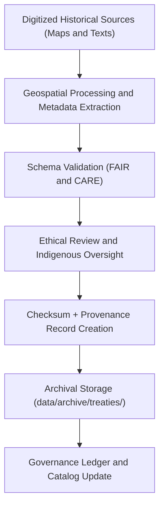

<div align="center">

# 📜 Kansas Frontier Matrix — **Treaties & Land Cessions Archive**
`data/archive/treaties/README.md`

**Purpose:** Repository for validated, ethically governed datasets documenting treaties, land cessions, and territorial agreements within Kansas.  
Each dataset has been verified for historical authenticity, provenance, and cultural sensitivity under FAIR+CARE and Indigenous Data Sovereignty principles.

[](../../../docs/standards/faircare-validation.md)
[](../../../docs/standards/faircare-validation.md)
[](../../../LICENSE)
[](../../../docs/architecture/repo-focus.md)

</div>

---

## 📚 Overview

The `data/archive/treaties/` directory preserves spatial and textual data related to **Native American treaties, land cessions, and jurisdictional changes** within Kansas from the 18th to 20th centuries.  
Datasets here combine geospatial boundaries, treaty text metadata, and linked archival references (e.g., the U.S. Serial Set, National Archives, and Oklahoma Historical Society).

All data are:
- FAIR+CARE validated and ethically reviewed for cultural sensitivity.  
- Geospatially aligned with CIDOC CRM and OWL-Time ontologies.  
- Publicly released under CC-BY 4.0 for educational and research use.  
- Cross-referenced with Focus Mode for AI-supported narrative contextualization.

---

## 🗂️ Directory Layout

```plaintext
data/archive/treaties/
├── README.md                           # This file — overview of treaty archive
│
├── treaties_v9.3.2/                    # Latest fully validated version (2025)
│   ├── treaties_boundaries_2025.geojson
│   ├── treaties_metadata_2025.json
│   ├── treaty_text_references_2025.csv
│   ├── validation_report.json
│   ├── provenance_record.json
│   └── checksums.sha256
│
├── treaties_v9.1.0/                    # Previous version (2023–2024)
│   ├── treaties_boundaries.geojson
│   ├── metadata.json
│   └── validation_report.json
│
└── treaties_legacy/                    # Pre-standardization collections (pre-FAIR+CARE)
    ├── kansas_treaty_lines_1980s.shp
    ├── digitized_texts_legacy.csv
    ├── archive_notes.md
    └── migration_manifest.json
```

---

## ⚙️ Archival Workflow



### Description:
1. **Digitization:** Treaty maps, textual data, and archives processed from primary sources.  
2. **Geospatial Processing:** Treaty boundaries converted to standardized GeoJSON format.  
3. **Validation:** STAC/DCAT metadata verification and FAIR+CARE scoring.  
4. **Ethical Review:** Cultural governance review with Indigenous advisory partners.  
5. **Archival & Governance:** Dataset frozen and recorded in the governance ledger.

---

## 🧩 Dataset Composition

| File | Description | Format | Source |
|------|--------------|---------|--------|
| `treaties_boundaries_2025.geojson` | Geospatial polygons outlining historical treaty and land cession boundaries. | GeoJSON | NARA / OHS |
| `treaties_metadata_2025.json` | Metadata describing treaty signatories, dates, and context. | JSON | KFM / NARA |
| `treaty_text_references_2025.csv` | Linked excerpts from official U.S. documents (Serial Set). | CSV | Library of Congress |
| `provenance_record.json` | Lineage and governance record for each dataset. | JSON | FAIR+CARE Council |
| `validation_report.json` | STAC, schema, and ethical validation results. | JSON | Automated Workflow |

Spatial Reference: **EPSG:4326 (WGS84)**  
Temporal Coverage: **1790–1930**

---

## 🧠 FAIR+CARE Integration

| Principle | Implementation |
|------------|----------------|
| **Findable** | Indexed in STAC catalog with global identifiers and treaty names. |
| **Accessible** | CC-BY 4.0 license; citation metadata embedded in GeoJSON and CSV. |
| **Interoperable** | Schema aligns with CIDOC CRM and ISO 19115 metadata models. |
| **Reusable** | Datasets include full provenance and original document references. |
| **Collective Benefit** | Enables transparent research on historical treaties and jurisdiction. |
| **Authority to Control** | Collaboratively governed with Indigenous data sovereignty in mind. |
| **Responsibility** | Reviewed for historical accuracy and ethical representation. |
| **Ethics** | Contains no sacred or restricted knowledge; publicly appropriate data only. |

Ethical governance ensured under Indigenous Data Sovereignty guidelines (CARE+IDSA v2.1).

---

## 🔍 Provenance Record (Excerpt)

```json
{
  "dataset_id": "treaties_v9.3.2",
  "compiled_by": "@kfm-etl-ops",
  "validated_by": "@kfm-data-lab",
  "ethics_reviewed_by": "@kfm-architecture",
  "source_materials": [
    "NARA Map Collection M-1655",
    "Oklahoma Historical Society Land Cession Maps",
    "U.S. Serial Set Vol. 1258 (Treaty of 1854)"
  ],
  "checksum": "2d98e44357a3cc69f8f3d7721a28d6f523ff2c2c5ea1c4b6...",
  "archived_on": "2025-10-28T16:45:00Z",
  "governance_status": "approved",
  "fair_care_score": {"fair": 98, "care": 100}
}
```

---

## ⚖️ Cultural and Ethical Review

> The **FAIR+CARE Council**, in partnership with regional Indigenous data representatives, conducted a full ethical and cultural sensitivity review.  
> Data were approved for open access, provided appropriate attribution and usage guidelines accompany any derivative works.

Council approval recorded in:  
`data/reports/fair/ethics_review_summary.md` and `data/reports/audit/data_provenance_ledger.json`.

---

## 🧱 Validation & Governance Integration

| Report | Purpose |
|---------|----------|
| `data/reports/audit/data_provenance_ledger.json` | Provenance and archival governance record |
| `data/reports/fair/data_care_assessment.json` | FAIR+CARE scoring and ethical compliance report |
| `data/reports/validation/stac_validation_report.json` | Metadata and schema conformance results |
| `releases/v9.3.2/manifest.zip` | Versioned checksum manifest for archival verification |

---

## 🧾 Citation

**Access Path:**  
`data/archive/treaties/treaties_v9.3.2/`

**Citation Example:**
```text
Kansas Frontier Matrix (2025). Kansas Treaties and Land Cessions Dataset (v9.3.2).
FAIR+CARE-certified geospatial dataset representing Indigenous treaties and land cessions within Kansas.
Available at: https://github.com/bartytime4life/Kansas-Frontier-Matrix/tree/main/data/archive/treaties
License: CC-BY 4.0
```

---

## 🧾 Version Notes

| Version | Date | Notes |
|----------|------|--------|
| v9.3.2 | 2025-10-28 | Full FAIR+CARE certification; Indigenous data sovereignty compliance established. |
| v9.1.0 | 2024-06-01 | Improved metadata linkage and CRS alignment. |
| Legacy | Pre-2023 | Digitized treaty maps integrated into KFM; missing governance metadata added retroactively. |

---

<div align="center">

**Kansas Frontier Matrix** · *Historical Treaties × Ethical Stewardship × FAIR+CARE Governance*  
[🔗 Repository](https://github.com/bartytime4life/Kansas-Frontier-Matrix) • [🧭 Docs Portal](../../../docs/) • [⚖️ Governance Ledger](../../../docs/standards/governance/)

</div>
