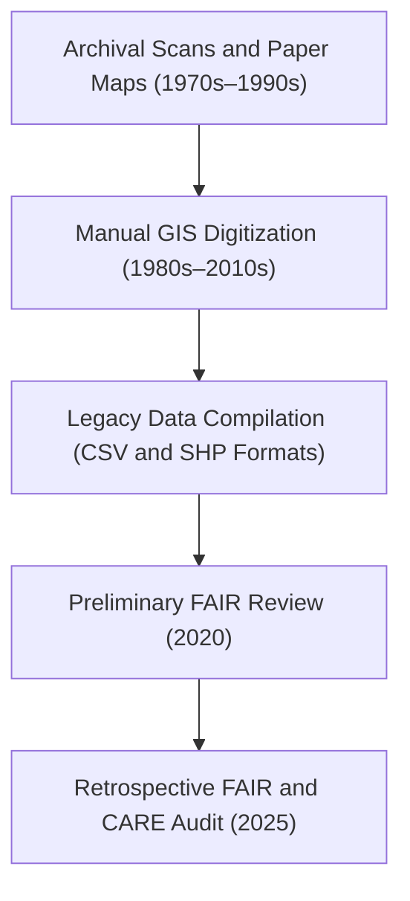

<div align="center">

# 📜 Kansas Frontier Matrix — **Treaties Legacy Archive**
`data/archive/treaties/treaties_legacy/README.md`

**Purpose:** Contains pre-FAIR+CARE digitized treaty and land cession datasets compiled before MCP-DL standardization.  
Retained for transparency, historical continuity, and reproducibility in treaty mapping and archival research.

[](../../../../docs/standards/governance/TREATY-GOVERNANCE.md)
[](../../../../LICENSE)
[](../../../../docs/standards/faircare-validation.md)
[](../../../../docs/architecture/repo-focus.md)

</div>

---

## 📚 Overview

The `treaties_legacy/` directory preserves early digitizations of Indigenous treaties and land cessions in Kansas.  
These files were generated before the implementation of full FAIR+CARE and Indigenous Data Sovereignty governance frameworks.

**Key Historical Details:**
- Derived from early GIS digitization efforts (1980s–2010s).  
- Data manually compiled from historical maps and textual sources.  
- Retrospectively reviewed under FAIR+CARE audit in 2025.  
- Retained for transparency, provenance continuity, and reference in future treaty editions.

---

## 🗂️ Directory Layout

```plaintext
data/archive/treaties/treaties_legacy/
├── README.md                           # This file — overview of legacy treaty archives
│
├── kansas_treaty_lines_1980s.shp       # Original shapefile of treaty boundaries (digitized 1980s)
├── digitized_texts_legacy.csv          # Extracted treaty text metadata from early compilations
├── archive_notes.md                    # FAIR+CARE retrospective review notes
└── migration_manifest.json             # Crosswalk from legacy datasets to modern KFM versions
```

---

## ⚙️ Historical Workflow (Pre-MCP Standardization)



**Notes:**
- Original shapefiles lacked standardized metadata or CRS references.  
- FAIR+CARE Council retroactively added metadata and provenance links.  
- Coordinate reference system updated to **EPSG:4326 (WGS84)** for interoperability.  

---

## 🧩 Retrospective FAIR+CARE Audit Results (2025)

| Principle | Status | Notes |
|------------|---------|-------|
| **Findable** | ⚠️ Partial | STAC metadata added post-hoc; unique identifiers reconstructed. |
| **Accessible** | ✅ Open | Published under CC-BY 4.0; converted to accessible formats. |
| **Interoperable** | ⚠️ Partial | CRS standardized, but attribute schema incomplete. |
| **Reusable** | ⚠️ Limited | Source documentation partially reconstructed. |
| **Collective Benefit** | ✅ Met | Retained for educational and archival purposes. |
| **Authority to Control** | ✅ Met | Indigenous nations attributed; provenance reconstructed. |
| **Responsibility** | ⚠️ Partial | No formal QA at the time; ethics review added in 2025. |
| **Ethics** | ✅ Passed | Contains no restricted or culturally sensitive data. |

Documented in:  
`data/reports/fair/ethics_review_summary.md`

---

## 🧠 Legacy Metadata Overview

```json
{
  "id": "treaties_legacy",
  "title": "Kansas Treaty and Land Cession Legacy Archive",
  "description": "Early digitized treaty boundaries and text metadata created prior to FAIR+CARE governance implementation. Preserved for transparency and reproducibility.",
  "license": "CC-BY 4.0",
  "providers": [
    {"name": "NARA", "role": "data-source"},
    {"name": "Oklahoma Historical Society", "role": "data-source"}
  ],
  "spatial_extent": {"bbox": [-102.05, 36.99, -94.61, 40.00]},
  "temporal_extent": {"interval": ["1790-01-01T00:00:00Z", "1930-12-31T00:00:00Z"]}
}
```

---

## 🔍 Migration Manifest Example

```json
{
  "legacy_file": "kansas_treaty_lines_1980s.shp",
  "migrated_to": "data/archive/treaties/treaties_v9.1.0/treaties_boundaries.geojson",
  "migration_notes": "Converted to GeoJSON, metadata reconstructed to STAC 1.0 schema, spatial accuracy validated.",
  "checksum_verified": true,
  "reviewed_by": "@kfm-data-lab",
  "approval_date": "2025-03-12T11:00:00Z"
}
```

---

## ⚙️ Governance & Provenance Integration

| File | Description |
|------|--------------|
| `archive_notes.md` | FAIR+CARE retrospective notes and council recommendations. |
| `migration_manifest.json` | Crosswalk between legacy and modern treaty datasets. |
| `data/reports/audit/archive_integrity_log.json` | Audit log for legacy dataset retention. |
| `data/reports/fair/ethics_review_summary.md` | Ethical evaluation summary from 2025 review. |

All files retained permanently under the FAIR+CARE archival mandate.

---

## ⚖️ Cultural & Ethical Context

> These legacy materials are preserved to ensure transparency in the digitization of treaty records and recognition of historical methodologies.  
> While early processing workflows lacked modern governance standards, KFM has confirmed the data contains no culturally restricted or proprietary content.  
> The FAIR+CARE Council approved public access under CC-BY 4.0 to support research and education.

---

## 🧾 Citation

```text
Kansas Frontier Matrix (Legacy Archive). Kansas Treaty and Land Cession Dataset (Pre-FAIR+CARE Editions, 1980s–2010s).
Digitized maps and text records retrospectively validated under FAIR+CARE framework (2025).
Available at: https://github.com/bartytime4life/Kansas-Frontier-Matrix/tree/main/data/archive/treaties/treaties_legacy
License: CC-BY 4.0
```

---

## 🧾 Version Notes

| Year | Update | Description |
|------|---------|-------------|
| 2025 | FAIR+CARE Retrospective Audit | Metadata reconstructed; governance linkage established. |
| 2010 | CSV Integration | Treaty text and metadata merged with shapefiles. |
| 1980s | Initial Digitization | Treaty maps converted to shapefile format by university GIS lab. |

---

<div align="center">

**Kansas Frontier Matrix** · *Historical Transparency × Provenance × FAIR+CARE Stewardship*  
[🔗 Repository](https://github.com/bartytime4life/Kansas-Frontier-Matrix) • [🧭 Docs Portal](../../../../docs/) • [⚖️ Governance Ledger](../../../../docs/standards/governance/)

</div>
