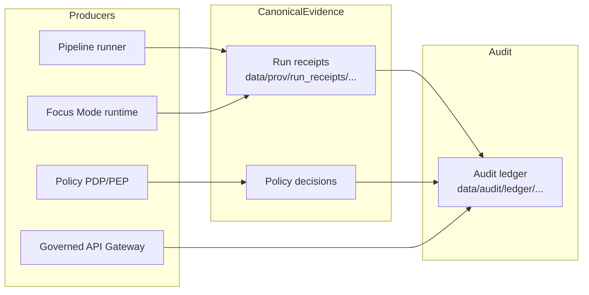

<!-- [KFM_META_BLOCK_V2]
doc_id: kfm://doc/5f5f2d2b-8c4c-4c2a-a3c7-0d0a785e2d7c
title: data/audit README
type: standard
version: v1
status: draft
owners: TBD
created: 2026-02-22
updated: 2026-02-22
policy_label: internal
related:
  - data/prov/
  - docs/governance/
tags:
  - kfm
  - audit
  - governance
  - provenance
notes:
  - This README defines the append-only audit ledger posture and local folder conventions.
[/KFM_META_BLOCK_V2] -->

# data/audit
Append-only audit ledger & operational audit artifacts for KFM (governed, time-aware, evidence-first).


**This directory is the “what happened?” memory**: it records governance-relevant events (runs, policy decisions, promotions, access decisions) in a way that is:
- **append-only**
- **time-stamped**
- **policy-labeled**
- **traceable to evidence/provenance artifacts**

> **WARNING**
> Audit artifacts can become **sensitive** (PII, precise locations, restricted dataset metadata, credentials/URLs). Default-deny, redact, and treat the ledger itself as a governed dataset.

---

## Navigation
- [Purpose](#purpose)
- [Confirmed requirements](#confirmed-requirements)
- [Directory layout](#directory-layout)
- [Audit record types](#audit-record-types)
- [Append-only rules](#append-only-rules)
- [Schemas and validation](#schemas-and-validation)
- [Retention and access](#retention-and-access)
- [Definition of Done](#definition-of-done)
- [Appendix: Example records](#appendix-example-records)

---

## Purpose

KFM uses audit artifacts to make governance enforceable and reviewable:
- support promotion gates (“why was this version promoted/blocked?”)
- support accountability (“which policy version produced this decision?”)
- support safety (“what was generalized/redacted and when?”)
- support incident response (“what changed, by whom/what, and what did it touch?”)

The audit ledger is **not** a debug log. It is a **governance record**.

[Back to top](#dataaudit)

---

## Confirmed requirements

These are the non-negotiable behaviors expected by KFM vNext design guidance:

### CONFIRMED
- **Every pipeline run and every Focus Mode query emits a run receipt** (inputs/outputs/environment/validation/policy).  
- The **audit ledger is append-only** and should be treated as a **governed dataset**.  
- Governance must define an **audit ledger retention and access policy**.

### PROPOSED (implementation posture)
- The audit ledger entries live under `data/audit/` as NDJSON and/or one-record-per-file JSON.
- Run receipts remain provenance artifacts under `data/prov/run_receipts/` (or equivalent), while the audit ledger stores **pointers** to those receipts.

### UNKNOWN (needs repo / governance confirmation)
- Whether this repo stores production audit records or only fixtures (production logs may live in an object store).
- Exact retention duration and archival workflow.
- Exact policy label(s) used for audit artifacts (`internal` vs `restricted`).

[Back to top](#dataaudit)

---

## Directory layout

> This layout is **PROPOSED**. Keep it stable once adopted (tools will depend on it).

```text
data/
└─ audit/
   ├─ README.md
   ├─ ledger/                      # append-only “event stream” (governed dataset)
   │  └─ YYYY/
   │     └─ YYYY-MM/
   │        ├─ events.ndjson        # newline-delimited JSON records (append-only)
   │        └─ events.ndjson.sig    # optional signature/attestation pointer (future)
   ├─ policy_decisions/             # normalized policy decision records (optional mirror)
   │  └─ YYYY/
   │     └─ YYYY-MM/
   │        └─ decision.<id>.json
   ├─ indexes/                      # rebuildable indexes derived from ledger (optional)
   │  └─ README.md
   └─ fixtures/                     # test fixtures (valid/invalid) for CI gates
      ├─ valid/
      └─ invalid/
```

### Why NDJSON?
- Append-only by design (no need to “edit” an array).
- Stream-friendly (can be tailed and processed incrementally).
- Simple to validate line-by-line.

[Back to top](#dataaudit)

---

## Audit record types

KFM expects multiple “audit-worthy” events. Keep them **typed**.

| Type | Producer | Purpose | Must include |
|---|---|---|---|
| `run_receipt_ref` | pipeline runner, Focus Mode runtime | Pointer to the canonical run receipt | `run_id`, `receipt_ref`, `dataset_version_id?`, `policy.decision_id?`, timestamps |
| `policy_decision` | policy PDP/PEP | Accountability for allow/deny + obligations | `decision_id`, `decision`, `policy_label`, `reason_codes`, `obligations`, `rule_id`, `evaluated_at` |
| `promotion_event` | promotion workflow | Governance trace for dataset lifecycle | `dataset_version_id`, `from_zone`, `to_zone`, approver, gate results, timestamps |
| `access_event` | governed API gateway | Security trace without leaking restricted metadata | `principal_hash`, `action`, `resource_ref`, allow/deny, `audit_ref` |
| `security_event` | ops tooling | e.g., secret rotation logged as a structural event | event type + timestamp + scope (no secrets) |

> **NOTE**
> Keep the audit ledger **structural**: store identifiers, digests, and references—avoid raw payloads, PII, or precise coordinates.

[Back to top](#dataaudit)

---

## Append-only rules

### HARD RULES
1. **Never edit or delete existing ledger events.**
2. Corrections are done by **appending a new event** that references the prior event:
   - `supersedes_event_id: "<old_event_id>"`
   - `correction_reason: "<human-readable>"`

3. Every event must include:
   - `event_id` (unique, stable)
   - `event_time` (when it happened)
   - `transaction_time` (when we recorded it)
   - `actor` (service principal / role; hashed for users)
   - `policy` (label + decision ref)
   - `refs` (run_id / dataset_version_id / artifact digests as applicable)

### Recommended ID pattern (PROPOSED)
- `event_id = "kfm://audit/<UTC_ISO8601>.<type>.<random_or_digest>"`

[Back to top](#dataaudit)

---

## Schemas and validation

### PROPOSED repo hygiene
- Add JSON Schemas for audit record shapes:
  - `contracts/schemas/audit_event.schema.json`
  - `contracts/schemas/policy_decision.schema.json`
  - `contracts/schemas/run_receipt_ref.schema.json`

- Add fixtures:
  - `data/audit/fixtures/valid/*.json`
  - `data/audit/fixtures/invalid/*.json`

- CI gates should:
  - validate fixtures against schemas
  - enforce **default-deny** rules for dangerous fields (credentials, exact coordinates, PII)
  - ensure any `receipt_ref` resolves (at least in integration tests)

[Back to top](#dataaudit)

---

## Retention and access

### CONFIRMED requirement (governance artifact)
A formal **audit ledger retention and access policy** must exist.

### PROPOSED defaults until governance finalizes
- Default policy label for audit ledger: `internal`
- Any ledger entries referencing restricted datasets: classify as `restricted` (or split by policy label partitions)
- Redact:
  - user identifiers (store hashes/pseudonyms)
  - URLs containing tokens / query strings
  - exact coordinates for sensitive locations

> **SECURITY NOTE**
> If secrets rotate, record only the fact of rotation + scope + time, never the secret itself.

[Back to top](#dataaudit)

---

## Diagram



[Back to top](#dataaudit)

---

## Definition of Done

Use this checklist when adding a new audit-producing component:

- [ ] Defines a **typed** audit event shape and adds/updates a JSON Schema.
- [ ] Emits **append-only** records (never rewrites).
- [ ] Includes `policy_label` and a `decision_id` reference when policy applies.
- [ ] Does **not** emit secrets, raw PII, or restricted geometry.
- [ ] Adds fixtures (valid + invalid) and CI validates them.
- [ ] Provides a deterministic way to link audit events to run receipts and dataset versions.

[Back to top](#dataaudit)

---

## Appendix: Example records

### Example: `policy_decision` (shape)
```json
{
  "event_type": "policy_decision",
  "event_id": "kfm://audit/2026-02-22T00:00:00Z.policy_decision.abc123",
  "event_time": "2026-02-22T00:00:00Z",
  "transaction_time": "2026-02-22T00:00:01Z",
  "actor": { "principal": "svc:pdp", "role": "policy" },
  "decision": {
    "decision_id": "kfm://policy_decision/xyz",
    "policy_label": "restricted",
    "decision": "deny",
    "reason_codes": ["SENSITIVE_SITE"],
    "obligations": [{ "type": "generalize_geometry", "min_cell_size_m": 5000 }],
    "evaluated_at": "2026-02-22T00:00:00Z",
    "rule_id": "deny.restricted_dataset.default"
  },
  "policy": { "policy_label": "internal" }
}
```

### Example: `run_receipt_ref` (pointer)
```json
{
  "event_type": "run_receipt_ref",
  "event_id": "kfm://audit/2026-02-22T00:10:00Z.run_receipt_ref.def456",
  "event_time": "2026-02-22T00:10:00Z",
  "transaction_time": "2026-02-22T00:10:01Z",
  "actor": { "principal": "svc:pipeline", "role": "operator" },
  "refs": {
    "run_id": "kfm://run/2026-02-20T12:34:56Z.noaa_ncei_storm_events.abcd1234",
    "receipt_ref": "prov://run/2026-02-20T12:34:56Z.noaa_ncei_storm_events.abcd1234",
    "dataset_version_id": "2026-02.abcd1234"
  },
  "policy": { "policy_label": "internal" }
}
```
