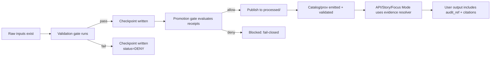

# 🧾 Audit Checkpoints


**This directory contains KFM “checkpoint” artifacts:** machine-readable, durable **receipts** produced at governance gates across the **Truth Path**.

A checkpoint is the canonical “proof” that a governed action happened (ingest, validate, enrich, catalog, publish, serve, explain) and that it passed the required checks **with traceable inputs/outputs**.

> [!IMPORTANT]
> **Checkpoints are not logs.** Logs can be noisy and ephemeral.  
> Checkpoints are **structured**, **reviewable**, and **promotion-grade**.

---

## Why this exists

KFM’s core promise is *evidence-first, provenance-first* intelligence. To enforce that promise with machines (not vibes), we need **receipts** that:

- prove which inputs were used (with digests),
- prove which outputs were produced (with digests),
- record which validators/policies were applied (with versions),
- record what was allowed/blocked (fail-closed),
- support **resolvable citations** and **audit_ref** in downstream outputs (API, Story Nodes, Focus Mode).

---

## What belongs here

✅ **Checkpoint artifacts** (JSON / JSON-LD) that represent *completed governance gates*:

- **Pipeline run receipts** (ingest → validate → enrich)
- **Catalog emission receipts** (STAC / DCAT / PROV outputs created and validated)
- **Promotion gate receipts** (policy evaluation + allow/deny + reasons)
- **Publish receipts** (artifacts promoted to `processed/` and declared promotable)
- **Export receipts** (governed export bundles generated)
- **AI answer receipts** (Focus Mode / Story Node claim set → citations → audit_ref)

Each checkpoint must be safe to reference from:
- CI policy gates (OPA/Rego / Conftest),
- evidence resolvers,
- provenance/citation tooling,
- audit views.

---

## What must NOT be stored here

🚫 Raw datasets or large binaries  
🚫 Secrets (tokens, keys), credentials, session cookies  
🚫 Sensitive precise locations when policy requires redaction/generalization  
🚫 PII unless explicitly approved and policy-permitted (**default: no**)  
🚫 “Free text” narratives as a substitute for structured fields

> [!WARNING]
> If you can’t safely publish the checkpoint to a partner lane, it likely contains too much detail.
> Put sensitive payloads elsewhere and store only **references + digests** here.

---

## Directory layout

> [!NOTE]
> This is a **recommended** layout designed for stable diffs + easy retrieval.  
> If the repo already enforces a different structure, follow the repo rules.

```text
data/
└── audit/
    └── checkpoints/
        ├── README.md
        ├── schema/                      # (recommended) JSON Schema(s) for checkpoints
        │   ├── checkpoint.schema.json
        │   └── promotion-manifest.schema.json
        └── by_date/                     # append-only, time-partitioned
            └── YYYY/
                └── MM/
                    └── DD/
                        └── <run_id>/
                            ├── <checkpoint_id>.json
                            └── <checkpoint_id>.sig     # optional detached signature
```

### Naming conventions

- `run_id` SHOULD be stable for the pipeline execution (or promotion saga).
- `checkpoint_id` SHOULD be content-addressed (hash of canonicalized payload) or a UUID with a recorded `checkpoint_hash`.

---

## Checkpoint lifecycle



---

## Checkpoint types

| `kind` | When created | Primary consumer | Example outcome |
|---|---|---|---|
| `pipeline_run` | after step(s) complete | promotion gate | “validate passed; outputs in work/” |
| `catalog_emit` | after STAC/DCAT/PROV emitted | evidence resolver | “catalog valid; cross-links present” |
| `promotion_gate` | before publish | CI + publish service | allow/deny + reasons |
| `publication` | after promotion | API + UI | “artifact now promotable/served” |
| `export` | when generating a bundle | user downloads | “export created; license honored” |
| `ai_response` | after Focus/Story response | audit | “claims→citations→audit_ref” |

---

## Minimal checkpoint schema (normative)

A checkpoint record MUST include:

| Field | Type | Required | Notes |
|---|---:|:---:|---|
| `checkpoint_id` | string | ✅ | stable identifier |
| `created_at` | string (RFC3339) | ✅ | when receipt was issued |
| `kind` | enum | ✅ | see “Checkpoint types” |
| `status` | enum | ✅ | `ALLOW` / `DENY` / `WARN` |
| `run` | object | ✅ | run identity + lane + tool versions |
| `artifacts` | object | ✅ | inputs + outputs, each with digests |
| `validators` | array | ✅ | what checks were run and results |
| `policy` | object | ✅ | policy decision, versioned |
| `provenance` | object | ✅ | pointers to STAC/DCAT/PROV bundles |
| `hashes` | object | ✅ | `spec_hash`, `checkpoint_hash`, optional chain |
| `notes` | string | ❌ | short, non-sensitive explanation |

### Required `run` fields

- `run.run_id`
- `run.lane` (e.g., `promotion:public`, `promotion:partner`, `internal`)
- `run.actor` (service identity, not a human email)
- `run.policy_version`
- `run.schema_version`

### Required artifact digests

Every input/output item MUST include:

- `uri` (or repo-relative path)
- `sha256` (or stronger; sha256 is minimum)
- `media_type`
- `bytes`
- `license_id` (or reference)

> [!TIP]
> Prefer **references + digests** over embedding large payloads.  
> This keeps diffs small and makes receipts promotable.

---

## Determinism and hashing

KFM relies on **deterministic identities** to keep receipts stable and reviewable:

- `spec_hash` SHOULD represent the canonicalized spec/config/policy inputs for the run.
- `checkpoint_hash` SHOULD be computed from the canonicalized checkpoint body.
- (Optional) `parent_hash` can be used to form a tamper-evident chain.

**Rule of thumb:** if two runs have the same meaningful inputs and the same governed spec, they should produce consistent fingerprints—and reviewers should only see meaningful diffs.

---

## Promotion gate expectations

Promotion MUST be **fail-closed**:

- If a publish/promotion is attempted **without** the required checkpoints, the default outcome is **DENY**.
- If policy cannot evaluate due to missing fields, corrupted receipts, or schema drift, the default outcome is **DENY**.

Promotion checkpoints SHOULD capture:
- intended exposure (public/partner/internal),
- sensitivity labels,
- intersection signals (e.g., “intersects authoritative boundary”),
- consent facets/attestations when required,
- deny reasons when blocked.

---

## Example checkpoint (minimal)

<details>
<summary><strong>Click to expand JSON example</strong></summary>

```json
{
  "checkpoint_id": "chk_01HZZZ...example",
  "created_at": "2026-02-17T19:05:00Z",
  "kind": "promotion_gate",
  "status": "DENY",
  "run": {
    "run_id": "run_2026-02-17T19-00-00Z_abcd1234",
    "lane": "promotion:public",
    "actor": "kfm.promotion-gate",
    "policy_version": "v13",
    "schema_version": "checkpoint.v1"
  },
  "artifacts": {
    "inputs": [
      {
        "uri": "data/work/example/artifact.geoparquet",
        "sha256": "sha256:…",
        "media_type": "application/x-parquet",
        "bytes": 12345678,
        "license_id": "CC-BY-4.0"
      }
    ],
    "outputs": []
  },
  "validators": [
    {
      "name": "schema.checkpoint.v1",
      "status": "ALLOW",
      "details_ref": "data/audit/logs/.../schema_report.json"
    }
  ],
  "policy": {
    "engine": "opa",
    "decision": "DENY",
    "deny_reasons": [
      "missing: artifact.labels.authority_to_control",
      "missing: provenance.facets.tribal_consent"
    ]
  },
  "provenance": {
    "stac_item_ref": "data/stac/items/...json",
    "dcat_dataset_ref": "data/catalog/dcat/datasets/...json",
    "prov_bundle_ref": "data/prov/runs/...jsonld"
  },
  "hashes": {
    "spec_hash": "sha256:…",
    "checkpoint_hash": "sha256:…"
  }
}
```

</details>

---

## CI / validation gates

### Required checks (minimum)

- [ ] Checkpoint validates against `checkpoint.schema.json`
- [ ] Digests verify (sha256 matches referenced file/object)
- [ ] `spec_hash` computed using canonical JSON rules (deterministic)
- [ ] Policy evaluation runs in CI for promotable lanes
- [ ] **Fail-closed**: missing receipts block promotion

### Suggested hardening (next increments)

- [ ] Detached signatures (`.sig`) for promotion/public lanes
- [ ] Hash chaining across related checkpoints for a run
- [ ] Redaction validator to prevent sensitive leakage
- [ ] Retention policy enforcement (TTL, archival, deletion workflow)

---

## Governance & safety notes

> [!IMPORTANT]
> **Checkpoints are governed artifacts.** Treat changes as production-impacting.

- Any schema changes MUST be versioned.
- Any new `kind` MUST ship with:
  - schema updates,
  - conftest tests,
  - documentation updates,
  - migration notes.

---

## Quick glossary

- **Checkpoint**: A receipt of a governance gate result (structured, durable).
- **Audit ledger**: Append-only event stream of actions (high volume, forensic).
- **Promotion**: The act of declaring an artifact promotable/servable (usually into `processed/`).
- **Truth Path**: The staged flow from raw → validate → enrich → catalog → serve → explain.

---

## Contacts / ownership

Ownership is governed by repo CODEOWNERS.  
If unsure: treat this directory as **security + governance critical**.