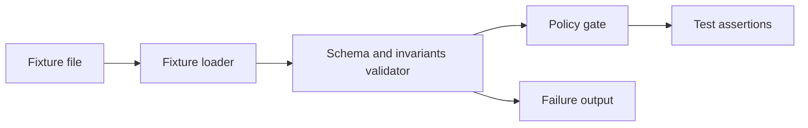

<!-- [KFM_META_BLOCK_V2]
doc_id: kfm://doc/f60c84f0-95a9-4713-b157-8a9688264397
title: Audit Fixtures
type: standard
version: v1
status: draft
owners: TODO
created: 2026-02-24
updated: 2026-02-24
policy_label: restricted
related:
  - TODO: data/audit/README.md
tags: [kfm, audit, fixtures]
notes:
  - This directory contains *non-production* fixture data used to test and document the audit subsystem.
  - Default-deny: fixtures must be synthetic/redacted unless explicitly approved by governance.
[/KFM_META_BLOCK_V2] -->

<a id="top"></a>

# `data/audit/fixtures/` 🧾
Test fixtures for **audit artifacts** (records, receipts, policy decisions) used in unit/integration tests and documentation examples.


> **Goal:** provide deterministic, minimal, and safe fixture inputs that make every audit-related behavior testable and reproducible.

---

## Quick navigation
- [Purpose](#purpose)
- [Where this fits](#where-this-fits)
- [Fixture contract](#fixture-contract)
- [Naming conventions](#naming-conventions)
- [How fixtures are used](#how-fixtures-are-used)
- [Security and governance rules](#security-and-governance-rules)
- [Suggested directory layout](#suggested-directory-layout)
- [Examples](#examples)
- [Definition of done](#definition-of-done)
- [Troubleshooting](#troubleshooting)

---

## Purpose
This directory is the **single place** for fixture datasets used to:

- validate **audit schemas** and **invariants**
- test promotion gates (Raw → Work/Quarantine → Processed → Published)
- test redaction and policy decisions (default-deny)
- provide small, copy/paste-ready examples for docs

### Acceptable inputs
Fixtures **may** be stored as:

- `*.json` (preferred)
- `*.yml` / `*.yaml` (allowed if a loader exists)
- `*.ndjson` (only for small, line-oriented examples)

### Exclusions
Do **not** commit the following into this directory:

- production audit logs, real pipeline receipts, or vendor exports
- secrets of any kind (API keys, tokens, private keys, connection strings)
- PII/PHI or location-sensitive coordinates (unless explicitly approved and safely generalized)
- large binaries or datasets (keep fixtures small and reviewable)
- “golden files” whose meaning isn’t documented (every fixture must have a short docstring/comment)

---

## Where this fits
`data/audit/fixtures/` supports the audit layer by providing deterministic inputs for tests that verify:

- **Traceability:** user-facing claims map back to evidence + policy decisions
- **Reproducibility:** the same inputs produce the same audit outputs
- **Governance:** fixtures never bypass policy boundaries

> **Not confirmed in repo:** the exact module boundaries and test runners that consume these fixtures.

---

## Fixture contract
Fixtures should represent **audit-shaped data**, not “whatever a test needs”.

At minimum, each audit fixture should document:

- **what it represents**
- **what behavior it is testing**
- **what assumptions it makes**

### Recommended minimum fields (guideline)
| Field | Type | Why it exists |
|---|---|---|
| `schema_version` | string | enables safe evolution of the audit format |
| `event_type` | string | supports routing/assertions by event category |
| `event_time` | ISO-8601 string | anchors temporal assertions |
| `actor` | object | records who/what initiated the event |
| `subject` | object | records what entity is being audited |
| `inputs` | array/object | provenance inputs + checksums (as applicable) |
| `outputs` | array/object | provenance outputs + checksums (as applicable) |
| `policy` | object | policy label + decisions + rationale (safe summary) |
| `qa` | object | validation checks + thresholds + pass/fail |

> This table is a **proposed baseline**. If a canonical audit schema exists in the repo, it should be treated as the source of truth.

---

## Naming conventions
Use filenames that support quick scanning in diffs:

- prefix with a **domain** (e.g., `audit_record`, `gate`, `redaction`)
- include **intent** and **expected outcome**
- keep them lowercase with dots/hyphens

Examples:
- `audit_record.minimal.valid.json`
- `audit_record.missing_required_fields.invalid.json`
- `gate.publish.allow.minimal.json`
- `gate.publish.deny.policy_restricted.json`
- `redaction.coordinates.coarsen.json`

---

## How fixtures are used


Typical patterns:
- **unit tests**: validate schema + invariants (fast, deterministic)
- **integration tests**: run through the policy gate / audit pipeline boundary
- **docs**: use `minimal.valid.json` style fixtures for examples

---

## Security and governance rules
Fixtures are part of the **trust membrane**.

- Default to `policy_label: restricted` unless governance explicitly allows otherwise.
- Prefer **synthetic** data or **irreversibly redacted** samples.
- Never include precise coordinates for vulnerable/private/culturally restricted sites; use coarse geography.
- Do not include raw secrets—ever. If a field exists in production, fixture values must be placeholders.

**If sensitivity is unclear:** redact/generalize and flag the fixture as `needs_governance_review`.

---

## Suggested directory layout
> **Proposed (not confirmed in repo):** adopt a small set of subfolders to keep fixtures discoverable.

```text
data/audit/fixtures/
  README.md
  audit_record/
    audit_record.minimal.valid.json
    audit_record.missing_required_fields.invalid.json
  gate/
    gate.publish.allow.minimal.json
    gate.publish.deny.policy_restricted.json
  redaction/
    redaction.coordinates.coarsen.json
```

---

## Examples

### 1) Minimal audit record fixture (example)
```json
{
  "schema_version": "v1",
  "event_type": "pipeline.run.completed",
  "event_time": "2026-02-24T00:00:00Z",
  "actor": {
    "type": "service",
    "id": "example-pipeline-runner"
  },
  "subject": {
    "type": "dataset",
    "id": "kfm://dataset/example"
  },
  "policy": {
    "policy_label": "restricted",
    "decision": "allow",
    "rationale": "Synthetic example fixture. No sensitive content."
  },
  "qa": {
    "checks": [
      { "name": "schema.valid", "passed": true }
    ]
  }
}
```

### 2) “Invalid” fixture note
For invalid fixtures, include a short note in the file (JSON comment alternative: adjacent `*.md` file) stating:

- **expected failure** (what invariant should fail)
- **why this matters** (what regression it prevents)
- **what the correct fix is** (for developers)

---

## Definition of done
Before adding or changing a fixture:

- [ ] Fixture is **small** (reviewable) and deterministic
- [ ] Fixture is **synthetic** or **irreversibly redacted**
- [ ] Filename states **intent** and **expected outcome**
- [ ] A test references the fixture (no orphan fixtures)
- [ ] The fixture includes enough context to understand it without guessing
- [ ] Any schema/policy change includes a **migration strategy** (or version bump)

---

## Troubleshooting
- Tests failing after a schema change? Add a new `schema_version` fixture instead of mutating old fixtures, unless the change is backwards-compatible.
- Policy gate behavior changed? Add paired allow/deny fixtures that isolate the decision point.

---

### Back to top
[↑ Back to top](#top)
