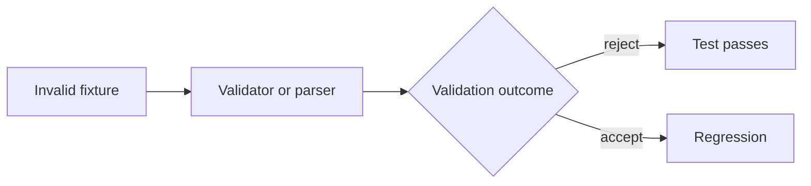

<!-- [KFM_META_BLOCK_V2]
doc_id: kfm://doc/a6b4c818-a580-4299-9864-51c2ae505266
title: Invalid audit fixtures
type: standard
version: v1
status: draft
owners: KFM maintainers
created: 2026-03-02
updated: 2026-03-02
policy_label: public
related:
  - kfm://concept/audit-ledger
  - kfm://concept/run-receipt
  - ../../README.md
tags: [kfm, audit, fixtures, tests]
notes:
  - Intentionally invalid fixtures used to prove validators and CI gates fail closed.
  - Do not include real secrets, PII, or precise sensitive locations.
[/KFM_META_BLOCK_V2] -->

# data/audit/fixtures/invalid
**Intentionally malformed audit artifacts used to prove the audit/receipt validators fail closed.**


**Owners:** KFM maintainers (update CODEOWNERS if your repo uses it)  
**Last updated:** 2026-03-02

---

## Quick links
- [Why this directory exists](#why-this-directory-exists)
- [Where it fits in KFM](#where-it-fits-in-kfm)
- [Directory contract](#directory-contract)
- [Fixture design principles](#fixture-design-principles)
- [How tests should use these fixtures](#how-tests-should-use-these-fixtures)
- [Adding a new invalid fixture](#adding-a-new-invalid-fixture)
- [Security and safety rules](#security-and-safety-rules)
- [FAQ](#faq)

---

## Why this directory exists

KFM treats **run receipts** and the **audit ledger** as part of the trust membrane: if a run cannot produce a
valid receipt/audit entry, it should **not** be promotable (and, ideally, should fail early). This directory
contains **intentionally broken** examples that must be rejected by schema/contract validators and by any
promotion gate that requires valid receipts.

> [!WARNING]
> These fixtures are **not data** and **not examples to copy into production**.  
> They are “negative tests” designed to break parsing and validation.

[Back to top](#dataauditfixturesinvalid)

---

## Where it fits in KFM

This directory is test-only scaffolding under the data tree:

```text
data/
  audit/
    fixtures/
      valid/      # “golden path” receipts/entries that MUST validate
      invalid/    # (this directory) receipts/entries that MUST be rejected
```

If `data/audit/README.md` exists in your repo, it should describe the *runtime* audit ledger and retention
policy. This README is only about **fixtures**.

[Back to top](#dataauditfixturesinvalid)

---

## Directory contract

### ✅ What belongs here (acceptable inputs)

Files in this directory **MUST** be:
- **Intentionally invalid** representations of audit artifacts (e.g., run receipts, audit entries).
- **Minimal**: the smallest file that triggers the intended failure.
- **Deterministic**: no randomness, no environment-dependent values.
- **Non-sensitive**: no real tokens, secrets, PII, or restricted coordinates.

Recommended file types:
- `*.json` / `*.jsonld` (most common for receipts and provenance graphs)
- `*.yaml` (only if your project uses YAML for audit/receipt artifacts)

### ❌ What must NOT go here (exclusions)

- Real production logs, real API keys, credentials, cookies, auth headers.
- Real individual-level records or precise sensitive locations.
- Large blobs, binaries, or anything that makes CI slow.
- “Accidentally invalid” files with no explanation or no test coverage.

> [!NOTE]
> If a fixture is “invalid” only because it’s *incomplete* (e.g., truncated file), prefer placing it under an
> explicit subfolder like `invalid/truncated/` so the intent is obvious.

[Back to top](#dataauditfixturesinvalid)

---

## Fixture design principles

### One fixture = one failure mode

Each invalid fixture should aim to violate **exactly one** contract rule, so test failures are diagnosable.

Examples of targeted failure modes:
- Missing required field (e.g., no `run_id` / `generated_at`).
- Wrong type (string instead of object).
- Malformed digest (doesn’t match `sha256:<hex>` shape).
- Broken referential integrity (links/IDs that don’t resolve).
- Timestamp is not RFC3339 / invalid ordering (end before start).
- Policy decision object missing required fields or includes forbidden fields.

### Naming convention

Use a name that encodes:
1) the artifact type  
2) the failure mode (the rule being tested)  
3) a short human hint

Suggested format:

```text
invalid__<artifact>__<rule>__<hint>.json
```

Example:

```text
invalid__run_receipt__missing_required__no_run_id.json
```

### Optional companion “why” note

To keep invalid JSON minimal (and avoid “extra fields” changing the validation behavior), document intent
using a sidecar markdown file:

```text
invalid__run_receipt__missing_required__no_run_id.json
invalid__run_receipt__missing_required__no_run_id.why.md
```

The `.why.md` should include:
- what contract rule is being violated
- what validator/test is expected to reject it
- the expected error code/message (if stable)

[Back to top](#dataauditfixturesinvalid)

---

## How tests should use these fixtures

**Goal:** Make regressions obvious. If an invalid fixture starts validating, that is a **red alert**.

### Validation flow (conceptual)



Recommended test posture:
- Iterate all files under `data/audit/fixtures/invalid/`
- Run the relevant validator/parser for each file
- Assert that validation **fails**, and (optionally) the error matches the failure mode

### Suggested assertion matrix

| Fixture kind | Expected validator behavior | Test should assert |
|---|---|---|
| Invalid JSON syntax | Parser rejects | “parse error” |
| JSON schema violation | Validator rejects | “schema invalid” |
| Broken links/IDs | Link checker rejects | “referential integrity” |
| Forbidden sensitive fields | Policy gate rejects | “obligation violated” / “restricted leak” |

> [!TIP]
> For stable tests, assert on **error class/code**, not brittle full error strings.

[Back to top](#dataauditfixturesinvalid)

---

## Adding a new invalid fixture

1. **Pick the rule you want to protect** (e.g., digest format, required ID, link resolution).
2. **Start from a known-good fixture** (usually `../valid/…`) and make the smallest change.
3. **Name it** with the convention above.
4. **Add a `.why.md`** if the reason is not obvious from a quick glance.
5. **Add/extend a test** that proves the fixture is rejected.

### Minimum verification steps (repo-local)

Because repo scripts differ, use these “discovery” steps to find the right validator/tests:

```bash
# 1) Find the tests that reference this directory
rg -n "data/audit/fixtures/invalid" -S .

# 2) Find receipt/audit schemas (names vary by repo)
rg -n "run_receipt|audit_.*schema|receipt.*schema" contracts tools packages apps tests -S || true

# 3) Run your normal CI test entrypoint locally (examples; adapt to your repo)
# npm test
# pnpm test
# make test
```

[Back to top](#dataauditfixturesinvalid)

---

## Security and safety rules

Audit logs and receipts can accidentally expose sensitive operational detail. Even in fixtures:

- **Never** include real credentials, internal URLs, or secrets.
- **Never** include real PII.
- If you need “sensitive-looking” examples, use **obviously fake** placeholders.
- If demonstrating sensitive-location rules, use **coarse** geography (or synthetic coordinates).

> [!IMPORTANT]
> Treat fixtures as if they are public. Repos leak.

[Back to top](#dataauditfixturesinvalid)

---

## FAQ

### Why keep invalid fixtures in the repo?

Because “fail closed” must be **provable**. Invalid fixtures are regression tests that prevent:
- validators from weakening over time
- schema drift from silently allowing incomplete receipts
- link-checkers from tolerating broken provenance

### Should we ever delete an invalid fixture?

Only if:
- the corresponding rule is removed intentionally (document the decision), or
- the fixture is redundant and covered by a clearer minimal example.

### What if we introduce `v2` of the receipt schema?

Keep `v1` invalid fixtures until:
- all `v1` validators/tests are removed, **and**
- a migration story exists (or a compatibility mode is explicitly deprecated)

Consider mirroring the structure:

```text
invalid/
  v1/
  v2/
```

[Back to top](#dataauditfixturesinvalid)

---

<details>
<summary><strong>Appendix: Suggested fixture checklist</strong></summary>

- [ ] Minimal reproduction (one failure mode)
- [ ] Naming matches convention
- [ ] Optional `.why.md` added (if not obvious)
- [ ] Test added/updated to assert rejection
- [ ] Contains no secrets/PII/sensitive coordinates
- [ ] Stable across OS / time / locale

</details>
