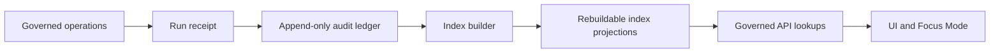

<!-- [KFM_META_BLOCK_V2]
doc_id: kfm://doc/3d8f86a9-2a0a-4e21-9b4e-2d9b3d24c4cc
title: Audit Index Projections
type: standard
version: v1
status: draft
owners: kfm-platform
created: 2026-03-02
updated: 2026-03-02
policy_label: public
related:
  - kfm://doc/promotion-contract
  - kfm://doc/run-receipts-audit-ledger
tags: [kfm, audit, indexes]
notes:
  - This directory stores rebuildable index projections over the append-only audit ledger.
  - The audit ledger itself is sensitive; treat index contents as restricted unless explicitly redacted for public use.
[/KFM_META_BLOCK_V2] -->

# data/audit/indexes — Audit Index Projections

> **Purpose:** Rebuildable, query-optimized *projections* over the KFM **audit ledger** and **run receipts**, used by governed services (API, UI, Focus Mode) to look up `audit_ref`s quickly **without scanning the full ledger**.

<!-- TODO: Replace placeholder badges/links once repo paths and CI workflows are confirmed. -->


## Quick navigation

- [Why this exists](#why-this-exists)
- [What belongs here](#what-belongs-here)
- [What must NOT be here](#what-must-not-be-here)
- [Index contract](#index-contract)
- [Directory layout](#directory-layout)
- [Rebuild workflow](#rebuild-workflow)
- [Security and governance](#security-and-governance)
- [CI gates and Definition of Done](#ci-gates-and-definition-of-done)
- [Minimum verification steps](#minimum-verification-steps)

---

## Why this exists

The audit ledger is **append-only** and designed for traceability. That makes it great for governance, but slow for:
- “Find the audit record for this `audit_ref`”
- “List all runs for `dataset_version_id`”
- “Show all policy denials in a time window”
- “Join Focus Mode outputs to the evidence bundles they cited”

These indexes are **read-optimized projections** built from the ledger so that governed systems can answer those questions quickly *while preserving the ledger as the canonical source of truth*.

### Trust membrane reminder

Audit artifacts and their indexes are **not** a public browsing surface. They are inputs to governed systems which:
- enforce policy and obligations,
- redact where required, and
- return policy-safe `audit_ref`s for debugging and review.

---

## What belongs here

✅ **Allowed (typical)**
- Deterministic index files derived from the audit ledger, e.g.:
  - `audit_ref -> ledger offset / receipt digest`
  - `dataset_version_id -> [audit_ref...]`
  - `artifact_digest -> [audit_ref...]`
  - `date shard -> [audit_ref...]`
- Manifests describing:
  - index builder version,
  - input ledger digest(s),
  - schema version(s),
  - build time, and
  - output digests.

✅ **Allowed (rare; requires governance review)**
- **Public-safe** projections that have been explicitly redacted/generalized and approved for publication.

---

## What must NOT be here

❌ **Do not store**
- Raw, unredacted audit ledger segments.
- Secrets (tokens, cookies, credentials, signing keys).
- PII beyond what policy explicitly permits (often: **none**).
- “Convenience copies” of logs that bypass retention/redaction rules.
- Anything that makes it possible to infer sensitive existence via index presence (e.g., public index shards that differ between 403/404 scenarios).

> **Rule of thumb:** if you wouldn’t expose it via a governed API response, it does not belong in a rebuildable index checked into the repo.

---

## Index contract

Indexes in this folder are **derived** and **rebuildable**.

### Canonical vs rebuildable

- **Canonical:** the audit ledger + run receipts (append-only).
- **Rebuildable:** these index projections.

If an index is missing or corrupted, it must be possible to rebuild it from canonical artifacts.

### Determinism

An index build MUST be deterministic given:
- input ledger digest(s),
- index schema version,
- builder code version, and
- config.

A rebuild must produce identical output digests (or a documented, versioned migration).

---

## Directory layout

> This is the **recommended** layout. If your repo already has a different structure, keep the existing structure and adapt this README (do not rename blindly).

```text
data/audit/indexes/                                       # Audit indexes (derived; rebuildable) for fast lookup across receipts/ledger
├─ README.md                                               # Index purpose, invariants (append-only inputs), rebuild rules, and query patterns
│
└─ v1/                                                     # Index layout/schema version (allows evolvable formats without breaking tooling)
   ├─ manifest.json                                         # Build manifest (inputs, outputs, builder version, digests, time range, provenance)
   │
   ├─ by_audit_ref/                                         # Fast lookup: audit_ref → receipt pointer/location
   │  ├─ shard-0000.jsonl.zst                                # Sharded compressed JSONL (record-per-audit_ref; deterministic ordering)
   │  └─ shard-0001.jsonl.zst
   │
   ├─ by_dataset_version_id/                                # Lookup: dataset_version_id → audit_ref list (supports “what receipts produced this version?”)
   │  └─ shard-0000.parquet                                 # Parquet shard (columnar; efficient for scans/filters)
   │
   ├─ by_artifact_digest/                                   # Lookup: artifact sha256 → audit_ref list (supports integrity + provenance tracing)
   │  └─ shard-0000.parquet
   │
   └─ by_time/                                              # Lookup: time shard → audit_ref list (supports “what happened in month X?”)
      └─ 2026-03.parquet                                    # Monthly shard (example; naming is YYYY-MM)
```

### Naming conventions

- Prefer **versioned roots** (`v1/`, `v2/`) to avoid ambiguous migrations.
- Prefer **sharded** outputs for large ledgers.
- Prefer **content-addressed** references inside indexes (digests / IDs), not filenames.

---

## Rebuild workflow

> Commands below are **illustrative**. Replace with your repo’s real CLI once confirmed.

### Local rebuild (illustrative)

```bash
# Example (PROPOSED): rebuild indexes from the canonical audit ledger
kfm audit indexes rebuild \
  --ledger data/audit/ledger \
  --out data/audit/indexes/v1 \
  --schema v1
```

### CI rebuild check (illustrative)

```bash
# Example (PROPOSED): verify rebuild determinism in CI
kfm audit indexes rebuild --ledger data/audit/ledger --out /tmp/audit-indexes --schema v1
kfm audit indexes diff --a data/audit/indexes/v1 --b /tmp/audit-indexes
```

---

## Security and governance

### Sensitivity

Audit logs and audit-derived indexes are **sensitive** by default:
- They often contain principals, endpoints, timing, and digests.
- They can accidentally leak existence and access patterns.

Treat this directory as **restricted-by-default**, even if the README is public.

### Redaction and retention

- Redaction obligations apply to audit artifacts and any derivative index.
- Retention policies apply to both ledger and projections.

### Access pattern

- **UI/clients never read these files directly.**
- Access is mediated by the governed API (trust membrane).

---

## CI gates and Definition of Done

### Minimum CI gates for index changes

- [ ] Schema validation for every emitted index record
- [ ] Index manifest must include:
  - [ ] input ledger digest(s)
  - [ ] builder version
  - [ ] output digests
- [ ] Rebuild determinism check (golden digest, or reproducible diff)
- [ ] Policy lint: verify no restricted fields appear in any public-safe projection
- [ ] Link integrity: `audit_ref` in index resolves to a real ledger receipt

### Definition of Done for new index type

- [ ] New index has an explicit contract (what keys, what values, what schema version)
- [ ] Index is rebuildable from canonical artifacts
- [ ] Index is sharded/partitioned appropriately for expected scale
- [ ] Index supports the intended governed use-case (API/UI/Focus Mode)
- [ ] Tests cover:
  - [ ] empty ledger
  - [ ] single-run ledger
  - [ ] large ledger (perf smoke)
  - [ ] policy-deny entries
- [ ] README updated (this file) with new index type and format

---

## Minimum verification steps

Because repo state may differ across branches, do these checks before relying on this README:

1. Confirm the canonical ledger location (expected sibling like `data/audit/ledger/`).
2. Locate the index builder (CLI / script / package) and record its invocation.
3. Confirm whether index outputs are checked into git or built at deploy-time.
4. Confirm which fields are considered sensitive in audit records (policy doc).
5. Run a rebuild on a small fixture ledger and verify determinism.

---

### Diagram



<a id="top"></a>
