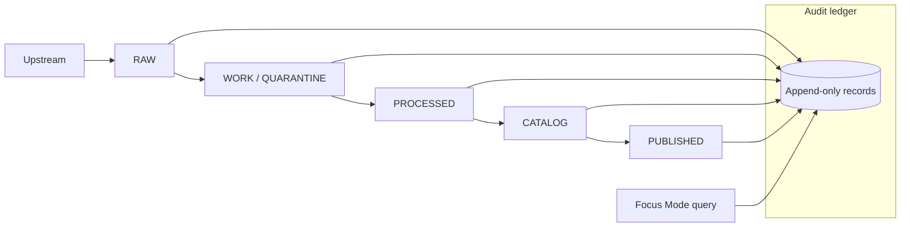

<!-- [KFM_META_BLOCK_V2]
doc_id: kfm://doc/8c33e462-5c92-4c4e-9d6a-4b6c5211c9b1
title: KFM Audit Ledger
type: standard
version: v1
status: draft
owners: TODO(kfm-stewards)
created: 2026-03-02
updated: 2026-03-02
policy_label: restricted
related:
  - kfm://doc/tbd-kfm-governance-guide
  - kfm://doc/tbd-promotion-contract
tags: [kfm, audit, ledger, receipts, provenance, governance]
notes:
  - Append-only audit ledger for run receipts, promotion events, and policy decisions.
  - Treat as a governed dataset; redact/generalize as required by policy.
[/KFM_META_BLOCK_V2] -->

<a id="top"></a>

# 🧾 KFM Audit Ledger
Append-only, governed records that make KFM’s truth path *provable* (runs, promotions, and policy decisions).


> [!WARNING]
> This ledger is **append-only** and must be treated as a **governed dataset**.  
> If you need to “fix” something, you **append a superseding record**—you do not edit history.

---

## Quick navigation
- [Purpose](#purpose)
- [What belongs here](#what-belongs-here)
- [What must not go here](#what-must-not-go-here)
- [How the ledger fits in KFM](#how-the-ledger-fits-in-kfm)
- [Record types](#record-types)
- [Minimum run receipt fields](#minimum-run-receipt-fields)
- [Append-only rules](#append-only-rules)
- [Recommended on-disk layout](#recommended-on-disk-layout)
- [Verification and CI gates](#verification-and-ci-gates)
- [Governance and redaction](#governance-and-redaction)
- [Minimum verification steps](#minimum-verification-steps)
- [Appendix: templates](#appendix-templates)
- [Back to top](#top)

---

## Purpose
The audit ledger exists to make KFM’s governance **enforceable and reviewable** by recording:
- **Run receipts** for *every pipeline run* and *every Focus Mode query*
- **Promotion and publishing events** (who/what/when/why)
- **Policy decisions and obligations** applied to outputs (allow/deny + required redactions)

In KFM terms, the audit ledger is a **canonical store** (source-of-truth for “what happened”). Rebuildable projections (PostGIS/search/tiles) may be regenerated, but the ledger record of events should not be rewritten.  

---

## What belongs here
This directory is for **append-only audit artifacts**, typically JSON/JSONL (or other structured formats) that are:
- **Schema-validated**
- **Content-addressed** (digest-based IDs recommended)
- **Cross-linked** to dataset versions, artifacts, and catalogs

Examples:
- `run_record` receipts emitted by ingestion/processing/catalog jobs
- `focus_query_record` receipts emitted by Focus Mode
- `promotion_event` records when a dataset version is promoted to publishable / published surfaces
- optional `attestation`/`signature` files if you adopt signing later

---

## What must not go here
Default-deny. If you’re unsure, treat as **not allowed** until a governance decision is recorded.

**Do not store:**
- Secrets (API keys, tokens, passwords)
- Raw upstream payloads (those belong in **RAW** zone)
- PII or sensitive details that are not explicitly approved for this ledger’s policy label
- Exact coordinates for vulnerable/private/culturally restricted sites unless policy explicitly allows (prefer generalized geometry or digests)
- Large binaries (images, tiles, parquet, etc.) — store *references + digests*, not blobs

---

## How the ledger fits in KFM

### Truth path context (conceptual)
KFM operates a gated lifecycle:
Upstream → RAW → WORK/QUARANTINE → PROCESSED → CATALOG → PUBLISHED.  
Promotion Contract gates apply at each transition and require run receipts and an append-only audit record.  



### Why this matters
- **Reproducibility:** You can prove what inputs and tools produced an artifact.
- **Governance:** You can prove policy evaluation happened, with obligations recorded.
- **Promotion safety:** You can fail closed if receipts are missing or invalid.

---

## Record types
> This repo directory may implement different filenames/types. The table below describes the **intended** types.

| Record type | Purpose | Typical producers | Typical consumers |
|---|---|---|---|
| `run_record` | Receipt for a pipeline run (ingest/normalize/validate/export/catalog) | pipeline runner, catalog generator | CI gates, stewards, evidence resolver |
| `focus_query_record` | Receipt for a Focus Mode query | Focus Mode service | auditing, UX “evidence drawer”, abuse review |
| `promotion_event` | Proof a dataset version was promoted/published | promotion tooling | release manifests, stewards, rollback tooling |
| `policy_decision` *(inline or referenced)* | allow/deny + obligations + reason codes | policy engine | evidence resolver, API/UI explanations |

---

## Minimum run receipt fields
KFM’s run receipt intent includes inputs, outputs, environment, validation results, and policy decisions.  

A practical minimum schema (recommended) is:

| Field | Type | Notes |
|---|---|---|
| `record_type` | string | e.g., `run_record` |
| `record_version` | string | schema version, e.g., `v1` |
| `record_id` | string | digest or UUID (digest recommended) |
| `transaction_time` | string | when KFM recorded this event (ISO8601) |
| `actor` | object | service principal (avoid PII) |
| `inputs[]` | array | each input references a digest / upstream version |
| `outputs[]` | array | produced artifact digests and logical refs |
| `environment` | object | container image digest, parameters, tool versions |
| `validation` | object | checks + pass/fail + thresholds |
| `policy` | object | allow/deny + obligations + reason codes |
| `links` | object | pointers to DCAT/STAC/PROV entities and dataset_version |

> [!TIP]
> Prefer **digest-addressing** for inputs/outputs and use **canonical JSON hashing** to avoid “hash drift”.

---

## Append-only rules
1. **Never edit or delete** an existing record.
2. Corrections must be expressed as a **new record** that references what it supersedes:
   - `supersedes: <prior_record_id>`
   - `reason: "correction: <short reason>"`
3. Records should be **schema-validated** and **hash-verified** before being accepted.
4. Records must not contain secrets or disallowed sensitive content.
5. If policy changes require redaction:
   - append a **redacted projection record** and mark it as the governed view
   - preserve the original record only if policy explicitly allows retention; otherwise store only a digest pointer in the ledger and keep the original outside the published boundary

---

## Recommended on-disk layout
> **PROPOSED** layout. Adjust to match the repo’s actual implementation.

```text
data/audit/ledger/                                         # Append-only audit ledger (records + schemas + heads + indexes)
├─ README.md                                                # Ledger purpose, append-only rules, retention/posture, and verification steps
│
├─ schemas/                                                 # Schemas for ledger record types (CI + tooling validation)
│  ├─ run_record.schema.json                                # Schema: pipeline/index/catalog run record (who/what/when + inputs/outputs)
│  ├─ promotion_event.schema.json                           # Schema: promotion event (zone change + approvals + artifact digests)
│  └─ focus_query_record.schema.json                        # Schema: Focus query/audit record (policy-safe; citations/abstain metadata)
│
├─ records/                                                 # Append-only ledger records (partitioned by date for auditability)
│  └─ 2026/                                                 # Year partition
│     └─ 2026-03/                                           # Month partition (YYYY-MM)
│        └─ 2026-03-02/                                     # Day partition (YYYY-MM-DD)
│           ├─ run_record_<digest>.json                     # One run record (filename keyed by digest for immutability)
│           └─ promotion_event_<digest>.json                # One promotion event record (digest-keyed)
│
├─ heads/                                                   # Pointers to latest known good ledger state (for consumers)
│  ├─ ledger_head.json                                      # Pointer to latest record digest(s) + time range + optional checkpoints
│  └─ ledger_head.sig                                       # OPTIONAL: signature/attestation for ledger_head.json (integrity)
│
└─ indexes/                                                 # Derived indexes for fast lookup (rebuildable from records/)
   ├─ by_day/                                               # Day-based index (enumerate records by date)
   └─ by_dataset/                                           # Dataset-based index (dataset_id/version → record digests)
```

**Naming guidance**
- Use date partitioning for human navigation.
- Make the **record filename** include the `record_type` and the `record_id`/digest.
- Keep “index” files rebuildable; treat the `records/` as canonical.

---

## Verification and CI gates
This directory is part of the Promotion Contract story. A run receipt + audit record is a minimum gate for promotion.

### Required checks (fail closed)
- [ ] Schema validation for every new record
- [ ] Digest verification (record content matches `record_id` if digest-based)
- [ ] Chain integrity (if you implement `prev_record_id` / hash chaining)
- [ ] No secrets scan / denylist fields
- [ ] Policy decision present and well-formed (allow/deny + obligations)
- [ ] All referenced digests and IDs resolve (artifacts, dataset_version, catalogs)
- [ ] Promotion/publish events recorded as explicit records

### Optional hardening (recommended)
- [ ] Record signing / attestation
- [ ] Cross-check: DCAT/STAC/PROV “triplet” references include the receipt ID
- [ ] WORM storage at the infrastructure layer (object lock / immutable buckets)

---

## Governance and redaction
This ledger is not “just logs.” It is a **governed dataset**:
- Assign a **policy label** to the ledger itself.
- Apply **redaction/generalization obligations** as needed.
- Ensure access is mediated by the same trust membrane principles as other KFM assets.

> [!NOTE]
> If you need evidence for a policy decision, store **reason codes** and **obligation descriptors**, not raw sensitive content.

---

## Minimum verification steps
Use this checklist to convert PROPOSED assumptions into repo-confirmed facts:

1. Locate the ledger’s **actual record format** (JSON vs JSONL) and update this README.
2. Confirm where the **schemas** live (if any) and link them.
3. Identify the **writer(s)**:
   - pipeline runner
   - Focus Mode service
   - promotion tooling
4. Identify the **reader(s)**:
   - CI gate enforcement
   - steward review UI
   - evidence resolver / receipt viewer
5. Confirm whether the ledger is **hash-chained**, **signed**, or **WORM-backed**.
6. Confirm the ledger’s **policy_label** and any required redactions.

---

## Appendix: templates

### Template: `run_record` (minimal)
```json
{
  "record_type": "run_record",
  "record_version": "v1",
  "record_id": "sha256:<DIGEST>",
  "transaction_time": "2026-03-02T18:42:00Z",
  "actor": {
    "kind": "service",
    "id": "kfm/pipeline-runner"
  },
  "links": {
    "dataset_id": "ds:<DATASET_ID>",
    "dataset_version_id": "dsv:<DATASET_VERSION_ID>",
    "catalog_refs": ["dcat://...", "stac://...", "prov://..."]
  },
  "inputs": [
    { "ref": "upstream://...", "digest": "sha256:<DIGEST>" }
  ],
  "outputs": [
    { "ref": "artifact://...", "digest": "sha256:<DIGEST>" }
  ],
  "environment": {
    "container_image_digest": "sha256:<DIGEST>",
    "parameters_digest": "sha256:<DIGEST>"
  },
  "validation": {
    "passed": true,
    "checks": [
      { "id": "schema", "passed": true },
      { "id": "qa.thresholds", "passed": true }
    ]
  },
  "policy": {
    "decision": "allow",
    "obligations": [],
    "reason_codes": ["POLICY_OK"]
  }
}
```

### Template: `promotion_event` (minimal)
```json
{
  "record_type": "promotion_event",
  "record_version": "v1",
  "record_id": "sha256:<DIGEST>",
  "transaction_time": "2026-03-02T19:10:00Z",
  "actor": { "kind": "user_or_service", "id": "kfm/promoter" },
  "promotion": {
    "from": "PROCESSED",
    "to": "PUBLISHED",
    "dataset_version_id": "dsv:<DATASET_VERSION_ID>",
    "run_record_id": "sha256:<RUN_RECORD_DIGEST>"
  },
  "policy": {
    "decision": "allow",
    "obligations": [],
    "reason_codes": ["PROMOTION_GATES_PASSED"]
  }
}
```

---

<a id="back-to-top"></a>
[Back to top](#top)
