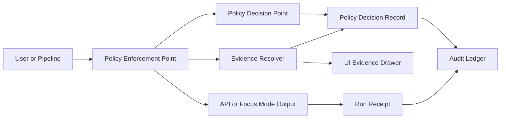

<!-- [KFM_META_BLOCK_V2]
doc_id: kfm://doc/6f3d3f2a-694a-4c2b-a0e0-1f9b2f9f1e5a
title: Policy Decisions Audit Store
type: standard
version: v1
status: draft
owners: KFM Stewardship Team
created: 2026-03-02
updated: 2026-03-02
policy_label: internal
related:
  - data/audit/README.md
  - data/audit/run_receipts/README.md
  - policy/README.md
tags: [kfm, audit, policy, governance]
notes:
  - Append-only policy decision records referenced by run receipts, evidence bundles, and promotion manifests.
  - Default-deny posture; decisions must be reproducible to a policy bundle digest.
[/KFM_META_BLOCK_V2] -->

<a id="top"></a>

# Policy Decisions Audit Store

Append-only, schema-validated **policy decision records** explaining **allow/deny** outcomes and **obligations** for governed access across APIs, evidence resolution, and AI-assisted outputs.


**Owners:** KFM Stewardship Team  
**Policy label:** `internal` (records in this directory may be `restricted` / `restricted_sensitive_location`)  
**Last updated:** 2026-03-02

---

## Navigation

- [Purpose](#purpose)
- [Where this fits](#where-this-fits)
- [Directory layout](#directory-layout)
- [Accepted inputs](#accepted-inputs)
- [Exclusions](#exclusions)
- [Decision record contract](#decision-record-contract)
- [Naming and immutability rules](#naming-and-immutability-rules)
- [Validation and CI gates](#validation-and-ci-gates)
- [Retention and access](#retention-and-access)
- [Glossary](#glossary)

---

## Purpose

This directory exists to store **policy decision artifacts** as part of the KFM “truth path”:

- **Every governed action** (API read, evidence resolution, Story publish, Focus Mode run, dataset promotion) should be explainable by a **decision record** (or a decision reference) that can be audited later.
- Decisions capture:
  - the **policy label** being enforced,
  - the **allow/deny** outcome,
  - the set of **obligations** (redaction, generalization, UI notices, export restrictions),
  - the **policy bundle identity** used to decide (e.g., digest / git commit),
  - an **audit reference** to connect to receipts and UI-safe “why” messages.

> **WARNING**
> Policy decision records can leak sensitive information if mis-modeled (e.g., precise locations, PII, restricted dataset identifiers). Keep the **input summary minimal** and **redacted-by-default**.

[Back to top](#top)

---

## Where this fits

KFM treats “policy” as both a **CI gate** and a **runtime enforcement boundary**. A typical flow is:



**Key principle:** the UI displays policy outcomes (badges / notices) but does **not** decide policy.

[Back to top](#top)

---

## Directory layout

> This README defines the **intended** structure. If the repo uses a different layout, keep the invariants (append-only, schema-valid, redacted) and adjust paths.

| Path | What belongs here | Append-only | Notes |
|---|---|---:|---|
| `records/` | Individual policy decision records (`.json`) | ✅ | Canonical audit artifacts |
| `schema/` | JSON Schema for decision records | ❌ | Contracts, versioned |
| `fixtures/` | Safe example decisions for CI validation | ❌ | No PII, no precise coords |
| `index/` | Optional monthly index files (`.jsonl`) | ✅ | Convenience for analytics |

If you only implement one thing first: **`schema/` + `fixtures/` + CI validation**.

[Back to top](#top)

---

## Accepted inputs

✅ **Allowed / expected**
- `records/*.json` — policy decision records
- `schema/*.schema.json` — JSON Schema(s) for decision record versions
- `fixtures/*.json` — minimal allow/deny examples used by policy/unit tests
- `index/*.jsonl` — append-only indexes of decision metadata (redacted)

[Back to top](#top)

---

## Exclusions

❌ **Do not store here**
- Secrets (tokens, API keys, session cookies)
- Raw request payloads containing PII
- Precise coordinates for restricted/sensitive-location resources
- Full dataset extracts or feature payloads
- Free-form “LLM reasoning” dumps that could echo restricted evidence

**If you need to explain a denial:** store **reason codes + policy-safe message**, and link to the governed evidence/receipt via IDs.

[Back to top](#top)

---

## Decision record contract

### Decision record invariants

A decision record **MUST**:
- be **append-only** (no edits-in-place; corrections are new records)
- include a **version field**
- include a stable **decision_id**
- include **policy bundle identity** (digest and/or commit)
- include the final **decision** (`allow` / `deny`)
- include **obligations** (possibly empty)
- include a **policy_label**
- avoid leaking restricted metadata (redacted-by-default)

### Proposed JSON shape

> **NOTE**
> This is a **repo contract proposal** designed to align with KFM’s published contract fragments (EvidenceBundle, run receipts, promotion manifests). If you already have a canonical schema elsewhere, treat this section as a mapping guide.

```jsonc
{
  "kfm_policy_decision_version": "v1",
  "decision_id": "kfm://policy_decision/<uuid-or-digest>",
  "decided_at": "2026-03-02T18:12:03Z",

  "policy_bundle": {
    "digest": "sha256:<policy-bundle-digest>",
    "git_commit": "<commit-sha>",
    "pdp": "opa",
    "package": "kfm.authz"
  },

  "request": {
    "action": "read",
    "principal": {
      "role": "public",
      "principal_ref": "kfm://principal/<pseudonymous-id>"
    },
    "resource": {
      "resource_type": "dataset_version",
      "resource_id": "kfm://dataset/<slug>@<dataset_version_id>",
      "policy_label": "public"
    }
  },

  "result": {
    "decision": "allow",
    "obligations": [
      {
        "type": "show_notice",
        "message": "Geometry generalized due to policy."
      }
    ],
    "reason_codes": ["ROLE_ALLOWED", "LABEL_PUBLIC"]
  },

  "redaction": {
    "redacted": true,
    "rules_applied": ["NO_PII", "NO_PRECISE_COORDS", "NO_RESTRICTED_METADATA"]
  },

  "links": {
    "audit_ref": "kfm://audit/entry/<id>",
    "run_id": "kfm://run/<id>",
    "correlation_id": "<trace-id>"
  }
}
```

### Obligations registry

Keep obligations **typed** and **machine-actionable**. Recommended starter types:

| Obligation `type` | Meaning | Typical enforcer |
|---|---|---|
| `show_notice` | UI must show a notice | UI |
| `generalize_geometry` | geometry must be generalized to a defined resolution | pipeline / tile server |
| `remove_fields` | remove/blank specific fields | API / export |
| `min_count_threshold` | suppress small counts to reduce reidentification risk | pipeline / API |
| `require_attribution` | attach attribution/license text to exports | API / UI |
| `deny_reason` | policy-safe explanation for denial | API / Focus Mode |

[Back to top](#top)

---

## Naming and immutability rules

### File naming

Store records so they are sortable and collision-resistant.

**Recommended:**
- `records/YYYY/MM/DD/<decided_at>__<decision_id_sanitized>.json`

Example:
- `records/2026/03/02/2026-03-02T18-12-03Z__kfm__policy_decision__a1b2c3.json`

### Append-only rule

A policy decision record is immutable. If you need to correct or supersede a decision record:

- write a **new** decision record
- include a `supersedes: ["kfm://policy_decision/<old>"]` field (if you adopt supersedence)
- never delete without a documented retention policy

[Back to top](#top)

---

## Validation and CI gates

### Minimum CI checks

CI should fail closed if:
- a decision record is not schema-valid
- required fields are missing
- `policy_label` is outside the controlled vocabulary
- prohibited fields appear (PII, precise coords, restricted-only metadata in public fixtures)
- fixtures do not cover allow/deny + obligations cases

### Local validation examples

```bash
# Example: schema validation (replace tooling with repo-standard)
jsonschema -i records/.../decision.json schema/policy_decision.v1.schema.json

# Example: policy fixtures test (OPA/Conftest or equivalent)
conftest test fixtures/ --policy policy/
```

> **TIP**
> Keep `fixtures/` intentionally boring: small, deterministic, safe-to-share JSON samples that are stable across platforms.

[Back to top](#top)

---

## Retention and access

Policy decision records are audit artifacts and may contain sensitive operational details.

**Rules of thumb**
- restrict read access to stewards/operators by default
- redact PII and restricted information in all logs/records
- define and enforce retention and deletion policies (do not “ad hoc delete”)

> **TODO**
> Link to the repo’s “audit ledger retention and access policy” document once it exists.

[Back to top](#top)

---

## Glossary

- **PDP**: Policy Decision Point (evaluates policy and returns allow/deny + obligations)
- **PEP**: Policy Enforcement Point (calls PDP and enforces outcome)
- **policy_label**: classification label driving access and redaction behavior
- **obligation**: required action triggered by policy (e.g., generalize geometry, show notice)
- **run receipt**: governed “what happened” record for a pipeline run or Focus Mode request
- **EvidenceRef / EvidenceBundle**: resolvable evidence objects; evidence resolution is policy-gated

[Back to top](#top)

---

## Appendix

<details>
<summary>Decision record checklist</summary>

- [ ] Versioned record format (`kfm_policy_decision_version`)
- [ ] Stable ID (`decision_id`)
- [ ] Policy bundle digest/commit captured
- [ ] Input summary is minimal + redacted
- [ ] Output includes allow/deny + obligations
- [ ] `policy_label` is present and valid
- [ ] Links include `audit_ref` (and optionally `run_id`)
- [ ] Schema + fixture validation running in CI

</details>
