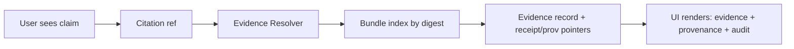

# 🧰 `data/bundles/` — Evidence Bundles (Digest-Addressed)

**Purpose:** This folder holds **governed, immutable, content-addressed _evidence bundles_** that back KFM’s **Evidence Resolver**, **auditability**, and “evidence-first” UX (receipts + catalogs + checksums + provenance pointers).

> [!IMPORTANT]
> **Evidence bundles ≠ OPA policy bundles.**  
> This folder is for **data/metadata/receipts evidence**. OPA/Rego policy packaging (often called “policy bundles”) lives elsewhere (e.g., `policy/`).

---

## ✅ Non-negotiables

> [!IMPORTANT]
> - **Immutable:** never edit a published bundle “in place”. New facts → new bundle digest.
> - **Content-addressed:** bundle folders are keyed by a cryptographic digest (e.g., SHA-256).
> - **Governed:** bundles must carry (or point to) required rights + sensitivity metadata.
> - **Bounded resolution:** evidence must be resolvable in bounded calls (avoid unbounded “rabbit holes”).  
> - **Fail closed:** if rights/sensitivity/required fields are missing or unclear → deny promotion/serving.

---

## Table of contents

- [What belongs here](#what-belongs-here)
- [Directory layout](#directory-layout)
- [How this relates to other KFM folders](#how-this-relates-to-other-kfm-folders)
- [Bundle identity and addressing](#bundle-identity-and-addressing)
- [Minimum bundle contract](#minimum-bundle-contract)
- [Validation gates](#validation-gates)
- [How the API and UI use bundles](#how-the-api-and-ui-use-bundles)
- [Publishing / distribution patterns](#publishing--distribution-patterns)
- [Definition of Done](#definition-of-done)
- [FAQ](#faq)

---

## What belongs here

A **bundle** is a *self-contained evidence packet* for a dataset version and/or pipeline run, containing:

- **Receipts/manifests** (what ran, inputs/outputs, what changed, validation outcome)
- **Checksums** for artifacts (so verification is possible without trusting the server)
- **Catalog snapshots** and/or pointers (STAC/DCAT)
- **Provenance bundle** and/or pointers (PROV-O)
- **Rights & sensitivity declarations** (and any redaction/generalization notes)

> [!NOTE]
> Bundles can be “thin” (pointers + checksums) or “snapshot” (include full catalogs/PROV).  
> For large binary assets (COG/GeoParquet/PMTiles/media), prefer **pointers + checksums** unless the repo is explicitly meant to carry large artifacts.

---

## Directory layout

> [!TIP]
> Use this structure as the **recommended** layout unless the repo already defines a different convention.

```text
data/
└── bundles/
    ├── README.md
    └── sha256/
        ├── <digest>/
        │   ├── bundle.json                 # Bundle descriptor (see “Minimum bundle contract”)
        │   ├── receipts/
        │   │   ├── run_receipt.json        # Receipt for the run/publish
        │   │   ├── run_manifest.json       # Declared inputs/outputs, versions, digests
        │   │   └── validation_report.json  # Machine-readable validation summary
        │   ├── catalogs/
        │   │   ├── stac/                   # Optional snapshot or minimal index
        │   │   └── dcat/                   # Optional snapshot or minimal index
        │   ├── prov/
        │   │   └── bundle.jsonld           # Optional snapshot (PROV-O JSON-LD)
        │   ├── checksums/
        │   │   ├── sha256sums.txt          # Checksums for EVERYTHING in this bundle
        │   │   └── checksums.json          # (Optional) structured checksums
        │   ├── assets/
        │   │   └── assets_manifest.json    # (Optional) URIs + digests for large assets
        │   └── attestations/
        │       ├── cosign.bundle.json      # (Optional) signature metadata
        │       └── sbom.spdx.json          # (Optional) software bill of materials
        └── <digest2>/...
```

---

## How this relates to other KFM folders

The repo’s broader layout typically separates **domain data**, **catalogs**, and **releases**:

- Domain lifecycle: `data/<domain>/{raw,work,processed}/`
- Catalog outputs: `data/stac/`, `data/catalog/dcat/`, `data/prov/`
- Release packaging: `releases/` (versioned bundle artifacts, manifests, SBOM)

This folder (`data/bundles/`) is for **bundle-shaped evidence packets** that can be:
- used locally (dev/test),
- cached for audits,
- promoted into `releases/`,
- or published externally (e.g., OCI by digest).

---

## Bundle identity and addressing

### Folder naming

Bundles are **digest-addressed**:

- `data/bundles/sha256/<digest>/`

Where `<digest>` is the **SHA-256** of the *canonical* bundle descriptor (or equivalent canonical tarball/OCI artifact).

### Canonicalization rule

If a JSON descriptor is hashed/signed, it must be canonicalized (stable serialization) before hashing/signing, so that identical semantics produce identical digests.

> [!TIP]
> Use a single canonicalization rule across the system (e.g., RFC 8785 JCS) to keep hashes stable.

---

## Minimum bundle contract

This folder is governed by a **minimum evidence contract**. A bundle should be able to answer:

1) **What was produced?**  
2) **How was it validated?**  
3) **Where are the catalogs that describe it?**  
4) **Where is provenance for how it was derived?**  
5) **What rights/sensitivity constraints apply?**  
6) **What is the content-addressable identifier for audit integrity?**

### `bundle.json` (recommended shape)

`bundle.json` is the **entrypoint** for local tooling and for any “bundle resolver” that loads evidence from disk.

Recommended fields (extend as needed):

```json
{
  "bundle_id": "sha256:<digest>",
  "created_at": "YYYY-MM-DDTHH:MM:SSZ",
  "dataset_id": "kfm.<domain>.<name>",
  "version_id": "vX.Y.Z",
  "spec_hash": "sha256:<hash>",
  "run_id": "<immutable-run-id>",
  "evidence_bundle_hash": "sha256:<digest>",
  "receipts": {
    "run_receipt": "receipts/run_receipt.json",
    "run_manifest": "receipts/run_manifest.json",
    "validation_report": "receipts/validation_report.json"
  },
  "catalogs": {
    "stac": ["catalogs/stac/"],
    "dcat": ["catalogs/dcat/"]
  },
  "prov": ["prov/bundle.jsonld"],
  "assets_manifest": "assets/assets_manifest.json",
  "rights": {
    "license": "SPDX-ID-or-text",
    "attribution": "…"
  },
  "sensitivity": {
    "class": "public|restricted|…",
    "notes": "…"
  }
}
```

> [!NOTE]
> The system also uses **EvidenceBundle** objects at the API layer (arrays of refs by kind). This on-disk `bundle.json` is a *storage-friendly entrypoint*; API models may be derived from it.

---

## Validation gates

A bundle is “servable” only if it passes these checks:

### 1) Schema validation (contracts-first)

- `run_receipt.json` validates against the governed schema.
- `run_manifest.json` validates against the governed schema.
- `validation_report.json` validates against the governed schema.

### 2) Policy gates (fail-closed)

- Rights metadata present and policy-compliant.
- Sensitivity class present and policy-compliant.
- Public bundles do **not** contain restricted fields (e.g., precise coordinates where prohibited).
- Any missing required field is a **deny**.

### 3) Integrity checks

- `sha256sums.txt` covers all files in the bundle directory (including itself if you’re using a structured checksum approach).
- Checksums match file contents.
- `evidence_bundle_hash` matches folder digest.

### 4) Bounded evidence resolvability

Every evidence reference that will appear in citations must resolve to **human-readable evidence** using a bounded resolver rule (example: “≤ 2 hops”).

> [!TIP]
> Add a contract test: “Every evidence ref in bundle resolves under the resolver’s hop limit.”

---

## How the API and UI use bundles

### API expectation (conceptual)

At the API layer, **EvidenceBundle** is typically a structure like:

- `stac`: array of STAC evidence refs
- `dcat`: array of DCAT evidence refs
- `prov`: array of PROV evidence refs
- `graph`: array of graph evidence refs

…and citations resolve via an Evidence Resolver endpoint (e.g., `/api/v1/evidence/{kind}/{id}`).

### UI expectation (conceptual)

Bundles drive:
- Evidence drawer (citations → resolvable evidence)
- Provenance chain viewer (PROV)
- ReceiptViewer + trust badges (valid/signed vs invalid/unsigned)
- Audit drawer (`audit_ref` + bundle hash)



---

## Publishing / distribution patterns

Bundles may be distributed in multiple ways:

1) **Repo-local** (`data/bundles/`) for dev/test and reproducibility
2) **Release artifacts** (`releases/`) as versioned, immutable published packages
3) **OCI by digest** (artifact published by digest, evidence attached as referrers, signed/attested)

> [!IMPORTANT]
> If an external distribution channel is used, keep **digest addressing** as the anchor so “what was served” remains verifiable.

---

## Definition of Done

A bundle is considered **ready** when:

- [ ] Bundle folder is digest-addressed (`sha256/<digest>/`)
- [ ] `bundle.json` exists and is internally consistent
- [ ] `run_receipt`, `run_manifest`, `validation_report` exist and validate
- [ ] Rights + sensitivity metadata are present and policy-compliant
- [ ] Checksums exist and verify
- [ ] Evidence refs are resolvable in bounded calls
- [ ] Any required redaction/generalization has been applied and documented
- [ ] Bundle hash is emitted/recorded wherever audit integrity is required

---

## FAQ

### “We found a mistake. Can we fix a bundle?”
No. **Do not mutate.** Create a new bundle with a new digest and deprecate the old one via catalogs/metadata.

### “Do bundles contain the actual data files?”
Sometimes, but prefer **pointers + checksums** for large assets. The governance requirement is verifiability and traceability, not necessarily in-repo storage.

### “How is this different from `releases/`?”
`releases/` is for **published** packages (versioned data bundles, manifests, SBOM).  
`data/bundles/` is for **bundle-shaped evidence packets** used in local workflows and as building blocks for publishing.

### “Is this the same as an OPA policy bundle?”
No. Evidence bundles are **data evidence**; policy bundles are **policy packaging**.

---
