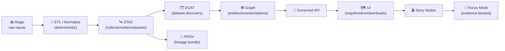

<div align="center">

# 🗂️ Data Catalog (DCAT) — `data/catalog/`


-0B7285)


**Discoverability metadata** for KFM datasets — **not the data itself**.  
DCAT is how KFM becomes *searchable + harvestable + shareable* **without** breaking provenance or governance. 🧭🧾

</div>

---

## 🚀 Quick links

- 📦 **DCAT entries** → [`./dcat/`](./dcat/)
- 🛰️ **STAC collections/items** → [`../stac/collections/`](../stac/collections/) · [`../stac/items/`](../stac/items/)
- 🧬 **PROV lineage bundles** → [`../prov/`](../prov/)
- 🕸️ **Graph exports (if present)** → [`../graph/`](../graph/)
- 🗺️ **Back to data root (if present)** → [`../README.md`](../README.md)
- 🔐 **Security policy** → [`../../SECURITY.md`](../../SECURITY.md) *(or `.github/SECURITY.md` depending on repo convention)*
- 🧪 **Catalog QA gate** → `tools/validation/catalog_qa/` *(recommended location)*

> [!TIP]
> DCAT is your **“dataset landing metadata”**: titles, licensing, access/distribution URLs, and high-level coverage.  
> STAC is your **“geospatial asset index”**: footprints, time, and web-ready assets.

---

<details>
<summary><strong>📌 Table of contents</strong></summary>

- [🎯 What `data/catalog/` is (and is not)](#-what-datacatalog-is-and-is-not)
- [🧱 Where DCAT fits in the KFM pipeline](#-where-dcat-fits-in-the-kfm-pipeline)
- [🗺️ Folder map (orientation)](#️-folder-map-orientation)
- [🧾 DCAT rules in KFM](#-dcat-rules-in-kfm)
- [🔗 Cross-linking rules: STAC ↔ DCAT ↔ PROV ↔ Graph](#-cross-linking-rules-stac--dcat--prov--graph)
- [🔒 Sensitive data & access control](#-sensitive-data--access-control)
- [✅ “Add or update a dataset” checklist](#-add-or-update-a-dataset-checklist)
- [🧪 Validation & CI gates](#-validation--ci-gates)
- [🧩 DCAT JSON-LD template (starter)](#-dcat-json-ld-template-starter)
- [🧠 AI-generated / derived artifacts still count as datasets](#-ai-generated--derived-artifacts-still-count-as-datasets)
- [🗃️ Distribution patterns (what DCAT typically points to)](#️-distribution-patterns-what-dcat-typically-points-to)
- [❓ FAQ](#-faq)
- [📚 Project reference library](#-project-reference-library)
- [🕰️ Version history](#️-version-history)

</details>

---

## 🎯 What `data/catalog/` is (and is not)

### ✅ This folder **IS**
- 🗂️ **DCAT/JSON-LD dataset discovery metadata** for KFM (search, filtering, harvesting).
- 🧾 A **required boundary artifact**: we ship datasets with **STAC + DCAT + PROV** alignment.
- 🛡️ A **governance surface**: datasets can be discoverable without bypassing access controls.

### ❌ This folder is **NOT**
- 🗃️ A place to store rasters/vectors/models/reports.
- 🧩 A replacement for STAC items/collections (STAC describes geospatial assets).
- 🧨 A place for one-off fields that can’t be validated (schemas > vibes).

> [!IMPORTANT]
> In KFM, **metadata is code**: missing license/providers/links is a breaking change for federation + trust.

---

## 🧱 Where DCAT fits in the KFM pipeline

KFM is intentionally ordered (no skipping stages):



**Why this order matters**
- STAC is how map engines + catalog tools “see” geospatial assets.
- DCAT is how portals + harvesters “see” datasets (including non-spatial).
- PROV is how humans (and future you) trust the dataset.

---

## 🗺️ Folder map (orientation)

```text
📁 data/
├─ 📁 catalog/
│  ├─ 📁 dcat/                🗂️ DCAT dataset entries (JSON-LD) live here
│  └─ 📄 README.md            👈 you are here
├─ 📁 stac/
│  ├─ 📁 collections/         🛰️ STAC collections
│  └─ 📁 items/               📦 STAC items
├─ 📁 prov/                   🧬 PROV activities/bundles
├─ 📁 graph/                  🕸️ graph exports (csv/cypher), if used
└─ 📁 <domain>/               🌾🏙️🌎 domain staging (raw/work/processed)
   ├─ 📁 raw/
   ├─ 📁 work/
   └─ 📁 processed/
```

> [!TIP]
> Keep **DCAT** (discovery) separate from **STAC** (asset index) and **PROV** (lineage).  
> It makes validation, governance, and federation dramatically easier. ✅

---

## 🧾 DCAT rules in KFM

### 🎛️ KFM “dataset unit”
In KFM, a dataset is anything that can be:
- discovered,
- accessed (directly or via API),
- cited,
- versioned.

That includes:
- 🛰️ geospatial layers (vector/raster/tiles),
- 🧾 documents & reports,
- 📈 model outputs & evaluation artifacts,
- 🧪 derived/processed data products,
- 🧠 ML/analytics datasets (with provenance + checksums).

### 🏷️ File naming convention (recommended)
Prefer stable, grep-friendly names:

```text
data/catalog/dcat/<dataset_id>.jsonld
# example:
data/catalog/dcat/kfm.ks.agriculture.ndvi.2017_2025.v1.jsonld
```

### ✅ Minimum required fields (KFM baseline)
These fields prevent “mystery datasets” and broken harvesters:

- `dct:identifier` (or a stable `@id`)
- `dct:title`
- `dct:description`
- `dct:license` (SPDX identifier or URL)
- `dcat:keyword` (at least a few)
- `dct:publisher` (org or authority)
- `dcat:distribution` (at least one)
- `dct:issued` and/or `dct:modified` (recommended)
- `dct:accessRights` (Public/Internal/Confidential/Restricted — see below)

### 🌎 Geospatial-friendly additions (recommended)
DCAT can carry spatial/temporal coverage even if STAC holds the canonical geometry:

- `dct:spatial` *(coarse footprint or Kansas-level reference)*
- `dct:temporal` *(start/end or event window)*
- `dcat:theme` *(controlled tags if you have them)*
- `dct:accrualPeriodicity` *(update cadence)*

> [!NOTE]
> Keep **precise geometry** and **per-asset detail** in STAC.  
> Keep **human discoverability** and **harvester-friendly metadata** in DCAT.

---

## 🔗 Cross-linking rules: STAC ↔ DCAT ↔ PROV ↔ Graph

KFM lives or dies on link integrity. These artifacts must reference each other cleanly:

| Artifact | Lives in | Must link to | Purpose 🧠 |
|---|---|---|---|
| 🛰️ STAC Collection/Item(s) | `data/stac/**` | real assets + preview + provenance hooks | map + search + indexing |
| 🗂️ DCAT Dataset | `data/catalog/dcat/**` | STAC collection/item **or** governed API/landing page | discoverability + harvesting |
| 🧬 PROV bundle | `data/prov/**` | inputs → activity → outputs → agents | reproducibility + trust |
| 🕸️ Graph | DB or `data/graph/**` | stable IDs referencing catalogs | narrative + reasoning integrity |

> [!CAUTION]
> **UI must not hardcode storage URLs** that bypass governance.  
> Prefer distribution links that resolve through **governed API** or signed URLs.

---

## 🔒 Sensitive data & access control

KFM is “mostly open,” but some metadata can still leak sensitive detail.

### 🧭 Classification levels (recommended)
| Level | Who can access | DCAT behavior |
|---|---|---|
| **Public** 🌍 | everyone | normal distributions allowed |
| **Internal** 🏢 | collaborators | distributions may require auth |
| **Confidential** 🔐 | approved users | avoid direct download URLs; use gated access URLs |
| **Restricted** 🧨 | owners/admins | **no precise coordinates**, minimal disclosure, gated landing page only |

### ✅ Safe patterns for restricted datasets
- Use **coarse spatial coverage** (county-level, grid, Kansas-only statement).
- Use `dcat:accessURL` pointing to an **access request** or **governed API endpoint** (auth required).
- Avoid:
  - direct `downloadURL` to raw storage
  - embedded sensitive coordinates
  - overly specific “where to find it” instructions

> [!IMPORTANT]
> If a dataset involves culturally sensitive locations, protected resources, or anything governed by consent/sovereignty:
> - do not publish precise coordinates in DCAT,
> - use generalized coverage,
> - follow the rules in the repo’s governance docs and `SECURITY.md`.

---

## ✅ “Add or update a dataset” checklist

### 0) Pick a stable dataset ID 🏷️
This ID becomes the join key across STAC/DCAT/PROV/Graph.

Recommended pattern:
```text
kfm.<state>.<domain>.<layer_or_product>.<time_or_range>.<version>
# example:
kfm.ks.hydrology.flood_extent.1993.v1
```

### 1) Stage data properly 📥
- `raw/` = immutable source snapshot / pointer manifests
- `work/` = intermediate
- `processed/` = publishable artifacts

### 2) Produce the “publication bundle” 📦
At publish time you should produce (or update):

- 🛰️ `data/stac/collections/<id>/collection.json`
- 📦 `data/stac/items/<id>/<item>.json`
- 🗂️ `data/catalog/dcat/<id>.jsonld`
- 🧬 `data/prov/<run_id>/prov.jsonld` *(or similar bundle)*
- (optional) 🕸️ graph import/export refs (IDs only)

### 3) Sanity check discoverability 🧠
Ask:
- Can someone identify what this is **without** opening raw files?
- Is license clear?
- Is the access method explicit?
- Is provenance traceable?

---

## 🧪 Validation & CI gates

### ✅ Local quick checks (muscle memory)
```bash
# JSON parse sanity
python -m json.tool data/catalog/dcat/<dataset_id>.jsonld > /dev/null

# optional: jq formatting + smoke check
jq . data/catalog/dcat/<dataset_id>.jsonld > /dev/null
```

### ✅ “Catalog QA” gate (recommended)
KFM treats broken links and missing license/providers as a ship-stopper.

```bash
python3 tools/validation/catalog_qa/run_catalog_qa.py \
  --root data/ \
  --glob "**/collection.json" \
  --fail-on-warn
```

**Recommended DCAT checks to add to CI**
- `dct:license` present
- at least one `dcat:distribution`
- validate `dcat:accessURL`/`downloadURL` is reachable *(if public)*
- ensure `dct:accessRights` exists (or fail closed)
- forbid restricted datasets from containing precise coordinates *(lint rule)*

> [!TIP]
> Keep PR gates fast (fixtures + metadata). Run heavy validation nightly.

---

## 🧩 DCAT JSON-LD template (starter)

<details>
<summary><strong>📄 Minimal DCAT JSON-LD skeleton</strong></summary>

```json
{
  "@context": {
    "dcat": "http://www.w3.org/ns/dcat#",
    "dct": "http://purl.org/dc/terms/",
    "prov": "http://www.w3.org/ns/prov#",
    "xsd": "http://www.w3.org/2001/XMLSchema#"
  },
  "@id": "kfm:dataset/<dataset_id>",
  "@type": "dcat:Dataset",

  "dct:identifier": "<dataset_id>",
  "dct:title": "<Human readable title>",
  "dct:description": "<What it is, scope, intended use, caveats>",
  "dct:publisher": {"@id": "kfm:org/<publisher_id>"},
  "dct:license": "<SPDX or URL>",
  "dct:accessRights": "Public",

  "dcat:keyword": ["kansas", "<domain>", "<theme>"],

  "dct:issued": {"@value": "2026-01-08", "@type": "xsd:date"},
  "dct:modified": {"@value": "2026-01-08", "@type": "xsd:date"},

  "dcat:distribution": [
    {
      "@type": "dcat:Distribution",
      "dct:title": "STAC Collection",
      "dcat:accessURL": "../stac/collections/<id>/collection.json",
      "dct:format": "application/json",
      "dcat:mediaType": "application/json"
    }
  ],

  "prov:wasGeneratedBy": "kfm:prov/<run_id>"
}
```

</details>

> [!NOTE]
> This is a **starter shape**, not the final contract.  
> If/when KFM adds a formal DCAT profile (recommended), this README should link to it and CI should validate against it.

---

## 🧠 AI-generated / derived artifacts still count as datasets

If an AI/ML pipeline produces:
- 🛰️ raster layer → **STAC + DCAT + PROV**
- 📈 model metrics/plots → **DCAT + PROV**
- 🧾 reports → **DCAT + PROV**
- 🕸️ derived entities/relationships → **graph ingestion must reference provenance-backed IDs**

> [!IMPORTANT]
> “AI did it” is not provenance. Every derived artifact needs lineage.

---

## 🗃️ Distribution patterns (what DCAT typically points to)

Pick distributions based on how users actually access the asset:

### Pattern A — Direct download (public + small-ish)
- `dcat:downloadURL` → GeoJSON/CSV/GeoPackage/PDF artifact
- include `dct:format`, `dcat:mediaType`, optional `dcat:byteSize`

### Pattern B — STAC-first (geospatial streaming)
- `dcat:accessURL` → STAC Collection/Item
- STAC assets point to COGs/tiles/Parquet/etc.

### Pattern C — Governed API (auth / rate limits / redaction)
- `dcat:accessURL` → API endpoint requiring auth
- supports signed URLs, scope-limited tokens, redaction/generalization

### Pattern D — “Landing page only” (restricted metadata)
- `dcat:landingPage` → access request + justification page
- no direct file links

---

## ❓ FAQ

<details>
<summary><strong>Why do we need DCAT if we already have STAC?</strong></summary>

**STAC** is optimized for geospatial assets: footprints, time, and streaming-friendly assets.  
**DCAT** is optimized for dataset discovery across *all* dataset types and external harvesting (portals, catalogs, inventory tooling).

KFM uses both (plus PROV) so the system stays discoverable **and** auditable.

</details>

<details>
<summary><strong>What breaks if DCAT isn’t updated?</strong></summary>

- dataset inventories drift
- portals/harvesters can’t find new datasets
- governance views (“what is public vs restricted?”) become unreliable
- CI should (ideally) fail on missing metadata fields and broken distribution links

</details>

<details>
<summary><strong>Should DCAT duplicate STAC metadata?</strong></summary>

No. Prefer:
- STAC = canonical geospatial asset details
- DCAT = human discovery + access + licensing + high-level coverage

</details>

---

## 📚 Project reference library

> ⚠️ Reference PDFs may have **different licenses** than the repository code/data.  
> Keep them in `docs/library/` (or outside the repo) and respect upstream terms.

<details>
<summary><strong>🧠 Canonical KFM design & system docs</strong></summary>

- `docs/specs/Kansas Frontier Matrix (KFM) – Comprehensive Technical Documentation.docx`

</details>

<details>
<summary><strong>🗺️ GIS, spatial ops, cartography</strong></summary>

- `docs/library/python-geospatial-analysis-cookbook.pdf`
- `docs/library/PostgreSQL Notes for Professionals - PostgreSQLNotesForProfessionals.pdf`
- `docs/library/making-maps-a-visual-guide-to-map-design-for-gis.pdf`
- `docs/library/Mobile Mapping_ Space, Cartography and the Digital - 9789048535217.pdf`
- `docs/library/compressed-image-file-formats-jpeg-png-gif-xbm-bmp.pdf`

</details>

<details>
<summary><strong>🛰️ Remote sensing</strong></summary>

- `docs/library/Cloud-Based Remote Sensing with Google Earth Engine-Fundamentals and Applications.pdf`

</details>

<details>
<summary><strong>🌐 Web UI + 3D/graphics</strong></summary>

- `docs/library/responsive-web-design-with-html5-and-css3.pdf`
- `docs/library/webgl-programming-guide-interactive-3d-graphics-programming-with-webgl.pdf`

</details>

<details>
<summary><strong>📈 Statistics, ML, modeling discipline</strong></summary>

- `docs/library/Understanding Statistics & Experimental Design.pdf`
- `docs/library/regression-analysis-with-python.pdf`
- `docs/library/Regression analysis using Python - slides-linear-regression.pdf`
- `docs/library/graphical-data-analysis-with-r.pdf`
- `docs/library/think-bayes-bayesian-statistics-in-python.pdf`
- `docs/library/Scientific Modeling and Simulation_ A Comprehensive NASA-Grade Guide.pdf`
- `docs/library/Understanding Machine Learning - From Theory to Algorithms.pdf` *(if present)*
- `docs/library/SciPy Lecture Notes (Edition 2022.1).pdf` *(if present)*
- `docs/library/Deep Learning for Coders with fastai and PyTorch.pdf` *(if present)*

</details>

<details>
<summary><strong>⚙️ Systems, scalability, interoperability</strong></summary>

- `docs/library/Scalable Data Management for Future Hardware.pdf`
- `docs/library/concurrent-real-time-and-distributed-programming-in-java-threads-rtsj-and-rmi.pdf`
- `docs/library/Data Spaces.pdf`

</details>

<details>
<summary><strong>❤️ Ethics, autonomy, governance</strong></summary>

- `docs/library/Introduction to Digital Humanism.pdf`
- `docs/library/Principles of Biological Autonomy - book_9780262381833.pdf`
- `docs/library/On the path to AI Law’s prophecies and the conceptual foundations of the machine learning age.pdf`

</details>

<details>
<summary><strong>🧮 Advanced math + optimization (optional deep dives)</strong></summary>

- `docs/library/Spectral Geometry of Graphs.pdf`
- `docs/library/Generalized Topology Optimization for Structural Design.pdf`

</details>

<details>
<summary><strong>🛡️ Security (defensive reference only)</strong></summary>

- `docs/library/ethical-hacking-and-countermeasures-secure-network-infrastructures.pdf`
- `docs/library/Gray Hat Python - Python Programming for Hackers and Reverse Engineers (2009).pdf`

> These are used to inform **defensive controls** (threat modeling, incident response, secure coding).  
> They are **not** a request for offensive tooling contributions.

</details>

<details>
<summary><strong>🧰 General programming shelf (bundles)</strong></summary>

- `docs/library/A programming Books.pdf`
- `docs/library/B-C programming Books.pdf`
- `docs/library/D-E programming Books.pdf`
- `docs/library/F-H programming Books.pdf`
- `docs/library/I-L programming Books.pdf`
- `docs/library/M-N programming Books.pdf`
- `docs/library/O-R programming Books.pdf`
- `docs/library/S-T programming Books.pdf`
- `docs/library/U-X programming Books.pdf`

</details>

---

## 🕰️ Version history

| Version | Date | Summary |
|---|---|---|
| v1.0.0 | 2026-01-08 | Rebuilt DCAT README: pipeline alignment, cross-link rules, sensitive-data handling, CI/QA guidance, and reference library mapping ✅ |

---

<p align="right"><a href="#-data-catalog-dcat--datacatalog">⬆️ Back to top</a></p>