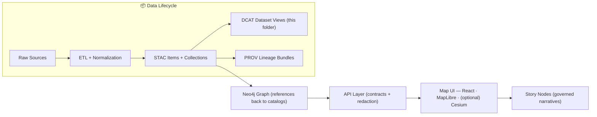

# 📚 `data/catalog/` — Dataset Discovery Catalog (DCAT) 🧭


> **This folder is the “discovery layer” for KFM datasets.**  
> ✅ Put **catalog metadata** here (DCAT).  
> 🚫 Do **NOT** put raw or processed data files here.

---

## 🎯 What this folder is for

`data/catalog/` contains **dataset discovery records** that answer:

- **What** is this dataset? (title, description, keywords)
- **Who** made it? (publisher/maintainer)
- **Where/when** does it apply? (spatial/temporal coverage)
- **How** do I access it? (distributions: downloads, STAC links, API endpoints)

In practice, this is where we keep our **DCAT dataset entries** so the platform (and humans) can *discover* what exists and how to use it.

---

## 🧱 “Published” data requires boundary artifacts

A dataset isn’t considered “published” until it has:

- 🗺️ **STAC Collection + Item(s)** (spatial/temporal indexing of geospatial assets)
- 🧾 **DCAT Dataset entry** (this folder → discovery catalog record)
- 🧬 **PROV lineage bundle** (full provenance: inputs → activities → outputs)

> Think of these as the **contract** between the data pipeline and the downstream layers (graph, API, UI).  
> If any one is missing, the dataset is *not complete*.

---

## 🗂️ Folder layout

```text
📁 data/
├─ 📁 raw/                      🧾 source snapshots (immutable / read-only)
├─ 📁 work/                     🧪 scratch + intermediate artifacts (ephemeral)
├─ 📁 processed/                ✅ final outputs consumed by DB/API/UI
├─ 📁 stac/                     🛰️ STAC Collections + Items (geospatial catalog)
│  ├─ 📁 collections/           🧩 collection JSON (grouping + semantics)
│  └─ 📁 items/                 📦 item JSON (per asset/scene/tile/chunk)
├─ 📁 prov/                     🧬 provenance bundles (W3C PROV-style receipts)
└─ 📁 catalog/                  🗂️ discovery catalog (DCAT)
   └─ 📁 dcat/
      ├─ 📄 README.md                      👈 you are here
      ├─ 📄 <dataset_id>.jsonld            ✅ canonical dataset record (JSON-LD)
      ├─ 📄 <dataset_id>.ttl               ◻️ optional (only if adopted + validated)
      └─ 📄 catalog.jsonld                 ◻️ optional aggregate dcat:Catalog export
```

---

## 🧩 DCAT entries (what goes in `data/catalog/dcat/`)

Each dataset should have **one** DCAT record (JSON-LD) that includes, at minimum:

- `dct:title` (human title)
- `dct:description` (what it is / why it exists)
- `dct:license` (SPDX-style if possible)
- `dcat:keyword` (searchability)
- `dct:spatial` / `dct:temporal` (coverage)
- `dcat:distribution` (download(s), STAC link(s), API link(s))

### ✅ Practical rule of thumb
If someone asks: “What is this dataset and how do I get it?”  
…the DCAT record should answer that without needing tribal knowledge.

---

## 🔗 Cross-linking rules (DCAT ⇄ STAC ⇄ PROV)

To keep the system coherent, we rely on **stable IDs** and **explicit links**:

### DCAT → STAC
- Add a `dcat:distribution` entry that points to:
  - the **STAC Collection** (for the dataset)
  - and/or the relevant **STAC Item(s)** (for individual assets)

### DCAT → Processed outputs
- Add at least one `dcat:distribution` that points to the processed artifact(s), e.g.:
  - `data/processed/<domain>/<dataset>.parquet`
  - `data/processed/<domain>/<dataset>.geojson`

### DCAT → PROV
- Include a distribution or relation that points to the provenance file in `data/prov/`
- The PROV record should name:
  - input raw entities
  - processing activity (pipeline run)
  - output entity (processed file)

---

## ✅ New dataset checklist (PR-ready)

Use this checklist before opening a PR:

- [ ] 📥 Raw inputs placed under `data/raw/<domain>/...`
- [ ] 🧪 Pipeline script/notebook exists under `pipelines/` and runs end-to-end without prompts
- [ ] 📦 Outputs written to `data/processed/<domain>/...`
- [ ] 🗺️ STAC written/updated under `data/stac/collections/` and `data/stac/items/`
- [ ] 🧾 DCAT JSON-LD added to `data/catalog/dcat/<dataset-id>.jsonld`
- [ ] 🧬 PROV bundle added to `data/prov/<dataset-id>.prov.json` (or project naming convention)
- [ ] 🔁 All links resolve: DCAT ↔ STAC ↔ PROV ↔ processed outputs
- [ ] 🧹 Naming is stable and slug-safe (avoid renames unless absolutely necessary)

---

## 🧪 Validation & CI expectations

CI is expected to verify that:

- new/changed `data/processed/**` artifacts have matching:
  - DCAT entry
  - STAC entry
  - PROV record
- basic format validity checks pass (GeoJSON/JSON/Parquet integrity, etc.)

If CI fails with “missing catalog/prov,” it usually means:
- the pipeline generated outputs but didn’t publish the metadata artifacts, **or**
- IDs don’t match across layers (common when a dataset slug changed).

---

## 🧾 DCAT template (starter)

<details>
<summary><strong>📄 Minimal DCAT JSON-LD skeleton (copy/paste)</strong></summary>

```json
{
  "@context": {
    "dcat": "http://www.w3.org/ns/dcat#",
    "dct": "http://purl.org/dc/terms/",
    "foaf": "http://xmlns.com/foaf/0.1/",
    "xsd": "http://www.w3.org/2001/XMLSchema#"
  },
  "@type": "dcat:Dataset",
  "@id": "kfm:dataset/<dataset-id>",
  "dct:title": "<Human Title>",
  "dct:description": "<What it is, why it exists, key caveats>",
  "dcat:keyword": ["kansas", "frontier", "railroad"],
  "dct:license": "<License URL or SPDX-like string>",
  "dcat:distribution": [
    {
      "@type": "dcat:Distribution",
      "dct:title": "Processed data (Parquet)",
      "dcat:downloadURL": "data/processed/<domain>/<file>.parquet",
      "dcat:mediaType": "application/parquet"
    },
    {
      "@type": "dcat:Distribution",
      "dct:title": "STAC Collection",
      "dcat:accessURL": "data/stac/collections/<collection-id>.json",
      "dcat:mediaType": "application/json"
    },
    {
      "@type": "dcat:Distribution",
      "dct:title": "Provenance (PROV)",
      "dcat:accessURL": "data/prov/<dataset-id>.prov.json",
      "dcat:mediaType": "application/json"
    }
  ],
  "dct:publisher": {
    "@type": "foaf:Organization",
    "foaf:name": "Kansas Frontier Matrix"
  }
}
```

</details>

---

## 🧬 Provenance mindset (quick reminder)

PROV records should make it easy to answer:

> “How was this produced?”  
> “From which sources?”  
> “Using which pipeline + parameters?”  
> “At what time, and by whom/what agent?”

If the provenance can’t reconstruct the story of the dataset, it’s not done yet.

---

## 🧠 Architecture snapshot (why the linking matters)



---

## 🏷️ IDs, naming, and versioning

- Prefer **stable dataset IDs** (`<domain>.<topic>.<time-range>` style is a good pattern)
- Changing a dataset ID is expensive:
  - it breaks links across DCAT/STAC/PROV/graph/UI
- Use Git history/tags/releases for “what version did you use?” tracking

---

## 🧰 Tips & gotchas

- ✅ Keep distributions explicit: “downloadURL” for files, “accessURL” for services/catalogs.
- ✅ If a dataset is huge (rasters, tilesets), store a **reference + checksum** in metadata and keep the *catalog-of-record* here.
- 🚫 Avoid “mystery fields.” If you need extra metadata, extend the project profiles instead of inventing one-off keys.

---

## 📎 Related reading

- `data/stac/` — STAC Collections + Items (geospatial indexing)
- `data/prov/` — PROV lineage bundles (traceability)
- `pipelines/` — ETL that must publish *both* data + metadata artifacts
- `docs/` — narrative + architecture + standards

---
