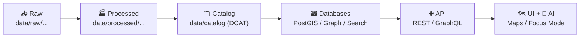

# 🗂️ `data/catalog/` — Dataset Catalog (🔎 DCAT • 🛰️ STAC • 🧬 PROV)

-2b6cb0)


> [!IMPORTANT]
> **This folder is the “public contract” for datasets.**  
> If it’s not described here (and cross-linked to STAC + PROV), it **doesn’t ship** to downstream systems.

---

## 🎯 What this folder is for

`data/catalog/` holds **discoverable, machine-readable dataset metadata** (primarily **DCAT JSON-LD**) that powers:

- 🔎 **Search & discovery** (keyword / bbox / time range)
- 🌐 **API dataset endpoints** (dataset summaries, links to assets, download formats)
- 🧾 **Governance & licensing clarity** (who published it, what you can do with it)
- 🧬 **Traceability** (“the map behind the map” → every layer ties back to sources + processing steps)

---

## 🧭 The non-negotiable “Truth Path” ✅

KFM enforces a strict lifecycle so nothing bypasses provenance + governance gates:



> [!TIP]
> The catalog is a **boundary artifact**: it’s what downstream services trust to exist, be legal to serve, and be explainable.

---

## 📦 What lives here (and what does *not*)

### ✅ Lives in `data/catalog/`
- 🧾 **DCAT Dataset entries** (JSON-LD) used for discovery and API dataset summaries
- 🧩 **Profiles / schemas** (so metadata is consistent and validateable)
- 🧰 **Templates** (copy/paste starters for new datasets)
- 🧱 **Index artifacts** (optional) to speed local search or docs builds

### ❌ Does *not* live here
- 🧱 Raw downloads → put in `data/raw/<domain>/...`
- 🏁 Final deliverables (COGs, GeoParquet, GeoJSON, etc.) → `data/processed/<domain>/...`
- 🛰️ STAC Collections/Items → `data/stac/...`
- 🧬 PROV lineage bundles → `data/prov/...`

---

## 🗃️ Expected layout

This is the **recommended canonical structure** (create folders if missing):

```text
📁 data/
  📁 catalog/
    📄 README.md                      👈 you are here
    📁 dcat/
      📁 datasets/                    👈 one file per dataset (JSON-LD)
      📄 catalog.jsonld               👈 optional rollup (generated/maintained)
    📁 schemas/
      📄 dcat.dataset.schema.json     👈 validation schema(s)
      📄 dcat.distribution.schema.json
    📁 templates/
      📄 dataset.template.jsonld
    📁 profiles/
      📄 KFM_DCAT_PROFILE.md          👈 human-readable rules
```

> [!NOTE]
> Keep **data** and **metadata** separate: metadata changes often and is small; data can be huge and may be tracked via DVC or object storage.

---

## 🧾 DCAT records: rules of the road

### 1) One dataset = one DCAT file 📄
Create a single JSON-LD file per dataset:

- **Path:** `data/catalog/dcat/datasets/<dataset_id>.jsonld`
- **Dataset ID:** stable, lowercase, snake_case  
  Example: `ks_hydrology_1880`

### 2) Required fields (minimum viable governance) ✅
Your DCAT dataset entry must include, at minimum:

- `dct:identifier` (must match `<dataset_id>`)
- `dct:title`
- `dct:description`
- `dct:license` (or `dct:rights`)
- `dct:publisher` (org/agent)
- `dct:spatial` (bbox or geometry reference)
- `dct:temporal` (start/end or interval)
- `dcat:distribution[]` (links to assets + access patterns)
- Cross-links to:
  - 🛰️ **STAC** (collection/items that describe the actual assets)
  - 🧬 **PROV** (how it was produced)

---

## 🧩 Minimal DCAT JSON-LD template (copy/paste)

Create: `data/catalog/dcat/datasets/<dataset_id>.jsonld`

```json
{
  "@context": {
    "dcat": "http://www.w3.org/ns/dcat#",
    "dct": "http://purl.org/dc/terms/",
    "prov": "http://www.w3.org/ns/prov#"
  },
  "@type": "dcat:Dataset",
  "dct:identifier": "ks_example_dataset_1900",
  "dct:title": "Kansas Example Dataset (1900)",
  "dct:description": "Short, evidence-first description. What is it, why it exists, what it is not.",
  "dct:license": "SPDX-OR-URL-HERE",
  "dct:publisher": {
    "@type": "prov:Agent",
    "dct:title": "Kansas Frontier Matrix"
  },
  "dct:spatial": {
    "type": "Polygon",
    "coordinates": [[[ -102.051, 36.993 ], [ -94.588, 36.993 ], [ -94.588, 40.003 ], [ -102.051, 40.003 ], [ -102.051, 36.993 ]]]
  },
  "dct:temporal": {
    "startDate": "1900-01-01",
    "endDate": "1900-12-31"
  },
  "dcat:distribution": [
    {
      "@type": "dcat:Distribution",
      "dct:title": "STAC Collection",
      "dcat:accessURL": "data/stac/collections/ks_example_dataset_1900.collection.json",
      "dct:format": "application/json"
    },
    {
      "@type": "dcat:Distribution",
      "dct:title": "GeoJSON Download",
      "dcat:downloadURL": "data/processed/example/ks_example_dataset_1900.geojson",
      "dct:format": "application/geo+json"
    }
  ],
  "prov:wasDerivedFrom": [
    {
      "@type": "prov:Entity",
      "dct:identifier": "source:agency_or_archive:record_id_or_url"
    }
  ]
}
```

> [!TIP]
> If you don’t have precise spatial/temporal bounds yet, keep them **honest** (coarse is fine) and tighten later—don’t fabricate precision.

---

## 🛰️ How DCAT ↔ STAC ↔ PROV fit together

- **DCAT (this folder)** = *“What is this dataset?”* (discovery + governance + how to access it)
- **STAC (`data/stac/`)** = *“What files/assets exist?”* (COGs, tiles, GeoParquet, rasters, etc.)
- **PROV (`data/prov/`)** = *“How was it made?”* (inputs → activities → outputs → agents)

> [!IMPORTANT]
> Any “AI-derived layer” (classification, OCR corpus, model output) must be treated as a **first-class dataset**:
> it gets **processed storage**, **DCAT**, **STAC**, and **PROV** like everything else.

---

## 🧪 Validation & CI gates (what will fail your PR) 🚦

Typical failures that should be prevented locally:

- ❌ Missing DCAT dataset entry for a new layer
- ❌ No linked STAC collection/items
- ❌ Missing PROV lineage bundle
- ❌ License/rights unclear or incompatible
- ❌ Broken references (paths/URLs)
- ❌ Schema mismatch (invalid JSON-LD / missing required fields)

> [!NOTE]
> CI is expected to enforce these invariants automatically (schema validation, provenance completeness, and safety checks).

---

## 🌐 How the API uses this catalog

Downstream services should treat this folder as the source of truth for *metadata*:

- `GET /api/v1/datasets/{id}` → returns dataset metadata summary (**DCAT**) + links to assets (**STAC**, etc.)
- `GET /api/v1/catalog/search` → search datasets by keyword, bounding box, and/or time range

> [!TIP]
> Keep `dct:identifier` stable: it becomes the **public handle** for API, UI, bookmarks, and citations.

---

## 🧰 Add a new dataset: quick checklist ✅

### 1) Pick an ID 🏷️
- `ks_<domain>_<topic>_<time>`
- Examples:
  - `ks_hydrology_1880`
  - `ks_counties_boundaries_current`
  - `ks_newspapers_chronicling_america_1836_1922`

### 2) Place data in the correct stage 📦
- `data/raw/<domain>/...` (inputs)
- `data/work/<domain>/...` (intermediate)
- `data/processed/<domain>/...` (final outputs)

### 3) Publish boundary artifacts 🧾🛰️🧬
- ✅ DCAT: `data/catalog/dcat/datasets/<dataset_id>.jsonld`
- ✅ STAC: `data/stac/collections/...` + `data/stac/items/...`
- ✅ PROV: `data/prov/<dataset_id>.prov.json` (or similar)

### 4) Validate locally 🧪
Run the repo’s catalog validation command(s) (see root tooling / CI config).  
If none exist yet, add a lightweight validator before scaling ingestion.

---

## 🧠 Practical tips (battle-tested) 🧷

- 🧷 **Prefer links over copies**: DCAT can point to STAC + processed assets without duplicating metadata everywhere.
- 🧷 **Keep descriptions evidence-first**: define scope, known limitations, and intended use.
- 🧷 **Never hide licensing**: if you can’t state the license, you can’t responsibly publish the dataset.
- 🧷 **Treat the catalog as code**: small PRs, reviewable diffs, consistent schema, automated checks.

---

## 📚 Related folders (recommended reading)

- 🛰️ `data/stac/` — asset catalog (collections/items)
- 🧬 `data/prov/` — provenance / lineage bundles
- 🏭 `pipelines/` — ingestion + processing workflows
- 🌐 `src/server/api/` — API contracts that expose catalog + data

---

*“If it’s not traceable, it’s not shippable.”* ✅