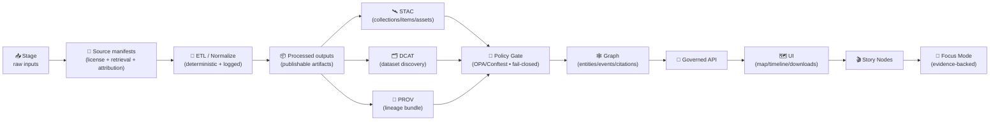

<div align="center">
<a id="top"></a>

# 🗂️ Data Catalog (DCAT) — `data/catalog/`


-0B7285)


**Discoverability metadata** for KFM datasets — **not the data itself**.  
DCAT is how KFM becomes *searchable + harvestable + federatable* **without** bypassing provenance, access controls, or sovereignty. 🧭🧾

> ✅ **KFM “Evidence Triplet” (publish boundary):** **STAC + DCAT + PROV**  
> If any leg is missing, the dataset is **not** considered “published” in KFM.

</div>

---

## 🚀 Quick links

- 📦 **DCAT entries** → [`./dcat/`](./dcat/)
- 🛰️ **STAC collections/items** → [`../stac/collections/`](../stac/collections/) · [`../stac/items/`](../stac/items/)
- 🧬 **PROV lineage bundles** → [`../prov/`](../prov/)
- 🧾 **Upstream source manifests (recommended)** → [`../sources/`](../sources/) *(if present)*
- 🕸️ **Graph exports (if used)** → [`../graph/`](../graph/)
- 🗺️ **Back to data root** → [`../README.md`](../README.md)
- 📐 **Schemas (contracts)** → [`../../schemas/`](../../schemas/) *(if present)*
- 🧪 **Catalog QA gate** → [`../../tools/validation/catalog_qa/`](../../tools/validation/catalog_qa/) *(recommended path)*
- 🧷 **Policy Pack (OPA/Conftest)** → [`../../tools/validation/policy/`](../../tools/validation/policy/) *(recommended path; see governance notes)*
- 📚 **Metadata profiles & conventions** → `docs/standards/` *(if present; v13 canon)*
- 🧩 **Templates** → `docs/templates/` *(if present; cookiecutter-style stubs)*
- 📖 **Story Nodes (narrative content)** → `docs/reports/story_nodes/` *(or `web/story_nodes/`, depending on repo layout)*
- 🔐 **Security policy** → [`../../SECURITY.md`](../../SECURITY.md) *(or `.github/SECURITY.md` depending on repo convention)*
- ✍️ **Contribution rules** → [`../../CONTRIBUTING.md`](../../CONTRIBUTING.md) *(if present)*

> [!TIP]
> **DCAT is the “dataset landing metadata.”** Title, license, access method, coarse coverage, publisher, keywords.  
> **STAC is the “asset index.”** Footprints, time ranges, per-asset URLs (COG/PMTiles/Parquet/etc.).  
> **PROV is “why you should trust it.”** Inputs → activities → outputs → agents, plus policy/audit hooks.  
> **Policy Pack** is “what prevents foot-guns.” ✅ Fail-closed rules for licensing, access, lineage, and sensitive handling.

---

<details>
<summary><strong>📌 Table of contents</strong></summary>

- [🎯 What `data/catalog/` is (and is not)](#-what-datacatalog-is-and-is-not)
- [🧱 Where DCAT fits in the KFM pipeline](#-where-dcat-fits-in-the-kfm-pipeline)
- [🗺️ Folder map (v13 orientation)](#️-folder-map-v13-orientation)
- [🧷 KFM invariants for catalogs](#-kfm-invariants-for-catalogs)
- [🧾 DCAT rules in KFM](#-dcat-rules-in-kfm)
- [📜 KFM metadata profiles & extensions](#-kfm-metadata-profiles--extensions)
- [🧬 Versioning & revisions](#-versioning--revisions)
- [🔗 Cross-linking rules: Sources ↔ STAC ↔ DCAT ↔ PROV ↔ Graph ↔ Story Nodes](#-cross-linking-rules-sources--stac--dcat--prov--graph--story-nodes)
- [🔒 Sensitive data, sovereignty & access control](#-sensitive-data-sovereignty--access-control)
- [📡 Streaming, rapid updates & simulations](#-streaming-rapid-updates--simulations)
- [✅ “Add or update a dataset” checklist](#-add-or-update-a-dataset-checklist)
- [🧪 Validation & CI gates](#-validation--ci-gates)
- [🧩 DCAT JSON-LD template (starter)](#-dcat-json-ld-template-starter)
- [🧊 Packaging patterns](#-packaging-patterns)
- [🧠 AI-generated / derived artifacts still count as datasets](#-ai-generated--derived-artifacts-still-count-as-datasets)
- [🌐 Federation & multi-region harvesting](#-federation--multi-region-harvesting)
- [❓ FAQ](#-faq)
- [📚 Project reference library](#-project-reference-library)
- [🕰️ Version history](#️-version-history)

</details>

---

## 🎯 What `data/catalog/` is (and is not)

### ✅ This folder **IS**
- 🗂️ **DCAT/JSON-LD dataset discovery metadata** (inventory, portals, harvesting, federation).
- 🧾 A **required boundary artifact**: “published” in KFM means the **Evidence Triplet** exists **and** passes policy gates.
- 🛡️ A **governance surface**: datasets can be discoverable without exposing restricted data.
- 🧠 A **citation backbone**: UI “Source:” labels, Story Nodes references, and Focus Mode citations should resolve to stable dataset IDs (DCAT/STAC), not random URLs.

### ❌ This folder is **NOT**
- 🗃️ A place to store rasters/vectors/models/reports.
- 🧩 A replacement for STAC items/collections (STAC describes geospatial assets and per-asset links).
- 🧨 A place for one-off fields that can’t be validated (schemas > vibes).

> [!IMPORTANT]
> In KFM, **metadata is code**: missing license/access methods is effectively a breaking change for trust + federation.

---

## 🧱 Where DCAT fits in the KFM pipeline

KFM is intentionally ordered (**no skipping stages**):



**Why this order matters**
- 🛰️ **STAC** is how map engines + geospatial catalogs “see” assets (footprints, time, media).
- 🗂️ **DCAT** is how portals + harvesters “see” datasets (including non-spatial) and how federation indexes inventory.
- 🧬 **PROV** is how humans (and future you) verify trust: what changed, why, and from what.
- 🧷 **Policy Gate** is how KFM stays safe-by-default: licensing, access classification, provenance completeness, and sensitive handling must pass before publishing.

> [!CAUTION]
> **API boundary is sacred.** UI should not hardcode storage URLs that bypass governance.  
> DCAT distributions must favor **governed endpoints** (or signed/short-lived links) over raw bucket paths.

---

## 🗺️ Folder map (v13 orientation)

v13 standardizes staging and eliminates “mystery duplicate” directories by enforcing **one canonical home per subsystem**.

```text
📁 data/
├─ 📁 raw/                        📥 immutable source snapshots (or pointer manifests)
│  └─ 📁 <domain>/
├─ 📁 work/                       🧰 intermediate transforms (scratch / notebooks / temp)
│  └─ 📁 <domain>/
├─ 📁 processed/                  📦 publishable artifacts (the things you ship)
│  └─ 📁 <domain>/
├─ 📁 sources/                    🧾 upstream manifests (license, URL, retrieval, checksums)  (recommended)
├─ 📁 stac/
│  ├─ 📁 collections/             🛰️ STAC collections
│  └─ 📁 items/                   📦 STAC items
├─ 📁 catalog/
│  ├─ 📁 dcat/                    🗂️ DCAT dataset entries (JSON-LD)
│  └─ 📄 README.md                👈 you are here
├─ 📁 prov/                       🧬 PROV activities/bundles (runs, agents, derivations)
├─ 📁 graph/                      🕸️ graph exports (csv/cypher) or sync payloads (if used)
└─ 📄 README.md
```

> [!NOTE]
> **Naming drift alert (keep it sane):** Some documents or legacy branches may use `data/catalogs/` (plural) for DCAT and/or `data/provenance/` for PROV.  
> The goal is **one canonical path in your repo** — update this README + tooling to match your actual tree and keep aliases temporary.

---

## 🧷 KFM invariants for catalogs

These are “system laws” (treat violations as breaking changes):

- 🧱 **Non‑negotiable ordering**: ETL → catalogs (STAC/DCAT/PROV) → graph → API → UI → story → focus.
- 🧭 **Provenance-first**: every derived artifact must have lineage; “AI did it” is not provenance.
- 🧩 **Contract-first**: catalogs are validated against schemas; unknown fields must be governed, not improvised.
- 🧾 **License explicitness**: every dataset has an explicit license in metadata (code license ≠ data license).
- 🔐 **Classification propagation**: outputs cannot be **less restricted** than inputs (no downstream “downgrade”).
- 🧯 **Redaction/generalization is allowed** (and often required), but must be declared and enforced consistently.
- 🔌 **Governed access**: DCAT can be public while distributions are gated; access enforcement is runtime policy, not vibes.
- 🎬 **Narrative integrity**: Story Nodes must reference stable dataset IDs; “story without evidence” is a policy violation.
- 🤖 **Safe automation only**: assistants/agents may open PRs and suggest metadata, but **must not auto-merge** changes and must remain human-reviewed (kill switch friendly).

> [!IMPORTANT]
> If a dataset is missing `dct:license` or `dct:accessRights`, treat it as **fail closed** (assume Restricted) until fixed.

---

## 🧾 DCAT rules in KFM

### 🎛️ KFM “dataset unit”
In KFM, a dataset is anything that can be:
- discovered,
- accessed (directly or via API),
- cited,
- versioned.

That includes:
- 🛰️ geospatial layers (vector/raster/tiles),
- 🧾 reports/documents,
- 📈 model outputs & evaluation artifacts,
- 🧪 derived/processed data products,
- 🧠 ML/analytics datasets (with provenance + checksums),
- 📡 “live” layers (streaming, near-real-time, simulation runs) — still cataloged, still governed.

### 🏷️ File naming convention (recommended)
Prefer stable, grep-friendly names:

```text
data/catalog/dcat/<dataset_id>.jsonld
# example:
data/catalog/dcat/kfm.ks.geology.surficial_units.2026.v1.jsonld
```

### ✅ Minimum required fields (KFM baseline)
These fields prevent “mystery datasets” and broken harvesters:

- `dct:identifier` (or a stable `@id`)
- `dct:title`
- `dct:description`
- `dct:license` (SPDX identifier or URL)
- `dct:publisher` (org or authority)
- `dct:accessRights` (Public/Internal/Confidential/Restricted)
- `dcat:keyword` (at least a few)
- `dcat:distribution` (at least one, even if gated)
- `dct:issued` and `dct:modified` *(strongly recommended)*

### 🌎 Geospatial-friendly additions (recommended)
DCAT can carry coarse spatial/temporal coverage even if STAC holds canonical geometry:

- `dct:spatial` *(coarse footprint or Kansas-level reference)*
- `dct:temporal` *(start/end or event window)*
- `dcat:theme` *(controlled tags if you have them)*
- `dct:accrualPeriodicity` *(update cadence)*

> [!NOTE]
> Keep **precise geometry** and **per-asset detail** in STAC.  
> Keep **human discoverability** and **harvester-friendly metadata** in DCAT.

---

## 📜 KFM metadata profiles & extensions

KFM uses open standards (STAC/DCAT/PROV) **plus** a KFM “profile layer” that standardizes:
- dataset IDs and naming rules,
- sensitivity/classification tags,
- coverage fields and domain keywords,
- link integrity conventions,
- CI policy IDs and waivers,
- optional KFM extensions (e.g., “story relevance”, “offline pack”, “quality status”).

### ✅ Rule of thumb
- **Standards fields first** (DCAT/STAC/PROV).
- **KFM extensions only when needed**, documented in `docs/standards/` and validated by schema/policy.

### 🧩 Recommended KFM extensions (examples)
If you need KFM-specific fields, keep them namespaced and validated:

- `kfm:classification` *(mirrors `dct:accessRights`, used by policy/UI)*
- `kfm:region` *(e.g., `ks`)*
- `kfm:domain` *(geology/hydrology/transport/etc.)*
- `kfm:qaStatus` *(draft/validated/deprecated)*
- `kfm:offlinePack` *(true/false + pack ID, if shipped as a field kit)*

> [!TIP]
> Prefer **controlled vocabularies** for things like `dcat:theme` and `kfm:domain`.  
> It makes search, federation, and UI filters dramatically better. ✅

---

## 🧬 Versioning & revisions

### ✅ Dataset IDs should be stable
A dataset ID is a **join key** across STAC/DCAT/PROV/Graph/Story Nodes and should be predictable.

Recommended pattern:
```text
kfm.<region>.<domain>.<product>.<time_or_range>.<version>
# example:
kfm.ks.hydrology.flood_extent.1993.v1
```

### 🔁 Revisions should be explicit
When updating an existing dataset (new processing, better QA, bug fixes):

- update `dct:modified`
- add revision semantics (recommended):
  - `prov:wasRevisionOf` → previous dataset entity ID
  - and/or `dct:isVersionOf` / `dcat:version`
- ensure PROV shows:
  - inputs used,
  - processing activity/run ID,
  - agents (human + CI bot),
  - outputs produced.

### 🧾 DevOps is provenance (recommended)
Treat “how the change landed” as part of the audit trail:

- tie dataset revisions to a **PR/commit** in PROV (activity + agent attribution),
- include CI run IDs / policy gate results in provenance or release notes,
- keep an append-only ingestion/processing ledger for traceability.

> [!TIP]
> For **snapshot releases**, consider stable citation IDs (e.g., DOI) and keep DCAT distributions pointing to the release artifact (or landing page) rather than volatile paths.

---

## 🔗 Cross-linking rules: Sources ↔ STAC ↔ DCAT ↔ PROV ↔ Graph ↔ Story Nodes

KFM lives or dies on link integrity. These artifacts must reference each other cleanly:

| Artifact | Lives in | Must link to | Purpose 🧠 |
|---|---|---|---|
| 🧾 Source manifest | `data/sources/**` | upstream URLs, licenses, retrieval time, checksums | legal + reproducible inputs |
| 🛰️ STAC Collection/Item(s) | `data/stac/**` | real assets + previews + provenance hooks | map + search + asset index |
| 🗂️ DCAT Dataset | `data/catalog/dcat/**` | STAC collection/item **and/or** governed API/landing page | discovery + federation harvesting |
| 🧬 PROV bundle | `data/prov/**` | inputs → activity → outputs → agents | reproducibility + auditability |
| 🕸️ Graph | DB or `data/graph/**` | stable IDs referencing catalogs | narrative + reasoning integrity |
| 🎬 Story Nodes | `docs/reports/story_nodes/**` *(or `web/story_nodes/**`)* | DCAT/STAC dataset IDs + citations | interactive narrative tied to evidence |
| 🧷 Policy Pack | `tools/validation/policy/**` | catalog IDs + rules + waivers | enforced governance |

> [!CAUTION]
> **Graph nodes should reference catalog IDs** (DCAT/STAC identifiers) rather than duplicating data.  
> This keeps the graph evidence-backed and governance-friendly.

---

## 🔒 Sensitive data, sovereignty & access control

KFM is “mostly open,” but metadata can still leak sensitive detail.

### 🧭 Classification levels (recommended baseline)
| Level | Typical visibility | Unauthorized access impact | DCAT distribution behavior |
|---|---|---|---|
| **Public** 🌍 | open access | low | direct distributions allowed |
| **Internal** 🏢 | org members | low | distributions may require auth |
| **Confidential** 🔐 | selected users | medium | prefer governed access URLs; avoid raw downloads |
| **Restricted** 🧨 | selected users / admins | high | minimal disclosure; **no precise coordinates**; landing page / access request only |

### 🧬 Classification propagation rule (non-negotiable)
If a parent entity is classified at some level, **children cannot be less restrictive**.  
In practice: if inputs are Internal, you cannot publish outputs as Public unless an explicit governance decision exists **and** the output is redacted/generalized appropriately.

### 🪪 Sovereignty & cultural protocols (design target)
Some content requires **community-defined access**, not just generic RBAC:

- support **tiered access** beyond “Public/Private” (e.g., community-only),
- record cultural constraints as metadata (and enforce via policy gate + API),
- treat “consent” as a first-class governance input (and audit it).

> [!IMPORTANT]
> If a dataset involves culturally sensitive locations, protected resources, private land, personal data, or consent/sovereignty constraints:
> - do not publish precise coordinates in DCAT,
> - use generalized coverage,
> - ensure policy gates and human review are satisfied before merge.

### ✅ Safe patterns for restricted datasets
- Use **coarse spatial coverage** (county-level, grid, Kansas-only statement).
- Use `dcat:accessURL` pointing to an **access request** or **governed API endpoint** (auth required).
- Provide `dct:description` notes describing what was generalized/redacted (without revealing the secret).
- Consider **geo-obfuscation** (e.g., rounded coordinates or generalized markers) when appropriate.

Avoid:
- direct `downloadURL` to raw storage
- embedded sensitive coordinates
- overly specific “where to find it” instructions

---

## 📡 Streaming, rapid updates & simulations

KFM treats “live” data as **the same governance problem**, just faster:

### ✅ Rules (still apply)
- 📌 **No bypassing catalogs**: UI + Focus Mode should still cite DCAT dataset metadata for “Source: …” labels.
- 🧬 **Provenance still required**: log dynamic queries / readings in PROV (at least as a running accumulation).
- 🔐 **Classification still enforced**: sensitive stations/entities may be omitted or downgraded for unauthorized users.

### Patterns that work well
- **Streaming sensors** (e.g., river gauges): DCAT entry represents the dataset; API serves latest values; PROV logs “reading used”.
- **Near-real-time satellite updates**: treat each update as an ingest cycle; mint STAC items; update DCAT `dct:modified`.
- **Simulation runs**: each run output is a dataset entity; PROV links run → model version → inputs; DCAT can describe the “run series” and/or stable landing page.

> [!TIP]
> If the UI shows a “Real-time” layer, the legend source label should come from DCAT, not hardcoded strings. ✅

---

## ✅ “Add or update a dataset” checklist

### 0) Pick a stable dataset ID 🏷️
This ID becomes the join key across STAC/DCCAT/PROV/Graph/Story Nodes.

### 1) Stage data properly 📥
- `data/raw/` = immutable source snapshot / pointer manifests
- `data/work/` = intermediate steps (safe to delete/rebuild)
- `data/processed/` = publishable artifacts (what STAC/DCAT will point to)

### 2) Create/Update the upstream source manifest 🧾 *(recommended)*
Capture:
- upstream URL(s) / provider
- license/terms
- retrieval time
- checksums/ETags where possible
- attribution text (if required)

### 3) Produce the “publication bundle” 📦
At publish time, create/update:

- 🛰️ `data/stac/collections/<id>/collection.json`
- 📦 `data/stac/items/<id>/<item>.json`
- 🗂️ `data/catalog/dcat/<id>.jsonld`
- 🧬 `data/prov/<run_id>/prov.jsonld` *(or equivalent bundle)*
- (optional) 🕸️ graph sync payloads referencing IDs (no raw data duplication)
- (optional) 🎬 Story Node updates if the dataset is used in narrative content

### 4) Sanity check discoverability 🧠
Ask:
- Can someone identify what this is **without** opening raw files?
- Is license clear and attributable?
- Is the access method explicit (download vs governed API)?
- Is provenance traceable (PROV links exist)?
- Does `dct:accessRights` match sensitivity and propagate correctly?
- Are Story Nodes and UI references pointing to dataset IDs (not random URLs)?

### 5) Run QA locally ✅
See [Validation & CI gates](#-validation--ci-gates).

---

## 🧪 Validation & CI gates

KFM treats broken links, missing license, and classification mistakes as ship-stoppers.

### ✅ Local quick checks (muscle memory)
```bash
# JSON parse sanity
python -m json.tool data/catalog/dcat/<dataset_id>.jsonld > /dev/null

# optional: jq formatting + smoke check
jq . data/catalog/dcat/<dataset_id>.jsonld > /dev/null
```

### ✅ “Catalog QA” gate (recommended)
```bash
python3 tools/validation/catalog_qa/run_catalog_qa.py \
  --root data/ \
  --fail-on-warn
```

### 🧷 Policy gate (recommended)
Automate governance constraints with OPA/Conftest:

- path: `tools/validation/policy/`
- run in CI as a required check (“Policy Gate”)
- support:
  - rule IDs (stable policy names),
  - waivers with **expiration + justification**,
  - fail-closed defaults for missing metadata.

### 🧾 Recommended checks to enforce
- `dct:license` present (and parseable)
- `dct:accessRights` present (**fail closed**)
- at least one `dcat:distribution`
- validate distributions are appropriate to classification:
  - Restricted → no raw `downloadURL`
  - Confidential → gated access preferred
- link integrity (STAC/DCAT/PROV references resolve)
- lint for sensitive coordinate leakage (especially for Restricted datasets)
- schema validation against KFM-specific profiles (`docs/standards/` + `schemas/`)

### 📊 Telemetry & audit hooks (recommended)
- ingestion ledger (append-only NDJSON / event log)
- QA metrics dashboards (missing metadata %, broken links, policy denials)
- Focus Mode citation coverage tracking (drift/safety indicators)
- run IDs that correlate ETL → catalogs → graph → API deployment

> [!TIP]
> Keep PR gates fast (fixtures + metadata). Run deeper quality checks nightly (geometry validity, CRS checks, range checks).

---

## 🧩 DCAT JSON-LD template (starter)

<details>
<summary><strong>📄 Minimal DCAT JSON-LD skeleton</strong></summary>

```json
{
  "@context": {
    "dcat": "http://www.w3.org/ns/dcat#",
    "dct": "http://purl.org/dc/terms/",
    "prov": "http://www.w3.org/ns/prov#",
    "xsd": "http://www.w3.org/2001/XMLSchema#",
    "kfm": "kfm:"
  },
  "@id": "kfm:dataset/<dataset_id>",
  "@type": "dcat:Dataset",

  "dct:identifier": "<dataset_id>",
  "dct:title": "<Human readable title>",
  "dct:description": "<What it is, scope, intended use, caveats, redaction notes if any>",
  "dct:publisher": {"@id": "kfm:org/<publisher_id>"},
  "dct:license": "<SPDX or URL>",
  "dct:accessRights": "Public",

  "dcat:keyword": ["kansas", "<domain>", "<theme>"],

  "dct:issued": {"@value": "2026-01-19", "@type": "xsd:date"},
  "dct:modified": {"@value": "2026-01-19", "@type": "xsd:date"},

  "dcat:distribution": [
    {
      "@type": "dcat:Distribution",
      "dct:title": "STAC Collection",
      "dcat:accessURL": "../stac/collections/<id>/collection.json",
      "dct:format": "application/json",
      "dcat:mediaType": "application/json"
    },
    {
      "@type": "dcat:Distribution",
      "dct:title": "GeoParquet (Analytics)",
      "dcat:downloadURL": "<governed-url-or-release-asset>",
      "dct:format": "application/parquet",
      "dcat:mediaType": "application/parquet"
    },
    {
      "@type": "dcat:Distribution",
      "dct:title": "PMTiles (Map)",
      "dcat:downloadURL": "<governed-url-or-release-asset>",
      "dct:format": "application/vnd.pmtiles",
      "dcat:mediaType": "application/vnd.pmtiles"
    }
  ],

  "prov:wasGeneratedBy": "kfm:prov/<run_id>",

  "kfm:classification": "Public",
  "kfm:domain": "<domain>",
  "kfm:region": "ks"
}
```

</details>

> [!NOTE]
> This is a **starter shape**, not the final contract.  
> The near-term priority is a **KFM dataset schema + validator** that enforces required fields and local conventions (naming, sensitivity, link integrity, policy IDs/waivers).

---

## 🧊 Packaging patterns

DCAT should point to how people actually **use** the dataset.

### Pattern A — Direct download (public + small-ish)
- `dcat:downloadURL` → GeoJSON/CSV/GeoPackage/PDF
- include `dct:format`, `dcat:mediaType`, optional `dcat:byteSize`

### Pattern B — STAC-first (geospatial streaming)
- `dcat:accessURL` → STAC Collection/Item
- STAC assets point to COGs/tiles/Parquet/etc.

### Pattern C — Dual-format publish (analytics + map UI) 🧊🗺️
A recommended KFM pattern for large layers:
- **GeoParquet** for analysis
- **PMTiles** (or similar) for fast map rendering
- both registered via a **STAC Collection + DCAT Dataset**, with hashes/checksums in provenance.

### Pattern D — Governed API (auth / rate limits / redaction)
- `dcat:accessURL` → API endpoint requiring auth
- supports signed URLs, scope-limited tokens, redaction/generalization

### Pattern E — “Landing page only” (restricted metadata)
- `dcat:landingPage` → access request + justification page
- no direct file links

### Pattern F — Offline data packs (field kits) 🧳📦
If you ship offline packs (rural/fieldwork/classroom):
- bundle **PMTiles + GeoParquet + thumbnails**,
- include **STAC + DCAT + PROV inside the pack**,
- keep stable IDs so the same pack can later sync upstream.

> [!TIP]
> If you’re making map previews (thumbnails, quicklooks), include them as STAC assets and/or as a DCAT distribution with clear media types (PNG/JPEG) and size hints.

---

## 🧠 AI-generated / derived artifacts still count as datasets

If an AI/ML or analytical pipeline produces:
- 🛰️ raster layer → **STAC + DCAT + PROV**
- 📈 model metrics/plots → **DCAT + PROV**
- 🧾 reports → **DCAT + PROV**
- 🕸️ derived entities/relationships → **graph ingestion must reference provenance-backed IDs**
- 🧪 notebooks / “Methods & Computational Experiments” outputs → treat as governed artifacts if cited by Story Nodes

> [!IMPORTANT]
> “AI did it” is not provenance. Every derived artifact needs lineage and an access classification.  
> If the assistant cannot cite sources, it should **refuse** rather than hallucinate.

---

## 🌐 Federation & multi-region harvesting

KFM’s long-term direction is a network of interoperable regional hubs (Kansas + neighbors).  
DCAT is the **lowest-friction interoperability layer** for multi-hub indexing:

- stable dataset IDs
- explicit licensing
- consistent `dct:accessRights`
- distributions that point to governed APIs or landing pages
- optional compatibility endpoints (OGC API Features / WMS/WFS) as needed

> [!NOTE]
> Designing DCAT entries with federation in mind today reduces rework when multiple hubs or “Frontier Matrix” instances interoperate tomorrow.

---

## ❓ FAQ

<details>
<summary><strong>Why do we need DCAT if we already have STAC?</strong></summary>

**STAC** is optimized for geospatial assets: footprints, time, and per-asset access patterns.  
**DCAT** is optimized for dataset discovery across *all* dataset types and external harvesting (portals, catalogs, inventory tooling).

KFM uses both (plus PROV) so the system stays discoverable **and** auditable.

</details>

<details>
<summary><strong>What breaks if DCAT isn’t updated?</strong></summary>

- dataset inventories drift
- portals/harvesters can’t find new datasets
- governance views (“what is public vs restricted?”) become unreliable
- CI should fail on missing license/access/distribution metadata

</details>

<details>
<summary><strong>Should DCAT duplicate STAC metadata?</strong></summary>

No. Prefer:
- STAC = canonical geospatial asset details
- DCAT = discovery + access + licensing + high-level coverage

</details>

---

## 📚 Project reference library

> ⚠️ Reference PDFs and docs may have **different licenses** than KFM’s code.  
> KFM code may be MIT-licensed, but datasets and reference materials can carry third‑party terms—**track licenses in STAC/DCAT**.

<details>
<summary><strong>🧠 Canonical KFM architecture, data intake, UI, AI</strong></summary>

- `Kansas Frontier Matrix (KFM) – Comprehensive Technical Documentation.pdf`
- `Kansas Frontier Matrix (KFM) – Comprehensive Architecture, Features, and Design.pdf`
- `📚 Kansas Frontier Matrix (KFM) Data Intake – Technical & Design Guide.pdf`
- `Kansas Frontier Matrix – Comprehensive UI System Overview.pdf`
- `Kansas Frontier Matrix (KFM) – AI System Overview 🧭🤖.pdf`
- `🌟 Kansas Frontier Matrix – Latest Ideas & Future Proposals.docx.pdf`
- `Innovative Concepts to Evolve the Kansas Frontier Matrix (KFM).pdf`

</details>

<details>
<summary><strong>📦 Bundled “PDF portfolios” (open locally for full index)</strong></summary>

- `AI Concepts & more.pdf`
- `Maps-GoogleMaps-VirtualWorlds-Archaeological-Computer Graphics-Geospatial-webgl.pdf`
- `Various programming langurages & resources 1.pdf`
- `Data Managment-Theories-Architures-Data Science-Baysian Methods-Some Programming Ideas.pdf`

</details>

---

## 🕰️ Version history

| Version | Date | Summary |
|---|---:|---|
| v1.2.0 | 2026-01-19 | Add policy-gate framing (fail-closed), metadata profile + extension rules, Story Nodes cross-links, streaming/simulation guidance, offline pack pattern, DevOps-as-PROV notes, and refresh reference library ✅ |
| v1.1.0 | 2026-01-11 | Align README with v13 canonical pipeline + directories; add classification propagation + policy gate concepts; add sources manifest + dual-format packaging guidance; refresh reference library list ✅ |
| v1.0.0 | 2026-01-08 | Initial DCAT README: pipeline alignment, cross-link rules, sensitive-data handling, CI/QA guidance ✅ |

---

<p align="right"><a href="#top">⬆️ Back to top</a></p>