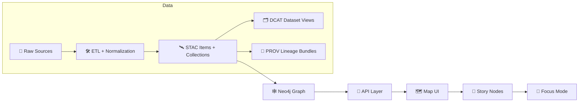

<div align="center">

# 🗂️ Data Catalog (DCAT) — `data/catalog/`


-0B7285)


_This folder holds **discoverability metadata** (DCAT) for KFM datasets — not the data itself._ 🧭

</div>

---

## 🚀 Quick Links

- 📦 **DCAT entries** → [`./dcat/`](./dcat/)
- 🛰️ **STAC collections/items** → [`../stac/collections/`](../stac/collections/) · [`../stac/items/`](../stac/items/)
- 🧬 **PROV lineage bundles** → [`../prov/`](../prov/)
- 🧠 **Graph exports** → [`../graph/`](../graph/) (if present)
- 🗺️ Back to **data root** → [`../README.md`](../README.md) (if present)

---

## 🎯 What `data/catalog/` is for (and what it is *not*)

### ✅ This folder **IS**
- 🧾 A **DCAT/JSON-LD discovery layer** so datasets can be found, filtered, and harvested.
- 🔗 A **required boundary artifact** in the KFM pipeline (STAC ↔ DCAT ↔ PROV consistency).
- 🛡️ A governance surface: datasets should be discoverable **without bypassing** access controls.

### ❌ This folder is **NOT**
- 🗃️ A place to store raw/processed rasters or vectors.
- 🧩 A substitute for STAC items/collections (that’s for geospatial asset indexing).
- 🧨 A place for ad-hoc, undocumented metadata fields.

> [!IMPORTANT]
> **STAC/DCAT/PROV alignment is required** for every new dataset (including AI-derived artifacts), and CI is expected to validate conformance to project profiles. [oai_citation:0‡MARKDOWN_GUIDE_v13.md.gdoc](file-service://file-UYVruFXfueR8veHMUKeugU)

---

## 🧱 Where this fits in the KFM pipeline



> The pipeline is **ordered and non-negotiable**: each stage consumes outputs from the previous one for traceability and governance. [oai_citation:1‡MARKDOWN_GUIDE_v13.md.gdoc](file-service://file-UYVruFXfueR8veHMUKeugU)

---

## 🗺️ Folder Map (orientation)

> [!TIP]
> Keep the **catalog** (DCAT) separate from **asset metadata** (STAC) and **lineage** (PROV). It makes validation + governance dramatically easier.

```text
📁 data/
├─ 📁 catalog/
│  ├─ 📁 dcat/                🗂️ DCAT Dataset entries (JSON-LD) live here
│  └─ 📄 README.md            👈 you are here
├─ 📁 stac/
│  ├─ 📁 collections/         🛰️ STAC collections
│  └─ 📁 items/               📦 STAC items
├─ 📁 prov/                   🧬 PROV activities/bundles
├─ 📁 graph/                  🕸️ graph exports (csv/cypher), if used
└─ 📁 <domain>/               🌾🏙️🌎 domain staging (raw/work/processed)
   ├─ 📁 raw/
   ├─ 📁 work/
   └─ 📁 processed/
```

This layout (including DCAT in `data/catalog/dcat/`) is explicitly called out in the project guide. [oai_citation:2‡MARKDOWN_GUIDE_v13.md.gdoc](file-service://file-UYVruFXfueR8veHMUKeugU) [oai_citation:3‡MARKDOWN_GUIDE_v13.md.gdoc](file-service://file-UYVruFXfueR8veHMUKeugU)

---

## 🧾 DCAT in KFM (what to put in `./dcat/`)

DCAT entries exist so we can answer questions like:

- “What datasets exist for drought?” 🌵
- “Which datasets are public vs restricted?” 🔒
- “Where do I download or access this dataset?” ⬇️
- “What is the license + update cadence?” 🗓️

Minimum DCAT expectations in KFM (per guide):
- **title**
- **description**
- **license**
- **keywords**
- **distribution links** (e.g., link to STAC item(s) or a download endpoint) [oai_citation:4‡MARKDOWN_GUIDE_v13.md.gdoc](file-service://file-UYVruFXfueR8veHMUKeugU)

> [!NOTE]
> Even “non-spatial” datasets often still get a STAC Collection in KFM for consistency, while DCAT handles discoverability. [oai_citation:5‡MARKDOWN_GUIDE_v13.md.gdoc](file-service://file-UYVruFXfueR8veHMUKeugU)

---

## 🔗 Cross-linking rules (STAC ↔ DCAT ↔ PROV ↔ Graph)

KFM’s guide sets explicit cross-layer linkage expectations so catalogs, graph, and narratives stay in sync. [oai_citation:6‡MARKDOWN_GUIDE_v13.md.gdoc](file-service://file-UYVruFXfueR8veHMUKeugU)

### ✅ Cross-reference matrix

| Artifact | Lives in | Must link to | Why it matters 🧠 |
|---|---|---|---|
| 🛰️ STAC Collection/Item(s) | `data/stac/**` | the real assets (processed files/tiles), and provenance hooks | drives map UI + indexing |
| 🗂️ DCAT Dataset | `data/catalog/dcat/**` | STAC item(s) **or** access/download endpoint(s) | discoverability + catalog harvesters |
| 🧬 PROV bundle | `data/prov/**` | inputs, activity, agents, params/config | reproducibility + trust |
| 🕸️ Graph entries | `data/graph/**` or DB | references back to catalog assets | narrative + reasoning consistency |

> [!CAUTION]
> Anything shown in UI must go through the governed API layer — **no hard-coded UI access** to raw files or “sneaky” URLs. [oai_citation:7‡MARKDOWN_GUIDE_v13.md.gdoc](file-service://file-UYVruFXfueR8veHMUKeugU)

---

## ✅ “Adding a dataset” checklist (the fast way)

### 0) Pick a stable dataset ID 🏷️
- Should not change lightly (it becomes the “join key” across metadata + lineage + graph).
- Recommend: `kfm.<domain>.<theme>.<spacetime>.<version>` (adapt to project naming).

### 1) Stage the data properly 📥
Raw → Work → Processed is required staging (don’t skip). [oai_citation:8‡MARKDOWN_GUIDE_v13.md.gdoc](file-service://file-UYVruFXfueR8veHMUKeugU)

### 2) Produce the “publication bundle” 📦
At publication time:
- STAC → `data/stac/collections/` + `data/stac/items/`
- DCAT → `data/catalog/dcat/` (JSON-LD)
- PROV → `data/prov/` (activity bundle) [oai_citation:9‡MARKDOWN_GUIDE_v13.md.gdoc](file-service://file-UYVruFXfueR8veHMUKeugU) [oai_citation:10‡MARKDOWN_GUIDE_v13.md.gdoc](file-service://file-UYVruFXfueR8veHMUKeugU)

### 3) Ensure CI won’t reject it 🚦
Contributions are expected to pass automated validation gates (broken links, missing PROV, missing metadata → fail build). [oai_citation:11‡MARKDOWN_GUIDE_v13.md.gdoc](file-service://file-UYVruFXfueR8veHMUKeugU)

---

## 🧪 DCAT entry template (starter)

<details>
<summary><strong>📄 Click to expand a minimal JSON-LD skeleton</strong></summary>

```json
{
  "@context": {
    "dcat": "http://www.w3.org/ns/dcat#",
    "dct": "http://purl.org/dc/terms/",
    "prov": "http://www.w3.org/ns/prov#"
  },
  "@id": "kfm:dataset/<dataset_id>",
  "@type": "dcat:Dataset",
  "dct:title": "<Human readable title>",
  "dct:description": "<What it is, scope, and intended use>",
  "dct:license": "<SPDX or URL>",
  "dcat:keyword": ["<tag1>", "<tag2>", "<tag3>"],
  "dcat:distribution": [
    {
      "@type": "dcat:Distribution",
      "dcat:accessURL": "<link to STAC Item / API endpoint / landing page>",
      "dct:format": "<e.g., application/geo+json | image/tiff; application=geotiff | application/json>"
    }
  ],
  "prov:wasGeneratedBy": "<link or identifier for PROV activity bundle>"
}
```

> [!TIP]
> Treat this as a **shape hint**, not the canonical spec. The canonical schema is defined by the KFM DCAT profile mentioned in the guide (e.g., `KFM_DCAT_PROFILE.md`). [oai_citation:12‡MARKDOWN_GUIDE_v13.md.gdoc](file-service://file-UYVruFXfueR8veHMUKeugU)

</details>

---

## 🧠 AI-generated / derived artifacts still count as datasets

If an AI model produces:
- 🛰️ a raster layer → STAC item + DCAT entry + PROV activity
- 🧾 a report → DCAT entry + PROV
- 🧩 derived entities/relationships → graph ingestion must point back to provenance

This “treat evidence artifacts like regular datasets” rule is explicitly called out in the guide. [oai_citation:13‡MARKDOWN_GUIDE_v13.md.gdoc](file-service://file-UYVruFXfueR8veHMUKeugU)

---

## 🗃️ Storage + formats (what DCAT distributions often point to)

KFM’s broader docs and design notes describe common outputs like:
- 🖼️ rasters stored as **COGs (Cloud Optimized GeoTIFFs)**
- 🧭 vectors stored as **GeoJSON / Shapefiles**
- 🧱 tiles generated for interactive use [oai_citation:14‡Kansas-Frontier-Matrix_ Open-Source Geospatial Historical Mapping Hub Design.pdf](file-service://file-ShqHKgjxCS9UT9vbcxDNzA)

And in the main KFM technical documentation, the pipeline emphasizes:
- ingest raw data → transform → store results → serve via APIs/visualizations [oai_citation:15‡Kansas Frontier Matrix (KFM) – Comprehensive Technical Documentation.pdf](file-service://file-Bro83fTiCi9UUVVno1fL6L)

---

## 🧬 Versioning & lifecycle (rules of thumb)

KFM explicitly treats versioning as multi-layer (dataset + metadata + graph + API release). [oai_citation:16‡Geographic Information System Basics - geographic-information-system-basics.pdf](file-service://file-Kjn2enYFqXQtK3J4zN2DWz)

### Recommended practice ✅
- 🧾 **DCAT**: keep a stable dataset ID + include a version field (or revision relationship) per profile
- 🛰️ **STAC**: update item/collection timestamps + keep historical items if time-series
- 🧬 **PROV**: capture `wasRevisionOf` / generation activity and parameters for every major rebuild [oai_citation:17‡Geographic Information System Basics - geographic-information-system-basics.pdf](file-service://file-Kjn2enYFqXQtK3J4zN2DWz)

---

## 🧹 Validation quick checks (local)

> [!TIP]
> Keep these as muscle memory — they catch 80% of issues before CI does.

```bash
# 1) JSON parse sanity
python -m json.tool data/catalog/dcat/<file>.jsonld > /dev/null

# 2) Optional: jq formatting + smoke-check
jq . data/catalog/dcat/<file>.jsonld > /dev/null
```

---

## 🗂️ Optional: large artifacts & reproducibility (DVC-friendly)

If your dataset includes very large rasters/models:
- consider **DVC** to version large artifacts without bloating Git, while keeping code↔data version alignment. [oai_citation:18‡Kansas-Frontier-Matrix_ Open-Source Geospatial Historical Mapping Hub Design.pdf](file-service://file-64djFYQUCmxN1h6L6X7KUw)

---

## 🌾 Example dataset families you’ll likely catalog (KFM context)

KFM integrates remote sensing + GIS heavily, including sources like:
- Landsat / Sentinel-2 multispectral imagery (NDVI, EVI, etc.)
- Sentinel-1 SAR (soil moisture, flood mapping)
- SMAP / SMOS soil moisture
- NASA GPM precipitation
- USDA Cropland Data Layer
- DEMs (e.g., SRTM) [oai_citation:19‡Kansas Frontier Matrix (KFM) – Comprehensive Technical Documentation.pdf](file-service://file-Bro83fTiCi9UUVVno1fL6L)

These typically become:
- 🛰️ STAC assets for geospatial indexing
- 🗂️ DCAT datasets for discoverability
- 🧬 PROV activities for reproducibility

---

## 📚 Reference Library (project files) 📖✨

### Core KFM specs / architecture
- 🧠 **KFM Comprehensive Technical Documentation**  [oai_citation:20‡Kansas Frontier Matrix (KFM) – Comprehensive Technical Documentation.pdf](file-service://file-Bro83fTiCi9UUVVno1fL6L)
- 🧭 **MARKDOWN_GUIDE v13** (pipeline + metadata invariants)  [oai_citation:21‡MARKDOWN_GUIDE_v13.md.gdoc](file-service://file-UYVruFXfueR8veHMUKeugU)

### Catalog + reproducibility notes
- 🗺️ **Open-Source Geospatial Historical Mapping Hub Design**  [oai_citation:22‡Kansas-Frontier-Matrix_ Open-Source Geospatial Historical Mapping Hub Design.pdf](file-service://file-ShqHKgjxCS9UT9vbcxDNzA)

### Helpful geospatial tooling references (optional deep dives)
- 🧰 **Geoprocessing with Python**  [oai_citation:23‡geoprocessing-with-python.pdf](file-service://file-NkXrdB4FwTruwhQ9Ggn53T)
- 🌍 **GIS Basics**  [oai_citation:24‡Geographic Information System Basics - geographic-information-system-basics.pdf](file-service://file-Kjn2enYFqXQtK3J4zN2DWz)
- 🗺️ **Making Maps (GIS design)**  [oai_citation:25‡google-maps-javascript-api-cookbook.pdf](file-service://file-6w897pmf6KhF1cHXFQ1zdf)
- 🧭 **Python Geospatial Analysis Cookbook**  [oai_citation:26‡python-geospatial-analysis-cookbook.pdf](file-service://file-HT14njz1MhrTZCE7Pwm5Cu)
- 🧪 **Cloud-Based Remote Sensing with Google Earth Engine**  [oai_citation:27‡Cloud-Based Remote Sensing with Google Earth Engine-Fundamentals and Applications.pdf](file-service://file-CXGLTw8wpR4uKWWqjrGkyk)

---

## 🆘 FAQ (tiny but useful)

<details>
<summary><strong>❓ Why do we need DCAT if we already have STAC?</strong></summary>

STAC is optimized for describing **geospatial assets** (spatial/temporal indexing, geometry, assets).  
DCAT is optimized for **catalog/discovery** across *all* dataset types (including non-spatial) and external harvesting.

KFM’s guide requires both (plus PROV) as part of the publication bundle. [oai_citation:28‡MARKDOWN_GUIDE_v13.md.gdoc](file-service://file-UYVruFXfueR8veHMUKeugU)

</details>

<details>
<summary><strong>❓ What breaks if DCAT isn’t updated?</strong></summary>

Downstream discovery (search, inventory, governance reports, “what datasets exist?” views) becomes unreliable.  
Also, CI may block the change if invariants are enforced for missing metadata/provenance. [oai_citation:29‡MARKDOWN_GUIDE_v13.md.gdoc](file-service://file-UYVruFXfueR8veHMUKeugU)

</details>