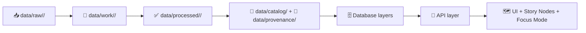

# 📚 Data Catalog (`data/catalog/`)


> 🗺️ **“The map behind the map.”**  
> This folder is the **discovery layer** for KFM datasets: it makes data *findable*, *auditable*, and *reusable* across pipelines, databases, APIs, and the UI.

---

## 🎯 What this folder is for

`data/catalog/` holds **catalog-grade metadata** used to:
- **List & search datasets** (humans + API + UI)
- Provide **high-level dataset summaries** (title, description, licensing, distributions)
- Power exports/harvesters (optional) for external catalogs
- Enforce **governance + reproducibility** by making metadata mandatory

In KFM, metadata is not optional—**catalog + provenance are part of the “publish” step**, not a nice-to-have.

---

## 🧬 Canonical lifecycle (where `data/catalog/` sits)



✅ **Rule of thumb:** if it shows up in the UI, it must be backed by **processed data + catalog metadata + provenance**.

---

## 🧱 Expected folder layout

This repo may evolve over time, but the intent stays consistent:

```text
data/
├── catalog/
│   ├── dcat/                 # ✅ DCAT dataset entries (JSON-LD recommended)
│   ├── exports/              # (optional) generated indexes/aggregations (do not hand-edit)
│   └── README.md             # you are here
├── stac/
│   ├── collections/          # ✅ STAC Collections (geospatial discovery metadata)
│   └── items/                # ✅ STAC Items (asset-level metadata)
└── provenance/               # ✅ PROV activity bundles (lineage)
```

> 💡 If your repo currently stores STAC under `data/catalog/` instead of `data/stac/`, that’s okay—**the contract is “STAC exists + is linked,”** not the exact directory name.

---

## 📦 What belongs in `data/catalog/`

### ✅ DCAT dataset entries (required)
Store one record per dataset (or per dataset “release unit”) under:

- `data/catalog/dcat/<dataset_id>.jsonld`

DCAT records should be:
- human-readable enough for browsing
- machine-readable for indexing
- link-rich (point to STAC, processed assets, docs, and provenance)

### 🧩 Optional: generated indexes
If you build an aggregate catalog view:
- `data/catalog/exports/datasets.index.json`
- `data/catalog/exports/keywords.index.json`

✅ Treat these as **build artifacts**.

---

## 🔗 Cross-linking rules (non-negotiable)

KFM expects **STAC + DCAT + PROV to agree** and cross-reference:

- **STAC Items → assets** (usually files in `data/processed/**` or stable external storage)
- **DCAT → distributions** (link to STAC and/or the underlying downloadable asset)
- **PROV → full lineage** (raw → work → processed, plus pipeline run/config/commit)
- Downstream graph/database nodes should **reference catalog IDs**, not duplicate metadata

---

## ✅ Definition of Done (DoD) for adding a dataset

When you add or update a dataset, you’re done only when all of these are true:

### 1) ✅ Processed data exists
- Output(s) live in `data/processed/<domain>/...`
- Data is clean, normalized, and ready for API/UI consumption

### 2) ✅ STAC exists (Collection + Item(s))
- Collection describes the dataset group (theme, extent, time range)
- Item(s) describe each asset (file/API endpoint), including bbox/time/license attribution

### 3) ✅ DCAT exists (this folder)
- `data/catalog/dcat/<dataset_id>.jsonld`
- Contains: **title**, **description**, **license**, **keywords**, **distributions**
- Distributions point to STAC and/or direct downloads

### 4) ✅ PROV exists
- `data/provenance/<dataset_id>.prov.json` (or similar convention)
- Captures inputs, processing activity, agents, timestamps, parameters/config

### 5) ✅ Validation passes (CI is the gatekeeper 🚦)
- Schema checks, provenance completeness, and security checks must pass
- Missing metadata/provenance should be treated as a **blocker**

---

## 🧾 Minimal DCAT starter (JSON-LD)

> ⚠️ This is a **starter skeleton**, not the full project profile.

```json
{
  "@context": {
    "dcat": "http://www.w3.org/ns/dcat#",
    "dct": "http://purl.org/dc/terms/"
  },
  "@id": "kfm:dataset/<dataset_id>",
  "@type": "dcat:Dataset",
  "dct:title": "Human-readable dataset title",
  "dct:description": "What this dataset is, what it contains, and how it can be used.",
  "dct:license": "SPDX identifier or license URL",
  "dcat:keyword": ["kansas", "frontier", "railroad", "1860s"],
  "dcat:distribution": [
    {
      "@type": "dcat:Distribution",
      "dct:title": "STAC entry",
      "dcat:accessURL": "relative/or/absolute/link/to/stac/item-or-collection"
    }
  ]
}
```

---

## 🧠 Naming & stability conventions

Keep identifiers stable and boring 😄:
- Prefer `snake_case` or `kebab-case` slugs
- Reuse the same `dataset_id` across:
  - DCAT filename
  - STAC `id`
  - PROV `entity/activity` IDs
  - pipeline outputs (where possible)

✅ If you version data, version **distributions**, not the dataset identity:
- dataset stays stable
- distributions point to versioned STAC items / processed files

---

## 🚫 Anti-patterns (please don’t)

- ❌ Dropping “final” data into `data/processed/` **without** DCAT/STAC/PROV
- ❌ Writing DCAT records that don’t link to distributions
- ❌ “Mystery data” (no license, no source attribution, no provenance)
- ❌ Copy/pasting external metadata without adapting it to KFM profiles
- ❌ Treating the catalog as “documentation only” (it’s executable discovery metadata)

---

## 🧰 Helpful pointers

- 📌 **Profiles live in** `docs/standards/` (project-specific STAC/DCAT/PROV extensions)
- 🧪 **Validation is enforced by CI** — assume missing metadata will fail builds
- 🧭 When in doubt: **link more** (processed asset, STAC, provenance, upstream sources, docs)

---

## 🤝 Contributing checklist (quick copy/paste)

- [ ] Processed output written to `data/processed/<domain>/...`
- [ ] STAC Collection created/updated
- [ ] STAC Item(s) created/updated
- [ ] DCAT JSON-LD created/updated in `data/catalog/dcat/`
- [ ] PROV bundle created/updated in `data/provenance/`
- [ ] Links verified (STAC ↔ DCAT ↔ PROV)
- [ ] CI checks pass ✅

---

## 🧾 Why all this ceremony?

Because KFM is built to be:
- **reproducible** (same inputs → same outputs)
- **auditable** (every dataset has a lineage story)
- **publishable** (metadata supports internal + external discovery)
- **trustworthy** (governance-by-default, fail-closed)