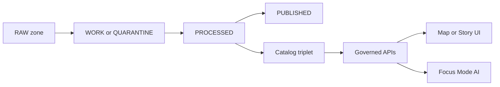

<!-- [KFM_META_BLOCK_V2]
doc_id: kfm://doc/3b7c36b1-7fb8-48b8-8b3c-51f5a9c62b7f
title: Data Catalog
type: standard
version: v1
status: draft
owners: KFM Data & Governance
created: 2026-02-22
updated: 2026-02-22
policy_label: public
related:
  - data/catalog/
tags:
  - kfm
  - data-catalog
  - provenance
notes:
  - This README is optimized for GitHub rendering (directory tree is in a fenced code block).
[/KFM_META_BLOCK_V2] -->

# Data Catalog
Machine-readable, governed dataset metadata and provenance for **map-first, time-aware** KFM workflows.


## Quick navigation
- [What lives here](#what-lives-here)
- [Directory layout](#directory-layout)
- [Catalog triplet](#catalog-triplet)
- [Adding a dataset](#adding-a-dataset)
- [Definition of done](#definition-of-done)

---

## What lives here

This folder is the **catalog layer**: it describes *what* datasets exist, *where* their artifacts live across lifecycle zones, and *how* they were produced (provenance).

You should expect:
- **Dataset identities** (stable IDs)
- **Dataset versions** (immutable version identifiers; content-addressed where possible)
- **Provenance/run receipts** (what transformed what, when, with which checksums)
- **Policy labels** (public/restricted/etc. + redaction notes)
- **Discovery indices** for UI + APIs (search, filtering, map/story)

> NOTE: This README may describe a *target layout* if your repo is still converging. Prefer aligning the structure to what the pipeline actually emits.

---

## Directory layout

The tree **must** stay inside a fenced code block or GitHub may mangle spacing/lines.

```text
data/
└── catalog/
    ├── README.md
    ├── dcat/                         # PROPOSED: DCAT-style catalog and dataset records
    │   ├── catalog.jsonld             # PROPOSED
    │   └── datasets/                  # PROPOSED
    │       └── <dataset_id>.jsonld
    ├── stac/                         # PROPOSED: STAC catalog/collections/items for spatial assets
    │   ├── catalog.json               # PROPOSED
    │   └── collections/               # PROPOSED
    │       └── <collection_id>/
    │           ├── collection.json
    │           └── items/
    │               └── <item_id>.json
    ├── prov/                         # PROPOSED: provenance bundles + run receipts
    │   ├── runs/
    │   │   └── <run_id>.json
    │   └── bundles/
    │       └── <bundle_id>.json
    ├── registry/                     # PROPOSED: human-friendly index (optional)
    │   ├── datasets.csv               # PROPOSED
    │   └── datasets.md                # PROPOSED
    ├── schemas/                      # PROPOSED: JSON Schema / definitions used by catalog docs
    ├── examples/                     # PROPOSED: minimal examples for contributors
    └── tools/                        # PROPOSED: helper scripts (validation, linting, generation)
```

### Common GitHub rendering gotchas
- If you put the tree in a normal paragraph or list, GitHub will collapse whitespace.
- If you nest the tree inside a list item, you must indent the code fence to match the list indentation (or GitHub may break the fence).

---

## Catalog triplet

KFM’s catalog layer is designed to support three complementary views of the same world:



- **DCAT-style** records: dataset-level discovery, licensing, contacts, coverage
- **STAC-style** records: spatial-temporal collections/items/assets for map-first workflows
- **PROV-style** records: lineage/run receipts so we can prove how artifacts were produced

---

## Adding a dataset

Minimal, safe workflow (adapt to your pipeline tooling):

1. Choose a stable `dataset_id` (kebab-case recommended).
2. Create a dataset record:
   - `dcat/datasets/<dataset_id>.jsonld` (or your repo’s equivalent)
3. If spatial assets exist, add STAC structures:
   - `stac/collections/<collection_id>/collection.json`
   - `stac/collections/<collection_id>/items/<item_id>.json`
4. Add provenance:
   - `prov/runs/<run_id>.json` with inputs/outputs + checksums
5. Validate:
   - JSON schema validation (if present)
   - link checks (relative paths should resolve)
   - policy label present (public/restricted/…)
6. Update any registry index if you use one:
   - `registry/datasets.csv` and/or `registry/datasets.md`

---

## Definition of done

When you add or update a dataset catalog entry, it is **done** only if:

- [ ] **Identity**: `dataset_id` is stable and documented
- [ ] **Versioning**: the record references an immutable dataset version (where applicable)
- [ ] **Provenance**: a run receipt exists (inputs/outputs + checksums + timestamps)
- [ ] **Policy**: a `policy_label` is set and any redactions are described
- [ ] **Discovery**: discovery fields are complete (title, summary, spatial/temporal coverage)
- [ ] **Validation**: schema validation passes (if schemas exist)
- [ ] **Links**: all relative paths resolve in-repo
- [ ] **Review**: changes are reviewable as diffs (no binary-only catalog edits)

---

_Back to top:_ [Data Catalog](#data-catalog)
