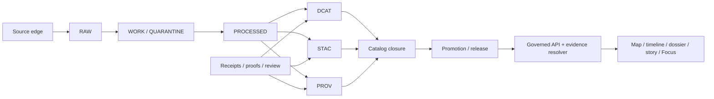

<!-- [KFM_META_BLOCK_V2]
doc_id: kfm://doc/NEEDS_VERIFICATION
title: data/catalog/
type: standard
version: v1
status: draft
owners: @bartytime4life
created: NEEDS_VERIFICATION
updated: 2026-04-14
policy_label: NEEDS_VERIFICATION
related: [
  ../README.md,
  ../processed/README.md,
  ../receipts/README.md,
  ../proofs/README.md,
  ../published/README.md,
  ./dcat/README.md,
  ./stac/README.md,
  ./prov/README.md,
  ../../contracts/README.md,
  ../../policy/README.md,
  ../../tests/README.md,
  ../../tools/validators/README.md,
  ../../tools/validators/promotion_gate/README.md,
  ../../.github/CODEOWNERS
]
tags: [kfm, data, catalog, dcat, stac, prov, closure, lineage]
notes: [owners confirmed from /.github/CODEOWNERS broad /data/ ownership; doc_id, created, and policy_label still need repo-side verification; public-main path presence is stronger than payload inventory.]
[/KFM_META_BLOCK_V2] -->

# `data/catalog/`

Governed **catalog-closure** surface for `DCAT + STAC + PROV` metadata inside the KFM data lifecycle.

> [!NOTE]
> **Status:** experimental  
> **Document status:** draft  
> **Owners:** `@bartytime4life` *(broad `/data/` CODEOWNERS fallback)*  
> **Path:** `data/catalog/README.md`  
>       
> **Quick jumps:** [Scope](#scope) · [Repo fit](#repo-fit) · [Accepted inputs](#accepted-inputs) · [Exclusions](#exclusions) · [Directory tree](#directory-tree) · [Current public inventory](#current-public-inventory) · [Quickstart](#quickstart) · [Usage](#usage) · [Diagram](#diagram) · [Reference tables](#reference-tables) · [Task list](#task-list) · [FAQ](#faq) · [Appendix](#appendix)

> [!IMPORTANT]
> `data/catalog/` is a **catalog surface**, not a canonical data zone.
>
> In KFM, authority stabilizes upstream through:
>
> `RAW → WORK / QUARANTINE → PROCESSED`
>
> and is then closed into outward `DCAT + STAC + PROV` metadata for:
>
> - discovery
> - asset description
> - lineage
> - release-visible identity

> [!TIP]
> Keep the KFM trust split visible here:
>
> **receipt ≠ proof ≠ catalog ≠ publication**
>
> `data/catalog/` should make released or release-candidate truth discoverable and cross-linkable.  
> It must not quietly replace `processed/`, `receipts/`, `proofs/`, or `published/`.

> [!NOTE]
> Current public `main` confirms `data/catalog/`, `data/catalog/dcat/`, `data/catalog/stac/`, and `data/catalog/prov/`. Each child lane currently shows a checked-in `README.md`; deeper checked-in catalog payloads are not yet visible from the inspected public tree.

---

## Scope

`data/catalog/` is the metadata seam where KFM turns released or release-candidate scope into outwardly discoverable catalog artifacts. It exists so the project can publish **discovery**, **asset description**, and **lineage** together without letting any one of those layers silently replace upstream truth.

In practical terms:

- **DCAT** carries dataset- and distribution-level discovery
- **STAC** carries spatial and temporal asset description
- **PROV** carries lineage, activity, and agent traceability

The directory’s job is not to invent truth. Its job is to make release-backed truth discoverable, inspectable, and cross-linkable without bypassing the trust membrane.

### What this README is for

Use this file to answer four questions quickly:

1. What belongs in `data/catalog/`?
2. What does **not** belong here?
3. What is **confirmed now** in the checked-in repo versus still **proposed**?
4. How should catalog material stay downstream of processing, review, and release?

### Evidence posture

| Layer | Status | Reading rule |
|---|---|---|
| Current public `main` tree for `data/` and `data/catalog/` | **CONFIRMED** | Safe for path existence and current checked-in shape |
| KFM lifecycle, catalog triplet, promotion, and fail-closed posture in current repo READMEs | **CONFIRMED** | Safe doctrine for this README |
| Checked-in catalog payload inventory beyond `README.md` files | **NEEDS VERIFICATION** | No checked-in dataset triplets are visible from the inspected directory views |
| `datasets/`, `collections/`, `items/`, and signed/hash-adjacent PROV starter paths | **PROPOSED** | Doctrine-aligned working shape only, not current-tree fact |
| Validator entrypoints and merge-blocking enforcement | **NEEDS VERIFICATION** | Mention only as starter wiring until branch-side scripts and workflows are directly confirmed |

[Back to top](#datacatalog)

---

## Repo fit

### Path and adjacency

| Aspect | Current reading |
|---|---|
| Path | [`data/catalog/README.md`](./README.md) |
| Owner surface | [`../../.github/CODEOWNERS`](../../.github/CODEOWNERS) broad `/data/` fallback |
| Parent lifecycle | [`../README.md`](../README.md) defines the wider governed `data/` surface |
| Child lanes | [`./dcat/README.md`](./dcat/README.md), [`./stac/README.md`](./stac/README.md), [`./prov/README.md`](./prov/README.md) |
| Adjacent data zones | [`../raw/`](../raw/), [`../work/`](../work/), [`../quarantine/`](../quarantine/), [`../processed/`](../processed/), [`../receipts/`](../receipts/), [`../proofs/`](../proofs/), [`../published/`](../published/), [`../registry/`](../registry/) |
| Shared control surfaces | [`../../contracts/`](../../contracts/), [`../../policy/`](../../policy/), [`../../tests/`](../../tests/), [`../../tools/validators/`](../../tools/validators/) |
| Downstream consumers | governed APIs, discovery/read routes, Evidence Drawer flows, map/timeline/dossier/story/focus surfaces |

### Current public evidence snapshot *(CONFIRMED)*

| Surface | Current public-main content | What that means |
|---|---|---|
| `data/` | `catalog/`, `processed/`, `proofs/`, `published/`, `quarantine/`, `raw/`, `receipts/`, `registry/`, `work/`, `README.md` | The wider lifecycle surface is checked in now |
| `data/catalog/` | `dcat/`, `prov/`, `stac/`, `README.md` | The catalog parent exists now as a real checked-in lane |
| `data/catalog/dcat/` | `README.md` | The DCAT lane exists; checked-in dataset JSON-LD files are not yet visible here |
| `data/catalog/stac/` | `README.md` | The STAC lane exists; checked-in collections/items are not yet visible here |
| `data/catalog/prov/` | `README.md` | The PROV lane exists; checked-in provenance bundles are not yet visible here |

### Repo-fit summary

`data/catalog/` is where KFM’s outward metadata closure should live once a dataset version is ready for release-backed discovery. It should help users and services discover released scope, resolve lineage, and follow policy-safe links outward.

It is **not** the place for raw payloads, unpublished scratch work, runtime envelopes, direct API behavior, or secret policy logic.

[Back to top](#datacatalog)

---

## Accepted inputs

The following belong here when they are release-bearing or promotion-relevant:

| Accepted input | Why it belongs here | Status |
|---|---|---|
| DCAT dataset and distribution metadata | Dataset-level discovery face | **CONFIRMED doctrine** |
| STAC catalogs, collections, and items for released assets | Asset-level spatial/temporal discovery face | **CONFIRMED doctrine** |
| PROV bundles with entity / activity / agent lineage | Catalog-facing traceability | **CONFIRMED doctrine** |
| Cross-links to processed artifacts, manifests, receipts, proofs, and authoritative sources | Catalog closure must resolve cleanly | **CONFIRMED doctrine** |
| Minimal human-readable README or index material | Fast maintainer and reviewer orientation | **CONFIRMED current pattern** |

### Practical interpretation

Accepted content here should be:

- downstream of `PROCESSED`
- compatible with review and release posture
- cross-linked across the triplet
- restrained enough that the catalog does not outrun upstream evidence

### Minimum bar for anything added here

- it is clearly **catalog-shaped** rather than payload-shaped
- it resolves to a governed upstream artifact
- it cross-links cleanly to the other triplet members
- it preserves release or candidate identity instead of inventing a parallel naming universe
- it does not quietly become a second proof pack or a public runtime object

[Back to top](#datacatalog)

---

## Exclusions

The following do **not** belong in `data/catalog/` as sovereign truth or as the normal public path:

| Excluded content | Put it under / behind | Why |
|---|---|---|
| Raw acquisitions and source-native dumps | [`../raw/`](../raw/) | Discovery is not intake |
| Intermediate transforms, QA scratch outputs, or unpublished work | [`../work/`](../work/) or [`../quarantine/`](../quarantine/) | Validation does not equal publication |
| Canonical processed payloads | [`../processed/`](../processed/) | Catalog metadata is not the payload store |
| Policy bundles, reason registries, and OPA/Rego logic | [`../../policy/`](../../policy/) | Policy should stay executable and reviewable in its own surface |
| Shared schemas, profiles, and fixtures | [`../../contracts/`](../../contracts/) or the repo’s schema authority | Prevents metadata docs from becoming silent contract authority |
| API handlers, OpenAPI contracts, or runtime response envelopes | app / contract surfaces | Catalog files are not API implementations |
| Unreviewed candidate scope pretending to be outward-ready truth | work / quarantine / review flows | KFM promotion is a governed state change, not a naming trick |
| Materialized outward copies as the primary release surface | [`../published/`](../published/) | Publication materialization is adjacent, not identical, to catalog closure |
| Release proof packs or attestations as the primary release record | [`../proofs/`](../proofs/) | Proofs stay explicit and separately inspectable |
| Process-memory receipts as the primary record | [`../receipts/`](../receipts/) | Catalog closure should point to process memory, not swallow it |

> [!CAUTION]
> If a fact is “true” only in `data/catalog/` and is not traceable back to governed upstream artifacts, review state, and release posture, it is not ready to cross KFM’s trust membrane.

[Back to top](#datacatalog)

---

## Directory tree

### Current visible shape *(CONFIRMED)*

```text
data/
├── README.md
├── catalog/
│   ├── README.md
│   ├── dcat/
│   │   └── README.md
│   ├── prov/
│   │   └── README.md
│   └── stac/
│       └── README.md
├── processed/
├── proofs/
├── published/
├── quarantine/
├── raw/
├── receipts/
├── registry/
└── work/
```

### Working-shape starter *(PROPOSED)*

```text
data/catalog/
├── dcat/
│   ├── README.md
│   └── datasets/
│       └── <dataset>__<version>.jsonld
├── stac/
│   ├── README.md
│   ├── collections/
│   │   └── <dataset>.json
│   └── items/
│       └── <dataset>__<version>.json
└── prov/
    ├── README.md
    ├── <dataset>__<version>.prov.json
    ├── <dataset>__<version>.prov.json.sig
    └── <dataset>__<version>.prov.json.sha256
```

### Interpretation rule

- **Current visible shape** = what is checked into public `main` now
- **Working-shape starter** = a doctrine-aligned target for later catalog payloads, not a claim that those files already exist

[Back to top](#datacatalog)

---

## Current public inventory

| Surface | Current public state | Why it matters |
|---|---|---|
| `data/catalog/` | Public listing shows `README.md`, `dcat/`, `stac/`, and `prov/` | Confirms the parent lane and triplet child lanes exist |
| `data/catalog/dcat/` | Public listing shows `README.md` | Confirms the DCAT child lane exists |
| `data/catalog/stac/` | Public listing shows `README.md` | Confirms the STAC child lane exists |
| `data/catalog/prov/` | Public listing shows `README.md` | Confirms the PROV child lane exists |
| Non-README catalog payloads | No checked-in triplet inventory is surfaced in the inspected public tree | Keep payload naming and storage conventions marked **PROPOSED** until checked-in artifacts prove otherwise |
| Sibling lifecycle lanes | `processed/`, `receipts/`, `proofs/`, and `published/` all exist as distinct siblings | Keeps closure, process memory, release proof, and materialized scope visibly separate |

[Back to top](#datacatalog)

---

## Quickstart

Use these commands first when working in this area:

```bash
# Inspect the current checked-in catalog surface
find data/catalog -maxdepth 2 -type f | sort

# Read parent + sibling guidance
sed -n '1,220p' data/README.md
sed -n '1,220p' data/catalog/README.md
sed -n '1,220p' data/catalog/dcat/README.md
sed -n '1,220p' data/catalog/stac/README.md
sed -n '1,220p' data/catalog/prov/README.md
sed -n '1,220p' data/processed/README.md
sed -n '1,220p' data/receipts/README.md
sed -n '1,220p' data/proofs/README.md
sed -n '1,220p' data/published/README.md

# Check whether real triplet artifacts exist yet
find data/catalog -type f | grep -E '\.(json|jsonld)$|\.prov\.json$' || true

# Inspect likely cross-link fields once payloads exist
grep -RIn "derived_from\|wasDerivedFrom\|wasGeneratedBy\|accessRights\|spec_hash\|release_id" data/catalog || true
```

When new catalog work starts, begin from a processed dataset version and ask what must be expressed in **DCAT**, **STAC**, and **PROV** together.

[Back to top](#datacatalog)

---

## Usage

### Operating rule

Author or emit catalog records here **only after** upstream data has enough identity, checksums, rights/sensitivity handling, review state, and validation evidence to support outward discovery.

### Recommended workflow

1. Start with a governed upstream artifact in [`../processed/`](../processed/).
2. Build or update the matching triplet:
   - **DCAT** for dataset/distribution discovery
   - **STAC** for spatial/temporal asset description
   - **PROV** for lineage
3. Cross-link all three to the same dataset/version identity.
4. Attach manifests, receipts, proofs, or decision references where the branch-side artifact model supports them.
5. Expose discovery through governed APIs and trust-visible read surfaces, not through direct filesystem assumptions.

### Current visible reality vs next useful step

| Current public-main reality | Next useful step |
|---|---|
| The catalog parent and all three child lanes are checked in as documentation surfaces | Add one representative public-safe triplet that resolves cleanly to a processed dataset version |
| No checked-in dataset JSON-LD, STAC collections/items, or PROV bundle inventory is visible in the inspected directories | Confirm canonical subtree naming, then add real files and validation fixtures |
| The lane-level READMEs exist, but they are not yet harmonized in status depth or ownership detail | Reconcile the family so `catalog/`, `dcat/`, `stac/`, and `prov/` read as one governed surface |

### Illustrative validation sequence *(PROPOSED starter wiring)*

The commands below are starter patterns, not confirmed branch-side enforcement.

```bash
scripts/catalog/validate_stac.py \
  data/catalog/stac/items/<dataset>__<version>.json

scripts/catalog/validate_jsonld.sh \
  data/catalog/dcat/datasets/<dataset>__<version>.jsonld

scripts/provenance/validate_prov.py \
  data/catalog/prov/<dataset>__<version>.prov.json

scripts/evidence/crosslink_consistency.py \
  --stac data/catalog/stac/items/<dataset>__<version>.json \
  --dcat data/catalog/dcat/datasets/<dataset>__<version>.jsonld \
  --prov data/catalog/prov/<dataset>__<version>.prov.json \
  --manifest data/processed/<theme>/<dataset>/<version>/manifest.json
```

### Working principles

1. **Keep DCAT dataset-level.** It should describe the outwardly discoverable dataset and its distributions.
2. **Keep STAC asset-aware.** It should explain geometry, time, assets, and map/timeline-ready description.
3. **Keep PROV replayable.** It should answer where an artifact came from, how it was produced, and who or what was involved.
4. **Share identifiers across the triplet.** Catalog closure fails when the three lanes drift into separate naming universes.
5. **Treat catalog closure as part of promotion.** Metadata is not an afterthought appended after release.
6. **Treat metadata drift as a release bug.** Broken lineage or stale distribution targets are trust failures, not cosmetic debt.

[Back to top](#datacatalog)

---

## Diagram


```mermaid
flowchart LR
    A[Source edge] --> B[RAW]
    B --> C[WORK / QUARANTINE]
    C --> D[PROCESSED]

    D --> E[DCAT]
    D --> F[STAC]
    D --> G[PROV]

    H[Receipts / proofs / review] --> E
    H --> F
    H --> G

    E --> I[Catalog closure]
    F --> I
    G --> I

    I --> J[Promotion / release]
    J --> K[Governed API + evidence resolver]
    K --> L[Map / timeline / dossier / story / Focus]
```

The architectural point is simple: catalog metadata is downstream of processed truth and release discipline, but upstream of outward discovery and trust-visible surfaces.

[Back to top](#datacatalog)

---

## Reference tables

### Catalog crosswalk

| Sub-area | Primary job | Typical grain | Must link to | Must not replace |
|---|---|---|---|---|
| `dcat/` | Dataset and distribution discovery | dataset / distribution / data service | processed artifacts, licenses, temporal/spatial coverage, outward endpoints | STAC’s asset model and PROV’s lineage model |
| `stac/` | Spatial/temporal asset description | catalog / collection / item / asset | processed geospatial assets, geometry/bbox, collection/self links, provenance refs | canonical processed payloads |
| `prov/` | Lineage and release traceability | entity / activity / agent | raw/work/processed artifacts, manifests, runs, tools, timestamps | dataset-discovery prose or payload storage |

### Boundary matrix

| Surface | Primary job | Must not be confused with |
|---|---|---|
| `data/processed/` | canonical processed authority | outward metadata closure |
| `data/receipts/` | process memory | catalog closure or release proof |
| `data/proofs/` | release-significant evidence | catalog metadata or materialized outward copies |
| `data/catalog/` | outward metadata and lineage closure | payload authority, process memory, or proof pack |
| `data/published/` | optional release-backed outward scope | the catalog triplet itself |

### Current lane status

| Lane | Current checked-in content | Meaning now |
|---|---|---|
| `data/catalog/dcat/` | `README.md` | Lane exists; dataset JSON-LD inventory is not yet visible here |
| `data/catalog/stac/` | `README.md` | Lane exists; collections/items are not yet visible here |
| `data/catalog/prov/` | `README.md` | Lane exists; provenance-bundle inventory is not yet visible here |

### Minimum cross-link expectations

| From | Minimum link target | Why it matters |
|---|---|---|
| DCAT dataset/distribution | processed artifact target or STAC reference | discovery must resolve to something concrete |
| STAC collection/item | asset hrefs, collection/self links, PROV or derived-from reference | map/time surfaces need exact asset context |
| PROV bundle | raw inputs, work intermediates, processed outputs, activities, agents | lineage must survive audit, correction, and replay |
| All three | shared release-safe identifiers and compatible scope | prevents three independent metadata silos |

### Finite outcome pressure

Where adjacent release-facing validators use finite outcomes, catalog closure should remain joinable to at least:

| Outcome | Why it matters near catalog closure |
|---|---|
| `ALLOW` | explains why closure is fit for outward release linkage |
| `ABSTAIN` | explains why closure remains unresolved without contradiction |
| `DENY` | explains why outward discovery should not advance |
| `ERROR` | explains validator or linkage failure without ambiguity |

[Back to top](#datacatalog)

---

## Task list

### Definition of done

- [ ] verify `doc_id`, `created`, `updated`, and `policy_label` in the meta block
- [ ] keep owners aligned with `.github/CODEOWNERS`, or split to finer-grained owners if repo governance changes
- [ ] reconcile [`../README.md`](../README.md) path-verification language with current public-tree reality for `data/catalog/` and its child lanes
- [ ] harmonize the child lane READMEs so `dcat/`, `stac/`, and `prov/` read as one governed family
- [ ] confirm whether `dcat/datasets/`, `stac/collections/`, `stac/items/`, and signed/hash-adjacent PROV paths are canonical
- [ ] add at least one representative public-safe triplet that resolves cleanly to a processed dataset version
- [ ] verify real validator entrypoints and merge gates before documenting them as enforced behavior
- [ ] check all relative links and Mermaid render cleanly in GitHub
- [ ] keep receipt/proof/catalog/published boundaries explicit and cross-linked

### Review gates

- [ ] no raw/work/quarantine payload is treated as outward-ready catalog truth
- [ ] DCAT, STAC, and PROV agree on dataset/version identity and target artifacts
- [ ] rights and sensitivity posture are visible where discoverability changes
- [ ] metadata, manifests, receipts, and proofs resolve without guesswork
- [ ] drift between `data/catalog/README.md` and sibling lane docs is actively reduced, not compounded

[Back to top](#datacatalog)

---

## FAQ

### Why does this directory need three metadata surfaces instead of one?

Because KFM splits **discovery**, **asset description**, and **lineage** into separate responsibilities. That separation keeps outward discovery useful without flattening provenance or overloading one record type.

### Does `data/catalog/` publish data by itself?

No. It supports outward discovery and inspection, but released payload truth still lives upstream in governed data zones and downstream in governed APIs and trust-visible read surfaces.

### What is currently confirmed on public `main`?

The checked-in documentation surface is confirmed: `data/catalog/`, `data/catalog/dcat/`, `data/catalog/stac/`, `data/catalog/prov/`, and their `README.md` files. That is real repo shape, but it is not yet proof of a checked-in catalog payload inventory.

### Why are deeper subtree paths still marked PROPOSED?

Because the inspected public directories do not yet show checked-in `datasets/`, `collections/`, `items/`, or `.prov.json` inventories. Those shapes fit current doctrine, but they still need branch-side confirmation before they should be treated as canonical.

### What failure mode should maintainers watch most closely?

Metadata drift. A catalog record that still resolves but no longer describes the released artifact truthfully is more dangerous than a missing file, because it looks trustworthy while quietly weakening auditability.

[Back to top](#datacatalog)

---

## Appendix

<details>
<summary><strong>PROPOSED starter naming patterns</strong></summary>

These patterns fit the current doctrine and sibling README guidance, but they should still be verified against the active branch before becoming hard policy.

```text
data/catalog/dcat/datasets/<dataset>__<version>.jsonld
data/catalog/stac/collections/<dataset>.json
data/catalog/stac/items/<dataset>__<version>.json
data/catalog/prov/<dataset>__<version>.prov.json
```

A matching processed artifact is typically expected upstream:

```text
data/processed/<theme>/<dataset>/<version>/
```

</details>

<details>
<summary><strong>Catalog PR review checklist</strong></summary>

- Does every outward discovery record point back to a governed processed artifact?
- Do DCAT, STAC, and PROV agree on dataset/version identity?
- Are license, access-rights, and sensitivity cues visible where they matter?
- Is provenance specific enough to survive audit, correction, or rollback?
- Are relative links stable and GitHub-readable where repository docs are involved?
- Are example commands clearly marked as runnable or illustrative?
- Does the README distinguish current checked-in shape from proposed working shape?

</details>

[Back to top](#datacatalog)
