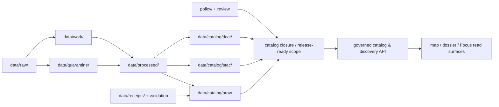

<!-- [KFM_META_BLOCK_V2]
doc_id: kfm://doc/NEEDS_VERIFICATION
title: data/catalog/
type: standard
version: v1
status: draft
owners: NEEDS_VERIFICATION
created: NEEDS_VERIFICATION
updated: NEEDS_VERIFICATION
policy_label: NEEDS_VERIFICATION
related: [data/README.md, data/catalog/dcat/README.md, data/catalog/stac/README.md, data/catalog/prov/README.md]
tags: [kfm, catalog, dcat, stac, prov]
notes: [doc_id, owners, dates, and policy_label need live verification]
[/KFM_META_BLOCK_V2] -->

# data/catalog/

Governed catalog-closure surface for DCAT, STAC, and PROV metadata inside the KFM data lifecycle.

> **Status:** experimental  
> **Doc state:** draft scaffold replacement  
> **Owners:** NEEDS_VERIFICATION  
> **Path:** `data/catalog/README.md`  
>      
> **Quick jump:** [Scope](#scope) · [Repo fit](#repo-fit) · [Directory tree](#directory-tree) · [Quickstart](#quickstart) · [Catalog crosswalk](#catalog-crosswalk) · [FAQ](#faq) · [Appendix](#appendix)

> [!IMPORTANT]
> `data/catalog/` is not the authoritative payload store. In KFM, authoritative data stays upstream in governed lifecycle zones such as `../processed/`; this directory carries outward discovery, distribution, and lineage metadata that must remain release-backed and cross-linked.

> [!NOTE]
> The live repo confirms that `data/catalog/` exists with `dcat/`, `stac/`, and `prov/` child directories. The deeper layout and filename patterns shown below are **PROPOSED starter conventions** unless verified in the mounted checkout.

## Scope

`data/catalog/` is the metadata seam where KFM turns promoted, policy-safe scope into outwardly discoverable catalog artifacts. In practice, this means three coordinated surfaces:

- **DCAT** for dataset- and distribution-level discovery
- **STAC** for spatial/temporal asset description
- **PROV** for lineage, activity, and agent traceability

The directory’s job is not to invent truth. Its job is to make release-backed truth discoverable, inspectable, and cross-linkable without bypassing the trust membrane.

**Evidence posture for this README**

- **CONFIRMED:** the current repo contains `data/catalog/` with `dcat/`, `stac/`, and `prov/`.
- **INFERRED:** this directory sits between `data/processed/` and governed discovery/API surfaces in the broader KFM lifecycle.
- **PROPOSED:** deeper subfolders, filename conventions, and validator commands below are starter patterns that should be confirmed against the mounted checkout before hard enforcement.

## Repo fit

| Aspect | Repo fit |
|---|---|
| Path | [`data/catalog/README.md`](./README.md) |
| Parent contract | [`../README.md`](../README.md) defines the surrounding `raw -> work/quarantine -> processed -> catalog -> published` lifecycle |
| Upstream inputs | [`../processed/`](../processed/), [`../receipts/`](../receipts/), [`../proofs/`](../proofs/), [`../registry/`](../registry/) |
| Shared controls | [`../../contracts/`](../../contracts/), [`../../schemas/`](../../schemas/), [`../../policy/`](../../policy/) |
| Child surfaces | [`./dcat/`](./dcat/), [`./stac/`](./stac/), [`./prov/`](./prov/) |
| Downstream consumers | governed discovery/read surfaces, tests, and tooling in adjacent repo areas such as [`../../apps/`](../../apps/), [`../../tests/`](../../tests/), and [`../../tools/`](../../tools/) |

**Upstream/downstream logic**

- **Upstream:** this directory should receive only release-relevant metadata and references for already-governed scope.
- **Downstream:** API and UI surfaces should read catalog outputs through governed contracts, not by treating the filesystem here as a public interface.

## Accepted inputs

The following belong here when they are release-bearing or promotion-relevant:

- DCAT dataset and distribution metadata for promoted scope
- STAC collections and items for spatial/temporal assets
- PROV bundles linking raw, work, and processed artifacts to activities and agents
- Cross-link metadata that ties catalog records back to processed outputs, receipts, checksums, and authoritative sources
- Minimal human-readable README/index material that clarifies caveats, CRS, units, licensing, and citation behavior for cataloged artifacts

## Exclusions

The following do **not** belong here:

- Raw source payloads, snapshots, or acquisition dumps
- Work/quarantine intermediates that are not ready for outward discovery
- The authoritative processed payloads themselves; those belong upstream in [`../processed/`](../processed/)
- Policy bundles, OPA/Rego logic, or auth rules; those belong in [`../../policy/`](../../policy/)
- API handlers, OpenAPI contracts, or runtime response envelopes; those belong in application/contract surfaces
- Unreviewed or unpublished candidate scope pretending to be outward-ready catalog truth

> [!CAUTION]
> If a fact is “true” only in `data/catalog/` and is not traceable to governed upstream artifacts and review/policy context, it is not ready to cross KFM’s trust membrane.

## Directory tree

### CONFIRMED live tree

```text
data/catalog/
├── README.md
├── dcat/
│   └── README.md
├── prov/
│   └── README.md
└── stac/
    └── README.md
```

### PROPOSED starter deepening

```text
data/catalog/
├── dcat/
│   ├── README.md
│   └── datasets/
│       └── <dataset>__<version>.jsonld
├── prov/
│   ├── README.md
│   └── <dataset>__<version>.prov.json
└── stac/
    ├── README.md
    ├── collections/
    │   └── <dataset>.json
    └── items/
        └── <dataset>__<version>.json
```

That proposed shape keeps discovery (`dcat/`), asset structure (`stac/`), and lineage (`prov/`) separate while still making cross-link checks straightforward.

## Quickstart

Use these commands first when working in this area:

```bash
# Inspect the current catalog surface
find data/catalog -maxdepth 3 -print | sort

# Read the parent lifecycle contract before editing catalog files
sed -n '1,220p' data/README.md

# Inspect the current scaffold state
sed -n '1,160p' data/catalog/README.md
sed -n '1,120p' data/catalog/dcat/README.md
sed -n '1,120p' data/catalog/stac/README.md
sed -n '1,120p' data/catalog/prov/README.md
```

For new work, start from a promoted or promotion-ready artifact in `../processed/`, then decide what must be expressed in DCAT, STAC, and PROV together.

## Usage

### Operating rule

Author or emit catalog records here **only after** upstream data has enough identity, checksums, rights/sensitivity handling, and validation evidence to support outward discovery.

### Recommended workflow

1. Start with a governed upstream artifact in [`../processed/`](../processed/).
2. Emit the matching catalog triplet:
   - **DCAT** dataset/distribution metadata
   - **STAC** collection/item metadata where spatial/temporal assets are involved
   - **PROV** lineage bundle
3. Cross-link the three surfaces so they reference the same released scope.
4. Confirm policy/review implications before anything here is treated as outward-ready.
5. Expose discovery through governed APIs and public-safe read surfaces, not through direct filesystem assumptions.

### Illustrative starter validation sequence

The commands below are **PROPOSED starter patterns** drawn from KFM’s current doctrinal and design materials. Verify actual mounted script paths before wiring them into CI.

```bash
scripts/catalog/validate_stac.py \
  data/catalog/stac/items/<dataset>__<version>.json

scripts/catalog/validate_jsonld.sh \
  data/catalog/dcat/datasets/<dataset>__<version>.jsonld

scripts/provenance/validate_prov.py \
  data/catalog/prov/<dataset>__<version>.prov.json

scripts/evidence/crosslink_consistency.py \
  --stac data/catalog/stac/items/<dataset>__<version>.json \
  --dcat data/catalog/dcat/datasets/<dataset>__<version>.jsonld \
  --prov data/catalog/prov/<dataset>__<version>.prov.json \
  --manifest data/processed/<theme>/<dataset>/<version>/manifest.json
```

### Working principles

1. **Keep DCAT dataset-level.** Use it to describe the discoverable dataset and its distributions.
2. **Keep STAC asset-aware.** Use it where place, time, geometry, and asset roles matter.
3. **Keep PROV replayable.** A lineage record should answer where the output came from, who or what produced it, and when.
4. **Cross-link without guesswork.** The three surfaces should agree on identifiers, release scope, and artifact targets.
5. **Do not bypass policy.** Catalog discoverability is part of release behavior, not a workaround around review.
6. **Do not let metadata drift from payload reality.** If the distribution URLs, checksums, roles, or provenance chain are stale, the catalog should be treated as untrustworthy.

## Diagram


```mermaid
flowchart LR
    RAW["data/raw/"] --> WORK["data/work/"]
    RAW --> QUAR["data/quarantine/"]
    WORK --> PROC["data/processed/"]
    QUAR --> PROC

    PROC --> DCAT["data/catalog/dcat/"]
    PROC --> STAC["data/catalog/stac/"]
    PROC --> PROV["data/catalog/prov/"]

    RECEIPTS["data/receipts/ + validation"] --> PROV
    POLICY["policy/ + review"] --> CLOSURE["catalog closure / release-ready scope"]

    DCAT --> CLOSURE
    STAC --> CLOSURE
    PROV --> CLOSURE

    CLOSURE --> API["governed catalog & discovery API"]
    API --> UI["map / dossier / Focus read surfaces"]
```

The key architectural point is that catalog metadata is downstream of governed processing and review, but upstream of outward discovery.

## Tables

### Catalog crosswalk

| Sub-area | Primary job | Typical grain | Must link to | Should not replace |
|---|---|---|---|---|
| `dcat/` | Dataset discovery and distribution metadata | Dataset / distribution / data service | processed artifacts, licenses, temporal/spatial coverage, outward endpoints | STAC’s detailed spatial asset model |
| `stac/` | Spatial/temporal asset description | Collection / item / asset | processed geospatial assets, geometry/bbox, collection/self links, provenance references | DCAT’s higher-level discovery role |
| `prov/` | Lineage and reproducibility | Entity / activity / agent | raw/work/processed artifacts, runs, tools, timestamps | public-facing catalog descriptions |

### Minimum cross-link expectations

| From | Minimum link target | Why it matters |
|---|---|---|
| DCAT dataset/distribution | processed artifact URL or STAC reference | discovery must resolve to something concrete |
| STAC item/collection | asset hrefs, collection/self links, derived/provenance links | map/time surfaces need exact asset context |
| PROV bundle | raw inputs, work intermediates, processed outputs, activities, agents | lineage must survive audit and correction |
| All three | shared release-safe identifiers and compatible scope | prevents “three metadata silos” drift |

### README minimums for cataloged datasets

| Field | Why it belongs |
|---|---|
| What it is | fast human orientation |
| Source(s) | citation and rights clarity |
| Method summary | transformation transparency |
| CRS / units / caveats | safe downstream interpretation |
| License / citation | reuse and attribution discipline |
| Links to DCAT / STAC / PROV | keeps human and machine views aligned |

## Task list

### Definition of done for this directory

- [ ] Owners, `doc_id`, `created`, `updated`, and `policy_label` are verified and placeholders removed.
- [ ] `dcat/README.md`, `stac/README.md`, and `prov/README.md` are upgraded from scaffolds to doctrine-aligned directory READMEs.
- [ ] The mounted checkout confirms whether nested paths such as `stac/items/`, `stac/collections/`, and `dcat/datasets/` are canonical.
- [ ] At least one representative public-safe catalog triplet exists and cross-links cleanly.
- [ ] Validator entrypoints referenced here are checked against the real repo and updated if needed.
- [ ] Parent and child README links resolve correctly in GitHub rendering.
- [ ] Release/review semantics for outward catalog scope are documented without overstating mounted implementation.

### Review gates

- [ ] No raw/work payloads are being treated as outward-ready catalog truth.
- [ ] DCAT, STAC, and PROV records agree on scope and identifiers.
- [ ] Rights/sensitivity labels are visible where they affect discoverability.
- [ ] This README still matches the parent `data/` lifecycle contract.

## FAQ

### Why does this directory need three metadata surfaces instead of one?

Because KFM treats **discovery**, **asset description**, and **lineage** as different responsibilities. DCAT, STAC, and PROV overlap, but they do not collapse cleanly into one object without losing clarity or auditability.

### Does `data/catalog/` publish data by itself?

No. It supports outward discovery and inspection, but release-bearing payload truth still lives upstream in governed data zones and downstream in governed API/read surfaces.

### Can unpublished or restricted scope appear here?

Only with extreme caution and only when policy and review behavior are explicit. As a default posture, outward-ready catalog closure should block unpublished or policy-unsafe scope.

### Should API payloads or OpenAPI specs live here?

No. Catalog artifacts can be consumed by APIs, but contracts and runtime envelopes belong in their own governed contract/application surfaces.

### What is the failure mode to watch for most closely?

Metadata drift: catalog records that still resolve, but no longer describe the released artifact truthfully. That failure is quieter than a broken build and more dangerous than a missing file.

## Appendix

<details>
<summary><strong>PROPOSED starter naming patterns</strong></summary>

These patterns are strong candidates, but they should still be checked against the mounted checkout before becoming hard policy.

```text
data/catalog/stac/collections/<dataset>.json
data/catalog/stac/items/<dataset>__<version>.json
data/catalog/dcat/datasets/<dataset>__<version>.jsonld
data/catalog/prov/<dataset>__<version>.prov.json
```

A matching processed artifact is typically expected upstream:

```text
data/processed/<theme>/<dataset>/<version>/
```

</details>

<details>
<summary><strong>Catalog PR review checklist</strong></summary>

- Does every outward discovery record point back to a governed processed artifact?
- Do DCAT, STAC, and PROV agree on dataset/version identity?
- Are license, access rights, and sensitivity cues visible where they matter?
- Is provenance specific enough to survive an audit or correction?
- Are links relative, stable, and GitHub-readable where repository docs are involved?
- Are example commands clearly marked as runnable or illustrative?

</details>

[Back to top](#datacatalog)
