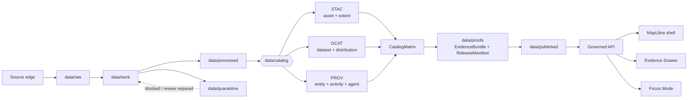

<!-- [KFM_META_BLOCK_V2]
doc_id: kfm://doc/NEEDS_VERIFICATION
title: data/catalog/
type: standard
version: v1
status: draft
owners: NEEDS_VERIFICATION(@bartytime4life from prior repo-doc evidence)
created: NEEDS_VERIFICATION
updated: NEEDS_VERIFICATION
policy_label: NEEDS_VERIFICATION
related: [../README.md, ./dcat/README.md, ./stac/README.md, ./prov/README.md, ../processed/README.md, ../receipts/README.md, ../proofs/README.md, ../published/README.md, ../../tools/catalog/README.md, ../../tests/catalog/README.md, ../../tools/validators/promotion_gate/README.md, ../../contracts/README.md, ../../schemas/README.md, ../../policy/README.md]
tags: [kfm, data, catalog, dcat, stac, prov, catalog-closure, evidence]
notes: [doc_id, owner, created date, updated date, and policy_label require verification against the target branch; this README preserves the receipt/proof/catalog/publication split and treats deeper payload inventory as NEEDS VERIFICATION until inspected.]
[/KFM_META_BLOCK_V2] -->

<a id="top"></a>
<a id="datacatalog"></a>

# `data/catalog/`

Governed catalog-closure surface for **DCAT**, **STAC**, and **PROV** metadata inside the KFM data lifecycle.

> [!NOTE]
> **Status:** experimental  
> **Document status:** draft  
> **Owners:** `@bartytime4life` — **NEEDS VERIFICATION** against the current branch’s `CODEOWNERS`  
> **Path:** `data/catalog/README.md`  
> **Repo fit:** parent [`../README.md`](../README.md) · children [`dcat/`](./dcat/README.md), [`stac/`](./stac/README.md), [`prov/`](./prov/README.md) · adjacent [`../processed/`](../processed/README.md), [`../receipts/`](../receipts/README.md), [`../proofs/`](../proofs/README.md), [`../published/`](../published/README.md)  
> 
> 
> 
> 
>   
> **Quick jumps:** [Scope](#scope) · [Repo fit](#repo-fit) · [Accepted inputs](#accepted-inputs) · [Exclusions](#exclusions) · [Directory tree](#directory-tree) · [Quickstart](#quickstart) · [Usage](#usage) · [Diagram](#diagram) · [Reference tables](#reference-tables) · [Task list](#task-list) · [FAQ](#faq) · [Appendix](#appendix)

> [!IMPORTANT]
> `data/catalog/` is a **catalog seam**, not a canonical data store, not a proof store, and not the act of publication.
>
> In KFM terms:
>
> **receipt ≠ proof ≠ catalog ≠ publication**
>
> Catalog records make released or release-candidate artifacts discoverable, inspectable, and cross-linked. They do not by themselves prove that promotion passed.

---

## Scope

`data/catalog/` is where KFM closes outward metadata around governed artifacts.

It exists so maintainers can answer review questions such as:

- What dataset, artifact, or release family is being described?
- Which spatial, temporal, and asset-level metadata are exposed for discovery?
- Which rights, access, and distribution cues are visible?
- Which lineage chain explains how the artifact was produced?
- Do `DCAT`, `STAC`, and `PROV` agree on the same subject, version, checksums, and release references?
- Can downstream Evidence Drawer, Focus Mode, API, and review surfaces resolve the cataloged artifact without bypassing governance?

### Working rule

Use this lane for **metadata closure around governed artifacts**.

Do **not** use it to hide weak upstream evidence, bypass validation, or turn generated catalog prose into source truth.

[Back to top](#top)

---

## Repo fit

`data/catalog/` sits after validated processed artifacts and before, or beside, release-facing proof and publication surfaces.

```text
Source edge
  -> data/raw/
  -> data/work/ or data/quarantine/
  -> data/processed/
  -> data/catalog/        # this directory
  -> data/proofs/
  -> data/published/
  -> governed API / MapLibre / Evidence Drawer / Focus Mode
```

### Path and adjacent surfaces

| Relation | Surface | Role | Verification posture |
|---|---|---|---|
| Parent data lifecycle | [`../README.md`](../README.md) | Explains how this catalog seam fits the broader `data/` truth path | NEEDS VERIFICATION in active checkout |
| Upstream canonical artifacts | [`../processed/README.md`](../processed/README.md) | Supplies the validated artifact or dataset version being cataloged | Must exist before release-bearing closure |
| Catalog child lane | [`./stac/README.md`](./stac/README.md) | Spatial/temporal asset discovery and item/collection metadata | Child README expected; payload inventory still branch-specific |
| Catalog child lane | [`./dcat/README.md`](./dcat/README.md) | Dataset/distribution discovery, access, rights, and publisher-facing metadata | Child README expected; payload inventory still branch-specific |
| Catalog child lane | [`./prov/README.md`](./prov/README.md) | Lineage vocabulary: entities, activities, agents, and generation links | Child README expected; payload inventory still branch-specific |
| Process memory | [`../receipts/README.md`](../receipts/README.md) | Run, validation, ingest, transform, and review memory | Catalog may reference receipts; it does not replace them |
| Release evidence | [`../proofs/README.md`](../proofs/README.md) | EvidenceBundle, ReleaseManifest, CatalogMatrix, proof pack, rollback refs | Proofs decide release trust; catalog supports closure |
| Published materialization | [`../published/README.md`](../published/README.md) | Release-backed public-safe materialized outputs and aliases | Publication follows promotion, not catalog file creation |
| Helper tooling | [`../../tools/catalog/README.md`](../../tools/catalog/README.md) | Catalog QA, cross-link, and reviewer-facing helper logic | Helper lane inspects this directory; it does not own catalog truth |
| Tests | [`../../tests/catalog/README.md`](../../tests/catalog/README.md) | Fixture-based proof for catalog closure behavior | Tests prove behavior; they do not become metadata authority |
| Promotion gate | [`../../tools/validators/promotion_gate/README.md`](../../tools/validators/promotion_gate/README.md) | Release-readiness validation, including catalog closure | Gate remains downstream of candidate preparation |
| Contracts and schemas | [`../../contracts/README.md`](../../contracts/README.md), [`../../schemas/README.md`](../../schemas/README.md) | Human contract meaning and machine schema authority | Schema home remains branch-sensitive |
| Policy | [`../../policy/README.md`](../../policy/README.md) | Rights, sensitivity, obligations, denials, and release policy | Policy law stays outside catalog files |

### Repo-fit summary

| Question | Answer |
|---|---|
| What belongs here? | `STAC`, `DCAT`, and `PROV` catalog records plus small catalog-local README guidance, examples, and closure references. |
| What does not belong here? | Raw payloads, work scratch files, canonical processed assets, receipts, proof packs, published runtime outputs, policy bundles, schemas, or generated AI prose. |
| What reads this lane? | Catalog validators, promotion gates, governed APIs, Evidence Drawer payload builders, reviewer tools, and documentation readers. |
| What should this lane never do? | Pretend a catalog file is proof of publication, proof of rights, proof of source authority, or a substitute for EvidenceBundle resolution. |

[Back to top](#top)

---

## Accepted inputs

Only explicit, reviewable, release-aware catalog artifacts belong here.

| Accepted input | Typical home | Why it belongs here |
|---|---|---|
| STAC Collections | `data/catalog/stac/<domain>/collection.json` | Declares spatial/temporal extent and asset family discovery. |
| STAC Items | `data/catalog/stac/<domain>/<release_id>/<artifact_id>.json` | Describes a specific spatial/temporal asset or release-bearing artifact. |
| DCAT Dataset records | `data/catalog/dcat/<domain>/<release_id>.jsonld` | Describes dataset identity, publisher/access context, rights, and distributions. |
| DCAT Distribution records | `data/catalog/dcat/<domain>/<release_id>.distribution.jsonld` | Binds access URLs, formats, checksums, and distribution metadata. |
| PROV lineage records | `data/catalog/prov/<domain>/<release_id>.prov.json` | Records entity/activity/agent lineage for the cataloged artifact. |
| Catalog closure summaries | Usually under `data/proofs/<domain>/.../catalog_matrix.json` with refs back here | Proves cross-surface agreement when the branch has a CatalogMatrix implementation. |
| README-local examples | `*.example.json`, `*.example.jsonld`, or documented fixture paths | Helps reviewers understand expected shape without implying production release. |
| Checksums or signatures for catalog records | `*.sha256`, `*.sig` — **NEEDS VERIFICATION** | Useful only when signing and checksum conventions are confirmed. |

### Input rules

1. Prefer **artifact-scoped** records over vague dataset prose.
2. Preserve **stable identity**: subject, version, release family, and digest references should match across child lanes.
3. Keep **rights and sensitivity cues visible**, especially when a catalog describes public-safe derivatives of restricted material.
4. Treat examples as examples. Do not use `*.example.*` files as release aliases.
5. Any catalog object that references unpublished or restricted materials must clearly mark access posture and avoid exposing sensitive internals.

[Back to top](#top)

---

## Exclusions

The following do **not** belong in `data/catalog/` as their primary home:

| Excluded | Put it here instead | Why |
|---|---|---|
| Source-native acquisitions | `../raw/` | RAW preserves source payloads and acquisition manifests. |
| Transform scratch space, QA staging, or repair outputs | `../work/` | WORK is reproducible processing space, not outward metadata. |
| Rights-unclear, malformed, sensitive, or blocked material | `../quarantine/` | Catalog should not normalize unresolved material into discoverability. |
| Canonical processed artifacts | `../processed/` | Catalog describes processed artifacts; it does not store them. |
| Run receipts, validation receipts, or ingest receipts as primary records | `../receipts/` | Receipts are process memory, not outward catalog closure. |
| EvidenceBundles, ReleaseManifests, proof packs, attestations, CatalogMatrix objects | `../proofs/` | These are release-grade trust objects, not catalog payloads. |
| Public materialized release packages | `../published/` | Publication is a governed state, not a catalog write. |
| Source descriptors and source activation records | `../registry/` or shared contracts/schemas | Source identity and admission stay upstream. |
| Policy bundles, rules, and obligations | `../../policy/` | Catalog records may expose policy labels; they do not define policy. |
| JSON Schemas or contract authority | `../../contracts/` and/or `../../schemas/` | Schema-home authority must not be duplicated in catalog folders. |
| MapLibre style files, UI state, Focus narratives, AI summaries | Governed API / app surfaces | UI and AI consume governed outputs; they do not live as catalog truth. |
| Secrets, credentials, source API tokens, private service URLs | Never commit; use approved secret management | Catalog files must be safe to review in GitHub. |

> [!CAUTION]
> A catalog record may reference upstream evidence and receipts, but it must not expose restricted raw paths, private source details, or exact sensitive locations unless release policy explicitly allows it.

[Back to top](#top)

---

## Directory tree

### README-level baseline to verify

This is the minimum README shape this directory contract expects. Re-check it against the active branch before strengthening claims.

```text
data/
└── catalog/
    ├── README.md
    ├── dcat/
    │   └── README.md
    ├── prov/
    │   └── README.md
    └── stac/
        └── README.md
```

### Doctrine-aligned growth shape

The shape below is a **PROPOSED** starter pattern, not proof that payloads already exist.

```text
data/
└── catalog/
    ├── README.md
    ├── dcat/
    │   ├── README.md
    │   └── <domain>/
    │       ├── <release_id>.dataset.jsonld
    │       └── <release_id>.distribution.jsonld
    ├── stac/
    │   ├── README.md
    │   └── <domain>/
    │       ├── collection.json
    │       └── <release_id>/
    │           └── <artifact_id>.json
    └── prov/
        ├── README.md
        └── <domain>/
            └── <release_id>.prov.json
```

### Related closure surface

Catalog closure usually becomes reviewable when this lane is paired with proof and release objects.

```text
data/
├── processed/<theme>/<dataset>/<version>/
├── catalog/
│   ├── stac/
│   ├── dcat/
│   └── prov/
├── receipts/
├── proofs/
│   └── <domain>/<release_id>/
│       ├── evidence_bundle.json
│       ├── release_manifest.json
│       ├── catalog_matrix.json
│       └── proof_pack.json
└── published/<domain>/<release_id>/
```

[Back to top](#top)

---

## Quickstart

Run these from the repository root.

### 1) Inspect the catalog surface

```bash
find data/catalog -maxdepth 4 -type f | sort

sed -n '1,220p' data/README.md
sed -n '1,220p' data/catalog/README.md
sed -n '1,220p' data/catalog/stac/README.md
sed -n '1,220p' data/catalog/dcat/README.md
sed -n '1,220p' data/catalog/prov/README.md
```

### 2) Inspect adjacent trust surfaces

```bash
sed -n '1,220p' data/processed/README.md 2>/dev/null || true
sed -n '1,220p' data/receipts/README.md 2>/dev/null || true
sed -n '1,220p' data/proofs/README.md 2>/dev/null || true
sed -n '1,220p' data/published/README.md 2>/dev/null || true

sed -n '1,220p' tools/catalog/README.md 2>/dev/null || true
sed -n '1,220p' tests/catalog/README.md 2>/dev/null || true
sed -n '1,220p' tools/validators/promotion_gate/README.md 2>/dev/null || true
```

### 3) Look for emitted catalog payloads

```bash
find data/catalog/stac -type f 2>/dev/null | sort
find data/catalog/dcat -type f 2>/dev/null | sort
find data/catalog/prov -type f 2>/dev/null | sort
```

### 4) Run branch-provided validators when available

```bash
# NEEDS VERIFICATION: run only when the active branch provides these helpers.
test -f tools/catalog/catalog_crosslink.py && \
  python tools/catalog/catalog_crosslink.py --root data/catalog

test -f tools/validators/catalog_matrix/evaluate.py && \
  python tools/validators/catalog_matrix/evaluate.py --candidate data/catalog
```

> [!TIP]
> Missing validators should not be treated as success. Record the gap in the PR notes and keep the candidate in draft or review until the branch’s validation path is confirmed.

[Back to top](#top)

---

## Usage

### Adding a catalog closure record

1. Confirm the processed artifact or release candidate exists outside `data/catalog/`.
2. Confirm source descriptors, rights, sensitivity, and review state are known enough for the intended release posture.
3. Add or update STAC records under `data/catalog/stac/`.
4. Add or update DCAT records under `data/catalog/dcat/`.
5. Add or update PROV records under `data/catalog/prov/`.
6. Confirm all three surfaces agree on subject, version, release family, and artifact digests.
7. Link the closure to proof objects such as `EvidenceBundle`, `ReleaseManifest`, and `CatalogMatrix` when those exist on the branch.
8. Let the promotion gate decide release readiness.

### Suggested minimal catalog record set

For one release-bearing artifact, prefer a small closure set:

```text
data/catalog/stac/<domain>/collection.json
data/catalog/stac/<domain>/<release_id>/<artifact_id>.json
data/catalog/dcat/<domain>/<release_id>.dataset.jsonld
data/catalog/dcat/<domain>/<release_id>.distribution.jsonld
data/catalog/prov/<domain>/<release_id>.prov.json
data/proofs/<domain>/<release_id>/catalog_matrix.json
```

### Catalog review posture

Catalog review should ask:

- Can each record resolve to a processed or published artifact?
- Do STAC asset checksums match the release manifest?
- Do DCAT distributions describe the same release and digest set?
- Does PROV name the activity that produced the cataloged entity?
- Are rights, access, sensitivity, and policy labels visible enough for the release context?
- Does the EvidenceBundle resolve without relying on generated prose?
- Can a rollback or correction notice supersede this closure without deleting history?

[Back to top](#top)

---

## Diagram


```mermaid
flowchart LR
    A[Source edge] --> B[data/raw]
    B --> C[data/work]
    C --> D[data/processed]
    C --> E[data/quarantine]
    D --> F{{data/catalog}}

    F --> G[STAC<br/>asset + extent]
    F --> H[DCAT<br/>dataset + distribution]
    F --> I[PROV<br/>entity + activity + agent]

    G --> J[CatalogMatrix]
    H --> J
    I --> J

    J --> K[data/proofs<br/>EvidenceBundle + ReleaseManifest]
    K --> L[data/published]
    L --> M[Governed API]
    M --> N[MapLibre shell]
    M --> O[Evidence Drawer]
    M --> P[Focus Mode]

    E -. blocked / review required .-> C
```

Catalog closure is meaningful only when it stays connected to upstream evidence, release proof, and downstream governed access.

[Back to top](#top)

---

## Reference tables

### Catalog triplet responsibilities

| Surface | Primary question | Minimum closure expectation | What it must not become |
|---|---|---|---|
| `stac/` | What spatial/temporal asset is discoverable? | Collection/item identity, extent, datetime, assets, checksums, links | A replacement for processed artifacts or proof bundles |
| `dcat/` | What dataset or distribution can be discovered and accessed? | Dataset/distribution IDs, rights/access cues, format, checksum, publisher/contact where applicable | A legal review substitute or policy engine |
| `prov/` | How was this artifact generated? | Entity/activity/agent relations with source, run, and output references | A full KFM proof pack or unrestricted raw lineage dump |
| `CatalogMatrix` | Do catalog records close over the same release candidate? | STAC/DCAT/PROV/checksum/EvidenceBundle agreement | A title-matching exercise or decorative checklist |
| `EvidenceBundle` | What admissible evidence supports claims about this release? | Resolved evidence refs, artifact digests, review/policy context | Generated prose or a loose citation string |
| `ReleaseManifest` | What is being released? | Release ID, artifacts, digests, prior/rollback refs, promotion state | A catalog record or a raw publication action |

### Truth labels used in this README

| Label | Meaning |
|---|---|
| `CONFIRMED` | Verified from current branch evidence, current repo docs, or directly inspected files. |
| `INFERRED` | Strongly suggested by adjacent KFM doctrine or prior repo documentation, but not proven as current branch reality. |
| `PROPOSED` | Recommended structure, convention, or workflow that should be reviewed before adoption. |
| `UNKNOWN` | Not verified strongly enough to claim. |
| `NEEDS VERIFICATION` | A concrete branch, owner, date, policy, payload, validator, or workflow check must be performed before strengthening the claim. |

### Closure checks

| Check | Pass condition | Fail-closed condition |
|---|---|---|
| Identity | Subject and version agree across STAC, DCAT, PROV, release manifest, and proof refs | Same title but different IDs, versions, or digests |
| Artifact integrity | Asset checksums match manifest and proof references | Missing digest, drifted digest, or checksum only in prose |
| Rights | License/access/sensitivity cues align with source descriptors and policy | Unknown rights, incompatible redistribution, or hidden restrictions |
| Lineage | PROV relations identify source, run/activity, and output entity | Detached provenance or unclear generation activity |
| Evidence | EvidenceRef resolves to EvidenceBundle or release proof surface | Claim relies on README prose, UI text, or model response only |
| Publication | Promotion decision approves release before public alias changes | Catalog exists but promotion state is absent, failed, or unclear |

[Back to top](#top)

---

## Task list

### Definition of done for this directory

- [ ] Current checkout confirms the child lanes: `dcat/`, `stac/`, and `prov/`.
- [ ] Every production catalog record points to a governed processed artifact or promotion candidate.
- [ ] STAC, DCAT, and PROV agree on subject identity, release/version ID, and checksums.
- [ ] Catalog records expose rights, access, policy, and sensitivity posture where needed.
- [ ] Catalog closure is validated by branch-approved helper(s) or a documented manual review.
- [ ] EvidenceBundle and ReleaseManifest references resolve when the record is release-bearing.
- [ ] No catalog object silently publishes raw, work, quarantine, or restricted internal material.
- [ ] Rollback or correction path is visible for release-bearing catalog updates.
- [ ] README links and examples are valid from `data/catalog/README.md`.
- [ ] Any placeholder in the KFM meta block is resolved or explicitly carried as `NEEDS VERIFICATION`.

### PR review checklist

- [ ] Does the PR add metadata only, or does it accidentally add payload data?
- [ ] Are example files named as examples and excluded from release aliases?
- [ ] Are generated timestamps separated from semantic identity and `spec_hash` inputs?
- [ ] Are branch-specific validators invoked in CI or noted as unavailable?
- [ ] Are catalog additions paired with proof/receipt references where release significance requires them?
- [ ] Are sensitive domains reviewed for exact-location, cultural, rights, or critical-infrastructure exposure?

[Back to top](#top)

---

## FAQ

### Why does KFM use three catalog surfaces instead of one?

Because discovery, asset description, and lineage are different responsibilities. STAC is strongest for spatial/temporal asset discovery, DCAT is strongest for dataset/distribution discovery, and PROV is strongest for lineage vocabulary. KFM keeps them cross-linked instead of flattening them into a single vague metadata file.

### Does `data/catalog/` publish data?

No. `data/catalog/` supports discovery and closure. Publication remains a governed state transition that depends on validation, policy, proof, review, release manifests, rollback visibility, and approved public access.

### Can catalog records reference receipts or proofs?

Yes. They may reference receipts and proofs. They must not replace them. Receipts preserve process memory; proofs carry release-grade trust evidence.

### Can PROV expose raw-source lineage?

Sometimes, but public catalog records must not leak restricted raw paths, exact sensitive locations, private source details, or review-protected material. Use source descriptors, redacted identifiers, generalized references, or restricted-access catalog records when needed.

### What is the most dangerous failure mode here?

Metadata drift. A catalog file that still resolves but no longer truthfully describes the artifact, rights posture, lineage, or release state can look trustworthy while weakening auditability.

### What should happen when catalog closure is incomplete?

Fail closed. Keep the candidate in draft, review, or quarantine-adjacent handling until closure is explicit enough for the intended audience and release posture.

[Back to top](#top)

---

## Appendix

<details>
<summary><strong>PROPOSED starter naming patterns</strong></summary>

These patterns fit the current KFM catalog doctrine, but they should be verified against the active branch before becoming hard policy.

```text
data/catalog/dcat/<domain>/<release_id>.dataset.jsonld
data/catalog/dcat/<domain>/<release_id>.distribution.jsonld

data/catalog/stac/<domain>/collection.json
data/catalog/stac/<domain>/<release_id>/<artifact_id>.json

data/catalog/prov/<domain>/<release_id>.prov.json
```

For early examples:

```text
data/catalog/dcat/<domain>/<release_id>.dataset.example.jsonld
data/catalog/stac/<domain>/<release_id>/<artifact_id>.example.json
data/catalog/prov/<domain>/<release_id>.prov.example.json
```

</details>

<details>
<summary><strong>Catalog anti-patterns to reject</strong></summary>

- Treating a STAC item as proof that a release was approved.
- Treating a DCAT distribution as a rights review.
- Treating PROV lineage as an EvidenceBundle.
- Letting a catalog helper overwrite catalog truth without review.
- Linking public UI directly to raw, work, or quarantine paths.
- Creating catalog records for artifacts whose source roles or rights are unresolved.
- Reusing a prior `release_id` after semantic content changes.
- Hiding digest drift inside regenerated timestamps.
- Allowing generated AI summaries to become catalog evidence.
- Publishing exact sensitive geometry because a catalog record “only contains metadata.”

</details>

<details>
<summary><strong>Maintainer verification notes</strong></summary>

Before promoting this README from draft to review or published:

1. Replace `doc_id: kfm://doc/NEEDS_VERIFICATION` with a registered KFM document ID.
2. Verify `owners` against the active branch’s `CODEOWNERS`.
3. Fill `created`, `updated`, and `policy_label` from repo history and policy docs.
4. Confirm relative links from `data/catalog/README.md`.
5. Confirm the branch’s actual catalog validators and update the quickstart commands.
6. Confirm whether catalog examples are checked in, generated, or fixture-only.
7. Confirm whether signatures/checksums for catalog records are required, optional, or not implemented.
8. Confirm whether `CatalogMatrix` lives under `data/proofs/`, a shared release folder, or another branch-approved home.

</details>

[Back to top](#top)
