# 🗂️ `data/catalog/` — Dataset Catalog Contract (🔎 DCAT • 🛰️ STAC • 🧬 PROV)

-2b6cb0)


> [!IMPORTANT]
> **This folder is part of KFM’s “Catalog & Lineage” stage and functions as a “public contract” for datasets.**
> If a dataset does not have an appropriate **DCAT entry here** (and it is not cross-linked to the relevant **STAC** + **PROV** artifacts),
> it is **not eligible to ship** to runtime stores, APIs, UI layers, or downstream consumers.

---

## 🎯 What this folder is for

`data/catalog/` holds **discoverable, machine-readable dataset metadata**—primarily **DCAT JSON-LD**—used by KFM to:

- 🔎 **Search & discovery** (keyword + spatial + temporal)
- 🌐 **Dataset API metadata** (dataset summaries + access links)
- 🧾 **Governance clarity** (license, rights, attribution, sensitivity)
- 🧬 **Traceability** (explicit links to asset inventories + provenance bundles)

This folder is intentionally **metadata-only**. The actual data assets live in `data/processed/…` and are indexed via `data/stac/…`.

---

## 🧭 KFM “Truth Path” (non-negotiable) ✅

KFM data is only publishable after it passes through the governed lifecycle:

```mermaid
flowchart LR
  A["📥 Raw<br/>data/raw/..."] --> B["🧪 Work<br/>data/work/..."]
  B --> C["✅ Processed<br/>data/processed/..."]
  C --> D["🗂️ Catalog & Lineage<br/>data/catalog (DCAT)<br/>data/stac (STAC)<br/>data/prov (PROV)"]
  D --> E["🗃 Runtime Stores<br/>PostGIS / Neo4j / Search+Vector"]
  E --> F["🌐 API<br/>REST / GraphQL"]
  F --> G["🗺 UI + 🤖 AI<br/>Maps / Focus Mode"]
```



> [!NOTE]
> **“Catalog & Lineage” is a single stage** comprised of:
> - **STAC**: assets + spatiotemporal indexing (`data/stac/`)
> - **DCAT**: dataset/distribution discovery (`data/catalog/dcat/`)
> - **PROV**: lineage bundles (`data/prov/`)

---

## 🧱 Repository truth: what lives where

KFM’s repository layout distinguishes **data**, **metadata**, **schemas**, and **standards**:

- ✅ Data stages:
  - `data/raw/` — immutable source snapshots
  - `data/work/` — intermediate scratch outputs
  - `data/processed/` — canonical processed outputs

- ✅ Catalog & lineage:
  - `data/stac/` — STAC Items + Collections (asset inventory + geo/time)
  - `data/catalog/dcat/` — DCAT dataset entries (dataset-level discovery)
  - `data/prov/` — W3C PROV records (transformation lineage)

- ✅ Contract artifacts (canonical locations):
  - `docs/standards/` — human-readable project profiles (STAC/DCAT/PROV)
  - `schemas/` — machine-validated schemas/shapes (JSON Schema, SHACL, etc.)
  - `tools/` — validator scripts / tooling (if provided)

> [!TIP]
> **Do not fork standards or schemas into `data/catalog/`** unless the repo explicitly chooses to mirror them.
> The authoritative standards live under `docs/standards/`, and the authoritative schemas live under `schemas/`.

---

## 📦 What lives here (and what does *not*)

### ✅ Lives in `data/catalog/`
- **DCAT dataset entries** (JSON-LD) used for discovery and dataset endpoints
- (Optional) a roll-up catalog artifact (if the repo generates one)

### ❌ Does *not* live here
- Raw data → `data/raw/<domain>/...`
- Work/intermediate outputs → `data/work/<domain>/...`
- Processed deliverables → `data/processed/<domain>/...`
- STAC Collections/Items → `data/stac/...`
- PROV bundles → `data/prov/...`
- Schemas/shapes → `schemas/...`
- Standards/profiles → `docs/standards/...`

---

## 🗃️ Expected layout

KFM’s documented baseline is:

```text
data/
  catalog/
    README.md
    dcat/                   # DCAT dataset catalog (JSON-LD)
      <dataset_id>.jsonld    # one file per dataset (recommended)
      catalog.jsonld         # optional rollup (generated/maintained)
```

> [!NOTE]
> This README assumes a **one-file-per-dataset** convention inside `data/catalog/dcat/`.
> If your repo uses a subfolder (e.g., `dcat/datasets/`), keep the rule but adjust paths consistently.

---

## 🧾 DCAT entries: rules of the road

### 1) One dataset = one DCAT file 📄
- **Path:** `data/catalog/dcat/<dataset_id>.jsonld`
- **Dataset ID:** stable, lowercase, snake_case (be consistent—this becomes a public handle)

### 2) Required minimum fields (governance-grade) ✅
At minimum, a DCAT entry must make it possible to answer:

**What is it?** (title/description)  
**Who published it?** (publisher/agent)  
**Can we legally serve it?** (license/rights)  
**Where/when does it apply?** (spatial + temporal coverage)  
**How do we access it?** (distribution links)  
**How was it made?** (link to PROV, and/or provenance pointers)

### 3) Mandatory cross-links (DCAT ↔ STAC ↔ PROV) 🔗
Each DCAT dataset record must include distribution links (or equivalent link fields) to:

- 🛰️ **STAC**: the Collection/Item(s) describing the actual assets
- 🧬 **PROV**: the lineage bundle describing inputs → activities → outputs → agents
- ✅ A concrete access path to the dataset (file download, API endpoint, or both)

> [!IMPORTANT]
> KFM treats **derived / AI-produced artifacts** as first-class datasets:
> they must be stored in `data/processed/…`, cataloged via **STAC/DCAT**, and traced via **PROV**.

---

## 🧷 Governance & policy-gated publishing

KFM is designed to be **fail-closed**:
- if required governance metadata is missing (license, attribution, sensitivity),
- if STAC/DCAT/PROV cross-links are broken,
- or if policies indicate restricted access without proper tagging,

…then the dataset should **not publish** to discovery surfaces or APIs.

### Access control & Indigenous data sovereignty
Some datasets require group-based restrictions (e.g., community-controlled or culturally sensitive data).  
Where applicable, DCAT must carry the governance signals required by policy (e.g., access level, ownership group, withdrawal status) **as defined by KFM standards/policies**.

> [!TIP]
> If you can’t clearly state **license + access rights**, you can’t responsibly ship the dataset.

---

## 🧩 Minimal DCAT JSON-LD template (copy/paste)

Create: `data/catalog/dcat/<dataset_id>.jsonld`

```json
{
  "@context": {
    "dcat": "http://www.w3.org/ns/dcat#",
    "dct": "http://purl.org/dc/terms/",
    "prov": "http://www.w3.org/ns/prov#",
    "xsd": "http://www.w3.org/2001/XMLSchema#",

    "kfm": "https://kansasfrontiermatrix.org/ns#",
    "accessLevel": "kfm:accessLevel",
    "ownerGroup": "kfm:ownerGroup",
    "sensitivity": "kfm:sensitivity",
    "status": "kfm:status"
  },
  "@type": "dcat:Dataset",

  "dct:identifier": "ks_example_dataset_1900",
  "dct:title": "Kansas Example Dataset (1900)",
  "dct:description": "Evidence-first description: what it is, what it is not, limitations, intended use.",

  "dct:publisher": {
    "@type": "prov:Agent",
    "dct:title": "Kansas Frontier Matrix"
  },

  "dct:license": "SPDX-OR-URL-HERE",

  "dct:temporal": {
    "@type": "dct:PeriodOfTime",
    "dcat:startDate": { "@value": "1900-01-01", "@type": "xsd:date" },
    "dcat:endDate":   { "@value": "1900-12-31", "@type": "xsd:date" }
  },

  "dct:spatial": {
    "@type": "dct:Location",
    "dct:description": "Coarse footprint OK; STAC is authoritative for exact asset geometry."
  },

  "dcat:keyword": ["kansas", "example"],

  "dcat:distribution": [
    {
      "@type": "dcat:Distribution",
      "dct:title": "STAC Collection",
      "dcat:accessURL": "data/stac/collections/ks_example_dataset_1900/collection.json",
      "dct:format": "application/json"
    },
    {
      "@type": "dcat:Distribution",
      "dct:title": "PROV Lineage Bundle",
      "dcat:accessURL": "data/prov/ks_example_dataset_1900.prov.json",
      "dct:format": "application/json"
    },
    {
      "@type": "dcat:Distribution",
      "dct:title": "API Metadata (DCAT summary + access links)",
      "dcat:accessURL": "/api/v1/datasets/ks_example_dataset_1900",
      "dct:format": "application/json"
    },
    {
      "@type": "dcat:Distribution",
      "dct:title": "API Data (queryable)",
      "dcat:accessURL": "/api/v1/datasets/ks_example_dataset_1900/data",
      "dct:format": "application/json"
    }
  ],

  "prov:wasDerivedFrom": [
    {
      "@type": "prov:Entity",
      "dct:identifier": "source:agency_or_archive:record_id_or_url"
    }
  ],

  "accessLevel": "Public",
  "sensitivity": "LOW",
  "status": "published"
}
```

> [!NOTE]
> The `kfm:*` terms above are **KFM extension terms**. The canonical definitions belong in `docs/standards/`.
> If your repo uses different extension terms/namespace, follow the project profile exactly.

> [!TIP]
> If you don’t have precise bounds yet, keep them **honest** (coarse is fine) and tighten later—don’t fabricate precision.

---

## 🧪 Validation & CI gates (what will fail)

Typical failures that should be prevented locally:

- ❌ Missing DCAT entry for a dataset
- ❌ Missing STAC and/or PROV cross-links
- ❌ Missing license/rights/attribution
- ❌ Missing sensitivity/access tagging when required
- ❌ Broken file/path references
- ❌ Schema/profile mismatch (invalid JSON-LD, missing required fields)

---

## 🌐 How the API uses this catalog

Downstream services treat DCAT as the **metadata source of truth** for discovery and dataset summaries:

- `GET /api/v1/datasets/{id}` → dataset metadata + access links
- `GET /api/v1/catalog/search` → search datasets (keyword + spatial + temporal)

> [!IMPORTANT]
> KFM’s UI and AI layers must **not** bypass governance by talking directly to databases or assets.
> They consume datasets via the governed API layer.

---

## 🧰 Add a new dataset: quick checklist ✅

1) **Ingest and process (truth path)**
- Put sources in `data/raw/...`
- Use pipelines to write intermediate outputs to `data/work/...`
- Write finalized outputs to `data/processed/...`

2) **Generate boundary artifacts**
- ✅ STAC: `data/stac/...`
- ✅ DCAT: `data/catalog/dcat/<dataset_id>.jsonld`
- ✅ PROV: `data/prov/<dataset_id>.*`

3) **Governance completeness**
- license/rights + attribution + access/sensitivity tagging

4) **Validate (before PR)**
- ensure DCAT↔STAC↔PROV links resolve
- ensure schemas/profiles pass validation
- ensure policy gates are satisfied (fail-closed by design)

---

## 📚 Canonical references (do not duplicate)

- `docs/standards/KFM_DCAT_PROFILE.md`
- `docs/standards/KFM_STAC_PROFILE.md`
- `docs/standards/KFM_PROV_PROFILE.md`
- `schemas/` (JSON Schema + SHACL shapes)
- `data/stac/` (asset inventory)
- `data/prov/` (lineage bundles)

---

*“If it’s not traceable, it’s not shippable.”* ✅
