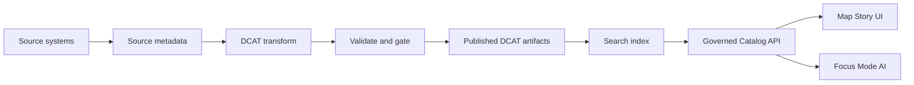

<!-- [KFM_META_BLOCK_V2]
doc_id: kfm://doc/f587b9e1-b4b5-4f23-9c38-cdc6308f73b7
title: DCAT catalog artifacts
type: standard
version: v1
status: draft
owners: TBD
created: 2026-02-24
updated: 2026-02-24
policy_label: restricted
related:
  - TODO: link to catalog governance doc (kfm://doc/...)
  - TODO: link to repo-level data governance README
  - TODO: link to API contract that serves the published catalog
  - TODO: link to SHACL shapes directory (if split out)
tags: [kfm, dcat, catalog, metadata]
notes:
  - This README defines conventions for governed DCAT outputs.
  - Default-deny: treat sensitivity as restricted until explicitly cleared.
[/KFM_META_BLOCK_V2] -->

# DCAT Catalog Artifacts

Governed **DCAT (Data Catalog Vocabulary)** representations of datasets, distributions, and services used by Kansas-Matrix-System’s catalog → indexing → API boundary.


**Owners:** `TBD`  \
**Last updated:** `2026-02-24`  \
**Primary audience:** data publishers, pipeline maintainers, catalog/API maintainers

---

## Navigation

- [Overview](#overview)
- [Where this fits](#where-this-fits)
- [Directory layout](#directory-layout)
- [Data model](#data-model)
- [Naming and identifiers](#naming-and-identifiers)
- [Governance and sensitivity](#governance-and-sensitivity)
- [Validation and promotion gates](#validation-and-promotion-gates)
- [Workflows](#workflows)
- [Examples](#examples)
- [FAQ](#faq)
- [Contributing](#contributing)

---

## Overview

This directory contains **catalog metadata artifacts** encoded using **W3C DCAT v3** (and optionally a profile such as **DCAT-AP**).

These artifacts are treated as **governed outputs**:

- They back catalog search/indexing.
- They are served via **governed APIs** (never direct-to-storage).
- They are referenced by Map/Story UI and Focus Mode AI as **evidence-bound descriptions**.

> **NOTE**
> If you’re unsure whether a dataset may be sensitive (privacy, cultural knowledge, vulnerable sites), treat it as **restricted** and avoid precise locations until governance review clears it.

[Back to top](#navigation)

---

## Where this fits



### Invariants

- **Clients/UI do not hit storage directly.** Consumers read catalog through a governed API boundary.
- **Catalog claims are traceable.** Dataset records should link to provenance/audit artifacts (see [Governance and sensitivity](#governance-and-sensitivity)).
- **Small, reversible changes.** Prefer additive edits and stable identifiers; deprecate rather than rewrite identifiers.

[Back to top](#navigation)

---

## Directory layout

> **IMPORTANT**
> The layout below is the *recommended* structure for this directory. If you don’t see these folders yet, create them incrementally as your catalog pipeline is introduced.

```text
data/catalog/dcat/
  README.md                      # This document

  catalogs/                       # Catalog-level records
    catalog.ttl                   # Canonical (review-friendly) RDF serialization
    catalog.jsonld                # Optional: JSON-LD form for web delivery

  datasets/                       # Dataset records (one logical dataset per id)
    <dataset_id>.ttl
    <dataset_id>.jsonld

  distributions/                  # Distribution/access records (download/API endpoints)
    <distribution_id>.ttl

  services/                       # DataService records (APIs, map services)
    <service_id>.ttl

  shapes/                         # SHACL shapes used for validation (recommended)
    dcat.shacl.ttl
    dcat-ap.shacl.ttl

  contexts/                       # JSON-LD contexts (optional)
    dcat.context.json

  reports/                        # Machine outputs for auditing + CI artifacts
    validation/
      <timestamp>__<commit>.json
```

[Back to top](#navigation)

---

## Data model

### Core resources

| Concept | DCAT class | What it represents in practice |
|---|---|---|
| Catalog | `dcat:Catalog` | A collection of dataset/service descriptions exposed by this system |
| Dataset | `dcat:Dataset` | A logical dataset (may have multiple distributions/formats) |
| Distribution | `dcat:Distribution` | A particular way to access a dataset (download, API endpoint, tile service, etc.) |
| Data Service | `dcat:DataService` | A service/API that provides access to datasets |
| Catalog Record | `dcat:CatalogRecord` | A record about the metadata entry itself (optional but useful for lifecycle tracking) |

### Common reused vocabularies

DCAT intentionally reuses other vocabularies. In practice you will commonly see:

- `dcterms:` (Dublin Core Terms) for **title, description, identifiers, license, spatial/temporal coverage**
- `prov:` (PROV-O) for **provenance links** (e.g., “this record was derived from that run/audit receipt”)

[Back to top](#navigation)

---

## Naming and identifiers

### Identifier rules (project conventions)

| Field | Recommendation | Why |
|---|---|---|
| `dcterms:identifier` | Stable slug (kebab-case), e.g. `parcels-johnson-county` | Stable IDs make diffs, lineage, and downstream joins reliable |
| Resource IRI | Prefer stable `https://...` for Published; allow `urn:` in Work/Quarantine | Aligns with linked-data best practices while supporting internal builds |
| File name | `<identifier>.<ttl|jsonld>` | Predictable mapping between record and file |

### Deprecation

Never “recycle” an identifier for a different dataset.

- If a dataset is replaced, keep the original ID and mark it deprecated (see [Workflows](#workflows)).
- If a dataset is removed, keep a tombstone record long enough for consumers to react.

[Back to top](#navigation)

---

## Governance and sensitivity

### Policy labels

Every dataset record must carry (directly or via an internal mapping) a **policy label** that determines what can be:

- published publicly
- shown in UI
- returned via API
- used in Focus Mode reasoning

**Default-deny:** if the label is unknown, treat it as **restricted**.

### Location safety

If a dataset includes vulnerable/private/culturally restricted sites:

- do **not** publish exact coordinates or high-resolution geometries in public artifacts
- prefer coarse geography (e.g., county/region)
- document the redaction decision in provenance/audit metadata

### Provenance binding

For Published artifacts, include a machine-resolvable link showing where the record came from.

**Minimum recommendation:** add a provenance link such as `prov:wasDerivedFrom` pointing to an **audit receipt** (build/run id, checksums, inputs).

[Back to top](#navigation)

---

## Validation and promotion gates

Catalog artifacts move through a truth path (conceptually):

`Raw → Work/Quarantine → Processed → Published`

No promotion to **Published** without minimum artifacts:

- metadata completeness (identity, schema, extents, license, sensitivity)
- validation results (QA checks + thresholds)
- provenance links (inputs, transforms, tool versions)
- integrity (checksums)
- audit record (who/what/when/why)

### Gate checklist

- [ ] **Schema / SHACL validation** passes for DCAT (and profile if used)
- [ ] **License** is present and machine-readable (prefer SPDX identifier or URL)
- [ ] **Sensitivity** is explicitly labeled (or falls back to restricted)
- [ ] **Provenance** link exists for Published records (audit receipt)
- [ ] **Spatial/temporal extent** provided when applicable
- [ ] **Distributions** include access method and format

### Suggested validation tools (choose one)

- SHACL validators (e.g., a Java-based SHACL engine or a Python SHACL validator)
- RDF syntax checks (Turtle/JSON-LD parsing)

> **TIP**
> Keep validation outputs under `reports/validation/` and attach them to CI artifacts so you can always reproduce why something passed/failed.

[Back to top](#navigation)

---

## Workflows

### Add a new dataset

1. Pick a stable `dataset_id` (see [Naming and identifiers](#naming-and-identifiers)).
2. Create the dataset record under `datasets/<dataset_id>.ttl` (or `.jsonld`).
3. Add one or more distributions under `distributions/` and link them from the dataset via `dcat:distribution`.
4. (Recommended) Add provenance link(s) and sensitivity label.
5. Run validation gates (SHACL + syntax).
6. Open a PR with:
   - the new/updated record(s)
   - validation report(s)
   - a short change note explaining intent + reversibility

### Update an existing dataset

- Prefer additive changes.
- If changing semantics materially (e.g., geometry resolution, coverage), record it:
  - update `dcterms:modified`
  - add provenance/audit link for the new build

### Deprecate a dataset

- Keep the record but mark it deprecated.
- Point users to a replacement dataset if applicable.

[Back to top](#navigation)

---

## Examples

### Minimal Dataset + Distribution (Turtle)

```turtle
@prefix dcat: <http://www.w3.org/ns/dcat#> .
@prefix dcterms: <http://purl.org/dc/terms/> .
@prefix foaf: <http://xmlns.com/foaf/0.1/> .
@prefix prov: <http://www.w3.org/ns/prov#> .
@prefix xsd: <http://www.w3.org/2001/XMLSchema#> .

<https://example.org/dataset/road-centerlines> a dcat:Dataset ;
  dcterms:identifier "road-centerlines" ;
  dcterms:title "Road centerlines"@en ;
  dcterms:description "Centerline geometry for maintained roads."@en ;
  dcterms:publisher [ a foaf:Organization ; foaf:name "Example DOT" ] ;
  dcterms:license <https://spdx.org/licenses/CC-BY-4.0.html> ;
  dcterms:issued "2026-02-24"^^xsd:date ;
  dcterms:modified "2026-02-24"^^xsd:date ;
  prov:wasDerivedFrom <urn:uuid:00000000-0000-0000-0000-000000000000> ;
  dcat:distribution <https://example.org/distribution/road-centerlines-geojson> .

<https://example.org/distribution/road-centerlines-geojson> a dcat:Distribution ;
  dcterms:format "GeoJSON" ;
  dcat:downloadURL <https://example.org/downloads/road-centerlines.geojson> .
```

### Minimal Dataset (JSON-LD)

```json
{
  "@context": {
    "dcat": "http://www.w3.org/ns/dcat#",
    "dcterms": "http://purl.org/dc/terms/",
    "prov": "http://www.w3.org/ns/prov#"
  },
  "@id": "https://example.org/dataset/road-centerlines",
  "@type": "dcat:Dataset",
  "dcterms:identifier": "road-centerlines",
  "dcterms:title": "Road centerlines",
  "dcterms:description": "Centerline geometry for maintained roads.",
  "dcterms:license": { "@id": "https://spdx.org/licenses/CC-BY-4.0.html" },
  "prov:wasDerivedFrom": { "@id": "urn:uuid:00000000-0000-0000-0000-000000000000" }
}
```

> **WARNING**
> Examples use `example.org` and a dummy `urn:uuid:`. Replace with your real identifiers and audit receipt URIs.

[Back to top](#navigation)

---

## FAQ

### Why keep both Turtle and JSON-LD?

- Turtle (`.ttl`) is diff-friendly for code review.
- JSON-LD (`.jsonld`) is often convenient for web APIs and clients.

Pick one as canonical and generate the other if/when you add automation.

### Do we have to use DCAT-AP?

Not necessarily. DCAT-AP is a widely used profile, but projects often need additional constraints.
If you use a profile, encode its constraints in SHACL and gate in CI.

[Back to top](#navigation)

---

## Contributing

- Keep changes small and reversible.
- Never introduce secrets, access tokens, or private endpoints.
- Add validation outputs for anything you want to promote.
- When in doubt about sensitivity: redact/generalize and request governance review.
