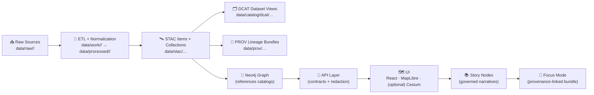

# 🗂️ DCAT Dataset Catalog (`data/catalog/dcat/`)

[](https://www.w3.org/TR/vocab-dcat-2/)
[](https://json-ld.org/)
[](#-validation--contract-expectations)
[](#-validation--contract-expectations)

> 🎯 **Purpose:** This folder holds **DCAT dataset records** that make KFM datasets *discoverable* and *harvestable* (e.g., by external catalog tooling), while pointing users (and machines) to the authoritative **STAC** + **PROV** artifacts.

---

## 🧠 DCAT vs STAC vs PROV (quick mental model)

| Spec | KFM role ✅ | Best at | Typical payload |
|---|---|---|---|
| **DCAT** | **Discovery layer** | “What is this dataset?” + “How do I access it?” | `dcat:Dataset` + `dcat:Distribution[]` |
| **STAC** | **Geospatial asset index** | Spatial/temporal search + asset metadata | `Collection` + `Item(s)` |
| **PROV** | **Lineage & reproducibility** | How it was produced (inputs → steps → outputs) | `prov:Activity`, `prov:Entity`, `prov:Agent` |

🧩 **Rule of thumb:**  
- **DCAT** should stay *high-level* (discovery + access).  
- **STAC** carries *geospatial detail*.  
- **PROV** proves *how/why it exists*.

---

## 🗺️ Where DCAT sits in the “truth path”



---

## 📁 What lives in this folder

**Recommended layout:**

```text
data/catalog/dcat/
├── 📄 README.md
├── 📄 catalog.jsonld                # (optional) top-level aggregator for harvesters
├── 📄 <dataset_id>__v1.jsonld        # dataset v1 (immutable after publish)
├── 📄 <dataset_id>__v2.jsonld        # dataset v2 (links back to v1)
└── 📁 _attachments/                 # (optional) human docs, citations, PDFs, etc.
```

### ✅ Naming guidance (practical, not sacred)
Use stable, predictable IDs so cross-links don’t rot:
- `historical__land-treaties__v1.jsonld`
- `hydrology__river-flow__v2.jsonld`
- `climate__prism-normals__v1.jsonld`

---

## ✅ Minimum record checklist

Each dataset record **MUST** be a `dcat:Dataset` and **SHOULD** expose at least:

- [ ] `dcterms:title`
- [ ] `dcterms:description`
- [ ] `dcterms:license` (or `dcat:license` depending on your profile)
- [ ] `dcat:keyword` (searchability)
- [ ] `dcat:distribution` (one or more)
- [ ] `dcterms:publisher` / `dcterms:creator` (accountability)
- [ ] `dcterms:issued` + `dcterms:modified` (timeline hygiene)
- [ ] `dcterms:spatial` and/or `dcterms:temporal` (when applicable)

> 🧷 KFM treats metadata as a **boundary artifact**: if the dataset is “published,” DCAT must exist, along with STAC + PROV.

---

## 🔗 Cross-linking rules (don’t break these)

### 1) DCAT → STAC / Data
Every `dcat:Distribution` should point to either:
- a **STAC** record (best for geospatial assets), and/or  
- the **underlying data** (direct download / stable storage URL / API endpoint)

**Practical pattern:**
- `dcat:accessURL` → “browse/search here” (STAC Item/Collection or API endpoint)
- `dcat:downloadURL` → “download this exact file” (processed artifact)

### 2) DCAT → PROV (lineage)
DCAT should reference lineage **without duplicating it**. Keep PROV as the source of truth.

Common approaches (pick the one your profile standardizes):
- `dcterms:provenance` → PROV bundle URI
- `prov:wasGeneratedBy` → PROV Activity URI
- `prov:wasDerivedFrom` → upstream dataset entity

### 3) Graph references catalogs (not payloads)
If/when a dataset is loaded into Neo4j, nodes should store **IDs/links** to:
- STAC Item/Collection IDs
- DCAT Dataset IDs
- PROV run/activity IDs

Not the bulky data itself. 🧠📦

---

## 🧬 Versioning & identifiers

### Dataset versioning (required behavior)
When a dataset is updated/reprocessed:
- **Create a new DCAT file** (don’t edit the published one).
- Link the new dataset to the previous version using:
  - `prov:wasRevisionOf` → previous dataset version

### Persistent IDs (recommended for “publish-grade” datasets)
If the dataset is meant to be cited externally:
- include a persistent identifier (`DOI`, `ARK`, etc.) at the dataset level
- keep the identifier stable per version

---

## 🧩 JSON-LD template (copy/paste starter)

> 🛠️ This is a **starter**. Your final fields should match `docs/standards/KFM_DCAT_PROFILE.md` and any JSON Schema under `schemas/dcat/`.

```json
{
  "@context": [
    "https://www.w3.org/ns/dcat2.jsonld",
    {
      "dcat": "http://www.w3.org/ns/dcat#",
      "dcterms": "http://purl.org/dc/terms/",
      "prov": "http://www.w3.org/ns/prov#",
      "schema": "https://schema.org/"
    }
  ],
  "@id": "urn:kfm:dataset:<domain>:<dataset>:v1",
  "@type": "dcat:Dataset",

  "dcterms:identifier": "<dataset_id>",
  "dcterms:title": "<Human-friendly title>",
  "dcterms:description": "<What it is, why it exists, what’s inside>",
  "dcterms:license": "<SPDX id or URL>",
  "dcat:keyword": ["<keyword1>", "<keyword2>", "<keyword3>"],

  "dcterms:publisher": {
    "@type": "schema:Organization",
    "schema:name": "Kansas Frontier Matrix (KFM)"
  },

  "dcterms:issued": "2026-01-29",
  "dcterms:modified": "2026-01-29",

  "dcat:distribution": [
    {
      "@type": "dcat:Distribution",
      "dcterms:title": "Primary data artifact",
      "dcat:downloadURL": "data/processed/<domain>/<artifact>.<ext>",
      "dcat:mediaType": "<mime-type>",
      "dcterms:format": "<format label>"
    },
    {
      "@type": "dcat:Distribution",
      "dcterms:title": "STAC record",
      "dcat:accessURL": "data/stac/items/<stac_item_id>.json",
      "dcterms:format": "STAC Item"
    }
  ],

  "dcterms:provenance": "data/prov/<dataset_id>__v1.prov.json"
}
```

### 🧷 Version bump example (v2 → v1)

```json
{
  "@id": "urn:kfm:dataset:<domain>:<dataset>:v2",
  "@type": "dcat:Dataset",
  "prov:wasRevisionOf": "urn:kfm:dataset:<domain>:<dataset>:v1"
}
```

---

## 🧪 Validation & contract expectations

KFM is **contract-first**. That means:

- 📐 **Schemas live as artifacts** (see `schemas/dcat/`)
- 📏 **Profiles define allowed/required fields** (see `docs/standards/KFM_DCAT_PROFILE.md`)
- 🚦 **CI gates metadata** — missing or invalid DCAT should fail fast

**Validation should cover:**
- JSON-LD parsing + RDF sanity (no broken contexts, no invalid JSON)
- conformance to KFM profile
- cross-link existence checks:
  - STAC targets exist
  - PROV target exists
  - referenced data artifacts exist (or resolve via stable storage)

---

## 🚀 Adding a new dataset (TL;DR)

1. 📥 Put sources in `data/raw/<domain>/`
2. 🧪 Transform into `data/processed/<domain>/`
3. 🛰️ Generate STAC:
   - `data/stac/collections/…`
   - `data/stac/items/…`
4. 🗂️ Generate this DCAT record:
   - `data/catalog/dcat/<dataset_id>__vX.jsonld`
5. 🧾 Generate PROV:
   - `data/prov/<dataset_id>__vX.prov.json`
6. ✅ Ensure cross-links resolve & CI passes

---

## 🧯 Common gotchas

- ❌ **Don’t duplicate STAC inside DCAT.** Link to it.
- ❌ **Don’t hand-invent fields.** Extend the KFM profiles instead.
- ✅ **Prefer stable identifiers.** File paths change; IDs should not.
- ✅ **Treat AI/analysis outputs as first-class datasets.** They still need DCAT + PROV.

---

## 🔗 See also

- 📁 `data/stac/` — STAC Collections + Items  
- 📁 `data/prov/` — PROV lineage bundles  
- 📘 `docs/standards/KFM_DCAT_PROFILE.md` — KFM-required DCAT fields  
- 📘 `docs/MASTER_GUIDE_v13.md` — canonical pipeline & repo structure  
- 🌐 W3C DCAT — vocabulary specification (external)

---
