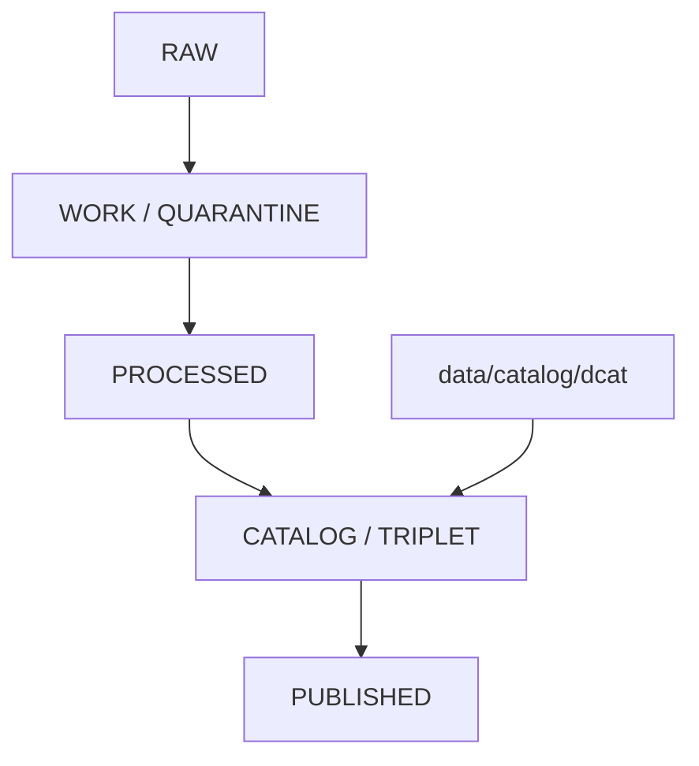

<!-- [KFM_META_BLOCK_V2]
doc_id: kfm://doc/data-catalog-dcat-readme
title: data/catalog/dcat/README.md — DCAT Catalog Lane
version: v0.3
type: readme; directory-readme; data-lifecycle-sublane; dcat-catalog-guide
status: draft; repository-grounded; confirmed-path; catalog-stage; dcat-profile-draft; release-gated; implementation-incomplete
owners: OWNER_TBD — Data steward · Catalog steward · DCAT steward · Source steward · Evidence steward · Rights/sensitivity steward · Policy steward · Validation steward · Release steward · Docs steward
created: NEEDS VERIFICATION — placeholder lineage predates v0.1
updated: 2026-07-22
policy_label: public-doc; data; catalog; dcat; discovery-not-truth; release-gated; sensitivity-aware
owning_root: data/
lifecycle_stage: CATALOG / TRIPLET
external_vocabulary: W3C DCAT v3 — repository target; KFM profile remains draft
truth_posture: cite-or-abstain; catalog-is-not-truth; path-presence-is-not-publication
evidence_snapshot:
  repository: bartytime4life/Kansas-Frontier-Matrix
  base_commit: d24c7bf9ee89c9bb3bd2cd14e0e60b1de6314bc0
  prior_blob: 07c61a743fd4712c8393b05c9fb82e98e55bf76c
related:
  - ../README.md
  - ../../README.md
  - ./flora/README.md
  - ../stac/README.md
  - ../prov/README.md
  - ../domain/README.md
  - ../../../docs/standards/DCAT.md
  - ../../../docs/doctrine/directory-rules.md
  - ../../../docs/adr/ADR-0011-receipts-vs-proofs-vs-manifests-vs-catalog-separation.md
  - ../../../docs/adr/ADR-0022-catalog-matrix--stac-+-dcat-+-prov-must-agree.md
  - ../../../contracts/data/catalog_matrix.md
  - ../../../schemas/contracts/v1/data/catalog_matrix.schema.json
  - ../../../tools/validators/catalog/README.md
  - ../../../tools/validators/catalog_closure/README.md
  - ../../../policy/data/README.md
  - ../../receipts/generated/README.md
notes:
  - "This revision is documentation-only. It creates no DCAT record, profile, JSON-LD context, schema, validator, policy rule, CatalogMatrix, release, route, or published artifact."
  - "ADR-0011 and ADR-0022 are proposed, not accepted. Their separation and catalog-closure language is recorded as proposal status, not current enforcement."
  - "The verified CatalogMatrix schema is a permissive placeholder and the observed top-level CatalogMatrix validator raises NotImplementedError."
  - "A bounded child-path check confirmed the Flora DCAT guide; it was not a complete recursive inventory of this directory."
[/KFM_META_BLOCK_V2] -->

# DCAT catalog lane

`data/catalog/dcat/`

> Governed DCAT discovery and interchange projections at KFM's `CATALOG / TRIPLET` lifecycle stage. A catalog record can describe an artifact; it cannot make the artifact true, safe, approved, released, or public.

- **Evidence snapshot:** `main@d24c7bf9ee89c9bb3bd2cd14e0e60b1de6314bc0`
- **Document status:** repository-grounded draft
- **Exposure posture:** release-gated; directory presence is not publication
**Implementation boundary:** the path and draft profile are confirmed; a production DCAT profile, validator, dedicated test/CI gate, emitted closure, and public serving behavior remain unestablished or need verification

**Quick navigation:** [Purpose](#purpose) · [Authority](#authority-level) · [Status](#status) · [What belongs](#what-belongs-here) · [What does not](#what-does-not-belong-here) · [Inputs](#inputs) · [Outputs](#outputs) · [Validation](#validation) · [Review](#review-burden) · [Related folders](#related-folders) · [ADRs](#adrs) · [Last reviewed](#last-reviewed)

---

## Purpose

Use this lane for DCAT catalog projections that make governed KFM datasets, distributions, and services discoverable without copying or replacing the objects that establish source identity, evidence, policy, review, validation, or release state.

Directory Rules place `dcat/` under `data/catalog/`, alongside `stac/`, `prov/`, and `domain/`. That is a lifecycle placement: promotion into or through this lane is a governed state transition, not a file copy.

```mermaid
flowchart TD
  A["RAW"] --> B["WORK / QUARANTINE"]
  B --> C["PROCESSED"]
  C --> D["CATALOG / TRIPLET"]
  D --> E["PUBLISHED"]
  F["data/catalog/dcat"] --> D
```

A DCAT record is a derived catalog carrier. It may reference authoritative objects, but it does not replace them and is not an `EvidenceBundle`, receipt, proof, `PolicyDecision`, `ReleaseManifest`, or publication decision.

## Authority level

**Catalog-stage data lane; discovery and interchange authority only.**

| Concern | Authority boundary |
|---|---|
| External vocabulary | W3C DCAT v3 is the target named by the repository's draft DCAT standard. |
| KFM DCAT profile | `docs/standards/DCAT.md` describes the draft profile direction. Profile IRIs, JSON-LD context, schema location, validators, and CI enforcement are not established here. |
| Catalog instances | This lane may hold governed DCAT projections once their profile and validation requirements are satisfied. |
| Source identity and role | Source descriptors and registry/contract authority remain outside this lane. |
| Evidence and proof | `EvidenceRef`, `EvidenceBundle`, proof packs, and validation evidence remain in their governed homes. |
| Admissibility | `policy/` and review records decide allow, deny, restrict, or abstain; catalog metadata does not. |
| Release and publication | `release/` owns release decisions; `data/published/` owns approved public-safe materializations. |
| Public access | Public clients use governed interfaces and released artifacts, not this internal catalog lane directly. |

This README documents boundaries. It is not a profile, schema, policy bundle, validator, release gate, or public API contract.

## Status

| Surface | Label | Current repository evidence and limit |
|---|---|---|
| `data/catalog/dcat/README.md` | CONFIRMED | This lane guide exists at the pinned snapshot. |
| DCAT placement under `data/catalog/` | CONFIRMED repository path / draft doctrine | Directory Rules list `stac/`, `dcat/`, `prov/`, and `domain/` under the catalog phase. Runtime enforcement is not implied. |
| Flora child guide | CONFIRMED | `data/catalog/dcat/flora/README.md` exists. Bounded checks of other common domain child README paths did not establish a complete directory inventory. |
| DCAT version target | CONFIRMED draft standard | `docs/standards/DCAT.md` targets W3C DCAT v3 and is itself marked `draft`. |
| KFM profile, namespace IRIs, context, and exact required fields | PROPOSED / NEEDS VERIFICATION | The standard contains working profile direction and placeholders; accepted machine authority was not established. |
| Record-local validator | NEEDS VERIFICATION | `tools/validators/catalog/` is README-only in its recorded review and no dedicated executable DCAT validator was established by the bounded checks. |
| Catalog closure | PROPOSED | ADR-0022 proposes STAC/DCAT/PROV agreement; ADR-0011 and ADR-0022 remain proposed and their catalog-matrix placement implications are unresolved. |
| CatalogMatrix schema and validator | CONFIRMED placeholders | `schemas/contracts/v1/data/catalog_matrix.schema.json` requires only `id` and allows additional properties; `tools/validators/validate_catalog_matrix.py` raises `NotImplementedError`. |
| Dedicated DCAT tests and CI | NEEDS VERIFICATION | The confirmed `validator-suite` workflow does not establish DCAT profile validation or catalog-closure enforcement. |
| Emitted DCAT payloads, release linkage, and governed public routes | NEEDS VERIFICATION | No complete payload inventory, current release proof, or runtime route behavior was established by this documentation pass. |

Absence statements above are bounded to the exact paths and evidence inspected at the snapshot. They are not claims that historical, branch-local, generated, package-local, or external implementations never existed.

## What belongs here

Subject to an accepted profile and working validation, appropriate contents include:

- `dcat:Catalog`, `dcat:Dataset`, `dcat:Distribution`, and `dcat:DataService` projections for governed KFM artifacts;
- dataset- and distribution-level discovery metadata bound to stable identifiers and immutable artifact digests;
- catalog links to admitted source metadata, evidence/proof context, rights and sensitivity posture, validation results, review state, release state, and correction lineage where material;
- KFM extension properties declared through an accepted namespace and JSON-LD context rather than ad hoc fields;
- release-linked public-safe catalog projections that point only to approved distributions and governed access surfaces;
- bounded catalog indexes or validation summaries that reference their source records and exact validation artifacts.

Exact filenames, serialization packaging, extension IRIs, required fields, cardinalities, and media types are profile/schema concerns. This README does not invent them.

## What does NOT belong here

| Do not place or decide here | Correct responsibility boundary |
|---|---|
| RAW captures, working data, quarantined material, or processed datasets | `data/raw/`, `data/work/`, `data/quarantine/`, `data/processed/` |
| STAC, PROV, domain-catalog, or graph/triplet records | Their sibling catalog lanes or `data/triplets/` |
| SourceDescriptor instances, source admission, rights authority, or source-role authority | Governed source registry, contracts, policy, and review lanes |
| EvidenceBundle, ProofPack, or proof payloads | `data/proofs/` |
| Run, validation, catalog-build, AI, or generated-work receipts | `data/receipts/` |
| Semantic contracts, JSON Schemas, JSON-LD context authority, policy rules, validator code, tests, or fixtures | `contracts/`, `schemas/`, `policy/`, `tools/`, `tests/`, `fixtures/` |
| ReleaseManifest, PromotionDecision, correction, withdrawal, supersession, or rollback decisions | `release/` |
| Public API responses, map layers, tiles, exports, or other released artifacts | Governed application/delivery surfaces and `data/published/` |
| CatalogMatrix authority while its proposed homes conflict | Follow the accepted ADR/migration outcome; do not create another matrix home here by implication |
| Generated prose or summary metadata presented as source truth | Evidence-grounded claim and governed AI surfaces |

## Inputs

A candidate DCAT record should be assembled from explicit, immutable, reviewable inputs. The following is a review contract, not proof of a current machine schema:

| Input family | Minimum posture |
|---|---|
| Identity | Stable dataset/service/distribution identity and version. |
| Artifact integrity | Digest for every referenced immutable artifact or bundle. |
| Profile | Accepted DCAT/KFM profile and context reference, including their versions or digests. |
| Source | Admitted source references, source role, rights/license, and material obligations. |
| Evidence | Evidence/proof references for consequential descriptions and derivation claims. |
| Scope and time | Subject, spatial/temporal scope, and distinct source/valid/retrieval/catalog/release/correction times as applicable. |
| Policy and sensitivity | Rights, consent, sensitivity, audience, redaction/generalization, and policy-decision references. |
| Validation and review | Results tied to the exact candidate digest and the required human review state. |
| Release and correction | Release candidate or immutable release reference plus supersession, withdrawal, correction, and rollback links when applicable. |

Missing or conflicting inputs must remain explicit. Do not infer approval, public status, rights, or safety from a directory path, URL, metadata value, or previous release.

## Outputs

This lane can support:

- profile-conformant DCAT catalog candidates for internal review;
- release-bound DCAT projections for approved public-safe datasets, distributions, and services;
- references used by cross-catalog discovery, provenance, review, correction, and rollback workflows; and
- validation or catalog-build summaries that remain subordinate to their receipts, reports, evidence, policy, and release records.

### Public exposure boundary

`data/catalog/dcat/` is not a public endpoint. A record becomes public only through a governed release that binds the exact record and distribution digests, evidence, rights and sensitivity disposition, validation, review, correction path, and rollback target. Public clients must receive the approved representation through governed interfaces or released artifacts.

### Correction, supersession, withdrawal, and rollback

Released meaning must not be silently overwritten. A corrected record should preserve prior identifiers and digests, identify the replacement or withdrawal, bind the governing decision and reviewer, invalidate affected indexes or closure claims, and allow consumers to return to the last approved representation when rollback is required.

## Validation

### Current implementation evidence

| Check surface | Current posture |
|---|---|
| DCAT profile document | CONFIRMED draft; CI badge says TODO and multiple implementation details are proposed. |
| Record-local catalog validator lane | CONFIRMED README-only at its recorded snapshot; executable DCAT behavior not established. |
| Catalog closure lane | CONFIRMED README-only at its recorded snapshot; no working closure executable or release resolver established. |
| CatalogMatrix shape | CONFIRMED permissive placeholder schema. |
| CatalogMatrix executable | CONFIRMED top-level `NotImplementedError` stub. |
| Repository validator workflow | CONFIRMED pull-request workflow with read-only token and no release/publication authority; DCAT coverage is not established by its presence. |

### Required checks before relying on a DCAT payload

1. Bind the exact accepted DCAT version, KFM profile, namespace, JSON-LD context, and schema digest.
2. Parse and validate the record locally without unbounded remote context or schema resolution.
3. Verify class, identifiers, distribution/service links, media types, checksums, URLs, rights, sensitivity, scope, and time fields.
4. Resolve source, evidence, policy, validation, review, release, and correction references without substituting one artifact family for another.
5. Confirm every public distribution resolves only to the approved public-safe representation; fail closed on unresolved rights, sensitivity, consent, or reconstructive metadata risk.
6. Verify STAC/DCAT/PROV agreement only under an accepted closure contract and working validator; do not claim closure from matching prose or a placeholder matrix.
7. Exercise positive and negative fixtures, deterministic reruns, bounded-resource behavior, safe diagnostics, withdrawal, supersession, and rollback.
8. Record the exact result in the governed report/receipt family and keep human approval separate from automated validation.

For this README revision, the target, parent/sibling lane guides, Directory Rules, draft DCAT standard, proposed ADRs, CatalogMatrix contract/schema/stub, catalog validator guides, data policy guide, generated-receipt schema, PR template, and validator workflow were inspected. The revision changes documentation only; runtime and release tests are not evidence of this edit.

## Review burden

- The data/catalog and DCAT stewards review vocabulary scope, lifecycle placement, and catalog semantics.
- Source, evidence, rights/sensitivity, and policy stewards review any fields or links that affect authority, disclosure, consent, licensing, or reconstructive risk.
- Validation and schema stewards review profile, context, schema, validator, fixtures, and CI claims.
- Release and correction/rollback stewards review any public, released, withdrawn, corrected, or superseded projection.
- A generated receipt records authorship and checks; it is not human approval. The author/generator must not be treated as the sole approver for policy- or release-significant changes.

README-only wording changes may use a smaller reviewer set when they do not adopt a profile, change an authority boundary, create a public route, or alter release/sensitivity policy. Any such substantive change triggers the corresponding governed review and, where required, an accepted ADR.

## Related folders

| Path | Relationship |
|---|---|
| [`../README.md`](../README.md) | Parent catalog-stage boundary. |
| [`../../README.md`](../../README.md) | Data lifecycle root. |
| [`./flora/README.md`](./flora/README.md) | Confirmed domain-specific DCAT guide; its profile and payload implementation remain bounded separately. |
| [`../stac/README.md`](../stac/README.md) | Spatiotemporal catalog sibling. |
| [`../prov/README.md`](../prov/README.md) | Semantic provenance catalog sibling. |
| [`../domain/README.md`](../domain/README.md) | Domain-scoped catalog sibling. |
| [`../../triplets/README.md`](../../triplets/README.md) | Paired graph/relationship projection at `CATALOG / TRIPLET`. |
| [`../../registry/README.md`](../../registry/README.md) | Source, dataset, rights, sensitivity, and other registry responsibilities. |
| [`../../proofs/README.md`](../../proofs/README.md) | Evidence and proof support; catalog references do not replace it. |
| [`../../receipts/README.md`](../../receipts/README.md) | Process-memory families, including validation and generation provenance. |
| [`../../published/README.md`](../../published/README.md) | Approved public-safe materializations. |
| [`../../../release/README.md`](../../../release/README.md) | Release, correction, withdrawal, and rollback authority. |
| [`../../../docs/standards/DCAT.md`](../../../docs/standards/DCAT.md) | Draft KFM conformance profile direction for DCAT v3. |
| [`../../../contracts/data/catalog_matrix.md`](../../../contracts/data/catalog_matrix.md) | Current draft semantic contract for the repository's CatalogMatrix family. |
| [`../../../schemas/contracts/v1/data/catalog_matrix.schema.json`](../../../schemas/contracts/v1/data/catalog_matrix.schema.json) | Current permissive placeholder shape; not a DCAT profile schema. |
| [`../../../tools/validators/catalog/README.md`](../../../tools/validators/catalog/README.md) | Record-local catalog validation boundary. |
| [`../../../tools/validators/catalog_closure/README.md`](../../../tools/validators/catalog_closure/README.md) | Cross-record catalog-closure readiness boundary. |
| [`../../../policy/data/README.md`](../../../policy/data/README.md) | Lifecycle admissibility and public-exposure policy boundary. |

## ADRs

- [`ADR-0011`](../../../docs/adr/ADR-0011-receipts-vs-proofs-vs-manifests-vs-catalog-separation.md) records the proposed `receipt ≠ proof ≠ catalog ≠ publication` separation. Its status is **proposed**.
- [`ADR-0022`](../../../docs/adr/ADR-0022-catalog-matrix--stac-+-dcat-+-prov-must-agree.md) proposes release-level STAC/DCAT/PROV agreement and CatalogMatrix closure. Its status is **proposed**, its implementation paths are not established, and it does not currently prove an active release gate.

No accepted ADR specific to this README revision was established. This documentation-only change preserves the existing responsibility root and creates no new path or authority.

## Last reviewed

- **Date:** 2026-07-22
- **Evidence snapshot:** `main@d24c7bf9ee89c9bb3bd2cd14e0e60b1de6314bc0`
- **Prior target blob:** `07c61a743fd4712c8393b05c9fb82e98e55bf76c`
- **Current safe conclusion:** the DCAT catalog lane and draft profile direction are documented; executable profile validation, catalog closure, release linkage, and governed public behavior remain incomplete or need verification.
- **Re-review when:** the DCAT profile/context/schema, namespace decision, catalog validator, closure ADR, CatalogMatrix authority, CI registration, public serving path, or release/correction contract changes.

Before merge, close the branch/PR to restore the base state. After merge, revert the README and its generated receipt commit; do not rewrite shared history.

<a href="#top">Back to top</a>

