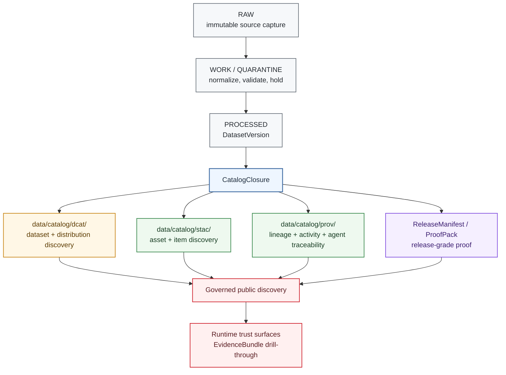

<!-- [KFM_META_BLOCK_V2]
doc_id: kfm://doc/NEEDS_VERIFICATION
title: DCAT Catalog Directory
type: standard
version: v1
status: draft
owners: NEEDS_VERIFICATION
created: NEEDS_VERIFICATION
updated: 2026-04-22
policy_label: NEEDS_VERIFICATION
related: [../../README.md, ../README.md, ../stac/README.md, ../prov/README.md, ../../../docs/standards/KFM_DCAT_PROFILE.md]
tags: [kfm, dcat, catalog, metadata]
notes: [README-like standard doc for data/catalog/dcat/; current authoring workspace did not expose a mounted target repo; prior baseline reports @bartytime4life as broad /data/ owner fallback and README-only lane shape, both requiring target-branch verification before stronger claims.]
[/KFM_META_BLOCK_V2] -->

<a id="top"></a>

# DCAT Catalog Directory

_Outward dataset and distribution discovery for the KFM catalog-closure layer._

> [!IMPORTANT]
> **Status:** `experimental` · **Doc state:** `draft` · **Owners:** `NEEDS_VERIFICATION`  
> **Path:** `data/catalog/dcat/README.md`  
> **Repo fit:** child lane of [`data/catalog/`](../README.md), downstream of [`data/processed/`](../../processed/) and adjacent to [`stac/`](../stac/) + [`prov/`](../prov/)  
> **Evidence posture:** **CONFIRMED doctrine** · **BASELINE-REPORTED public-main lane** · **PROPOSED payload layout** · **NEEDS VERIFICATION active checkout**  
> 
> 
> 
> 
>   
> **Quick jumps:** [Scope](#scope) · [Repo fit](#repo-fit) · [Evidence posture](#evidence-posture) · [Accepted inputs](#accepted-inputs) · [Exclusions](#exclusions) · [Directory tree](#directory-tree) · [Quickstart](#quickstart) · [Usage](#usage) · [Diagram](#diagram) · [Reference tables](#reference-tables) · [Task list](#task-list--release-gates) · [FAQ](#faq) · [Appendix](#appendix)

> [!CAUTION]
> Use **profile-fit** language by default. Do **not** claim DCAT conformance, emitted catalog payloads, validator coverage, or promotion-gate enforcement unless the active branch exposes reviewable records, fixtures, validators, and release proof.

---

## Scope

`data/catalog/dcat/` is KFM’s **dataset- and distribution-facing catalog lane**.

Its job is narrow and important: make released or release-candidate scope discoverable without replacing canonical truth, flattening policy, or bypassing release discipline.

In KFM terms, this directory sits at the `CATALOG` seam:

```text
RAW -> WORK / QUARANTINE -> PROCESSED -> CATALOG / TRIPLET -> PUBLISHED
```

At this seam, **DCAT** describes outward datasets and distributions. It travels beside:

- **STAC** for spatiotemporal asset, item, collection, map, and timeline discovery.
- **PROV** for lineage, activities, agents, and derivation traceability.
- **KFM governance objects** such as `CatalogClosure`, `ReleaseManifest`, `EvidenceBundle`, `DecisionEnvelope`, `ReviewRecord`, and `CorrectionNotice`.

DCAT records here should help maintainers and downstream users answer:

- What dataset or dataset version is being described?
- What distributions are publicly discoverable?
- What license, rights, spatial scope, temporal scope, and update cadence are asserted?
- Which release, STAC, PROV, proof, and correction objects close the loop?
- What remains unknown or intentionally withheld?

[Back to top](#top)

---

## Repo fit

### Path and adjacency

| Relationship | Surface | Status | Why it matters |
| --- | --- | --- | --- |
| This lane | `data/catalog/dcat/` | **Target path** | DCAT-facing catalog directory for dataset/distribution discovery. |
| Parent lifecycle | [`../../README.md`](../../README.md) | **NEEDS VERIFICATION active checkout** | Defines the broader `data/` truth path and lifecycle zones. |
| Parent catalog lane | [`../README.md`](../README.md) | **NEEDS VERIFICATION active checkout** | Defines shared `DCAT + STAC + PROV` catalog closure behavior. |
| Sibling catalog lane | [`../stac/README.md`](../stac/README.md) | **NEEDS VERIFICATION active checkout** | STAC carries item/asset discovery where spatiotemporal assets are the right carrier. |
| Sibling catalog lane | [`../prov/README.md`](../prov/README.md) | **NEEDS VERIFICATION active checkout** | PROV carries outward lineage and activity/agent traceability. |
| Upstream profile | [`../../../docs/standards/KFM_DCAT_PROFILE.md`](../../../docs/standards/KFM_DCAT_PROFILE.md) | **NEEDS VERIFICATION active checkout** | KFM-specific DCAT profile guidance should live outside the emitted payload lane. |
| Contracts / schemas | [`../../../contracts/`](../../../contracts/) and [`../../../schemas/`](../../../schemas/) | **UNKNOWN** | Machine-contract authority must be verified before linking exact validator paths. |
| Policy | [`../../../policy/`](../../../policy/) | **UNKNOWN** | Rights, sensitivity, access, and release posture must not be inferred from DCAT alone. |
| Validators / tests | [`../../../tools/`](../../../tools/) and [`../../../tests/`](../../../tests/) | **UNKNOWN** | Validator commands must be branch-proven before this README names them as enforced. |

### Upstream / downstream boundary

| Direction | Boundary | Rule |
| --- | --- | --- |
| Upstream | `RAW`, `WORK`, `QUARANTINE`, `PROCESSED` | DCAT must not expose raw, scratch, quarantined, or unpublished material as if it were public. |
| Same seam | `CatalogClosure` | DCAT should close with sibling STAC and PROV references where applicable. |
| Downstream | `PUBLISHED`, governed APIs, Evidence Drawer, Focus Mode | Runtime and UI surfaces consume release-backed catalog context; they do not treat DCAT as root truth. |

[Back to top](#top)

---

## Evidence posture

This README deliberately separates what is known from what is carried forward as a proposed or baseline-reported shape.

| Claim | Label | Basis / handling |
| --- | --- | --- |
| KFM uses `RAW -> WORK / QUARANTINE -> PROCESSED -> CATALOG / TRIPLET -> PUBLISHED` as a core lifecycle invariant. | **CONFIRMED doctrine** | Keep this as the governing boundary for catalog placement. |
| DCAT is KFM’s dataset/distribution discovery member of the outward catalog triplet. | **CONFIRMED doctrine** | Use DCAT beside STAC and PROV, not instead of them. |
| `data/catalog/dcat/README.md` is the requested target file. | **CONFIRMED request** | This file is authored for that path. |
| Prior baseline material reports `data/catalog/dcat/` as a public-main README-first lane. | **BASELINE-REPORTED / NEEDS VERIFICATION** | Recheck the active branch before claiming current repository inventory. |
| DCAT payload subtree such as `data/catalog/dcat/datasets/` exists. | **UNKNOWN** | Treat as a proposed starter shape until the target branch proves it. |
| Exact validator command, CI gate, schema home, owner, creation date, and policy label are known. | **UNKNOWN / NEEDS VERIFICATION** | Keep placeholders reviewable; do not invent enforcement. |

> [!NOTE]
> Strong KFM doctrine can justify the lane’s purpose. It does **not** prove the active repository currently emits DCAT JSON-LD, validates it in CI, or publishes it through a release gate.

[Back to top](#top)

---

## Accepted inputs

Content belongs here only when it is release-linked, public-safe, and aligned to the KFM DCAT profile posture.

| Accepted input | Belongs here when… | Status |
| --- | --- | --- |
| `README.md` orientation material | it explains this lane honestly against current repo evidence | **CONFIRMED current task** |
| DCAT dataset records | they describe released or release-candidate dataset scope | **CONFIRMED doctrine / UNKNOWN active tree** |
| DCAT distribution records | each outward artifact class or service endpoint needs discoverable access metadata | **INFERRED from profile + doctrine** |
| Release linkage | the record points to a release manifest, catalog closure, proof pack, or equivalent release-backed object | **CONFIRMED doctrine** |
| STAC / PROV cross-links | asset and lineage views must resolve coherently from discovery | **CONFIRMED doctrine** |
| Rights / access posture | license, rights, access restrictions, and public-safety conditions remain visible | **CONFIRMED doctrine / INFERRED field mapping** |
| Correction / supersession links | changed public meaning, withdrawal, narrowing, or replacement needs visible lineage | **CONFIRMED doctrine** |
| Profile examples | they are clearly labeled as examples or pseudocode unless emitted from the active branch | **PROPOSED** |

### What “accepted” means in KFM terms

Accepted material here should be:

- downstream of `PROCESSED`,
- compatible with `CatalogClosure`,
- linkable to release/proof context,
- explicit enough to support fail-closed discovery,
- and restrained enough that the catalog does not outrun upstream evidence.

[Back to top](#top)

---

## Exclusions

| Not here | Goes instead | Why |
| --- | --- | --- |
| Raw acquisitions and source-native dumps | `../../raw/` | Discovery is not intake. |
| Scratch transforms or unreleased work | `../../work/` or `../../quarantine/` | This lane must not make provisional material look publishable. |
| Canonical processed payloads | `../../processed/` | DCAT describes released scope; it does not replace the payload. |
| STAC Items / Collections | `../stac/` | STAC remains the primary item/asset discovery carrier. |
| PROV bundles | `../prov/` | PROV remains the primary lineage carrier. |
| Receipts and validation reports | `../../receipts/` or version-adjacent audited receipt surfaces | Process memory should not be confused with outward dataset discovery. |
| Release manifests and proof packs | `../../proofs/`, `../../releases/`, or the repo’s release-proof lane | Release proof is adjacent and linkable; it is not DCAT payload. |
| Internal-only policy bundles or reviewer workflows | `../../../policy/` and review artifacts | These may be linked, but should not be flattened into DCAT as sovereign truth. |
| Runtime envelopes, resolver contracts, or feature APIs | API / contract surfaces outside this lane | DCAT is a catalog-edge vocabulary, not the runtime truth surface. |

> [!WARNING]
> If a record would expose unresolved rights, exact-location-sensitive detail, unreleased scope, or a distribution that is not actually public-safe, it does **not** belong here.

[Back to top](#top)

---

## Directory tree

### Baseline-reported lane shape

```text
data/catalog/dcat/
└── README.md
```

The attached baseline reports a README-first shape for this lane. The active checkout must still verify whether any payload subtree now exists.

<details>
<summary><strong>Proposed starter shape for first payload-bearing adoption</strong></summary>

```text
data/catalog/dcat/
├── README.md
└── datasets/
    └── <dataset-id>__<version>.jsonld
```

Use this starter shape only after maintainers verify:

- active branch path inventory,
- owner / CODEOWNERS coverage,
- profile document location,
- validator command,
- fixture path,
- catalog-closure expectations,
- and release-gate linkage.

</details>

[Back to top](#top)

---

## Quickstart

### 1) Inspect the surrounding docs first

```bash
sed -n '1,220p' data/README.md
sed -n '1,220p' data/catalog/README.md
sed -n '1,220p' data/catalog/stac/README.md
sed -n '1,220p' data/catalog/prov/README.md
sed -n '1,260p' docs/standards/KFM_DCAT_PROFILE.md
```

### 2) Confirm the checked-in catalog shape before adding payload files

```bash
git ls-files 'data/catalog/**'
```

### 3) Search the repo before inventing paths or fields

```bash
git grep -n 'DCAT\|CatalogClosure\|dcat:Dataset\|dcat:Distribution' \
  docs data contracts schemas policy tools scripts tests
```

### 4) Add payloads only after the subtree and profile are branch-proven

```bash
# PROPOSED starter pattern — verify before using.
mkdir -p data/catalog/dcat/datasets
$EDITOR data/catalog/dcat/datasets/<dataset-id>__<version>.jsonld
```

### 5) Treat validator wiring as branch-specific until proven

```bash
# Do not paste a validator command here as fact until the active branch exposes it.
# Expected future proof: validator source + fixtures + CI call + passing report.
```

> [!TIP]
> The safest first change in this lane is usually a **doc + profile + fixtures + validator** change set, not a standalone JSON-LD payload dropped without release linkage.

[Back to top](#top)

---

## Usage

### When to touch this lane

Revise `data/catalog/dcat/` when you need to:

- clarify directory intent against current repo evidence,
- introduce or update outward dataset/distribution discovery,
- keep DCAT aligned with sibling STAC and PROV records,
- add release, correction, or supersession-visible links,
- document profile-fit expectations,
- or remove claims that outpaced implementation proof.

### How DCAT should behave in KFM

| KFM expectation | DCAT expression | Status | Review note |
| --- | --- | --- | --- |
| Stable dataset identity | `dct:identifier` | **PROPOSED profile field** | Must align with `DatasetVersion`, `ReleaseManifest`, and catalog closure IDs. |
| Human-readable discovery | `dct:title`, `dct:description` | **CONFIRMED doctrine** | Keep precise, scoped, and non-promotional. |
| Responsible publisher | `dct:publisher` | **CONFIRMED doctrine** | Use verified organization / steward identifiers only. |
| Rights posture | `dct:license`, `dct:rights`, access notes | **CONFIRMED doctrine** | Unknown rights should block outward publication. |
| Public-safe extent | `dct:spatial`, `dct:temporal` | **INFERRED profile mapping** | Discovery needs honest scope without leaking unsafe precision. |
| Update cadence | `dct:accrualPeriodicity` | **CONFIRMED doctrine** | Cadence must match source and release behavior. |
| One distribution per artifact class | `dcat:distribution` | **INFERRED profile mapping** | Do not flatten COG, GeoParquet, PMTiles, CSV, API, and service endpoints into one ambiguous object. |
| Download vs access URL discipline | `dcat:downloadURL` / `dcat:accessURL` | **INFERRED profile mapping** | Use the URL type that matches the actual outward artifact class. |
| Provenance linkage | `dct:provenance`, `prov:wasGeneratedBy`, or profile-specific relation | **CONFIRMED doctrine / PROPOSED profile mapping** | Must resolve to sibling PROV or release-bearing lineage context. |
| Correction visibility | outward links to supersession, replacement, or correction notice | **CONFIRMED doctrine** | Corrections must preserve visible lineage. |

### Profile-aligned pseudocode shape

The following is a **pseudocode sketch**, not a proven emitted fixture from the active branch.

```jsonc
{
  "@context": {
    "dcat": "http://www.w3.org/ns/dcat#",
    "dct": "http://purl.org/dc/terms/",
    "prov": "http://www.w3.org/ns/prov#",
    "time": "http://www.w3.org/2006/time#",
    "locn": "http://www.w3.org/ns/locn#"
  },
  "@type": "dcat:Dataset",
  "dct:identifier": "NEEDS_VERIFICATION(stable-dataset-id)",
  "dct:title": "NEEDS_VERIFICATION(title)",
  "dct:description": "NEEDS_VERIFICATION(description)",
  "dct:publisher": {
    "@id": "NEEDS_VERIFICATION(publisher-org-id)"
  },
  "dct:license": {
    "@id": "NEEDS_VERIFICATION(resolvable-license-iri)"
  },
  "dct:rights": "NEEDS_VERIFICATION(public-rights-note)",
  "dct:spatial": {
    "@type": "dct:Location",
    "locn:geometry": "NEEDS_VERIFICATION(public-safe-geometry-or-admin-coverage)"
  },
  "dct:temporal": {
    "@type": "dct:PeriodOfTime",
    "time:hasBeginning": {
      "@type": "time:Instant",
      "time:inXSDDateTime": "NEEDS_VERIFICATION(start)"
    },
    "time:hasEnd": {
      "@type": "time:Instant",
      "time:inXSDDateTime": "NEEDS_VERIFICATION(end)"
    }
  },
  "dct:accrualPeriodicity": "NEEDS_VERIFICATION(update-cadence)",
  "dct:conformsTo": [
    {
      "@id": "https://www.w3.org/TR/vocab-dcat-3/"
    },
    {
      "@id": "NEEDS_VERIFICATION(kfm-dcat-profile-ref)"
    }
  ],
  "dct:relation": [
    "NEEDS_VERIFICATION(release-manifest-ref)",
    "NEEDS_VERIFICATION(stac-ref)",
    "NEEDS_VERIFICATION(prov-ref)"
  ],
  "dct:provenance": "NEEDS_VERIFICATION(outward-prov-ref)",
  "dcat:distribution": [
    {
      "@type": "dcat:Distribution",
      "dcat:downloadURL": {
        "@id": "NEEDS_VERIFICATION(actual-downloadable-artifact)"
      },
      "dcat:mediaType": "NEEDS_VERIFICATION(media-type)"
    },
    {
      "@type": "dcat:Distribution",
      "dcat:accessURL": {
        "@id": "NEEDS_VERIFICATION(service-or-mediated-access-point)"
      },
      "dcat:mediaType": "NEEDS_VERIFICATION(service-media-type)"
    }
  ]
}
```

Use `dcat:downloadURL` only for an **actual downloadable artifact**. Use `dcat:accessURL` when the outward object is a **service, viewer, catalog endpoint, or mediated access point**.

[Back to top](#top)

---

## Diagram


```mermaid
flowchart TD
    A[RAW<br/>immutable source capture] --> B[WORK / QUARANTINE<br/>normalize, validate, hold]
    B --> C[PROCESSED<br/>DatasetVersion]
    C --> D[CatalogClosure]

    D --> E[data/catalog/dcat/<br/>dataset + distribution discovery]
    D --> F[data/catalog/stac/<br/>asset + item discovery]
    D --> G[data/catalog/prov/<br/>lineage + activity + agent traceability]
    D --> H[ReleaseManifest / ProofPack<br/>release-grade proof]

    E --> I[Governed public discovery]
    F --> I
    G --> I
    H --> I

    I --> J[Runtime trust surfaces<br/>EvidenceBundle drill-through]

    classDef source fill:#f6f8fa,stroke:#57606a,stroke-width:1.25px,color:#24292f;
    classDef seam fill:#eef6ff,stroke:#4a74a8,stroke-width:2px,color:#1f2d3d;
    classDef dcat fill:#fff7e6,stroke:#c9871a,stroke-width:1.5px,color:#5c3b00;
    classDef sibling fill:#eef9ef,stroke:#3d8b50,stroke-width:1.5px,color:#183d23;
    classDef proof fill:#f5efff,stroke:#8250df,stroke-width:1.5px,color:#3b1d70;
    classDef runtime fill:#fff0f0,stroke:#cf222e,stroke-width:1.5px,color:#5a1d22;

    class A,B,C source;
    class D seam;
    class E dcat;
    class F,G sibling;
    class H proof;
    class I,J runtime;
```

Plain-language reading: DCAT is one outlet from `CatalogClosure`. It does not bypass STAC, PROV, release proof, policy, or EvidenceBundle resolution.

[Back to top](#top)

---

## Reference tables

### DCAT / STAC / PROV division of labor

| Closure member | Primary job | KFM expectation |
| --- | --- | --- |
| **DCAT** | Dataset and distribution discovery | Present for outward dataset/distribution descriptions that are release-linked and public-safe. |
| **STAC** | Spatiotemporal asset, collection, item, map, and timeline discovery | Present when items, assets, scenes, rasters, vectors, or map/timeline outputs are the right carrier. |
| **PROV** | Lineage, activities, agents, and derivation | Present or resolvable for released artifacts and catalog closures. |
| **KFM governance objects** | Policy, review, release, evidence, correction, rollback | Must remain first-class; linkable but not absorbed into generic catalog metadata. |

### Minimum DCAT field set for KFM review

| Field / relation | Required before public release? | Notes |
| --- | ---: | --- |
| `dct:identifier` | Yes | Must align with release/catalog identity. |
| `dct:title` | Yes | Human-readable and scoped. |
| `dct:description` | Yes | Must avoid unsupported claims. |
| `dct:publisher` | Yes | Publisher / steward identity must be verified. |
| `dct:license` | Yes | Unknown license blocks outward publication. |
| `dct:rights` | Usually | Required when access terms, restrictions, or obligations matter. |
| `dct:spatial` | Yes, when spatial scope exists | Public-safe generalization may be required. |
| `dct:temporal` | Yes, when temporal scope exists | Separate observed, valid, and publication time semantics where the profile requires it. |
| `dct:accrualPeriodicity` | Usually | Cadence should not imply live freshness unless proven. |
| `dcat:distribution` | Yes, when outward artifact or access exists | Each distribution must point to a real, allowed, release-backed artifact or access path. |
| Provenance / release relation | Yes | Must resolve to PROV and/or KFM release-proof context. |

### Avoid patterns

| Avoid | Why |
| --- | --- |
| Treating DCAT as canonical truth | KFM refuses outward metadata to become sovereign truth. |
| Claiming conformance because a standard is a good fit | KFM separates **profile fit** from **mounted adoption** and **validated output**. |
| Publishing public DCAT without rights/review closure | Fail-closed publication must remain real. |
| Letting DCAT, STAC, and PROV disagree on identity or release scope | Catalog closure stops being trustworthy when the triplet drifts. |
| Minting ad hoc KFM extension predicates in prose | Extension drift becomes catalog drift. |
| Linking distributions to `RAW`, `WORK`, or `QUARANTINE` | That bypasses the governed lifecycle. |
| Hiding correction or supersession state | Public discovery must preserve lineage when meaning changes. |

[Back to top](#top)

---

## Task list / release gates

Use this checklist for changes in this lane.

- [ ] The README reflects the **active checked-in tree**, not only older doctrine or prior baseline material.
- [ ] Any new outward record is tied to released or release-candidate scope.
- [ ] Stable identifier, title, description, and explicit release linkage are present.
- [ ] STAC / DCAT / PROV companion links resolve cleanly where applicable.
- [ ] Rights and access posture are explicit enough to support fail-closed behavior.
- [ ] No `dcat:Distribution` points at `RAW`, `WORK`, or `QUARANTINE`.
- [ ] `downloadURL` vs `accessURL` choice matches the actual outward artifact class.
- [ ] Public-safe temporal and spatial extent has been reviewed for precision and sensitivity.
- [ ] Correction, supersession, withdrawal, or replacement behavior remains visible.
- [ ] No claim of mounted conformance appears unless emitted records, fixtures, validators, and proof are checked in and reviewable.

### Definition of done

A change in `data/catalog/dcat/` is closer to done when it is:

- repo-grounded,
- release-linked,
- link-resolvable,
- policy-aware,
- public-safe,
- correction-preserving,
- sibling-aligned with STAC and PROV,
- and explicit about anything still **UNKNOWN** or **NEEDS VERIFICATION**.

[Back to top](#top)

---

## FAQ

### Why does KFM need DCAT if it already has STAC?

Because the two lanes do different jobs. **STAC** is the item/asset discovery carrier. **DCAT** is the dataset/distribution discovery carrier. **PROV** carries lineage. KFM is strongest when those three stay linked inside `CatalogClosure`.

### Does this README prove emitted DCAT payloads exist?

No. It defines the lane contract and preserves the prior baseline’s README-first posture. Emitted payload inventory remains **NEEDS VERIFICATION** until the active branch exposes payload files, validator fixtures, and release proof.

### Where should machine-readable schemas live?

**UNKNOWN until active-branch verification.** KFM materials point to both `contracts/` and `schemas/` families in different contexts. Do not create a second authority by guessing. Verify the branch convention or record an ADR before adding schema files.

### Can DCAT include restricted or sensitive datasets?

Only in a public-safe form and only when policy allows it. If rights, sensitivity, sovereignty, exact-location exposure, or review state are unresolved, the safe default is to withhold, generalize, redact, or publish metadata-only discovery with clear access constraints.

### Can DCAT point directly to a governed API?

Yes, when the API endpoint is the public-safe access mechanism and `dcat:accessURL` is more accurate than `dcat:downloadURL`. The endpoint must still sit behind the governed API boundary and must not expose raw, quarantined, or unreviewed scope.

### Is JSON-LD mandatory?

Not confirmed by active-branch evidence here. JSON-LD is the **PROPOSED** outward-friendly serialization because DCAT is RDF-based and KFM catalog records need linked identifiers. Treat exact serialization and schema validation as branch-specific until verified.

[Back to top](#top)

---

## Appendix

<details>
<summary><strong>Review notes for maintainers</strong></summary>

Before strengthening this README from `experimental` to `active`, verify and update:

| Item | Current label | What to check |
| --- | --- | --- |
| `doc_id` | `NEEDS_VERIFICATION` | Assign or confirm a stable KFM document ID. |
| Owner | `NEEDS_VERIFICATION` | Confirm CODEOWNERS or domain-owner assignment for `data/catalog/dcat/`. |
| Created date | `NEEDS_VERIFICATION` | Use git history or documented file-origin evidence. |
| Policy label | `NEEDS_VERIFICATION` | Confirm whether this README and any examples are public, restricted, or mixed. |
| Payload subtree | `UNKNOWN` | Confirm whether `datasets/`, examples, fixtures, or emitted JSON-LD are present. |
| Validator command | `UNKNOWN` | Link only after branch-proven source, tests, and CI workflow exist. |
| Profile doc | `NEEDS_VERIFICATION` | Confirm exact path and status of `KFM_DCAT_PROFILE.md`. |
| Cross-catalog closure | `PROPOSED / NEEDS VERIFICATION` | Confirm `CatalogClosure` or `CatalogMatrix` records close STAC, DCAT, PROV, and release proof. |

</details>

<details>
<summary><strong>Related surfaces to verify when editing this lane</strong></summary>

| Surface | Why it matters |
| --- | --- |
| `data/README.md` | Confirms lifecycle terms and data-zone boundaries. |
| `data/catalog/README.md` | Confirms shared catalog-closure posture. |
| `data/catalog/stac/README.md` | Prevents DCAT from duplicating STAC’s asset/item role. |
| `data/catalog/prov/README.md` | Prevents DCAT from duplicating lineage/provenance role. |
| `docs/standards/KFM_DCAT_PROFILE.md` | Defines KFM’s outward DCAT application profile, if present. |
| `contracts/` / `schemas/` | Houses machine contract authority after branch verification. |
| `policy/` | Houses rights, sensitivity, access, and release policy. |
| `tools/` / `tests/` | Houses validators, fixtures, and CI proof after implementation. |
| `data/proofs/` / release surfaces | Houses release manifests, proof packs, rollback references, and correction artifacts. |

</details>

[Back to top](#top)
